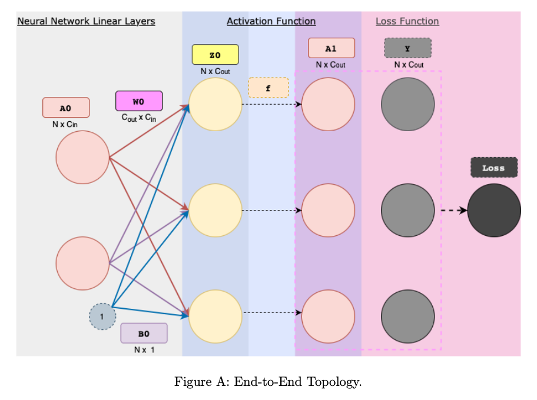

# Activation Functions

I use relu.md to illstrate the main idea behind activation functions [ReLU](relu.md).

### Overview

In the realm of machine learning, engineers have the liberty to select any differentiable function to serve as an activation function. The inclusion of non-linear elements within a neural network ($f_{NN}$) is crucial for its capability to model non-linear phenomena. In the absence of activation functions, the output of an $f_{NN}$ remains linear irrespective of its depth, due to the inherent linearity of the equation $A · W + b$.

Activation functions can either take scalar or vector arguments. Scalar activations apply a function to a single number. Scalar activation functions are applied individually to each element of a vector, maintaining a direct relationship between each input and its corresponding output, which simplifies the computation of derivatives. Popular choices of scalar activation functions are **Sigmoid, ReLU, Tanh, and GELU**, as shown in the following figure.


### Scalar Activation Function
If an activation function is applied element-wise to each individual element of $Z$, treating each $z_{ij}$ independently, then it is a scalar activation function. For example, applying the ReLU function to each element of $Z$ would be a scalar operation:

#### Example:

$$\text{ReLU}(Z) = \begin{pmatrix}
\max(0, z_{11}) & \max(0, z_{12}) \\
\max(0, z_{21}) & \max(0, z_{22}) \\
\max(0, z_{31}) & \max(0, z_{32})
\end{pmatrix}$$

In this case, each element $z_{ij}$ is processed independently, and the shape of the output matrix remains the same as $Z$, but with the activation function (in this case, ReLU) applied to each element.

#### Derivative Simplification
The one-to-one correspondence in scalar activations like ReLU simplifies derivative calculations:

- For $x1 = -1$, derivative $ReLU'(x1) = 0$ because $x1$ is negative.
- For $x2 = 5$, derivative $ReLU'(x2) = 1$ as $x2$ is positive.
- For $x3 = -3$, derivative $ReLU'(x3) = 0$ due to $x3$ being negative.

This element-wise approach allows for straightforward computation of derivatives, a key aspect in neural network optimization through backpropagation.


#### Element-wise Derivative

The term "element-wise derivative" refers to the derivative calculated independently for each element of a function's output with respect to its corresponding input element. This concept is widely used in functions applied to vectors or matrices, such as activation functions in neural networks.

When computing the element-wise derivative of an activation function's output $A$ with respect to its input $Z$, we calculate the derivative for each entry $a_{ij}$ in the output matrix  $A$ with respect to the corresponding entry $z_{ij}$ in the input matrix $Z$, where $i$ and $j$ denote the row and column indices, respectively.

##### Illustration with an Example

Consider a simple example using a vector input and the ReLU activation function, defined as $\text{ReLU}(x) = \max(0, x)$.

For an input vector $Z = [z_1, z_2, z_3]$, the ReLU function produces an output vector $A = [a_1, a_2, a_3]$, where $a_i = \max(0, z_i)$ for $i = 1, 2, 3$.

The element-wise derivative of $A$ with respect to $Z$is given by:

$\frac{\partial A}{\partial Z} = \left[ \frac{\partial a_1}{\partial z_1}, \frac{\partial a_2}{\partial z_2}, \frac{\partial a_3}{\partial z_3} \right]$

For the ReLU function, this derivative is 1 for $z_i > 0$ (indicating that a small increase in $z_i$ results in an equal increase in $a_i$ and 0 for $z_i \leq 0$ as $a_i$ remains at $0$ regardless of changes in $z_i$.

##### Significance in Neural Networks

In the context of neural networks, particularly during the backpropagation process, the element-wise derivative plays a crucial role in weight updates. It enables the network to understand how small changes in each weight influence the overall loss, allowing the gradient descent algorithm to minimize the loss function effectively. This individualized computation ensures that each weight is optimized based on its specific contribution to the network's performance.


### Vector Activation Function

On the other hand, vector activation functions like the **Softmax** involve outputs that are interdependent on all input elements, complicating the derivative computation process. If the activation function processes each row (or column) of $Z$ as a whole vector, considering the relationships between elements in that vector, then it is a vector activation function. An example of this would be applying the Softmax function to each row of $Z$, treating each row as a vector of logits for a multi-class classification problem.


#### Example:

Consider a neural network output for a 3-class classification problem with logits $Z = [2, 1, -1]$. Applying the Softmax function would yield the following probabilities:

- $\text{Softmax}(z_1) = \frac{e^2}{e^2 + e^1 + e^{-1}}$
- $\text{Softmax}(z_2) = \frac{e^1}{e^2 + e^1 + e^{-1}}$
- $\text{Softmax}(z_3) = \frac{e^{-1}}{e^2 + e^1 + e^{-1}}$

Each output probability depends on all input logits, illustrating the interconnected nature of vector activation functions.

#### Derivative Complexity:

The derivative of the Softmax function with respect to any input $z_k$ involves partial derivatives where each output depends on all inputs. This is due to the normalization term in the denominator, which includes all input exponentials.

For instance, the derivative of $\text{Softmax}(z_i)$ with respect to $z_k$ is:

- If $i = k$: $\frac{\partial \text{Softmax}(z_i)}{\partial z_k} = \text{Softmax}(z_i) \cdot (1 - \text{Softmax}(z_k))$
- If $i \neq k$: $\frac{\partial \text{Softmax}(z_i)}{\partial z_k} = -\text{Softmax}(z_i) \cdot \text{Softmax}(z_k)$

This reflects the fact that an increase in one logit not only increases its corresponding probability (assuming it's positive) but also decreases the probabilities of other classes due to the shared sum in the denominator.

This interconnectedness makes the derivative computation for vector activation functions like Softmax more complex compared to scalar activations like ReLU.

### Implementation

- **Class attributes**:
  - Activation functions have no trainable parameters.
  - Variables stored during forward-propagation to compute derivatives during back-propagation: layer output $A$.

- **Class methods**:
  - $forward$: The forward method takes in a batch of data $Z$ of shape $N \times C$(representing $N$ samples where each sample has $C$ features), and applies the activation function to $Z$ to compute output $A$ of shape $N \times C$.
  - $backward$: The backward method takes in $dLdA$, a measure of how the post-activations (output) affect the loss. Using this and the derivative of the activation function itself, the method calculates and returns $dLdZ$, how changes in pre-activation features (input) $Z$ affect the loss $L$. In the case of scalar activations, $dLdZ$ is computed as:
    
    $$dLdZ = dLdA \odot \frac{\partial A}{\partial Z}$$
    
    #### Forward Example:
    To illustrate this with an example, let's consider a simple case where we have a batch of 3 samples ($N = 3$) and each sample has 2 features ($C=2$). So, our input matrix $Z$ could look something like this:

$$Z = \begin{pmatrix}
z_{11} &z_{12} \\
z_{21} &z_{22} \\
z_{31} &z_{32}
\end{pmatrix}$$

Applying the ReLU activation function, which is defined as $ReLU(x) = \max(0, x)$, we get the output matrix $A$ as follows:

$$A = \begin{pmatrix}
\max(0, z_{11}) & \max(0, z_{12}) \\
\max(0, z_{21}) &\max(0, z_{22}) \\
\max(0, z_{31}) &\max(0, z_{32})
\end{pmatrix}$$

As you can see, each element in $Z$ is transformed individually to produce an element in $A$, but the overall shape of the matrix, $3 \times 2$ in this case, remains unchanged.
    
 

### Backward Method Example with ReLU Activation

Let's explore an example of the backward method in a neural network using the ReLU (Rectified Linear Unit) activation function. The ReLU function is defined as $ReLU(x) = \max(0, x)$.

#### Forward Pass

Suppose we have a neuron that receives an input $Z$ and applies the ReLU activation function to produce an output $A$. Consider a single input value $Z = -2$ during the forward pass:

$A = ReLU(Z) = \max(0, -2) = 0$

#### Backward Pass

During the backward pass, we compute $dLdZ$, which represents how changes in $Z$ (pre-activation input) affect the loss $L$, using $dLdA$ (the gradient of the loss with respect to the activation function's output) and the derivative of the activation function $\frac{\partial A}{\partial Z}$.

The derivative of the ReLU function with respect to its input $Z$ is:


$$\frac{\partial A}{\partial Z} = \begin{cases} 
1 & \text{if } Z > 0 \\
0 & \text{otherwise}
\end{cases}$$

For $Z = -2$, the derivative $\frac{\partial A}{\partial Z}$ is $0$, because $Z$ is not greater than $0$.

Let's say the backward pass provides us with $dLdA = 0.5$, indicating how the post-activation output $A$ affects the loss $L$.

#### Computing $dLdZ$

To find $dLdZ$, we use:

$dLdZ = dLdA \odot \frac{\partial A}{\partial Z}$

Substituting the known values:

$dLdZ = 0.5 \odot 0 = 0$

This result implies that in this scenario, where the ReLU function clamps the negative input to $0$, changes in $Z$  have no effect on the loss, as reflected by $dLdZ = 0$. This is intuitive since for negative inputs to ReLU, the output is always $0$, and slight variations in $Z$ do not affect $A$ or the loss.

This example demonstrates computing the gradient of the loss with respect to pre-activation inputs using the backward method and scalar activation functions.


**For $dLdZ = dLdA \odot \frac{\partial A}{\partial Z}$, Here, $\frac{\partial A}{\partial Z}$ represents the element-wise derivative of the activation output $A$ with respect to its corresponding input $Z$. Specifically, for a single input of size $1 \times C$, this derivative equates to the diagonal of the Jacobian matrix, expressed as a vector of size $1 \times C$. This concept aligns with the understanding presented in the lecture that the Jacobian of a scalar activation function manifests as a diagonal matrix. When considering a batch with size $N$, the dimension of $\frac{\partial A}{\partial Z}$ expands to $N \times C$. The computation of $\frac{\partial A}{\partial Z}$ varies among different scalar activation functions, as detailed in their respective subsections. The size of $\frac{\partial A}{\partial Z}$ is $N \times C$ because we have a derivative value for each feature of each sample.**


### Understanding the Diagonal of the Jacobian Matrix for Scalar Activation Functions

To comprehend why, for a single input of size $1 \times C$, the derivative $\frac{\partial A}{\partial Z}$ equates to the diagonal of the Jacobian matrix, it's essential to explore the nature of the Jacobian matrix in the context of activation functions.

#### The Jacobian Matrix in the Context of Activation Functions
The Jacobian matrix represents all first-order partial derivatives of a function that maps from $\mathbb{R}^n$ to $\mathbb{R}^m$. For a vector-valued function $\mathbf{f}(\mathbf{x})$ where $\mathbf{x} \in \mathbb{R}^n$ and $\mathbf{f}(\mathbf{x}) \in \mathbb{R}^m$, the Jacobian matrix $J$ is defined as:

$$J = \begin{pmatrix}
\frac{\partial f_1}{\partial x_1} & \cdots & \frac{\partial f_1}{\partial x_n} \\
\vdots & \ddots & \vdots \\
\frac{\partial f_m}{\partial x_1} & \cdots & \frac{\partial f_m}{\partial x_n}
\end{pmatrix}$$

#### Scalar Activation Functions and the Jacobian
When scalar activation functions like ReLU or Sigmoid are applied element-wise to a vector $\mathbf{z} = [z_1, \ldots, z_C]$, they can be viewed as a set of independent scalar functions $f_i(z_i)$. In this scenario, the Jacobian matrix has a distinctive structure.

#### Example with ReLU Activation Function
Consider the ReLU activation function applied to an input vector $\mathbf{z} = [z_1, z_2, z_3]$ (for $C = 3$). The ReLU function transforms $\mathbf{z}$ into $\mathbf{A} = [ReLU(z_1), ReLU(z_2), ReLU(z_3)]$.

The derivative of $ReLU(z)$ with respect to $z$ is:


$$\frac{\partial ReLU(z)}{\partial z} = \begin{cases}
1, & \text{if } z > 0 \\
0, & \text{otherwise}
\end{cases}$$

For an input vector $\mathbf{z}$ with all positive elements, the Jacobian matrix of $\mathbf{A}$ with respect to $\mathbf{z}$ is:

$$J = \begin{pmatrix}
1 & 0 & 0 \\
0 & 1 & 0 \\
0 & 0 & 1
\end{pmatrix}$$

#### Why the Diagonal?
The diagonal nature of the Jacobian matrix for element-wise scalar activations arises because each output element $A_i$ depends solely on the corresponding input element $z_i$, making all off-diagonal elements (which represent derivatives of output with respect to different inputs) zero. The non-zero elements, located on the diagonal, represent the derivative of each output with respect to its corresponding input, simplifying computations in neural networks, particularly during backpropagation.


### Understanding the Diagonal of the Jacobian Matrix for Vector Activation Functions

**The Jacobian of a vector activation function is not a diagonal matrix. For each input vector $Z^{(i)}$ of size $1 \times C$ and its corresponding output vector $A^{(i)}$ (also $1 \times C$ within the batch, the Jacobian matrix $J^{(i)}$ must be computed individually. This matrix holds dimensions $C \times C$. Consequently, the gradient $dLdZ^{(i)}$ for each sample in the batch is determined by:**

**$$dLdZ^{(i)} = dLdA^{(i)} \cdot J^{(i)}$$**

**After computing each $1 \times C$ vector of $dLdZ^{(i)}$, these vectors are vertically stacked to form the final $N \times C$ matrix of $dLdZ$, which is then returned.**

Specifically, the Jacobian matrix of a vector-valued function represents the collection of all first-order partial derivatives of the function's outputs with respect to its inputs. Each element in the Jacobian matrix is a partial derivative of one of the function's output components with respect to one of its input components.

In the context of a vector-valued function $\mathbf{f}(\mathbf{x})$ where $\mathbf{x}$ is the input vector and $\mathbf{f}(\mathbf{x})$ is the output vector, the Jacobian matrix $J$ is defined as:

$$
J = \begin{pmatrix}
\frac{\partial f_1}{\partial x_1} & \cdots & \frac{\partial f_1}{\partial x_n} \\
\vdots & \ddots & \vdots \\
\frac{\partial f_m}{\partial x_1} & \cdots & \frac{\partial f_m}{\partial x_n}
\end{pmatrix}
$$

Here, $f_1, f_2, \ldots, f_m$ are the components of the output vector $\mathbf{f}(\mathbf{x})$, and $x_1, x_2, \ldots, x_n$ are the components of the input vector $\mathbf{x}$. The element in the $i$-th row and $j$-th column of $J$, $\frac{\partial f_i}{\partial x_j}$, represents the partial derivative of the $i$-th output component with respect to the $j$-th input component.

In summary, the Jacobian matrix itself is a matrix of derivatives that describes how each component of the output vector changes with respect to changes in each component of the input vector. It is not the input but rather a mathematical object that characterizes the sensitivity of the output to changes in the input.


### Example Using Softmax Activation Function in Neural Networks

Consider a neural network layer with 2 samples in a batch ($N=2$) and each sample has 3 features ($C=3$). This setup could represent the logits for 3 classes in a classification problem.

Our batch of input vectors $Z$ is given by:

$$Z = \begin{pmatrix} Z^{(1)} & Z^{(2)} \end{pmatrix}
= \begin{pmatrix}
1 & 2 & 3 \\
2 & 2 & 1
\end{pmatrix}$$
$$

#### Applying Softmax Activation

Softmax is applied to each sample $Z^{(i)}$ to produce the output vector $A^{(i)}$. The Softmax function for an element $z_j$ in vector $Z^{(i)}$ is defined as:

$$\text{Softmax}(z_j) = \frac{e^{z_j}}{\sum\limits_{k=1}^{C} e^{z_k}}$$ 

After applying Softmax to each row of $Z$, we get:

$$A = \begin{pmatrix} A^{(1)} & A^{(2)} \end{pmatrix}
= \begin{pmatrix}
0.09 & 0.24 & 0.67 \\
0.42 & 0.42 & 0.16
\end{pmatrix}$$
$$

#### Jacobian Matrix for Softmax

For Softmax, the Jacobian $J^{(i)}$ for a single sample $A^{(i)}$ has elements:

$$J^{(i)}_{jk} = \begin{cases}
    A^{(i)}_j (1 - A^{(i)}_j) & \text{if } j = k \\
    -A^{(i)}_j A^{(i)}_k & \text{otherwise}
\end{cases}$$

For our first sample $A^{(1)}$, the Jacobian $J^{(1)}$ would be a 3x3 matrix where each element is computed using the above rule.

Calculating $J^{(1)}$

For the first sample, $A^{(1)} = [0.09, 0.24, 0.67]$.  

Using the Softmax derivative formula:

$$ For \ \ j = k: J^{(1)}_{jj} = A^{(1)}_j (1 - A^{(1)}_j)$$

$$ For \ \ j \neq k: J^{(1)}_{jk} = -A^{(1)}_j A^{(1)}_k$$

Thus, we have:

$$J^{(1)}_{11} = 0.09 \times (1 - 0.09) = 0.0819$$

$$J^{(1)}_{22} = 0.24 \times (1 - 0.24) = 0.1824$$

$$J^{(1)}_{33} = 0.67 \times (1 - 0.67) = 0.2211$$


And for 

$$j \neq k$$


$$J^{(1)}_{12} = J^{(1)}_{21} = -0.09 \times 0.24 = -0.0216$$


$$J^{(1)}_{13} = J^{(1)}_{31} = -0.09 \times 0.67 = -0.0603$$


$$J^{(1)}_{23} = J^{(1)}_{32} = -0.24 \times 0.67 = -0.1608$$

So, $J^{(1)}$ is

$$J^{(1)} = \begin{pmatrix}
0.0819 &-0.0216 & -0.0603 \\
-0.0216 &0.1824 & -0.1608 \\
-0.0603 &-0.1608 &0.2211
\end{pmatrix}$$

Similarly

$$J^{(2)} = \begin{pmatrix}
0.2436 & -0.1764 & -0.0672 \\
-0.1764 & 0.2436 & -0.0672 \\
-0.0672 & -0.0672 & 0.1344
\end{pmatrix}$$

Computing the Gradient $dLdZ^{(i)}$
Let's assume we have the gradient of the loss with respect to the activation output dLdA for our batch as:
$$dLdA= \begin{pmatrix}
0.1 & -0.2 & 0.1 \\
-0.1 & 0.3 & -0.2
\end{pmatrix}$$

The gradient $dLdZ^{(i)}$ for each sample is calculated by multiplying the corresponding row of $dLdA$ by the Jacobian $J^{(i)}$:

$$dLdZ^{(i)} =dLdA^{(i)} \cdot J^{(i)}$$

This operation would be performed for each sample, and the resulting vectors $dLdZ^{(1)}$ and $dLdZ^{(2)}$ are then stacked to form the final gradient matrix $dLdZ$ for the whole batch.

#### Specific Calculations

Due to the complexity of the Softmax derivatives and for brevity, detailed computations of each element of $J^{(1)}$ and $J^{(2)}$ are omitted here. However, the general process involves:

Calculating $J^{(1)}$ and $J^{(2)}$ using $A^{(1)}$ and $A^{(2)}$, respectively.

Multiplying $dLdA^{(1)} = [0.1, -0.2, 0.1]$ by $J^{(1)}$ to get $dLdZ^{(1)}$.

Multiplying $dLdA^{(2)} = [-0.1, 0.3, -0.2]$ by $J^{(2)}$ to get $dLdZ^{(2)}$.

Stacking $dLdZ^{(1)}$ and $dLdZ^{(2)}$ vertically to form $dLdZ$


This example illustrates the process of computing the gradient of the loss with respect to the inputs for a layer using a vector activation function, where the interdependence of the inputs in producing the outputs requires the computation of a full Jacobian matrix for each sample.


Consider the following class structure for the scalar activations:
```python
class Activation:
    def forward(self, Z):
        self.A = # TODO
        return self.A
    def backward(self, dLdA):
        dAdZ = # TODO
        dLdZ = # TODO
        return dLdZ
```

| Code Name | Math       | Type   | Shape | Meaning                                  |
|-----------|------------|--------|-------|------------------------------------------|
| N         |  $N$    | scalar | -     | batch size                               |
| C         | $C$    | scalar | -     | number of features                       |
| Z         | $Z$    | matrix | $N \times C$ | batch of $N$ inputs each represented by $C$ features |
| A         | $A$    | matrix | $N \times C$ | batch of $N$ outputs each represented by $C$ features |
| dLdA      | $\frac{\partial L}{\partial A}$ | matrix | $N \times C$ | how changes in post-activation features affect loss |
| dLdZ      | $\frac{\partial L}{\partial Z}$ | matrix | $N \times C$ | how changes in pre-activation features affect loss  |


The topology of the activation function is illustrated in Figure C. To understand its context within the broader network architecture, refer back to Figure A.

**Note**: In this document, we adhere to a specific convention:
- $Z$ represents the output of a linear layer.
- $A$ signifies the input to a linear layer.

In this framework, $Z$ is derived from the preceding linear layer's output, and $A$ serves as the input for the subsequent linear layer. For instance, if $f_l$ denotes the activation function for layer $l$, then the relationship between $A$ and $Z$ for consecutive layers is given by:

$A_{l+1} = f_l(Z_l)$

This equation highlights how the output $Z$ from one layer, after undergoing transformation by the activation function $f_l$, becomes the input $A$ for the next layer.




> Note: dLdZ is used in the backward pass because it directly relates the loss to the parameters we want to optimize (weights and biases) through $Z$ since $Z = W \cdot A_{prev} + b$, and followed by $A = f(Z)$, where $f$ is the activation function.
> In the case of scalar activations, $dLdZ$ is computed as:
> $$dLdZ = dLdA \odot \frac{\partial A}{\partial Z}$$
> In the case of vector activation function, $dLdZ$ is computed as: For each input vector $Z^{(i)}$ of size $1 \times C$ and its corresponding output vector $A^{(i)}$ (also $1 \times C$ within the batch, the Jacobian matrix $J^{(i)}$ must be computed individually. This matrix holds dimensions $C \times C$. Consequently, the gradient $dLdZ^{(i)}$ for each sample in the batch is determined by:
> $$dLdZ^{(i)} = dLdA^{(i)} \cdot J^{(i)}$$


# Appendix 

## Sigmoid Function vs Softmax Function:

**Sigmoid**: Suitable for binary classification, where you need to output a single probability score for the positive class.

**Softmax**: Suitable for multi-class classification, where you need to output a probability distribution over multiple classes.

### Sigmoid Function

- **Context**: Binary classification.
- **Purpose**: Converts a single logit into a probability.
- **Operation**: Takes a single logit (a raw score from the model) and maps it to a value between 0 and 1, which can be interpreted as a probability.

#### Mathematical Operation

Given a logit $z$:

$$\sigma(z) = \frac{1}{1 + \exp(-z)}$$

- **Input**: A single logit value (scalar).
- **Output**: A single probability value between 0 and 1.

#### Example

```python
import numpy as np

def sigmoid(z):
    return 1 / (1 + np.exp(-z))

logit = 2.0
probability = sigmoid(logit)
print(probability)  # Output: 0.8807970779778823
```
### Softmax Function

- **Context**: Multi-class classification.
- **Purpose**: Converts a vector of logits into a probability distribution.
- **Operation**: Takes a vector of logits (raw scores from the model) and maps them to a probability distribution over multiple classes, where the sum of probabilities is 1.

#### Mathematical Operation

Given a vector of logits $z$:

$$\sigma(z)_i = \frac{\exp(z_i)}{\sum_{j=1}^k \exp(z_j)}$$

for $i = 1, \ldots, k$.

- **Input**: A vector of logits.
- **Output**: A vector of probabilities that sum to 1.

#### Example
```python
import numpy as np

def softmax(z):
    exp_z = np.exp(z)
    return exp_z / np.sum(exp_z, axis=0)

logits = np.array([2.0, 1.0, 0.1])
probabilities = softmax(logits)
print(probabilities)  # Output: [0.65900114 0.24243297 0.09856589]
```
### Summary

Both sigmoid and softmax functions operate on logits, but they are used in different scenarios:

- **Sigmoid Function**: Used in binary classification to map a single logit to a probability between 0 and 1.
- **Softmax Function**: Used in multi-class classification to map a vector of logits to a probability distribution over multiple classes.

## Reference:
- CMU_11785_Introduction_To_Deep_Learning
