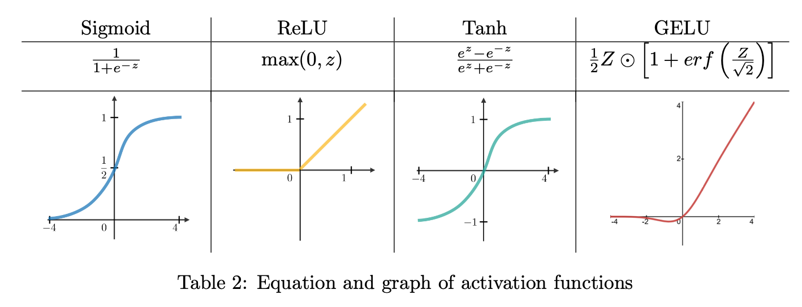
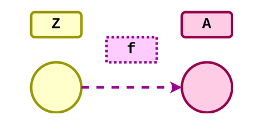

I use relu.md to illstrate the main idea behind activation functions [ReLU](Deep-Learning-Concepts/Basic-Neural-Network-Concepts/Activation-Functions/relu.md).

In the realm of machine learning, engineers have the liberty to select any differentiable function to serve as an activation function. The inclusion of non-linear elements within a neural network ($f_{NN}$) is crucial for its capability to model non-linear phenomena. In the absence of activation functions, the output of an $f_{NN}$ remains linear irrespective of its depth, due to the inherent linearity of the equation $A · W + b$.

Activation functions can either take scalar or vector arguments. Scalar activations apply a function to a single number. Scalar activation functions are applied individually to each element of a vector, maintaining a direct relationship between each input and its corresponding output, which simplifies the computation of derivatives. Popular choices of scalar activation functions are **Sigmoid, ReLU, Tanh, and GELU**, as shown in the following figure.



#### Example:
Consider a vector $X = [x1, x2, x3]$ and applying the ReLU function $ReLU(x) = max(0, x)$. The ReLU function is applied to each vector element:

- $ReLU(x1) = max(0, x1)$
- $ReLU(x2) = max(0, x2)$
- $ReLU(x3) = max(0, x3)$

For $X = [-1, 5, -3]$, the output after applying ReLU is $[0, 5, 0]$, as ReLU converts negative inputs to 0.

#### Simplifying Derivative Calculation:
The one-to-one correspondence in scalar activations like ReLU simplifies derivative calculations:

- For $x1 = -1$, derivative $ReLU'(x1) = 0$ because $x1$ is negative.
- For $x2 = 5$, derivative $ReLU'(x2) = 1$ as $x2$ is positive.
- For $x3 = -3$, derivative $ReLU'(x3) = 0$ due to $x3$ being negative.

This element-wise approach allows for straightforward computation of derivatives, a key aspect in neural network optimization through backpropagation.

On the other hand, vector activation functions like the **Softmax** involve outputs that are interdependent on all input elements, complicating the derivative computation process. This document will guide you in implementing both scalar and vector activation functions, with an emphasis on the **Softmax** function for vector activations.

#### Example:

Consider a neural network output for a 3-class classification problem with logits $Z = [2, 1, -1]$. Applying the Softmax function would yield the following probabilities:

- $\text{Softmax}(z_1) = \frac{e^2}{e^2 + e^1 + e^{-1}}$
- $\text{Softmax}(z_2) = \frac{e^1}{e^2 + e^1 + e^{-1}}$
- $\text{Softmax}(z_3) = \frac{e^{-1}}{e^2 + e^1 + e^{-1}}$

Each output probability depends on all input logits, illustrating the interconnected nature of vector activation functions.

#### Derivative Complexity:

The derivative of the Softmax function with respect to any input $z_k$ involves partial derivatives where each output depends on all inputs. This is due to the normalization term in the denominator, which includes all input exponentials.

For instance, the derivative of $\text{Softmax}(z_i)$ with respect to $z_k$ is:

- If $i = k$: $\frac{\partial \text{Softmax}(z_i)}{\partial z_k} = \text{Softmax}(z_i) \cdot (1 - \text{Softmax}(z_k))$
- If $i \neq k$: $\frac{\partial \text{Softmax}(z_i)}{\partial z_k} = -\text{Softmax}(z_i) \cdot \text{Softmax}(z_k)$

This reflects the fact that an increase in one logit not only increases its corresponding probability (assuming it's positive) but also decreases the probabilities of other classes due to the shared sum in the denominator.

This interconnectedness makes the derivative computation for vector activation functions like Softmax more complex compared to scalar activations like ReLU.


- **Class attributes**:
  - Activation functions have no trainable parameters.
  - Variables stored during forward-propagation to compute derivatives during back-propagation: layer output $A$.

- **Class methods**:
  - $forward$: The forward method takes in a batch of data $Z$ of shape $N \times C$(representing $N$ samples where each sample has $C$ features), and applies the activation function to $Z$ to compute output $A$ of shape $N \times C$.
  - $backward$: The backward method takes in $dLdA$, a measure of how the post-activations (output) affect the loss. Using this and the derivative of the activation function itself, the method calculates and returns $dLdZ$, how changes in pre-activation features (input) $Z$ affect the loss $L$. In the case of scalar activations, $dLdZ$ is computed as:
    
    $dLdZ = dLdA \odot \frac{\partial A}{\partial Z}$

Here, $\frac{\partial A}{\partial Z}$ represents the element-wise derivative of the activation output $A$ with respect to its corresponding input $Z$. Specifically, for a single input of size $1 \times C$, this derivative equates to the diagonal of the Jacobian matrix, expressed as a vector of size $1 \times C$. This concept aligns with the understanding presented in the lecture that the Jacobian of a scalar activation function manifests as a diagonal matrix. When considering a batch with size $N$, the dimension of $\frac{\partial A}{\partial Z}$ expands to $N \times C$. The computation of $\frac{\partial A}{\partial Z}$ varies among different scalar activation functions, as detailed in their respective subsections.

The Jacobian of a vector activation function is not a diagonal matrix. For each input vector $Z^{(i)}$ of size $1 \times C$ and its corresponding output vector $A^{(i)}$ (also $1 \times C$ within the batch, the Jacobian matrix $J^{(i)}$ must be computed individually. This matrix holds dimensions $C \times C$. Consequently, the gradient $dLdZ^{(i)}$ for each sample in the batch is determined by:

$dLdZ^{(i)} = dLdA^{(i)} \cdot J^{(i)}$

After computing each $1 \times C$ vector of $dLdZ^{(i)}$, these vectors are vertically stacked to form the final $N \times C$ matrix of $dLdZ$, which is then returned.

Please consider the following class structure for the scalar activations:
```python
class Activation:
    def forward(self, Z):
        self.A = # TODO
        return self.A
    def backward(self, dLdA):
        dAdZ = # TODO
       dLdZ = # TODO
       return dLdZ
```

| Code Name | Math       | Type   | Shape | Meaning                                  |
|-----------|------------|--------|-------|------------------------------------------|
| N         |  $N$    | scalar | -     | batch size                               |
| C         | $C$    | scalar | -     | number of features                       |
| Z         | $Z$    | matrix | $N \times C$ | batch of $N$ inputs each represented by $C$ features |
| A         | $A$    | matrix | $N \times C$ | batch of $N$ outputs each represented by $C$ features |
| dLdA      | $\frac{\partial L}{\partial A}$ | matrix | $N \times C$ | how changes in post-activation features affect loss |
| dLdZ      | $\frac{\partial L}{\partial Z}$ | matrix | $N \times C$ | how changes in pre-activation features affect loss  |


The topology of the activation function is illustrated in Figure C. To understand its context within the broader network architecture, refer back to Figure A.

**Note**: In this course, we adhere to a specific convention:
- $Z$ represents the output of a linear layer.
- $A$ signifies the input to a linear layer.

In this framework, $Z$ is derived from the preceding linear layer's output, and $A$ serves as the input for the subsequent linear layer. For instance, if $f_l$ denotes the activation function for layer $l$, then the relationship between $A$ and $Z$ for consecutive layers is given by:

$A_{l+1} = f_l(Z_l)$

This equation highlights how the output $Z$ from one layer, after undergoing transformation by the activation function $f_l$, becomes the input $A$ for the next layer.



## Reference:
- CMU_11785_Introduction_To_Deep_Learning


