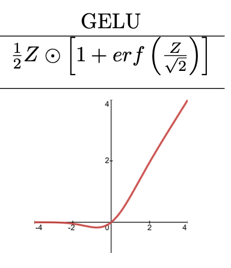

# GELU Activation Function

## Overview:
The Gaussian Error Linear Unit (GELU) is a nonlinear activation function used in neural networks that models neuron output as a stochastic process. Unlike traditional activation functions like ReLU, GELU takes into account the stochastic nature of neuron activation, making it more effective in certain models, particularly in Transformer architectures.

## Mathematical Expression:
The GELU function is approximated as follows:

$$\text{GELU}(x) = 0.5x\left(1 + \text{tanh}\left(\sqrt{\frac{2}{\pi}}\left(x + 0.044715x^3\right)\right)\right)$$

This approximation allows for a smooth, non-monotonic function that closely resembles the exact GELU computation.

## Function Characteristics:
- **Range**: The output of the GELU function is unbounded, but it generally moves towards 0 for negative inputs and towards the input value for positive inputs.
- **Shape**: The GELU function has a non-monotonic S-shaped curve that becomes linear for large positive inputs.
- **Output Interpretation**: The function softly gates inputs, allowing for a probabilistic interpretation of neuron activations.

## Example:
Consider a neuron receiving an input value of 0.5. 

The output using the GELU function is:

$$\text{activated output} = \text{GELU}(0.5) \approx 0.345$$

This output can then be used as input to subsequent neurons in the network.

## Visualization:

 

 

### Derivation of the GELU Function's Derivative

The derivative of the GELU function is important for backpropagation in neural networks. Due to the complexity of the GELU function, its derivative is not straightforward and is typically computed numerically.

## GELU Class Implementation:

### GELU Forward Equation

In forward propagation, input features $X$ are passed through the GELU function to obtain the activated outputs $A$.

$$\begin{align}
A &= \text{GELU.forward}(X) \\
&= 0.5X\left(1 + \text{tanh}\left(\sqrt{\frac{2}{\pi}}\left(X + 0.044715X^3\right)\right)\right)
\end{align}$$

### GELU Backward Equation

During backward propagation, the gradient of the loss with respect to the input $X$ is calculated, taking into account the gradient of the activated output $A$.

$$\begin{align}
\frac{dL}{dX} &= \text{GELU.backward}(dLdA) \\
&= dLdA \odot \frac{\partial A}{\partial X} \\
\end{align}$$

Due to the complexity of the GELU function, the exact form of $\frac{\partial A}{\partial X}$ is often computed numerically.

Here's a Python class skeleton for GELU implementation:

```python
import numpy as np

class GELU:
    def forward(self, X):
        return 0.5 * X * (1 + np.tanh(np.sqrt(2 / np.pi) * (X + 0.044715 * np.power(X, 3))))

    def backward(self, dLdA):
        # Approximate the derivative numerically or use autograd if available
        pass
```
## Reference:
- CMU_11785_Introduction_To_Deep_Learning
