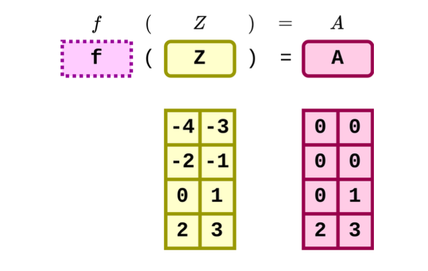
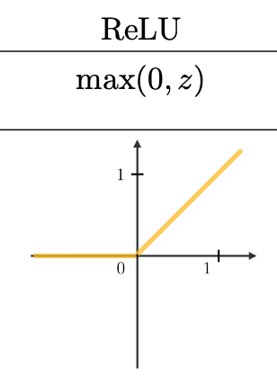

# ReLU Activation Function

## Overview:
The ReLU (Rectified Linear Unit) function is a widely used activation function in artificial neural networks, especially in deep learning models. It is defined as the positive part of its argument, with a formula of $f(x) = \max(0, x)$. This simplicity makes it computationally efficient and helps in reducing the vanishing gradient problem.

## Mathematical Expression:
The ReLU function is defined mathematically as:

$$
\text{ReLU}(x) = \max(0, x)
$$

where $x$ represents the input to the function.

## Function Characteristics:
- **Range**: The output of the ReLU function is from 0 to $\infty$.
- **Shape**: It is a piecewise linear function that looks like a ramp.
- **Output Interpretation**: Values less than 0 are mapped to 0, which indicates no activation. Values greater than 0 are kept unchanged, indicating linear activation.

## Example:
Consider a neuron receiving inputs with values 1.2 and -0.9, weights 0.5 and -1.1, and bias 0.1.

The pre-activated output ($x$) is:

$$
x = (1.2 \times 0.5) + (-0.9 \times -1.1) + 0.1 = 1.49
$$

Applying the ReLU function gives the activated output:

$$
\text{activated output} = \text{ReLU}(1.49) = 1.49
$$

This output then serves as input to subsequent neurons.

## Visualization:




### Derivation of the ReLU Function's Derivative

The derivative of the ReLU function is a simple step function:

1. **For $x > 0$**:
   $$
   \frac{d}{dx}\text{ReLU}(x) = 1
   $$

2. **For $x \leq 0$**:
   $$
   \frac{d}{dx}\text{ReLU}(x) = 0
   $$

This derivative is straightforward to compute, which is one of the reasons for the popularity of ReLU in deep learning.

## ReLU Class Implementation:

### ReLU Forward Equation

In forward propagation, the pre-activation features $Z$ are passed through the ReLU function to get the post-activation values $A$.

$$
\begin{align}
A &= \text{ReLU.forward}(Z) \\
&= \max(0, Z)
\end{align}
$$

### ReLU Backward Equation

In backward propagation, we calculate how changes in $Z$ affect the loss, given the changes in $A$.

$$
\begin{align}
\frac{dL}{dZ} &= \text{ReLU.backward}(dLdA) \\
&= dLdA \odot \text{step}(Z)
\end{align}
$$

Where $\text{step}(Z)$ is 1 for $Z > 0$ and 0 otherwise.

Here's a Python class implementation:

```python
import numpy as np

class ReLU:
    def forward(self, Z):
        self.A = np.maximum(0, Z)
        return self.A

    def backward(self, dLdA):
        dAdZ = np.where(self.A > 0, 1, 0)
        dLdZ = dLdA * dAdZ
        return dLdZ
```
## Visualization:




## Reference:
- CMU_11785_Introduction_To_Deep_Learning
  
# ReLU In Action!!!

Part 1 in neural networks, we started with a simple data set(inside the black box) that showed whether or not different drug dosages were effective against a virus. The low and high dosages were not effective but the medium dosage was effective. Then we talked about how a neural network like this one using the soft plus activation function in the hidden layer can fit a green squiggle to the dataset.


Now let’s see what happens if we swap out the soft plus activation function in the hidden layer with one of the most popular activations functions for deep learning and convolutional neural networks——the ReLU activation function, which is short for rectified linear Unit. And as a bonus, because it is common to put an activation function before the final output, we’ll do that too.


Remember: To keep the math simple, let’s assume Dosages go from 0(low) to 1(high). So if we plug in the lowest dosage, 0, the connection from the input to the top node in the hidden layer multiples the dosage by 1.70 and then adds -0.85, and the result is an x-axis coordinate for the activation function. 

$(0x1.70)+-0.85 = -0.85$


Now we plug -0.85 into the ReLU activation function, the ReLU activation function output whichever value is larger, 0 or the input value, which in this case is -0.85.

$f(-0.85) = max(0,-0.85) = y-axis coordinate = 0$


So, let’s put a blue dot at 0 for when dosage = 0.


And if we continue to increase the dosage values all the way to 1(the maximum dosage), we will get this bent blue line. Then we multiply the y-axis coordinates on the bent blue line by -40.8, and the new bent blue line goes off the screen.

 


Now when we run dosages through the connection to the bottom node in the hidden layer, we get the corresponding y-axis coordinates that go off the screen for this straight orange line. Now we multiply the y-axis coordinates on the straight orange line by 2.7 and we end up with this final straight orange line

  


Now we add the bent blue line and straight orange line together to get this green wedge. Now we add the final bias term, -16 to the y-axis coordinates on the green wedge.


Lastly, because we included the ReLU activation function right in front of the output, we use the green wedge as its input. For example, the y-axis coordinate for this point on the green wedge is -16 which corresponds to this x-axis coordinate for the ReLU activation function. 


And when we plug that into the ReLU activation function, we get 

$f(x) = max(0,x) = y-axis coordinate$

$f(-16) = max(0,-16) =  y-axis coordinate = 0$

And 0 corresponds to this green dot.


And at long las, we end up with this green pointy thing.


Thus, the ReLU activation function may seem weird, because it is not curvy and the equation is really simple f(x) = max(0,x) = y-axis coordinate

But just like for any other activation function, the weights and biases on the connections slice them, flip them and stretch them into new shapes, which are added together to get an entirely new shape that fits the data.


Some of you may have noticed that the ReLU activation function is bent and not curved, this means that the derivative is not defined where the function is bent, and that’s a problem because gradient descent, which we use to estimate the weights and biases, requires a derivative for all points. However, it’s not a big problem because we can get around this by simply defining the derivative at the bent part to be 0, or 1, it doesn’t really matter.


## Reference:
- [Watch the video on YouTube](https://www.youtube.com/watch?v=68BZ5f7P94E)

