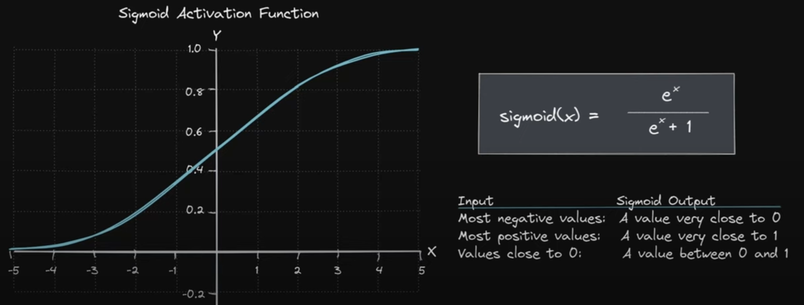

# Sigmoid Activation Function

## Overview:
The sigmoid function is a widely used nonlinear activation function in artificial neural networks. It effectively maps input values to a range between 0 and 1, making it particularly useful for models where the output needs to be interpreted as a probability.

## Mathematical Expression:
The sigmoid function is mathematically defined as:

$\text{sigmoid}(x) = \frac{e^x}{e^x+1} = \frac{1}{1+e^{-x}}$

where $e$ is the base of the natural logarithm, and $x$ represents the input to the function, typically the weighted sum of inputs to a neuron.

## Function Characteristics:
- **Range**: The output of the sigmoid function is bounded between 0 and 1, inclusive.
- **Shape**: It has an S-shaped curve (sigmoid curve).
- **Output Interpretation**: Values near 1 indicate a high degree of activation, while values near 0 indicate low activation. This can be intuitively understood as the probability of the neuron being activated.

## Application in Neural Networks:
In the context of neural networks, the sigmoid function is applied to each neuron within a layer. Specifically, for a fully connected layer, the function is applied to the weighted sum of inputs for each neuron, producing the neuron's activation level. This activated output is then passed on to the next layer in the network.

The use of sigmoid allows for a clear interpretation of neuron activation levels:
- **Closer to 1**: Indicates higher activation.
- **Closer to 0**: Indicates lower activation.

Thus, the sigmoid function serves as a mechanism to introduce non-linearity into the network, enabling it to learn complex patterns and make decisions that go beyond simple linear boundaries.

## Example:
Consider a neuron in a hidden layer receiving inputs from two neurons in the input layer with values 0.5 and 0.8. If the weights of these inputs are 0.4 and 0.6 respectively, and the neuron's bias is 0.1, the pre-activated output (x) would be calculated as:

$x = (0.5 \times 0.4) + (0.8 \times 0.6) + 0.1 = 0.68$

Applying the sigmoid function gives the activated output:

$\text{activated output} = \frac{1}{1 + e^{-0.68}} \approx 0.6637$

This activated output is then used as input to the neurons in the subsequent layer.

## Visualization:


## Sigmoid Class Implementation:
Below is a Python class implementation of the sigmoid activation function, which includes both the forward pass (calculating the activated output) and the backward pass (calculating the gradient for backpropagation).

```python
import numpy as np
class Sigmoid:
    """
    Sigmoid Activation Function:
    - 'forward' function applies the sigmoid activation.
    - 'backward' function computes the gradient for backpropagation.
    """
    def forward(self, Z):
        self.A = 1 / (1 + np.exp(-Z))
        return self.A

    def backward(self, dLdA):
        dAdZ = self.A * (1 - self.A)
        dLdZ = dLdA * dAdZ
        return dLdZ
```


## Key Takeaway:
The sigmoid function is crucial for transforming linear inputs into outputs that can be interpreted as probabilities, thereby providing a probabilistic foundation to the activation levels within a neural network.

## Reference:
- [Watch the video on YouTube](https://www.youtube.com/watch?v=KOhbp3EIRlM)
