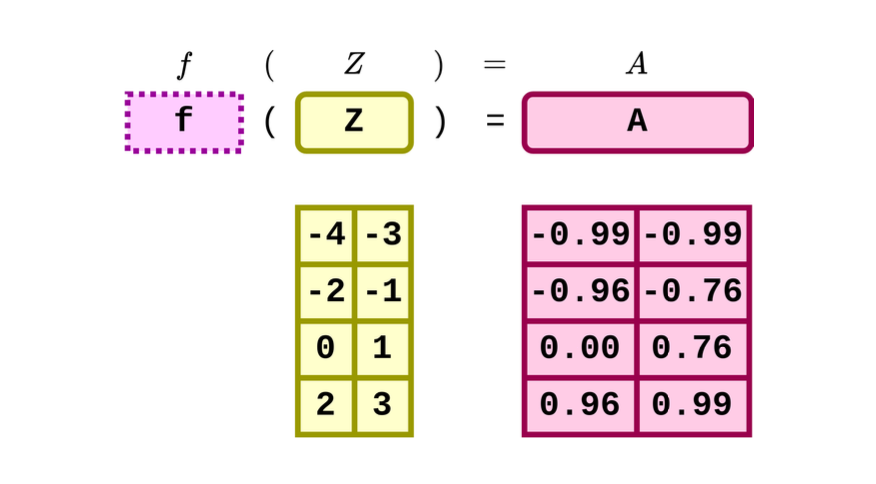
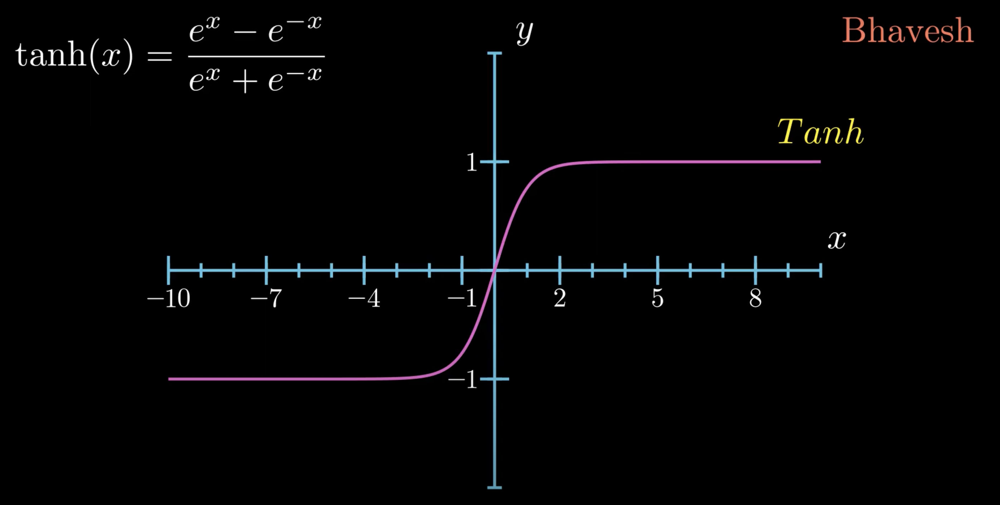

# Tanh Activation Function

## Overview:
The tanh function is a popular nonlinear activation function used in artificial neural networks, similar to the sigmoid function but with a range from -1 to 1. This makes it more suitable for cases where the model needs to deal with negative inputs efficiently.

## Mathematical Expression:
The tanh function is defined mathematically as:

$$\text{tanh}(x) = \frac{e^{x} - e^{-x}}{e^{x} + e^{-x}}$$

where $e$ is the base of the natural logarithm, and $x$ represents the input to the function.

## Function Characteristics:
- **Range**: The output of the tanh function is bounded between -1 and 1, inclusive.
- **Shape**: It has an S-shaped curve, similar to the sigmoid function, but stretched vertically to fit the new range.
- **Output Interpretation**: Values near 1 indicate high positive activation, values near -1 indicate high negative activation, and values around 0 indicate low or no activation.

## Example:
Consider the same neuron receiving inputs with values 0.5 and 0.8, weights 0.4 and 0.6, and bias 0.1. 

The pre-activated output ($x$) is:

$x = (0.5 \times 0.4) + (0.8 \times 0.6) + 0.1 = 0.68$

Applying the tanh function gives the activated output:

$\text{activated output} = \text{tanh}(0.68) \approx 0.591$

This output then serves as input to subsequent neurons.

## Visualization:



### Derivation of the tanh Function's Derivative

The derivative of the tanh function, $\frac{\partial \tanh(Z)}{\partial Z} = 1 - \tanh^2(Z)$, is derived from applying the chain rule and the definition of the tanh function. The tanh function is given by $\tanh(Z) = \frac{e^Z - e^{-Z}}{e^Z + e^{-Z}}$. Here's a step-by-step breakdown of how this derivative is obtained:

1. **Express the tanh function**: The tanh function is defined as:
   $$\tanh(Z) = \frac{e^Z - e^{-Z}}{e^Z + e^{-Z}}$$

2. **Apply the quotient rule**: The quotient rule in calculus is a formula to compute the derivative of the ratio of two functions. If we have $f(Z) = \frac{g(Z)}{h(Z)}$, then the derivative is:
   $$f'(Z) = \frac{g'(Z) \cdot h(Z) - g(Z) \cdot h'(Z)}{[h(Z)]^2}$$
   
   In this case, $g(Z) = e^Z - e^{-Z}$ and $h(Z) = e^Z + e^{-Z}$.

3. **Compute \(g'(Z)\) and \(h'(Z)\)**: The derivatives of $g(Z)$ and $h(Z)$ with respect to $Z$ are:
   $$g'(Z) = e^Z + e^{-Z}$$
   $$h'(Z) = e^Z - e^{-Z}$$

4. **Apply the quotient rule**: Substituting $g(Z)$, $h(Z)$, $g'(Z)$, and $h'(Z)$ into the quotient rule gives:
   $$\frac{d\tanh}{dZ} = \frac{(e^Z + e^{-Z})(e^Z + e^{-Z}) - (e^Z - e^{-Z})(e^Z - e^{-Z})}{(e^Z + e^{-Z})^2}$$

5. **Simplify**: Simplifying the above expression, we get:
   $$\frac{d\tanh}{dZ} = \frac{(e^Z + e^{-Z})^2 - (e^Z - e^{-Z})^2}{(e^Z + e^{-Z})^2}$$
   Recognizing that $\tanh^2(Z) = \left(\frac{e^Z - e^{-Z}}{e^Z + e^{-Z}}\right)^2$, we can simplify further to:
   $$\frac{d\tanh}{dZ} = 1 - \tanh^2(Z)$$


## Tanh Class Implementation:

### Tanh Forward Equation

In forward propagation, the pre-activation features $Z$ are passed through the tanh function to get the post-activation values $A$.

$$\begin{align}
A &= \text{tanh.forward}(Z) \\
&= \text{tanh}(Z) \\
&= \frac{e^{x} - e^{-x}}{e^{x} + e^{-x}}
\end{align}$$

### Tanh Backward Equation

In backward propagation, we calculate how changes in $Z$ affect the loss, given the changes in $A$.

$$\begin{align}
\frac{dL}{dz} &= \text{tanh.backward}(dLdA) \\
&= dLdA \odot \frac{\partial A}{\partial Z} \\
&= dLdA \odot (1 - \text{tanh}^2(Z)) \\
&= dLdA \odot (1 - A \odot A)
\end{align}$$

Here's a Python class implementation:

```python
import numpy as np
class Tanh:
    def forward(self, Z):
        self.A = np.tanh(Z)
        return self.A

    def backward(self, dLdA):
        dAdZ = 1 - np.power(self.A, 2)
        dLdZ = dLdA * dAdZ
        return dLdZ
```


## Visualization:




## Reference:
- CMU_11785_Introduction_To_Deep_Learning
