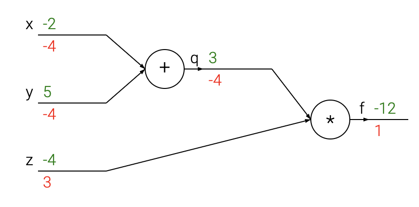
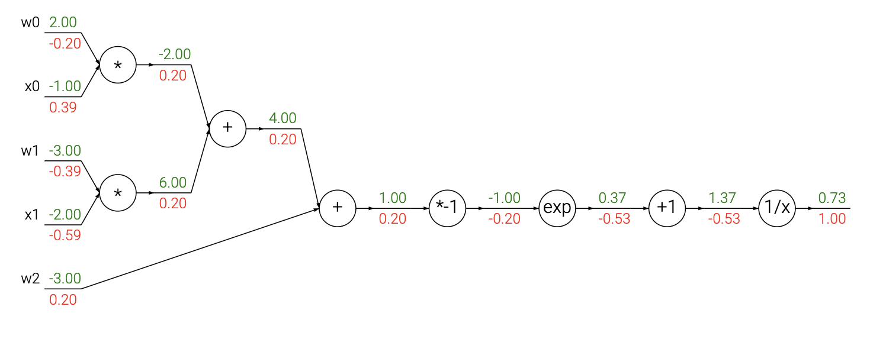
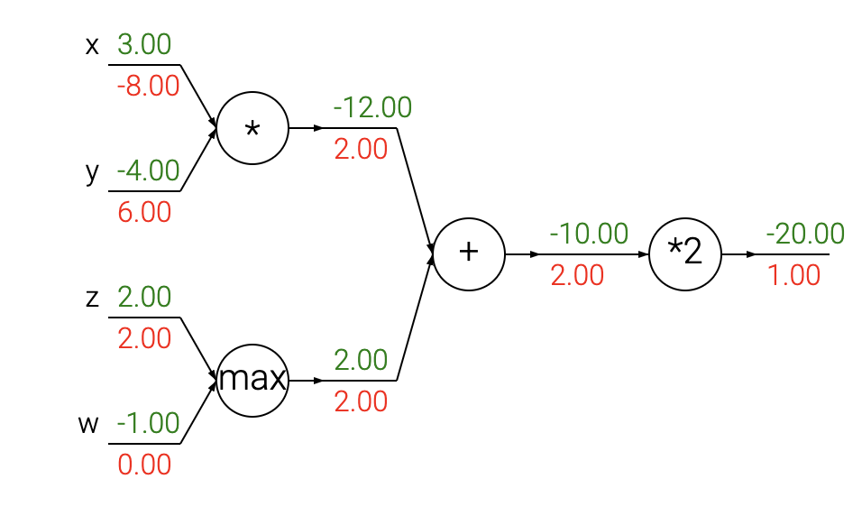

## Add Exploding and Vanishing Gradients problem
# Version 1 Backpropagation 

**Before Reading This:**
Please refer to the following resources for background knowledge:
- Wenqing’s Machine Learning Blog:
   - [Optimization Overview](https://github.com/purepisces/Wenqing-Machine_Learning_Blog/blob/main/Foundational-Concepts-in-Machine-Learning/Optimization-Algorithms/optimization-overview.md)

Table of Contents:

- [Introduction](#intro)
- [Simple expressions, interpreting the gradient](#grad)
- [Compound expressions, chain rule, backpropagation](#backprop)
- [Intuitive understanding of backpropagation](#intuitive)
- [Modularity: Sigmoid example](#sigmoid)
- [Backprop in practice: Staged computation](#staged)
- [Patterns in backward flow](#patterns)
- [Gradients for vectorized operations](#mat)
- [Summary](#summary)

### Introduction

**Motivation**. In this section we will develop expertise with an intuitive understanding of **🌟🌟🌟**backpropagation**, which is a way of computing gradients of expressions through recursive application of **chain rule**.** Understanding of this process and its subtleties is critical for you to understand, and effectively develop, design and debug neural networks.

> **expressions** refer to mathematical functions or formulas that describe how certain variables are related to each other.
> 
> In the context of **backpropagation**, recursive application of the **chain rule** means that the gradients are computed one step at a time, layer by layer, moving backward through a computational graph, with each step depending on the result of the previous one.

**Problem statement**. The core problem studied in this section is as follows: We are given some function $f(x)$ where $x$ is a vector of inputs and we are interested in computing the gradient of $f$ at $x$ (i.e. $\nabla f(x)$ ).

**Motivation**. Recall that the primary reason we are interested in this problem is that in the specific case of neural networks, $f$ will correspond to the loss function ($L$), and $x$ includes both the training data and the neural network weights. For instance: The loss could be an SVM loss function and the inputs are both the training data $(x_i, y_i), i = 1, \ldots, N$ and the weights and biases $W, b$. Note that (as is usually the case in Machine Learning) we think of the training data as given and fixed, and of the weights as variables we have control over.
Hence, while backpropagation can calculate gradients with respect to the input data ($x_i$​), in practice, it is primarily used to compute gradients with respect to the parameters (e.g. $W, b$, facilitating their optimization. However, gradients on $x_i$ can also provide insights, such as visualizing and interpreting neural network behavior. Even if you're already familiar with deriving gradients using the chain rule, this section offers a unique perspective on backpropagation as a backward flow in real-valued computational circuits. Exploring these concepts may uncover valuable insights to deepen your understanding.


### Simple expressions and interpretation of the gradient
___
Let’s begin with a simple example to develop the notation and conventions used for more complex expressions. Consider a simple function defined by the multiplication of two variables: $f(x, y) = x \cdot y$. Using basic calculus, we can compute the partial derivatives with respect for each input:

$$f(x,y) = x y \hspace{0.5in} \rightarrow \hspace{0.5in} \frac{\partial f}{\partial x} = y \hspace{0.5in} \frac{\partial f}{\partial y} = x $$

**Interpretation**. Keep in mind what the **🌟🌟🌟derivatives tell you: They indicate the rate of change of a function with respect to that variable surrounding an infinitesimally small region near a particular point**:

$$\frac{df(x)}{dx} = \lim_{h\ \to 0} \frac{f(x + h) - f(x)}{h}$$

A technical note is that the division sign on the left-hand side is, unlike the division sign on the right-hand side, not a division. Instead, this notation indicates that the operator $\frac{d}{dx}$ is being applied to the function $f$, and returns a different function (the derivative). 

> -   The operator $\frac{d}{dx}$​ takes $f(x)$ as input and returns the derivative function $f'(x)$ as output. The notation $\frac{df(x)}{dx}$ is **equivalent** to $f'(x)$. Both represent the **derivative** of the function $f(x)$ with respect to $x$.
>-   For example:
 >     -   Input: $f(x) = x^2$
>     -   Output: $f'(x) = 2x$

A nice way to think about the expression above is that when $h$ is very small, then the function is well-approximated by a straight line, and the derivative is its slope. In other words, the derivative on each variable tells you the sensitivity of the whole expression on its value.
> Any smooth function, no matter how curved, can appear linear if you "zoom in" close enough to a specific point.

For example, if $x = 4, y = -3$ then $f(x,y) = -12$, and the partial derivative with respect to $x$, $\frac{\partial f}{\partial x} = -3$, shows that a tiny increase in $x$ would decrease the value of $f(x, y)$ by three times the change in $x$, due to the negative sign. This can be seen by rearranging the above equation ( $f(x + h) = f(x) + h \frac{df(x)}{dx}$ ). Analogously, since $\frac{\partial f}{\partial y} = 4$, we expect that increasing the value of $y$ by some very small amount $h$ would also increase the output of the function (due to the positive sign), and by $4h$.
> The derivative on each variable tells you the sensitivity of the whole expression on its value.

As mentioned, the gradient $\nabla f$ is the vector of partial derivatives, so we have that $\nabla f = [\frac{\partial f}{\partial x}, \frac{\partial f}{\partial y}] = [y, x]$. Even though the gradient is technically a vector, we will often use terms such as *"the gradient on x"* instead of the technically correct phrase *"the partial derivative on x"* for simplicity.

We can also derive the derivatives for the addition operation:

$$f(x,y) = x + y \hspace{0.5in} \rightarrow \hspace{0.5in} \frac{\partial f}{\partial x} = 1 \hspace{0.5in} \frac{\partial f}{\partial y} = 1$$

that is, the derivative on both $x,y$ is one regardless of what the values of $x,y$ are. This makes sense, since increasing either $x,y$ would increase the output of $f$, and the rate of that increase would be independent of what the actual values of $x,y$ are (unlike the case of multiplication above). 

> for $f(x, y) = x \cdot y$, the **rate of increase depends on the value of the other variable**.

The last function we'll use quite a bit in the class is the *max* operation:

$$f(x,y) = \max(x, y) \hspace{0.5in} \rightarrow \hspace{0.5in} \frac{\partial f}{\partial x} = \mathbb{1}(x >= y) \hspace{0.5in} \frac{\partial f}{\partial y} = \mathbb{1}(y >= x)$$

where $\mathbb{1}(\text{condition})$ is the **indicator function**:

-   $\mathbb{1}(x \geq y) = 1$ if $x \geq y$, and $0$ otherwise.
-   $\mathbb{1}(y \geq x) = 1$ if $y \geq x$, and $0$ otherwise.

That is, the (sub)gradient is 1 on the input that was larger and 0 on the other input. Intuitively, if the inputs are $x = 4,y = 2$, then the max is 4, and the function is not sensitive to the setting of $y$. That is, if we were to increase it by a tiny amount $h$, the function would keep outputting 4, and therefore the gradient is zero: there is no effect. Of course, if we were to change $y$ by a large amount (e.g. larger than 2), then the value of $f$ would change, but the derivatives tell us nothing about the effect of such large changes on the inputs of a function; They are only informative for tiny, infinitesimally small changes on the inputs, as indicated by the $\lim_{h \rightarrow 0}$ in its definition.

> The **gradient** can still be applied to functions that are differentiable at some points but **not differentiable everywhere**. However, the gradient only exists at the specific points where the function is differentiable. At points where the function is **not differentiable**, the gradient does not exist.
> 
> The **subgradient** is specific to **convex functions**. It generalizes the concept of the gradient to allow for non-differentiable points in convex functions (e.g., kinks or corners). Subgradients are only defined for **convex functions** because the subgradient inequality relies on convexity.

### Compound expressions with chain rule

Let’s consider more complex expressions involving multiple composed functions, such as$f(x, y, z) = (x + y)z$. While this expression is still simple enough to differentiate directly, we’ll take a specific approach to it that helps build intuition for backpropagation. 
This function can be broken into two parts:
-   $q=x+y$
-   $f = qz$

We already know how to compute the derivatives of each part separately:

-   For $f = qz$ the derivatives are $\frac{\partial f}{\partial q} = z$ and $\frac{\partial f}{\partial z} = q$.
-   For $q = x + y$, the derivatives are $\frac{\partial q}{\partial x} = 1$ and $\frac{\partial q}{\partial y} = 1$.

However, we’re not interested in the intermediate gradient $\frac{\partial f}{\partial q}$ itself. Instead, we care about the gradients of $f$ with respect to the inputs $x, y, z$. The **chain rule** provides the correct way to "chain" these gradients together, which involves multiplying them along the dependency paths. For instance, to compute $\frac{\partial f}{\partial x}$, we combine the gradients as: $\frac{\partial f}{\partial x} = \frac{\partial f}{\partial q} \cdot \frac{\partial q}{\partial x}.$ In practice, this is simply the multiplication of two numerical values: the gradient of $f$ with respect to $q$, and the gradient of $q$ with respect to $x$. Let’s work through an example to make this clear.

```python
# set some inputs
x = -2; y = 5; z = -4

# perform the forward pass
q = x + y # q becomes 3
f = q * z # f becomes -12

# perform the backward pass (backpropagation) in reverse order:
# first backprop through f = q * z
dfdz = q # df/dz = q, so gradient on z becomes 3
dfdq = z # df/dq = z, so gradient on q becomes -4
dqdx = 1.0
dqdy = 1.0
# now backprop through q = x + y
dfdx = dfdq * dqdx  # The multiplication here is the chain rule!
dfdy = dfdq * dqdy  
```
We are left with the gradients in the variables `[dfdx, dfdy, dfdz]`, which represent how sensitive the output fff is to changes in the inputs $x, y, z$ This is a simple yet effective demonstration of backpropagation. Moving forward, we’ll adopt a more concise notation that omits the `df` prefix. For instance, we’ll write `dq` instead of `dfdq`, always assuming  that the gradient is computed on the final output.

This entire computation can be effectively visualized using a **circuit diagram**:
___


The real-valued **circuit** above provides a visual representation of the computation. During the **forward pass** (values shown in green), the circuit computes intermediate values and the final output, progressing from the inputs to the output. In the **backward pass** (gradients shown in red), backpropagation begins at the output and recursively  applies the chain rule to calculate gradients, propagating backward through the circuit to the inputs.  The gradients can be thought of as flowing backwards through the circuit.

___

### Intuitive understanding of backpropagation

> Look at appendix part for a clear explanation 

Backpropagation is inherently a localized process. Each gate in a circuit diagram receives inputs and can right away independently compute two things: 1) its output value and 2) the _local_ gradient of its output with respect to its inputs. Importantly, gates can perform these computations without needing any knowledge of the full circuit that they are embedded in. However, after the forward pass is complete, the gate will receive, during backpropagation, the gradient of its output with respect to the final output of the entire circuit. According to the chain rule, the gate then combines this gradient with its local gradients to calculate the gradients for all its inputs.

> The gradient of a gate's output value on the final output of the entire circuit is provided by the **upstream gradient** during backpropagation
> 
> **Recursive Dependency:**
>-   Each gate or layer relies on the gradient passed from the layer after it to compute its own gradient. This continues recursively until we reach the input layer, completing the backward pass.

This extra multiplication (for each input) due to the chain rule can turn a single and relatively useless gate into a cog in a complex circuit such as an entire neural network. 
> The **"extra multiplication"** refers to the step in backpropagation where the **local gradient** of a gate is multiplied by the **upstream gradient** from the next layer, as dictated by the **chain rule**.

To build intuition, let’s revisit the example. The add gate received inputs $[-2, 5]$ and computed an output of $3$. Since the gate performs an addition operation, its local gradient with respect to both inputs is $+1$. The rest of the circuit computed the final output of $-12$. During the backward pass, where the chain rule is applied recursively throught the circuit, the add gate (an input to the multiply gate) is informed that the gradient of its output is $-4$. If we imagine the circuit as aiming to increase the final output (which can help with intuition), we can interpret this as the circuit "preferring" the add gate’s output to decrease (indicated by the negative sign), with a "force" of $4$. To continue the recurrence and to chain the gradient, the add gate multiplies this gradient ($-4$) with its local gradients ($1$) for each input, resulting in gradients of $1 * -4 = -4$ for both $x$ and $y$.

This adjustment achieves the desired effect: if $x$ and $y$ decrease in response to their negative gradients, the add gate’s output will also decrease, causing the multiply gate’s output to increase.

Backpropagation, therefore, can be thought of as gates "communicating" through gradient signals, indicating whether their outputs should increase or decrease (and by how much) to steer the final output closer to the desired value.

### Modularity: Sigmoid example

> -   A convex function can be differentiable or non-differentiable.
>-   The set of differentiable functions includes both convex and non-convex functions.

The gates we introduced above are relatively arbitrary.  Any kind of differentiable function can act as a gate, and we can either group multiple operations into a single gate or split a complex function into smaller gates for convenience. Lets look at another expression that illustrates this point:

$$f(w,x) = \frac{1}{1+e^{-(w_0x_0 + w_1x_1 + w_2)}}$$

as we will see later in the class, this expression describes a 2-dimensional neuron (with inputs **x** and weights **w**) that uses the *sigmoid activation* function. But for now lets think of this very simply as just a function from inputs *w,x* to a single number. 

> A **2-dimensional neuron** refers to a basic computational unit in a neural network that operates on two inputs ($x_0, x_1$​) and applies a mathematical transformation to produce a single output. It is called "2-dimensional" because it processes **two input features**. **$x_0​$ and $x_1$​** represent **two features of a single data example**, not two separate data examples. Since a neuron processes a **single data example** at a time., and if $x_0$​ and $x_1$​ were two separate data examples, the neuron would need to process them independently, as each data example produces its own output. However, in this equation, $x_0$​ and $x_1$​ are **combined** in the weighted sum, indicating they belong to the same data example.

The function is made up of multiple gates. In addition to the ones described already above (add, mul, max), there are four more:

$$f(x) = \frac{1}{x} 
\hspace{1in} \rightarrow \hspace{1in} 
\frac{df}{dx} = -1/x^2 
\\\\
f_c(x) = c + x
\hspace{1in} \rightarrow \hspace{1in} 
\frac{df}{dx} = 1 
\\\\
f(x) = e^x
\hspace{1in} \rightarrow \hspace{1in} 
\frac{df}{dx} = e^x
\\\\
f_a(x) = ax
\hspace{1in} \rightarrow \hspace{1in} 
\frac{df}{dx} = a$$

The functions $f_c(x)$ and $f_a(x)$ add a constant $c$ or scale by a constant $a$, respectively. While these are technically special cases of addition and multiplication, they are introduced as (new) unary gates here because the constants $c$ and $a$ do not require gradients. 
> **Unary gates** are operations in a computational graph or a neural network that take a **single input** and produce a **single output**.

The full circuit then looks as follows:




Example circuit for a 2D neuron with a sigmoid activation function. The inputs are [x0,x1] and the (learnable) weights of the neuron are [w0,w1,w2]. As we will see later, the neuron computes a dot product with the input and then its activation is softly squashed by the sigmoid function to be in range from 0 to 1.
> see appendix part about explain neuron operations
> The term "softly squashed" refers to the **smooth and gradual nature** of the sigmoid curve, the transition from 0 to 1 happens gradually, without sharp changes, making it "soft."
___
In the example above, we observe a long chain of function applications acting on the output of the dot product between **w** and **x**. The function that these operations implement is called the *sigmoid function* $\sigma(x)$.  Interestingly, the derivative of the sigmoid function with respect to its input can be greatly simplified through a clever step, which involves adding and subtracting 1 in the numerator during the derivation.

$$\sigma(x) = \frac{1}{1+e^{-x}} \\\\
\rightarrow \hspace{0.3in} \frac{d\sigma(x)}{dx} = \frac{e^{-x}}{(1+e^{-x})^2} = \left( \frac{1 + e^{-x} - 1}{1 + e^{-x}} \right) \left( \frac{1}{1+e^{-x}} \right) 
= \left( 1 - \sigma(x) \right) \sigma(x)$$

As we see, the gradient turns out to simplify and becomes surprisingly simple. For instance, when the sigmoid function receives an input of $1.0$ and computes the output 0.73 during the forward pass.  The derivation shows that the _local_ gradient is simply calculated as $(1 - 0.73) \cdot 0.73 \approx 0.2$, matching the circuit's previous computation (refer to the image above). However, this simplified expression allows the gradient to be computed more efficiently and with fewer numerical issues. As a result, in practical applications, it is advantageous to combine all these operations into a single computational gate for better efficiency and simplicity.

> From the image, the operations to group into the sigmoid gate are:
> -   **Negation** ($*-1$)
> -   **Exponential** ($⁡\exp$)
> -   **Addition** ($+1$)
> -   **Reciprocal** ($1/x$)
> These correspond to the computation of the sigmoid function $\sigma(z)$. Once grouped, these steps are represented as a single gate that computes $\sigma(z)$ and its gradient for backpropagation.

Lets see the backprop for this neuron in code:

```python
w = [2,-3,-3] # assume some random weights and data
x = [-1, -2]

# forward pass
dot = w[0]*x[0] + w[1]*x[1] + w[2]
f = 1.0 / (1 + math.exp(-dot)) # sigmoid function

# backward pass through the neuron (backpropagation)
ddot = (1 - f) * f # gradient on dot variable, using the sigmoid gradient derivation
dx = [w[0] * ddot, w[1] * ddot] # backprop into x
dw = [x[0] * ddot, x[1] * ddot, 1.0 * ddot] # backprop into w
# we're done! we have the gradients on the inputs to the circuit
```

**Implementation protip: staged backpropagation**. In practice, it's often helpful to break the forward pass into smaller, manageable stages that can be easily processed during backpropagation. For instance, in the example above, we introduced an intermediate variable `dot` to store the result of the dot product between `w` and `x`. During backward pass we then successively compute (in reverse order) the corresponding variables (e.g. `ddot`, and ultimately `dw, dx`) that hold the gradients of those variables.

The key takeaway here is that the details of how the backpropagation is performed, and which parts of the forward function we think of as gates, is a matter of convenience. It helps to be aware of which parts of the expression have easy local gradients, so that they can be chained together with the least amount of code and effort. 

### Backprop in practice: Staged computation

Lets see this with another example. Suppose that we have a function of the form:

$$f(x,y) = \frac{x + \sigma(y)}{\sigma(x) + (x+y)^2}$$


To be clear, this function is completely useless and it's not clear why you would ever want to compute its gradient, except for the fact that it is a good example of backpropagation in practice. It's worth noting that directly differentiating with respect to $x$ or $y$ would lead to cumbersome and complex expressions. However, explicit differentiation is unnecessary—we don't need to have an explicit function written down that evaluates the gradient. Instead, we only have to know how to compute it. Below is an example of how to structure the forward pass for such a function:

```python
x = 3 # example values
y = -4

# forward pass
sigy = 1.0 / (1 + math.exp(-y)) # sigmoid in numerator   #(1)
num = x + sigy # numerator                               #(2)
sigx = 1.0 / (1 + math.exp(-x)) # sigmoid in denominator #(3)
xpy = x + y                                              #(4)
xpysqr = xpy**2                                          #(5)
den = sigx + xpysqr # denominator                        #(6)
invden = 1.0 / den                                       #(7)
f = num * invden # done!                                 #(8)
```
By the end of the forward pass, we have computed the desired output by breaking the computation into multiple intermediate variables (e.g., `sigy`, `num`, `sigx`, `xpy`, `xpysqr`, `den`, `invden`). Each intermediate variable corresponds to a simple operation for which the local gradient is well-known. Therefore, computing the backprop pass is easy: We'll go backwards and for every variable along the way in the forward pass (`sigy, num, sigx, xpy, xpysqr, den, invden`) we will have the same variable, but one that begins with a `d`, which will hold the gradient of the output of the circuit with respect to that variable. Additionally, note that every single piece in our backprop will involve computing the local gradient of that expression, and chaining it with the gradient on that expression with a multiplication. For each row, we also highlight which part of the forward pass it refers to:

> We'll go backward through the computation, and for every intermediate variable, we compute its local gradient and combine it with the gradient flowing back from subsequent steps using multiplication. Each step in the backward pass directly corresponds to a part of the forward pass.

```python
# backprop f = num * invden
dnum = invden # gradient on numerator                             #(8)
dinvden = num                                                     #(8)
# backprop invden = 1.0 / den 
dden = (-1.0 / (den**2)) * dinvden                                #(7)
# backprop den = sigx + xpysqr
dsigx = (1) * dden                                                #(6)
dxpysqr = (1) * dden                                              #(6)
# backprop xpysqr = xpy**2
dxpy = (2 * xpy) * dxpysqr                                        #(5)
# backprop xpy = x + y
dx = (1) * dxpy                                                   #(4)
dy = (1) * dxpy                                                   #(4)
# backprop sigx = 1.0 / (1 + math.exp(-x))
dx += ((1 - sigx) * sigx) * dsigx # Notice += !! See notes below  #(3)
# backprop num = x + sigy
dx += (1) * dnum                                                  #(2)
dsigy = (1) * dnum                                                #(2)
# backprop sigy = 1.0 / (1 + math.exp(-y))
dy += ((1 - sigy) * sigy) * dsigy                                 #(1)
# done! phew
```
> For example, f = num * invden, in this backprop, will calculate each of its input dnum and dinvden,  and for num = x + sigy, the input is x and sigy, so calculate dx and dsigy.

Notice a few things:
**Cache forward pass variables**. During the backward pass, it is crucial to reuse the intermediate variables computed in the forward pass. Storing these variables, also known as caching. In practice you want to structure your code so that you cache these variables, and so that they are available during backpropagation. If this is too difficult, it is possible (but wasteful) to recompute them.

**Gradients add up at forks**. In the forward pass, variables like $x$ and $y$ might contribute to multiple parts of the computation graph. When backpropagating, the gradients from these branches must be **added together** to get the total gradient. To achieve this, use `+=` instead of `=`, ensuring the gradient contributions are accumulated rather than overwritten. This follows the *multivariable chain rule* in Calculus, which states that if a variable branches out to different parts of the circuit, then the gradients that flow back to it will add.

### Patterns in backward flow

The backward flow of gradients in neural networks can often be interpreted intuitively, especially for the three most commonly used gates: **add**, **multiply**, and **max**, all have very simple interpretations in terms of how they act during backpropagation.  Consider the example circuit below:

___



An example circuit demonstrating the intuition behind the operations that backpropagation performs during the backward pass in order to compute the gradients on the inputs. The sum operation evenly distributes the gradient across all its inputs. The max operation directs the gradient to the input with the highest value. Multiply gate takes the input activations, swaps them and multiplies by its incoming gradient.

> **Input activations** refer to the inputs $x$ and $y$ provided to the multiply gate during the forward pass.
> The multiply gate computes gradients for its inputs by swapping their values and scaling them by the incoming gradient.
___

Looking at the diagram above, we can observe the following:

The **add gate** always takes the gradient on its output and distributes it equally to all of its inputs, regardless of their values during the forward pass. This happens because the local gradient of the add operation with respect to each input is $+1.0$. As a result, the gradients on all inputs are equal to the gradient at the output, because it will be multiplied by $1.0$, leaving them unchanged. In the example circuit, the add gate evenly routed the gradient of $2.00$ to both of its inputs, equally and unchanged.

> **Everyday English**: Distribute equally = Split the total into equal portions. **Backpropagation Context**: Distribute equally = Assign the same value (not split) to each input.

Unlike the add gate, which distributes the gradient unchanged to all its inputs, the **max gate** directs the gradient (unchanged) exclusively to the input with the highest value during the forward pass. The local gradient of the max gate is $1.0$ for the input with the maximum value and $0.0$ for all others. In the example circuit, the max gate routed the gradient of $2.00$ to the $z$ variable (which had a higher value than **w**), leaving the gradient on $w$ remains zero.

The **multiply gate** is a little less easy to interpret. Its local gradients are the input values (swapped for each input), which are then multiplied by the gradient from its output as per the chain rule. In the example circuit, the gradient on $x$ is $-8.00$, calculated as $-4.00 \cdot 2.00$ (input $y$ multiplied by the output gradient).
> The **output gradient** refers to the gradient of the loss $L$ with respect to the output of the multiply gate ($z$).

*Unintuitive effects and their consequences*. When one input to the multiply gate is very small and the other is very large, then the multiply gate will do something slightly unintuitive: it will assign a relatively huge gradient to the small input and a tiny gradient to the large input. Note that in linear classifiers where the weights are dot producted $w^Tx_i$ (multiplied) with the inputs, this implies that the scale of the data has an effect on the magnitude of the gradient for the weights. For example, If all input values $x_i$ are scaled by a factor of $1000$ during preprocessing, the gradients of the weights will also increase by a factor of $1000$. To stabilize training, you’d have to lower the learning rate by that factor to compensate. This is why preprocessing matters a lot, sometimes in subtle ways! This highlights the importance of data preprocessing, such as normalization or standardization, to avoid unintended gradient scaling. Having an intuitive understanding of how gradients flow can help identify and resolve such issues during debugging.

### Gradients for vectorized operations
> looking at appendix part

The above sections were concerned with single variables, but all concepts extend in a straight-forward manner to matrix and vector operations. However, extra care must be taken to account for the dimensions of the matrices and the need for transpose operations.

**Matrix-Matrix multiply gradient**. Possibly the most tricky operation is the matrix-matrix multiplication (which generalizes all matrix-vector and vector-vector) multiply operations:

```python
# forward pass
W = np.random.randn(5, 10)
X = np.random.randn(10, 3)
D = W.dot(X)

# now suppose we had the gradient on D from above in the circuit
dD = np.random.randn(*D.shape) # same shape as D
dW = dD.dot(X.T) #.T gives the transpose of the matrix
dX = W.T.dot(dD)
```
*Tip: use dimension analysis!* You don’t need to memorize the formulas for `dW` and `dX` because they can easily be re-derived using dimensional reasoning. For example, the gradient of the weights `dW` must have the same shape as `W` after computation. Additionally, it should involve the matrix multiplication of `X` and `dD`. This logic holds true even when both `X,W` are single numbers and not matrices. To ensure the dimensions align correctly, there is only one valid way to compute the gradient. For example, `X` is of size [10 x 3] and `dD` of size [5 x 3], so if we want `dW` and `W` has shape [5 x 10], then the only way of achieving this is with `dD.dot(X.T)`, as shown above.

**Work with small, explicit examples**. Some people may find it difficult at first to derive the gradient updates for some vectorized expressions. Our recommendation is to explicitly write out a minimal vectorized example, derive the gradient on paper and then generalize the pattern to its efficient, vectorized form.

Erik Learned-Miller has also written up a longer related document on taking matrix/vector derivatives which you might find helpful. [Find it here](http://cs231n.stanford.edu/vecDerivs.pdf).


### Summary

- We developed intuition for what the gradients mean, how they flow backwards in the circuit, and how they communicate which part of the circuit should increase or decrease and with what force to make the final output higher.
> We built an understanding of gradients, how they flow backward through a computational graph, and how they indicate which parts of the circuit should adjust (and by how much) to increase the final output.
>
- We emphasized the importance of **staged computation** for practical implementations of backpropagation. It’s best to break a function into smaller modules where local gradients can be easily derived, and then combine them using the chain rule. Crucially, you almost never want to write out these expressions on paper and differentiate them symbolically in full, because you never need an explicit mathematical equation for the gradient of the input variables. Hence, decompose your expressions into stages such that you can differentiate every stage independently (the stages will be matrix vector multiplies, or max operations, or sum operations, etc.) and then backprop through the variables one step at a time. 

> Instead, decompose the function into stages (e.g., matrix-vector multiplications, max operations, sum operations), compute gradients for each stage independently, and propagate the gradients back through the graph step by step.

In the next section, we will start to define neural networks and use backpropagation to efficiently compute the gradient of a loss function with respect to the model's parameters. In other words, we're now ready to train neural nets, and the most conceptually difficult part of this class is behind us! ConvNets will then be a small step away.

### Appendix

#### 1. **Roles of Each Gate in Backpropagation**

-   **Add Gate (at $q = x + y$)**:
    
    -   **Forward Pass**:
        -   Computes and stores $q = x + y$(its output).
    -   **Backward Pass**:
        -   Stores its **local gradients**:
            -   $\frac{\partial q}{\partial x} = 1$
            -   $\frac{\partial q}{\partial y} = 1$
        -   Receives $\frac{\partial f}{\partial q}$​ (upstream gradient from the multiply gate).
        -   Computes $\frac{\partial f}{\partial x}$​ and $\frac{\partial f}{\partial y}$​ using: $\frac{\partial f}{\partial x} = \frac{\partial f}{\partial q} \cdot \frac{\partial q}{\partial x}, \quad \frac{\partial f}{\partial y} = \frac{\partial f}{\partial q} \cdot \frac{\partial q}{\partial y}.$
        -   These values ($\frac{\partial f}{\partial x}$and$\frac{\partial f}{\partial y}$​) are sent back to their respective inputs.
-   **Multiply Gate (at $f = q \cdot z$)**:
    
    -   **Forward Pass**:
        -   Computes and stores $f = q \cdot z$ (its output).
    -   **Backward Pass**:
        -   Stores its **local gradients**:
            -   $\frac{\partial f}{\partial q} = z$
            -   $\frac{\partial f}{\partial z} = q$
        -   Receives $\frac{\partial f}{\partial f} = 1$ (from the final output).
        -   Computes $\frac{\partial f}{\partial q}$​ and $\frac{\partial f}{\partial z}$​ using: $\frac{\partial f}{\partial q} = \frac{\partial f}{\partial f} \cdot \frac{\partial f}{\partial q}, \quad \frac{\partial f}{\partial z} = \frac{\partial f}{\partial f} \cdot \frac{\partial f}{\partial z}.$
        -   These values are sent back to the add gate ($q$) and input $z$, respectively.
-   **Final Output Gate (at $f$)**:
    
    -   Does not need to store $\frac{\partial f}{\partial f}$​, as it is always $1$.
    -   $\frac{\partial f}{\partial f}$ is simply used as the starting point of backpropagation.

#### 2. **Where Are Gradients Stored?**

-   **Local Gradients**:
    
    -   Each gate (e.g., the add gate and multiply gate) computes and stores its own local gradients (e.g., $\frac{\partial q}{\partial x}, \frac{\partial q}{\partial y}$​ in the add gate, or $\frac{\partial f}{\partial q}, \frac{\partial f}{\partial z}$​ in the multiply gate).
-   **Upstream Gradients**:
    
    -   Each gate **receives** the gradient of its output with respect to the final output ($\frac{\partial f}{\partial q}$ for the add gate, or $\frac{\partial f}{\partial f} = 1$ for the multiply gate).
    -   These are computed during backpropagation and passed from one gate to the next.
-   **Final Gradient ($\frac{\partial f}{\partial f}$​)**:
    
    -   This is always $1$, and it does not need to be stored. It serves as the starting point for the backward pass.

#### Another Example for Backward Pass:
$$\frac{\partial f}{\partial b} = \frac{\partial f}{\partial q} \cdot \frac{\partial q}{\partial z} \cdot \frac{\partial z}{\partial b}.$$
1.  **Gate $f$** starts backpropagation:
    -   Computes $\frac{\partial f}{\partial q}$​ (local gradient) and sends it to **Gate $q$**.
2.  **Gate $q$**:
    -   Receives $\frac{\partial f}{\partial q}$​.
    -   Computes $\frac{\partial f}{\partial z} = \frac{\partial f}{\partial q} \cdot \frac{\partial q}{\partial z}$.
    -   Sends $\frac{\partial f}{\partial z}$ to **Gate $z$**.
3.  **Gate $z$**:
    -   Receives $\frac{\partial f}{\partial z}$.
    -   Computes $\frac{\partial f}{\partial b} = \frac{\partial f}{\partial z} \cdot \frac{\partial z}{\partial b}$​.
    -   Sends $\frac{\partial f}{\partial b}$​ to **Gate $b$**.

### Explain neuron operations
A **neuron** in a neural network typically performs **two main operations**:

1.  **Computing the weighted sum** (or linear transformation):
    
   $$z = w_0x_0 + w_1x_1 + \dots + w_nx_n + b$$
   -   This step combines the inputs ($x_i$) with their corresponding weights ($w_i$) and adds a bias term ($b$).
    -   The result $z$ is called the **pre-activation** value.
2.  **Applying an activation function**:
    
   $$f(z) = \sigma(z)$$
   -   The activation function (e.g., **sigmoid**, ReLU, or tanh) transforms the weighted sum into the final output of the neuron.
    -   This step introduces **non-linearity**, enabling the network to model complex relationships in the data.

### Explain for vectorized operations
```python
# Non-vectorized (loop-based):
result = []
for i in range(len(a)):
    result.append(a[i] + b[i])

# Vectorized:
result = a + b  # Done in one line, much faster
```
```python
import numpy as np

# Vectors
a = np.array([1, 2, 3])
b = np.array([4, 5, 6])
c = a + b  # Result: [5, 7, 9]

# Matrices
A = np.array([[1, 2], [3, 4]])
B = np.array([[5, 6], [7, 8]])
C = A + B  # Result: [[6, 8], [10, 12]]
```
> Both **matrix operations** and **vector operations** are considered **vectorized operations**

 **Examples of Vectorized Operations**

#### **Vector Operations**

1.  **Addition**:
    
    $$\mathbf{c} = \mathbf{a} + \mathbf{b}, \quad \text{where } \mathbf{a}, \mathbf{b} \in \mathbb{R}^n$$
2.  **Dot Product**:
    
    $$s = \mathbf{a}^T \mathbf{b}, \quad \text{result is a scalar.}$$

#### **Matrix Operations**

1.  **Matrix-Vector Multiplication**:
    
   $$\mathbf{y} = \mathbf{A} \cdot \mathbf{x}, \quad \text{where } \mathbf{A} \in \mathbb{R}^{m \times n}, \mathbf{x} \in \mathbb{R}^n$$

2.  **Matrix-Matrix Multiplication**:
    
   $$\mathbf{C} = \mathbf{A} \cdot \mathbf{B}, \quad \text{where } \mathbf{A} \in \mathbb{R}^{m \times n}, \mathbf{B} \in \mathbb{R}^{n \times p}$$

## Reference:
- [https://cs231n.github.io/optimization-2/](https://cs231n.github.io/optimization-2/)
  
# Version 2 Backpropagation 
Backpropagation is the algorithm used to calculate the gradient of the loss function with respect to each parameter (weight) in a neural network. It allows the network to update these weights in a way that minimizes the loss function, enabling the network to learn from the data.

## Backpropagation Overview

#### Forward Pass:
- Input data passes through the network, and the output is calculated.
- Activations and intermediate values (such as $Z_i$) are stored for use in the backward pass.

#### Backward Pass:
- The loss is computed using the output of the network and the true labels.
- Gradients of the loss with respect to each parameter are calculated using the chain rule of calculus.
- These gradients are used to update the parameters (weights) using an optimization algorithm like gradient descent.

### Backpropagation with Respect to $Z_i$ and $W_i$

In backpropagation, we need to calculate gradients with respect to both the activations $Z_i$ and the weights $W_i$. Here’s how this is done:

#### Gradients with Respect to Activations $Z_i$
The gradients with respect to the activations $Z_i$ are intermediate steps in the backpropagation process. They are used to calculate the gradients with respect to the weights. Specifically, for layer $i$, we compute $\frac{\partial \ell}{\partial Z_i}$, which represents how the loss changes with respect to the activations of that layer.

#### Gradients with Respect to Weights $W_i$
The ultimate goal is to compute the gradients of the loss with respect to the weights $W_i$, denoted as $\frac{\partial \ell}{\partial W_i}$. These gradients tell us how to adjust the weights to minimize the loss.

Refer to slides - [CMU 10714 Manual-Neural-Nets PDF](manual_neural_nets.pdf)

## Example to illustrate backpropagation from CMU Deep Learning Systems hw0 question 5: SGD for a two-layer neural network

Let's consider the case of a simple two-layer neural network. Specifically, for input $x \in \mathbb{R}^n$, we'll consider a two-layer neural network (without bias terms) of the form

$$\begin{equation}
z = W_2^T \mathrm{ReLU}(W_1^T x)
\end{equation}$$

where $W_1 \in \mathbb{R}^{n \times d}$ and $W_2 \in \mathbb{R}^{d \times k}$ represent the weights of the network (which has a $d$-dimensional hidden unit), and where $z \in \mathbb{R}^k$ represents the logits output by the network. We again use the softmax / cross-entropy loss, meaning that we want to solve the optimization problem

$$\begin{equation}
minimize_{W_1, W_2} \;\; \frac{1}{m} \sum_{i=1}^m \ell_{\mathrm{softmax}}(W_2^T \mathrm{ReLU}(W_1^T x^{(i)}), y^{(i)}).
\end{equation}$$

Or alternatively, overloading the notation to describe the batch form with matrix $X \in \mathbb{R}^{m \times n}$, this can also be written

$$\begin{equation}
minimize_{W_1, W_2} \;\; \ell_{\mathrm{softmax}}(\mathrm{ReLU}(X W_1) W_2, y).
\end{equation}$$

Using the chain rule, we can derive the backpropagation updates for this network. Specifically, let

$$\begin{equation}
\begin{split}
Z_1 \in \mathbb{R}^{m \times d} & = \mathrm{ReLU}(X W_1) \\
G_2 \in \mathbb{R}^{m \times k} & = normalize(\exp(Z_1 W_2)) - I_y \\
G_1 \in \mathbb{R}^{m \times d} & = \mathrm{1}\{Z_1 > 0\} \circ (G_2 W_2^T)
\end{split}
\end{equation}$$

where $\mathrm{1}\{Z_1 > 0\}$ is a binary matrix with entries equal to zero or one depending on whether each term in $Z_1$ is strictly positive and where $\circ$ denotes elementwise multiplication. Then the gradients of the objective are given by

$$\begin{equation}
\begin{split}
\nabla_{W_1} \ell_{\mathrm{softmax}}(\mathrm{ReLU}(X W_1) W_2, y) & = \frac{1}{m} X^T G_1 \\
\nabla_{W_2} \ell_{\mathrm{softmax}}(\mathrm{ReLU}(X W_1) W_2, y) & = \frac{1}{m} Z_1^T G_2. \\
\end{split}
\end{equation}$$

**Note:** If the details of these precise equations seem a bit cryptic to you (prior to the 9/8 lecture), don't worry too much. These _are_ just the standard backpropagation equations for a two-layer ReLU network: the $Z_1$ term just computes the "forward" pass while the $G_2$ and $G_1$ terms denote the backward pass. But the precise form of the updates can vary depending upon the notation you've used for neural networks, the precise ways you formulate the losses, if you've derived these previously in matrix form, etc. If the notation seems like it might be familiar from when you've seen deep networks in the past, and makes more sense after the 9/8 lecture, that is more than sufficient in terms of background (after all, the whole _point_ of deep learning systems, to some extent, is that we don't need to bother with these manual calculations). But if these entire concepts are _completely_ foreign to you, then it may be better to take a separate course on ML and neural networks prior to this course, or at least be aware that there will be substantial catch-up work to do for the course.

### Neural networks in machine learning

Recall that neural networks just specify one of the "three" ingredients of a machine learning algorithm, also need:
- Loss function: still cross entropy loss, like last time
- Optimization procedure: still SGD, like last time

In other words, we still want to solve the optimization problem

$$\min_{\theta} \frac{1}{m} \sum_{i=1}^{m} \ell_{ce}(h_{\theta}(x^{(i)}), y^{(i)})$$

using SGD, just with $h_{\theta}(x)$ now being a neural network.

Requires computing the gradients $\nabla_{\theta} \ell_{ce}(h_{\theta}(x^{(i)}), y^{(i)})$ for each element of $\theta$.

### The gradient(s) of a two-layer network part1

Let's work through the derivation of the gradients for a simple two-layer network, written in batch matrix form, i.e.,

$$\nabla_{\{W_1, W_2\}} \ell_{ce}(\sigma(XW_1)W_2, y)$$

The gradient w.r.t. $W_2$ looks identical to the softmax regression case:

$$\frac{\partial \ell_{ce}(\sigma(XW_1)W_2, y)}{\partial W_2} = \frac{\partial \ell_{ce}}{\partial \sigma(XW_1)W_2} \cdot \frac{\partial \sigma(XW_1)W_2}{\partial W_2}
= (S - I_y) \cdot \sigma(XW_1), \quad [S = \text{softmax}(\sigma(XW_1)W_2)]$$

so (matching sizes) the gradient is

$$\nabla_{W_2} \ell_{ce}(\sigma(XW_1)W_2, y) = \sigma(XW_1)^T (S - I_y)$$


> **Prove  $S - I_y$**
> 
> **1. First Prove $\ell_{ce}(h(x), y) = -h_y(x) + \log \sum_{j=1}^{k} \exp(h_j(x))$**
> 
> Let's convert the hypothesis function to a "probability" by exponentiating and normalizing its entries (to make them all positive and sum to one)
> 
> $$z_i = p(\text{label} = i) = \frac{\exp(h_i(x))}{\sum_{j=1}^{k} \exp(h_j(x))} \quad \Longleftarrow \quad z \equiv \text{softmax}(h(x))$$
> 
> Then let's define a loss to be the (negative) log probability of the true class: this is called softmax or cross-entropy loss
> 
> $$\ell_{ce}(h(x), y) = -\log p(\text{label} = y) = -h_y(x) + \log \sum_{j=1}^{k} \exp(h_j(x))$$
> 
> **2. Second prove $S - I_y$**
> 
>Let's start by deriving the gradient of the softmax loss itself: for vector $h \in \mathbb{R}^k$
> 
>$$\frac{\partial \ell_{ce} (h, y)}{\partial h_i} = \frac{\partial}{\partial h_i} \left( -h_y + \log \sum_{j=1}^{k} \exp h_j \right)$$
>$$= -1 \{ i = y \} + \frac{\exp h_i}{\sum_{j=1}^{k} \exp h_j}$$
> 
>So, in vector form:
> 
>$$\nabla_h \ell_{ce} (h, y) = z - e_y, \text{ where } z = \text{softmax}(h)$$
> 
>In “matrix batch” form:
> 
>$$\nabla_h \ell_{ce} (X\theta, y) = S - I_y, \text{ where } S = \text{softmax}(X\theta)$$

### The gradient(s) of a two-layer network part2

Deep breath and let's do the gradient w.r.t. \( W_1 \)...

$$\frac{\partial \ell_{ce} (\sigma(XW_1) W_2, y)}{\partial W_1} = \frac{\partial \ell_{ce} (\sigma(XW_1) W_2, y)}{\partial \sigma(XW_1) W_2} \cdot \frac{\partial \sigma(XW_1) W_2}{\partial \sigma(XW_1)} \cdot \frac{\partial \sigma(XW_1)}{\partial XW_1} \cdot \frac{\partial XW_1}{\partial W_1}$$

$$= (S - I_y) \cdot W_2 \cdot \sigma'(XW_1) \cdot X$$

and so the gradient is

$$\nabla_{W_1} \ell_{ce} (\sigma(XW_1) W_2, y) = X^T \left( (S - I_y) W_2^T \circ \sigma'(XW_1) \right)$$

where $\circ$ denotes elementwise multiplication

$$\sigma'(x) = \begin{cases}
1 & \text{if } x > 0 \\
0 & \text{if } x \leq 0
\end{cases}$$

### Backpropagation "in general"

> 🌟🌟🌟🌟🌟🌟 In the slides explanation, the  neural network is Z1->W1->Z2->W2->Z3, however, in the assignment, the neural network is X->W1->Z1->W2->Z2. So the formula will be index different, but the logic is same. For example in assignment, $G_1 \in \mathbb{R}^{m \times d}  = \mathrm{1}\{Z_1 > 0\} \circ (G_2 W_2^T)$, but in slides $G_i$ is $G_{i+1}W_i$.

There is a method to this madness ... consider our fully-connected network:

$$ Z_{i+1} = \sigma_i(Z_i W_i), \quad i = 1, \ldots, L $$

Then (now being a bit terse with notation)

$$ \frac{\partial \ell(Z_{L+1}, y)}{\partial W_i} = \frac{\partial \ell}{\partial Z_{L+1}} \cdot \frac{\partial Z_{L+1}}{\partial Z_L} \cdot \frac{\partial Z_L}{\partial Z_{L-1}} \cdot \ldots \cdot \frac{\partial Z_{i+2}}{\partial Z_{i+1}} \cdot \frac{\partial Z_{i+1}}{\partial W_i} $$

$$ G_{i+1} =\frac{\partial \ell}{\partial Z_{L+1}} \cdot \frac{\partial Z_{L+1}}{\partial Z_L} \cdot \frac{\partial Z_L}{\partial Z_{L-1}} \cdot \ldots \cdot \frac{\partial Z_{i+2}}{\partial Z_{i+1}} $$

Then we have a simple "backward" iteration to compute the $G_i$'s

$$ G_i = G_{i+1} \cdot \frac{\partial Z_{i+1}}{\partial Z_i} = G_{i+1} \cdot \frac{\partial \sigma_i(Z_i W_i)}{\partial Z_i W_i} \cdot \frac{\partial Z_i W_i}{\partial Z_i} = G_{i+1} \cdot \sigma'(Z_i W_i) \cdot W_i $$

### Computing the real gradients

To convert these quantities to "real" gradients, consider matrix sizes

$$G_i = \frac{\partial \ell(Z_{L+1}, y)}{\partial Z_i} = \nabla_{Z_i} \ell(Z_{L+1}, y) \in \mathbb{R}^{m \times n_i}$$

so with "real" matrix operations

$$G_i = G_{i+1} \cdot \sigma'(Z_i W_i) \cdot W_i = \left( G_{i+1} \circ \sigma'(Z_i W_i) \right) W_i^T$$

Similar formula for actual parameter gradients $\nabla_{W_i} \ell(Z_{L+1}, y) \in \mathbb{R}^{n_i \times n_{i+1}}$

$$\frac{\partial \ell(Z_{L+1}, y)}{\partial W_i} = G_{i+1} \cdot \frac{\partial \sigma_i(Z_i W_i)}{\partial Z_i W_i} \cdot \frac{\partial Z_i W_i}{\partial W_i} = G_{i+1} \cdot \sigma'(Z_i W_i) \cdot Z_i$$

$$\implies \nabla_{W_i} \ell(Z_{L+1}, y) = Z_i^T \left( G_{i+1} \circ \sigma'(Z_i W_i) \right)$$

> 🌟🌟🌟🌟🌟🌟 Note that in the assignment, $G_1 \in \mathbb{R}^{m \times d}  = \mathrm{1}\{Z_1 > 0\} \circ (G_2 W_2^T)$. This is because in the slides explanation, the  neural network is Z1->W1->Z2->W2->Z3, however, in the assignment, the neural network is X->W1->Z1->W2->Z2. So $G_i$ is not $G_{i+1}W_i$ but $G_{i+1} W_{i+1}$

### Backpropagation: Forward and backward passes

Putting it all together, we can efficiently compute all the gradients we need for a neural network by following the procedure below

**Forward pass**
1. Initialize: $Z_1 = X$
   
   Iterate: $Z_{i+1} = \sigma_i(Z_i W_i), \quad i = 1, \ldots, L$

**Backward pass}**

2. Initialize: $G_{L+1} = \nabla_{Z_{L+1}} \ell(Z_{L+1}, y) = S - I_y$
   
   Iterate: $G_i = \left( G_{i+1} \circ \sigma'_i(Z_i W_i) \right) W_i^T, \quad i = L, \ldots, 1$

And we can compute all the needed gradients along the way

$$\nabla_{W_i} \ell(Z_{L+1}, y) = Z_i^T \left( G_{i+1} \circ \sigma'_i(Z_i W_i) \right)$$

"Backpropagation" is just chain rule + intelligent caching of intermediate results


### A closer look at these operations

What is really happening with the backward iteration?

$$\frac{\partial \ell(Z_{L+1}, y)}{\partial W_i} = \frac{\partial \ell}{\partial Z_{L+1}} \cdot \frac{\partial Z_{L+1}}{\partial Z_L} \cdot \ldots \cdot \frac{\partial Z_{i+2}}{\partial Z_{i+1}} \cdot \frac{\partial Z_{i+1}}{\partial W_i}$$

$$ G_{i+1} =\frac{\partial \ell}{\partial Z_{L+1}} \cdot \frac{\partial Z_{L+1}}{\partial Z_L} \cdot \frac{\partial Z_L}{\partial Z_{L-1}} \cdot \ldots \cdot \frac{\partial Z_{i+2}}{\partial Z_{i+1}} $$

Each layer needs to be able to multiply the "incoming backward" gradient $G_{i+1}$ by its derivatives, $\frac{\partial Z_{i+1}}{\partial W_i}$, an operation called the "vector Jacobian product."

This process can be generalized to arbitrary computation graphs: this is exactly the process of automatic differentiation we will discuss in the next lecture.

### Code Implementation(pay attention to backpropagation)
- [a simple two-layer neural network](../../../Code-Implementation/Simple-Two-Layer-Neural-Network)

```python
def nn_epoch(X, y, W1, W2, lr = 0.1, batch=100):
    """ Run a single epoch of SGD for a two-layer neural network defined by the
    weights W1 and W2 (with no bias terms):
        logits = ReLU(X * W1) * W2
    The function should use the step size lr, and the specified batch size (and
    again, without randomizing the order of X).  It should modify the
    W1 and W2 matrices in place.

    Args:
        X (np.ndarray[np.float32]): 2D input array of size
            (num_examples x input_dim).
        y (np.ndarray[np.uint8]): 1D class label array of size (num_examples,)
        W1 (np.ndarray[np.float32]): 2D array of first layer weights, of shape
            (input_dim, hidden_dim)
        W2 (np.ndarray[np.float32]): 2D array of second layer weights, of shape
            (hidden_dim, num_classes)
        lr (float): step size (learning rate) for SGD
        batch (int): size of SGD minibatch

    Returns:
        None
    """
    ### BEGIN YOUR CODE
    num_examples = X.shape[0]
    num_classes = W2.shape[1]

    for start in range(0, num_examples, batch):
        end = min(start + batch, num_examples)
        X_batch = X[start:end]
        y_batch = y[start:end]

        # Forward pass: Compute Z1 and Z2 (the output logits)
        Z1 = np.maximum(0, X_batch @ W1)  # ReLU activation
        Z2 = Z1 @ W2

        # Compute softmax probabilities
        exp_logits = np.exp(Z2)
        probs = exp_logits / np.sum(exp_logits, axis=1, keepdims=True)

        # Create a one-hot encoded matrix of the true labels
        I_y = np.zeros((len(y_batch), num_classes))
        I_y[np.arange(len(y_batch)), y_batch] = 1

        # Backward pass: Compute gradients G2 and G1
        G2 = probs - I_y
        G1 = (Z1 > 0).astype(np.float32) * (G2 @ W2.T)
        # Compute the gradients for W1 and W2
        grad_W1 = X_batch.T @ G1 / batch
        grad_W2 = Z1.T @ G2 / batch

        # Perform the gradient descent step(Update the weights)
        W1 -= lr * grad_W1
        W2 -= lr * grad_W2
    ### END YOUR CODE
```


# Version 3 Backpropagation 

In our previous discussion, we delved into how a neural network can fit a complex model to data, such as determining the effectiveness of various drug dosages against a virus. We saw that while low and high dosages were ineffective, a medium dosage proved beneficial. The neural network achieved this by adjusting a basic activation function into a "green squiggle" that matched our data points through manipulation of weights and biases.


Remember, the neural network starts with identical activation functions but using different weights and biases on the connections, it flips and stretches the activation functions into new shapes, which are then added together to get a squiggle that is shifted to fit the data.


However, we did not talk about how to estimate the weights and biases, so let’s talk about how back propagation optimizes the weights and biases in this and other neural networks.


In this part, we talk about the main ideas of backpropagation:

1. **Using the chain rule to calculate derivatives**

   \(\frac{dSSR}{dbias} = \frac{dSSR}{dPredicted} \cdot \frac{dPredicted}{dbias}\)

   

2. **Plugging the derivatives into gradient descent to optimize parameters**

   

In the next part, we’ll talk about how the chain rule and gradient descent apply to multiple parameters simultaneously and introduce some fancy notation, then we will go completely bonkers with the chain rule and show how to optimize all 7 parameters simultaneously in this neural network.


Note: conceptually, backpropagation starts with the last parameter and works its way backwards to estimate all of the other parameters. However, we can discuss all of the main ideas behind backprogagation by just estimating the last Bias, b3.


In order to start from the back, let’s assume that we already have optimal values for all of the parameters except for the last bias term, $b_3$. The parameter values that have already been optimized are marked green, and unoptimized parameters will be red. Also note, to keep the math simple, let’s assume dosages go from 0(low) to 1(high).


Now, if we run dosages from 0 to 1 through the connection to the top node in the hidden layer then we get x-axis coordinates for the activation function that are all inside this red box and when we plug the x-axis coordinates into the activation function, which, in this example is the soft plus activation function, we get the corresponding y-axis coordinates and this blue curve. Then we multiply the y-axis coordinates on the blue curve by -1.22 and we get the final blue curve.

 

Then same operation for run dosages from 0 to 1 through the connection to the bottom node in the hidden layer, and get the final orange curve. Then add the blue and orange curves together to get the green squiggle.


Now we are ready to add the final bias, b3, to the green squiggle. because we don’t yet know the optimal value for b3, we have to give it an initial value. And because bias terms are frequently initialized to 0, we will set b3 = 0. Now, adding 0 to all of the y-axis coordinates on the green squiggle leaves it right where it is. However, that means the green squiggle is pretty far from the data that we observed. We can quantify how good the green squiggle fits the data by calculating the sum of the squared residuals.


A residual is the difference between the observed and predicted values.

$Residual = Observed - Predicted$


By calculation when $b_3$= 0, the SSR = 20.4. And we can plot it in the following graph, where y-axis is SSR, x-axis is the bias $b_3$.


Now, if we increase b3 to 1, then we add 1 to the y-axis coordinates on the green squiggle and shift the green squiggle up 1 and we end up with shorter residuals.


And if we had time to plug in tons of values for b3, we would get this pink curve and we could find the lowest point, which corresponds to the value for b3 that results in the lowest SSR, here.


However, instead of plugging in tons of values to find the lowest point in the pink curve, we use gradient descent to find it relatively quickly. And that means we need to find the derivative of the sum of the squared residuals with respect to b3.


$SSR = \sum\limits_{i=1}^{n=3} (Observed_i - Predicted_i)^2$


Each predicted value comes from the green squiggle, Predicted_i = green squiggle_i, and the green squiggle comes from the last part of the neural network. In other words, the green squiggle is the sum of the blue and orange curves plus b3.

$Predicted_i = \text{green squiggle}_i = \text{blue} + \text{orange} + b_3$


Now remember, we want to use gradient descent to optimize b3 and that means we need to take the derivative of the SSR with respect to b3. And because the SSR are linked to b3 by the predicted values, we can use the chain rule so solve for the derivative of the sum of the squared residuals with respect to b3.
The chain rule says that the derivative of the SSR respect to b3 is the derivative of the SSR with respect to the predicted values times the derivative of the predicted values with respect to b3.

Now let’s solve for the first part, the derivative of the SSR with respect to the predicted values:

$\frac{d SSR}{d b_3} = \frac{d SSR}{d Predicted} \cdot \frac{d Predicted}{d b_3}$

$\frac{d SSR}{d Predicted} = \frac{d}{d Predicted} \sum\limits_{i=1}^{n=3} (Observed_i - Predicted_i)^2 = \sum\limits_{i=1}^{n=3} 2 \cdot (Observed_i - Predicted_i) \cdot (-1) = \sum\limits_{i=1}^{n=3} -2 \cdot (Observed_i - Predicted_i)$

$\frac{d}{d Predicted} (Observed - Predicted) = -1$


Now let’s solve for the second part, the derivative of the Predicted values with respect to b3. Remember, the blue and orange curves were created before we got to b3, so the derivative of the blue curve with respect to b_3 is 0, because the blue curve is independent of b_3.


 $\frac{d Predicted}{d b_3} = \frac{d}{d b_3} (\text{green squiggle}) = \frac{d}{d b_3} (blue + orange + b_3) = 0 + 0 + 1 = 1$


Therefore

$\frac{d SSR}{d b_3} = \frac{d SSR}{d Predicted} \cdot \frac{d Predicted}{d b_3} = \sum\limits_{i=1}^{n=3} -2 \cdot (Observed_i - Predicted_i) \cdot 1$

And that means we can pug this derivative into gradient descent to find the optimal value for $b_3$.


$\frac{d SSR}{d b_3} = \sum\limits_{i=1}^{n=3} -2 \cdot (Observed_i - Predicted_i) \cdot 1$


Let’s see how we can use this equation with gradient descent

$$\begin{align*}
\frac{d SSR}{d b_3} &= \sum_{i=1}^{n=3} -2 \cdot (Observed_i - Predicted_i) \cdot 1 \\
&= -2 \cdot (Observed_1 - Predicted_1) \cdot 1 \\
&\quad - 2 \cdot (Observed_2 - Predicted_2) \cdot 1 \\
&\quad - 2 \cdot (Observed_3 - Predicted_3) \cdot 1 \\
&= -2 \cdot (0 - (-2.6)) \cdot 1 \\
&\quad - 2 \cdot (1 - (-1.6)) \cdot 1 \\
&\quad - 2 \cdot (0 - (-2.61)) \cdot 1 \\
&= -15.7
\end{align*}$$


Remember, we get the predicted values on the green squiggle by running the dosages through the neural network.


Now we just do the math and get -15.7 and that corresponds to the slope for when b3=0


Now we plug the slope into the gradient descent equation for step size, and in this example, we’ll set the learning rate to 0.1. And then we use the step size to calculate the new value for b3.

$$\begin{align*}
\text{Step size} &= \text{slope} \times \text{learning rate} \\
&= -15.7 \times 0.1 \\
&= -1.57 \\
\\
\text{New } b_3 &= \text{Old } b_3 - \text{Step size} \\
&= 0 - (-1.57) \\
&= 1.57
\end{align*}$$


Changing b3 to 1.57 shifts the green squiggle up and that shrinks the residuals.


Now, plugging in the new predicted values and doing the math gives us -6.26 which corresponds to the slope when b3 = 1.57. Then calculate the step size and the new value for b3 which is 2.19. Changing b3 to 2.19 shifts the green squiggle up further and that shrinks the residuals even more.

  


Now we just keep taking steps until the step size is close to 0. And because the spa size is close to 0 when b3 = 2.61, we decide that 2.16 is the optimal value for b3.


So the main ideas for back propagation are that when a parameter is unknown like b3, we use the chain rule to calculate the derivative of the sum of the squared residuals(SSR) with respect to the unknown parameter, which in this case was b3. Then we initialize the unknown parameter with a number and in this case we set b3 = 0 and used gradient descent to optimize the unknown parameter.

 

## Reference:
- [Watch the video on YouTube](https://www.youtube.com/watch?v=IN2XmBhILt4)
