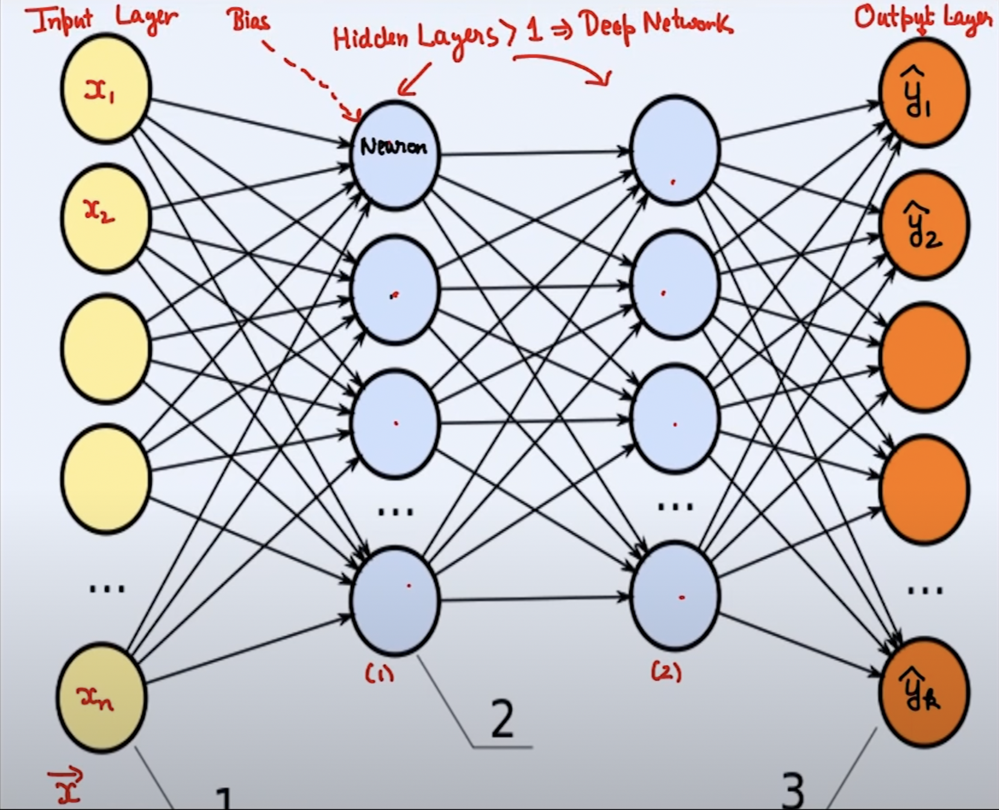

# Feedforward Neural Network (FFNN)
## Definition:
An FFNN comprises multiple layers: input, one or more hidden layers, and an output layer. In FFNN, data flows in a single direction—straight from input to output, without cycles. When multiple hidden layers are used, the neural network is referred to as a "deep neural network", leading to the domain known as "deep learning".

## Feedforward Process:
Given a known input vector `x` and weights throughout the network, we can compute the output vector `ŷ`.

## Basic Structure:


- **Input Layer**:
  - The number of neurons typically corresponds to the size of the input data.
    - Example: For images of 28x28 pixels (like in the MNIST dataset), the input layer has 28×28=784 neurons, one per pixel.

- **Hidden Layers**:
  - The number of neurons and the number of hidden layers are hyperparameters that can be tuned. They don't have a direct relationship with the size of the input or output but are chosen based on model performance, problem complexity, and the risk of overfitting.
  - Each neuron in the first hidden layer has weights from all neurons in the input layer and a unique bias.
- **Output Layer**:
  - The number of neurons depends on the desired output format or classification classes.
  - Binary Classification: Single neuron denoting the probability of the positive class.
  - Multi-class classification: Neurons match the number of classes. E.g., a digit recognition task would have 10 output neurons.

> Note: The output layer's neuron count often differs from the input layer. Each layer can have a distinct number of neurons, indicating its 'size' or capacity.
>
## Intricacies of Neurons:
### Understanding Weights and Biases
- **Weights (often denoted as $w$ or $W$)**: These are the multipliers applied to input values, representing the importance of the connection between neurons.
- **Bias (often denoted as $b$ or $B$)**: This is an offset added to the weighted sum of inputs. Conceptually, it's similar to the intercept in a linear regression equation.

### Inside a Neuron: Two-Step Transformation

Within each neuron, the output is derived by first taking a weighted sum of its inputs, adding a bias term, and subsequently passing this aggregate through an activation function: 

1. **Linear Combination**: Each neuron in a neural network interacts with its preceding layer through weights and biases. Inputs are scaled by weights, summed, and then offset by a bias.
    - Formula: $z = w_1x_1 + w_2x_2 + ... + w_nx_n + b$
3. **Non-linear Activation**: The linear sum $z$ undergoes a non-linear transformation through an activation function, enabling the network to learn complex patterns.
   - Common functions: ReLU, Sigmoid, Tanh, Softmax
   - Neuron's Output: After processing the result $z$ through the activation function $f$, we obtain the neuron's output, denoted as $a$. This is expressed mathematically as: $a = f(z)$
  
   
**Significance**: By cascading these transformations across layers, neural networks can represent highly sophisticated functions. Training adjusts the neuron's weights and biases, optimizing them to reduce the disparity between predicted outputs and actual data, typically utilizing optimization algorithms like gradient descent.

### Parameter Counting

**Fully Connected Networks**: These are networks where each neuron connects to every other neuron in the subsequent layer. Convolutional Neural Network (CNN) is a type of FFNN, however, in CNN we only have some of these weights are non-zero and most of them are 0, which means each neuron is connected only to a few other neurons in the previous layer. This is a special case.

**For the First Hidden Layer**:
- **Weights**: Each neuron in the first hidden layer is connected to every neuron (or input feature) in the input layer. Thus, if there are `n` neurons in the input layer, a neuron in the first hidden layer will have `n` weights associated with it.
- **Bias**: Each neuron in the first hidden layer also has its unique bias that adjusts its output.
  
**For Adjacent Layers**:
Considering two adjacent layers in a network: 
- Layer $L-1$ with $N$ neurons
- Layer $L$ with $M$ neurons
- Assuming each neuron in $L$ is connected to every neuron in $L-1$

  Total Parameters((weights + biases):
  $N \times M (weights) + M (biases) = N \times M + M$(since Each neuron in layer $L$ get a different bias)

## Code Implementation
- [CMU Deep Learning System hw0 a simple two-layer neural network](../../../Code-Implementation/Simple-Two-Layer-Neural-Network)

```python
import struct
import numpy as np
import gzip
try:
    from simple_ml_ext import *
except:
    pass

def parse_mnist(image_filename, label_filename):
    """ Read an images and labels file in MNIST format.  See this page:
    http://yann.lecun.com/exdb/mnist/ for a description of the file format.

    Args:
        image_filename (str): name of gzipped images file in MNIST format
        label_filename (str): name of gzipped labels file in MNIST format

    Returns:
        Tuple (X,y):
            X (numpy.ndarray[np.float32]): 2D numpy array containing the loaded 
                data.  The dimensionality of the data should be 
                (num_examples x input_dim) where 'input_dim' is the full 
                dimension of the data, e.g., since MNIST images are 28x28, it 
                will be 784.  Values should be of type np.float32, and the data 
                should be normalized to have a minimum value of 0.0 and a 
                maximum value of 1.0 (i.e., scale original values of 0 to 0.0 
                and 255 to 1.0).

            y (numpy.ndarray[dtype=np.uint8]): 1D numpy array containing the
                labels of the examples.  Values should be of type np.uint8 and
                for MNIST will contain the values 0-9.
    """
    ### BEGIN YOUR CODE
    # Read the labels file
    with gzip.open(label_filename, 'rb') as lbl_f:
        magic, num_items = struct.unpack(">II", lbl_f.read(8))
        if magic != 2049:
            raise ValueError(f"Invalid magic number in label file: {magic}")
        labels = np.frombuffer(lbl_f.read(num_items), dtype=np.uint8)

    # Read the images file
    with gzip.open(image_filename, 'rb') as img_f:
        magic, num_images, num_rows, num_cols = struct.unpack(">IIII", img_f.read(16))
        if magic != 2051:
            raise ValueError(f"Invalid magic number in image file: {magic}")
        images = np.frombuffer(img_f.read(num_images * num_rows * num_cols), dtype=np.uint8)
        images = images.reshape(num_images, num_rows * num_cols).astype(np.float32)
        images /= 255.0  # Normalize to range [0, 1]

    return images, labels
    ### END YOUR CODE


def softmax_loss(Z, y):
    """ Return softmax loss.  Note that for the purposes of this assignment,
    you don't need to worry about "nicely" scaling the numerical properties
    of the log-sum-exp computation, but can just compute this directly.

    Args:
        Z (np.ndarray[np.float32]): 2D numpy array of shape
            (batch_size, num_classes), containing the logit predictions for
            each class.
        y (np.ndarray[np.uint8]): 1D numpy array of shape (batch_size, )
            containing the true label of each example.

    Returns:
        Average softmax loss over the sample.
    """
    ### BEGIN YOUR CODE
    # Formula for one training sample: \begin{equation} \ell_{\mathrm{softmax}}(z, y) = \log\sum_{i=1}^k \exp z_i - z_y. \end{equation}

    # Compute the log of the sum of exponentials of logits for each sample
    log_sum_exp = np.log(np.sum(np.exp(Z), axis = 1))
    # Extract the logits corresponding to the true class for each sample
    # np.arange(Z.shape[0]) generates array [0, 1, 2, ..., batch_size-1]
    # Z[np.arange(Z.shape[0]), y] = Z[[row_indices], [col_indices]]
    # This selects the logits Z[i, y[i]] for each i which is each row
    correct_class_logits = Z[np.arange(Z.shape[0]), y]
    losses = log_sum_exp - correct_class_logits
    return np.mean(losses)
    ### END YOUR CODE

def nn_epoch(X, y, W1, W2, lr = 0.1, batch=100):
    """ Run a single epoch of SGD for a two-layer neural network defined by the
    weights W1 and W2 (with no bias terms):
        logits = ReLU(X * W1) * W2
    The function should use the step size lr, and the specified batch size (and
    again, without randomizing the order of X).  It should modify the
    W1 and W2 matrices in place.

    Args:
        X (np.ndarray[np.float32]): 2D input array of size
            (num_examples x input_dim).
        y (np.ndarray[np.uint8]): 1D class label array of size (num_examples,)
        W1 (np.ndarray[np.float32]): 2D array of first layer weights, of shape
            (input_dim, hidden_dim)
        W2 (np.ndarray[np.float32]): 2D array of second layer weights, of shape
            (hidden_dim, num_classes)
        lr (float): step size (learning rate) for SGD
        batch (int): size of SGD minibatch

    Returns:
        None
    """
    ### BEGIN YOUR CODE
    num_examples = X.shape[0]
    num_classes = W2.shape[1]

    for start in range(0, num_examples, batch):
        end = min(start + batch, num_examples)
        X_batch = X[start:end]
        y_batch = y[start:end]

        # Forward pass: Compute Z1 and Z2 (the output logits)
        Z1 = np.maximum(0, X_batch @ W1)  # ReLU activation
        Z2 = Z1 @ W2

        # Compute softmax probabilities
        exp_logits = np.exp(Z2)
        probs = exp_logits / np.sum(exp_logits, axis=1, keepdims=True)

        # Create a one-hot encoded matrix of the true labels
        I_y = np.zeros((len(y_batch), num_classes))
        I_y[np.arange(len(y_batch)), y_batch] = 1

        # Backward pass: Compute gradients G2 and G1
        G2 = probs - I_y
        G1 = (Z1 > 0).astype(np.float32) * (G2 @ W2.T)
        # Compute the gradients for W1 and W2
        grad_W1 = X_batch.T @ G1 / batch
        grad_W2 = Z1.T @ G2 / batch

        # Perform the gradient descent step(Update the weights)
        W1 -= lr * grad_W1
        W2 -= lr * grad_W2
    ### END YOUR CODE


### CODE BELOW IS FOR ILLUSTRATION, YOU DO NOT NEED TO EDIT

def loss_err(h,y):
    """ Helper funciton to compute both loss and error"""
    return softmax_loss(h,y), np.mean(h.argmax(axis=1) != y)

def train_nn(X_tr, y_tr, X_te, y_te, hidden_dim = 500,
             epochs=10, lr=0.5, batch=100):
    """ Example function to train two layer neural network """
    # X_tr.shape[1]: the number of features in the training data
    # y_tr.max()+1 : the number of classes
    n, k = X_tr.shape[1], y_tr.max() + 1
    # np.random.seed(0): This sets the random seed for reproducibility. By setting the seed, you ensure that every time you run     
    # the code, the same random numbers are generated, which means that the results will be the same.
    # W1: Initializes the weights for the first layer with random values, scaled by the square root of the hidden dimension.
    # W2: Initializes the weights for the second layer with random values, scaled by the square root of the number of classes.
    np.random.seed(0)
    W1 = np.random.randn(n, hidden_dim).astype(np.float32) / np.sqrt(hidden_dim)
    W2 = np.random.randn(hidden_dim, k).astype(np.float32) / np.sqrt(k)

    print("| Epoch | Train Loss | Train Err | Test Loss | Test Err |")
    for epoch in range(epochs):
        nn_epoch(X_tr, y_tr, W1, W2, lr=lr, batch=batch)
        train_loss, train_err = loss_err(np.maximum(X_tr@W1,0)@W2, y_tr)
        test_loss, test_err = loss_err(np.maximum(X_te@W1,0)@W2, y_te)
        print("|  {:>4} |    {:.5f} |   {:.5f} |   {:.5f} |  {:.5f} |"\
              .format(epoch, train_loss, train_err, test_loss, test_err))


if __name__ == "__main__":
    X_tr, y_tr = parse_mnist("data/train-images-idx3-ubyte.gz",
                             "data/train-labels-idx1-ubyte.gz")
    X_te, y_te = parse_mnist("data/t10k-images-idx3-ubyte.gz",
                             "data/t10k-labels-idx1-ubyte.gz")

    print("\nTraining two layer neural network w/ 100 hidden units")
    train_nn(X_tr, y_tr, X_te, y_te, hidden_dim=100, epochs=20, lr = 0.2)
```


## Reference:
- [Watch the video on YouTube](https://youtube.com/watch?v=jTzJ9zjC8nU)


