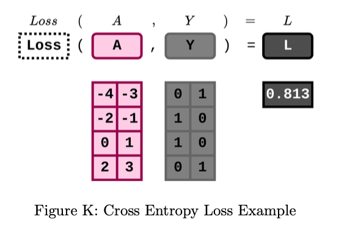

# Cross-Entropy Loss

Cross-entropy loss is one of the most commonly used loss function for probability-based classification problems. 

## Cross-Entropy Loss Forward Equation

Firstly, we use softmax function to transform the raw model outputs $A$ into a probability distribution consisting of $C$ classes proportional to the exponentials of the input numbers.

$\iota_N$, $\iota_C$ are column vectors of size $N$ and $C$ which contain all 1s. 

$$\text{softmax}(A) = \sigma(A) = \frac{\exp(A)}{\sum\limits_{j=1}^{C} \exp(A_{ij})}$$


Now, each row of A represents the model’s prediction of the probability distribution while each row of Y represents target distribution of an input in the batch.
Then, we calculate the cross-entropy H(A,Y) of the distribution Ai relative to the target distribution Yi for i = 1,...,N:

$$\text{crossentropy} = H(A, Y) = (-Y \circ \log(\sigma(A))) \cdot \mathbf{\iota}_C$$

Remember that the output of a loss function is a scalar, but now we have a column matrix of size N. To transform it into a scalar, we can either use the sum or mean of all cross-entropy.

Here, we choose to use the mean cross-entropy as the cross-entropy loss as that is the default for PyTorch as well:

$$\text{sumcrossentropyloss} := \mathbf{\iota}_N^T \cdot H(A, Y) = SCE(A, Y)$$

$$\text{meancrossentropyloss} := \frac{SCE(A, Y)}{N}$$



Cross-Entropy Loss Backward Equation

$$\text{xent.backward}() = \frac{\sigma(A) - Y}{N}$$


### Derivation of the Gradient(My prove)
To find the gradient of the cross-entropy loss with respect to the logits $A_i$, we need to compute the derivative $\frac{\partial H}{\partial A_i}$. This involves applying the chain rule to the composition of the logarithm and the softmax function.

Note the softmax function for a logit $A_{ic}$ is defined as:

$$\sigma(A_{ic}) = \frac{e^{A_{ic}}}{\sum\limits_{j=1}^{C} e^{A_{ij}}}$$

#### Step 1: Apply the Chain Rule
First, note that we need to apply the chain rule for the derivative of a composite function, which in this case is the logarithm of the softmax output:

$$H(A_i, Y_i) = -\sum_{c=1}^{C} Y_{ic} \log(\sigma(A_{ic}))$$

$$\begin{align*}
\frac{\partial H}{\partial A_{ic}} &= \frac{\partial (-Y_{i1}\log(\sigma(A_{i1}))  -Y_{i2}\log(\sigma(A_{i2}))-...-Y_{iC}\log(\sigma(A_{iC})))}{\partial A_{ic}} \\
&=  \frac{\partial (-Y_{i1}\log(\sigma(A_{i1})))}{\partial A_{ic}}  + \frac{\partial (-Y_{i2}\log(\sigma(A_{i2})))}{\partial A_{ic}}  + ...+ \frac{\partial (-Y_{iC}\log(\sigma(A_{iC})))}{\partial A_{ic}} \\
&=-Y_{i1}\frac{\partial \log(\sigma(A_{i1}))}{\partial A_{ic}} -Y_{i2}\frac{\partial \log(\sigma(A_{i2}))}{\partial A_{ic}} -...-Y_{iC}\frac{\partial \log(\sigma(A_{iC}))}{\partial A_{ic}} \\
&=- \sum_{k=1}^{C} Y_{ik} \frac{\partial \log(\sigma(A_{ik}))}{\partial A_{ic}}\\
\end{align*}$$


$$\frac{\partial H}{\partial A_{ic}} = - \sum_{k=1}^{C} Y_{ik} \frac{\partial \log(\sigma(A_{ik}))}{\partial A_{ic}}$$

#### Step 2: Derivative of the Logarithm of Softmax
The derivative of $\log(\sigma(A_{ik}))$ with respect to $A_{ic}$ involves two cases: when $k=c$ and when $k \neq c$.

When $k=c$, using the derivative of the logarithm $\frac{\partial \log(x)}{\partial x} = \frac{1}{x}$ and the definition of softmax, we get: 

$$\frac{\partial \log(\sigma(A_{ik}))}{\partial A_{ic}} = \frac{\partial \log(\sigma(A_{ic}))}{\partial \sigma(A_{ic})} \cdot \frac{\partial \sigma(A_{ic})}{\partial A_{ic}} = \frac{1}{\sigma(A_{ic})} \cdot \sigma(A_{ic}) \cdot (1 - \sigma(A_{ic})) = 1 - \sigma(A_{ic})$$

When $k\neq c$, the derivative involves the softmax function for a different class, and the result is:

$$\frac{\partial \log(\sigma(A_{ik}))}{\partial A_{ic}} = \frac{\partial \log(\sigma(A_{ik}))}{\partial \sigma(A_{ic})} \cdot \frac{\partial \sigma(A_{ic})}{\partial A_{ic}} = \frac{1}{\sigma(A_{ik})} \cdot -\sigma(A_{ik}) \cdot  \sigma(A_{ic}) = -\sigma(A_{ic})$$


#### Step 3: Combine the Cases


Since $Y_i$ can only be 1 for the true class and 0 otherwise, this simplifies to:

$$\begin{align*}
\frac{\partial H}{\partial A_{ic}} &= - \sum_{k=1}^{C} Y_{ik} \frac{\partial \log(\sigma(A_{ik}))}{\partial A_{ic}} \\
&=-1 (1 - \sigma(A_{ic})) =  \sigma(A_{ic}) -1 \ \text{or} -1(-\sigma(A_{ic})) = \sigma(A_{ic}) -0\\
&= \sigma(A_{ic}) - Y _{ic}
\end{align*}$$

#### Example 

Let me give specific example to illustrate it:

#### Example 1

Consider this case $Y = [1,0,0]$ and $A = [2, 1, -1]$.

$Y_{11} = 1, Y_{12} = 0, Y_{13} = 0$
$A_{11} = 2, A_{12} = 1, A_{13} = -1$

Then when calculate 

$$\begin{align*}
\frac{\partial H}{\partial A_{13}} &= - \sum\limits_{k=1}^{C} Y_{1k} \frac{\partial \log(\sigma(A_{1k}))}{\partial A_{13}}\\
&=-Y_{11}\frac{\partial \log(\sigma(A_{11}))}{\partial A_{13}}-Y_{12}\frac{\partial \log(\sigma(A_{12}))}{\partial A_{13}}-Y_{13}\frac{\partial \log(\sigma(A_{13}))}{\partial A_{13}}\\
&= -1(-\sigma(A_{13}))-0-0 \\
&= \sigma(A_{13}) - 0 \\
&= \sigma(A_{13}) - Y _{13}\\
\end{align*}$$

#### Example 2

Consider this case $Y = [0,0,1]$ and $A = [2, 1, -1]$.

$Y_{11} = 0, Y_{12} = 0, Y_{13} = 1$
$A_{11} = 2, A_{12} = 1, A_{13} = -1$

Then when calculate 

$$\begin{align*}
\frac{\partial H}{\partial A_{13}} &= - \sum\limits_{k=1}^{C} Y_{1k} \frac{\partial \log(\sigma(A_{1k}))}{\partial A_{13}}\\
&=-Y_{11}\frac{\partial \log(\sigma(A_{11}))}{\partial A_{13}}-Y_{12}\frac{\partial \log(\sigma(A_{12}))}{\partial A_{13}}-Y_{13}\frac{\partial \log(\sigma(A_{13}))}{\partial A_{13}}\\
&= -0-0-1(1 - \sigma(A_{13})) \\
&= \sigma(A_{13}) - 1 \\
&= \sigma(A_{13}) - Y _{13}\\
\end{align*}$$


### Derivation of the Gradient(Youtube's prove)

- The softmax function is a vector.
- Each element $\frac{e^{z_k}}{\sum\limits_{c=1}^{C} e^{z_c}}$ is dependent on all of the input elements because of the denominator.
- The gradient of a vector w.r.t. a vector is a matrix.
- To simplify and solidify the notion, let's make it more concrete by looking at a vector of size $3$:
  
$$ \begin{pmatrix}
z_1\\
z_2\\
z_3
\end{pmatrix} \rightarrow \begin{pmatrix}
\frac{e^{z_1}}{e^{z_1} + e^{z_2} + e^{z_3}}\\
\frac{e^{z_2}}{e^{z_1} + e^{z_2} + e^{z_3}}\\
\frac{e^{z_3}}{e^{z_1} + e^{z_2} + e^{z_3}}
\end{pmatrix} = \begin{pmatrix}
a_1\\
a_2\\
a_3
\end{pmatrix} = \begin{pmatrix}
\hat{y_1}\\
\hat{y_2}\\
\hat{y_3}
\end{pmatrix}$$

What happens in the diagonal elements of the matrix? We have that the derivative is w.r.t. the same element which is in the numerator. E.g., for $\frac{\partial a_1}{\partial z_1}$ we get:

$$\frac{\partial a_1}{\partial z_1} = \frac{e^{z_1}(e^{z_1} + e^{z_2} + e^{z_3}) - e^{z_1}e^{z_1}}{(e^{z_1} + e^{z_2} + e^{z_3})(e^{z_1} + e^{z_2} + e^{z_3})} = \frac{e^{z_1}}{e^{z_1} + e^{z_2} + e^{z_3}} \cdot \frac{e^{z_1}+e^{z_2}+e^{z_3}-e^{z_1}}{e^{z_1} + e^{z_2} + e^{z_3}} = a_1(1 - a_1)$$

So we got something really close to the sigmoid derivatives.

What happens in the off diagonal element? E.g., for $\frac{\partial a_1}{\partial z_2}$ we get:

$$\frac{\partial a_1}{\partial z_2} = \frac{0 \cdot (e^{z_1} + e^{z_2} + e^{z_3}) - e^{z_1}e^{z_2}}{(e^{z_1} + e^{z_2} + e^{z_3})^2} = -\frac{e^{z_1}}{e^{z_1} + e^{z_2} + e^{z_3}} \cdot \frac{e^{z_2}}{e^{z_1} + e^{z_2} + e^{z_3}} = -a_1a_2$$

Overall for our 3x3 matrix we will get:

$$\frac{\partial \mathbf{a}}{\partial \mathbf{z}} = 
\begin{pmatrix}
a_1(1 - a_1) & -a_1a_2 & -a_1a_3 \\
-a_1a_2 & a_2(1 - a_2) & -a_2a_3 \\
-a_1a_3 & -a_2a_3 & a_3(1 - a_3)
\end{pmatrix}$$

For the derivative of the loss w.r.t. the final output - we have a derivative of a scalar w.r.t. a vector, so the result will also be a vector:

$$\frac{\partial \mathcal{L}}{\partial a_L} = \begin{bmatrix}
\frac{\partial}{\partial a_{L1}} \left(-\sum\limits_{c=1}^{C} y_c \log a_{Lc}\right) \\
\vdots \\
\frac{\partial}{\partial a_{LC}} \left(-\sum\limits_{c=1}^{C} y_c \log a_{Lc}\right)
\end{bmatrix} = -
\begin{bmatrix}
\frac{y_1}{a_{L1}} \\
\vdots \\
\frac{y_C}{a_{LC}}
\end{bmatrix}$$

Remember that for each 1-hot vector of $y$ we only have one element which is equal to 1, the rest are 0.

Going back to our concrete $3 \times 3$ example, and putting everything together, we get:

$$\begin{align}
\frac{\partial \mathcal{L}}{\partial z_L} &= \frac{\partial \mathcal{L}}{\partial a_L} \frac{\partial a_L}{\partial z_L} \\
&= -\begin{bmatrix} \frac{y_1}{a_1} \\ \frac{y_2}{a_2} \\ \frac{y_3}{a_3} \end{bmatrix} 
\begin{pmatrix}
a_1(1 - a_1) & -a_1a_2 & -a_1a_3 \\
-a_2a_1 & a_2(1 - a_2) & -a_2a_3 \\
-a_3a_1 & -a_3a_2 & a_3(1 - a_3)
\end{pmatrix} \\
&= -\begin{bmatrix} y_1 - a_1(y_1 + y_2 + y_3) & y_2 - a_2(y_1 + y_2 + y_3) & y_3 - a_3(y_1 + y_2 + y_3) \end{bmatrix} \\
&= \mathbf{a} - \mathbf{y}
\end{align}$$

note that $\mathbf{a}$ and $\mathbf{y}$ here are vectors, not scalars.


## Example For Cross Entropy Loss

To illustrate the cross-entropy loss, let's consider a specific example with a small dataset. Imagine we have a simple classification problem with three classes (C=3) and we are working with a batch of two samples ($N=2$). The raw output scores ($A$) from the model for these two samples and the corresponding true labels ($Y$) could be as follows:

- Raw model outputs for the two samples ($A$):
  - Sample 1: $[2.0, 1.0, 0.1]$
  - Sample 2: $[0.1, 2.0, 1.9]$

- True class distributions ($Y$, one-hot encoded):
  - Sample 1: $[0, 1, 0]$  (class 2 is the true class)
  - Sample 2: $[1, 0, 0]$  (class 1 is the true class)

Let's go through the cross-entropy loss computation step by step for this example:

### 1. Apply Softmax

First, we apply the softmax function to the raw outputs to get the predicted probabilities for each class.

For Sample 1, the softmax calculation would be:
$$\sigma(A_1) = \left[\frac{e^{2.0}}{e^{2.0} + e^{1.0} + e^{0.1}}, \frac{e^{1.0}}{e^{2.0} + e^{1.0} + e^{0.1}}, \frac{e^{0.1}}{e^{2.0} + e^{1.0} + e^{0.1}}\right]$$

For Sample 2, similarly:
$$\sigma(A_2) = \left[\frac{e^{0.1}}{e^{0.1} + e^{2.0} + e^{1.9}}, \frac{e^{2.0}}{e^{0.1} + e^{2.0} + e^{1.9}}, \frac{e^{1.9}}{e^{0.1} + e^{2.0} + e^{1.9}}\right]$$

### 2. Compute Cross-Entropy Loss

Next, we compute the cross-entropy loss for each sample. The loss for a single sample is given by:
$$H(A_i, Y_i) = -\sum_{c=1}^{C} Y_{ic} \log(\sigma(A_{ic}))$$

For Sample 1:
$$H(A_1, Y_1) = -[0 \times \log(\sigma(A_{11})) + 1 \times \log(\sigma(A_{12})) + 0 \times \log(\sigma(A_{13}))]$$

For Sample 2:
$$H(A_2, Y_2) = -[1 \times \log(\sigma(A_{21})) + 0 \times \log(\sigma(A_{22})) + 0 \times \log(\sigma(A_{23}))]$$

### 3. Calculate Mean Cross-Entropy Loss

Finally, we calculate the mean of these losses to get the mean cross-entropy loss for the batch:
$$\text{meancrossentropyloss} = \frac{H(A_1, Y_1) + H(A_2, Y_2)}{2}$$

### 4. Cross-Entropy Loss Backward

For backpropagation, the gradient of the cross-entropy loss with respect to the raw model outputs before applying softmax is given by:
$$\frac{\partial \text{Loss}}{\partial A} = \frac{\sigma(A) - Y}{N}$$

For each sample in the batch, we compute:
- For Sample 1: $\frac{\sigma(A_1) - Y_1}{2}$
- For Sample 2: $\frac{\sigma(A_2) - Y_2}{2}$

This gives us the gradients that we need to backpropagate through the network.

Based on the calculations:

- The softmax probabilities for the two samples are approximately:
  - Sample 1: $[0.659, 0.242, 0.099]$
  - Sample 2: $[0.073, 0.487, 0.440]$

- The cross-entropy losses for the two samples are:
  - Sample 1: 1.417
  - Sample 2: 2.620

- The mean cross-entropy loss for this batch is approximately 2.019.

- The gradients of the loss with respect to the raw model outputs ($A$) are:
  - For Sample 1: $[0.330, -0.379, 0.049]$
  - For Sample 2: $[-0.464, 0.243, 0.220]$

These results give us the predicted probabilities for each class using the softmax function, the individual cross-entropy losses for each sample, the overall mean cross-entropy loss for the batch, and the gradients required for the backward pass. The negative values in the gradients indicate the direction in which we should adjust our model's parameters to reduce the loss, while the positive values suggest the opposite.

```python
class CrossEntropyLoss:
    def softmax(self, x):
        e_x = np.exp(x - np.max(x, axis=1, keepdims=True))
        return e_x / e_x.sum(axis=1, keepdims=True)

    def forward(self, A, Y):
        self.A = A
        self.Y = Y
        self.softmax = self.softmax(A)
        crossentropy = -Y * np.log(self.softmax)
        L = np.sum(crossentropy) / A.shape[0]
        return L

    def backward(self):
        dLdA = (self.softmax - self.Y) / self.A.shape[0]
        return dLdA
```

## Reference:
- [Watch the video on YouTube](https://www.youtube.com/watch?v=rf4WF-5y8uY)
- CMU_11785_Introduction_To_Deep_Learning


