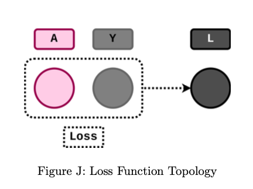

Different loss functions may become useful depending on the type of neural network and type of data you are using. Here we will program Mean Squared Error Loss MSE and Cross Entropy Loss. It is important to know how these are calculated, and how they will be used to update your network. 

## Loss Class

### Class Attributes:
- `A`: Stores model prediction to compute back-propagation.
- `Y`: Stores desired output to compute back-propagation.

### Class Methods:
- `forward`: 
  - Parameters: `A` (model prediction), `Y` (desired output)
  - Returns: Loss value `L`
  - Description: Calculates and returns a scalar loss value `L` quantifying the mismatch between the network output and the desired output.
  
- `backward`: 
  - Returns: `dLdA` (how changes in model outputs affect loss `L`)
  - Description: Calculates and returns `dLdA`, which represents how changes in model outputs `A` affect the loss `L`. It enables downstream computation for back-propagation.


Please consider the following class structure:
```python
class Loss:
        def forward(self, A, Y):
            self.A = A
            self.Y = Y
            self.    # TODO (store additional attributes as needed)
            N      = # TODO,  this is the first dimension of A and Y
            C      = # TODO,  this is the second dimension of A and Y
            # TODO
return L
def backward(self):
    dLdA = # TODO
return dLdA
```
| Code Name | Math      | Type    | Shape | Meaning                                 |
|-----------|-----------|---------|-------|-----------------------------------------|
| N         | $N$   | scalar  | -     | batch size                              |
| c         | $C$   | scalar  | -     | number of classes                       |
| A         | $A$   | matrix  | $N \times C$ | model outputs                        |
| Y         | $Y$   | matrix  | $N \times C$ | ground-truth values                   |
| L         | $L$   | scalar  | -     | loss value                              |
| dLdA      | $\frac{\partial L}{\partial A}$ | matrix  | $N \times C$ | how changes in model outputs affect loss |

The loss function topology is visualized in the follwing Figure, whose reference persists throughout this document.



