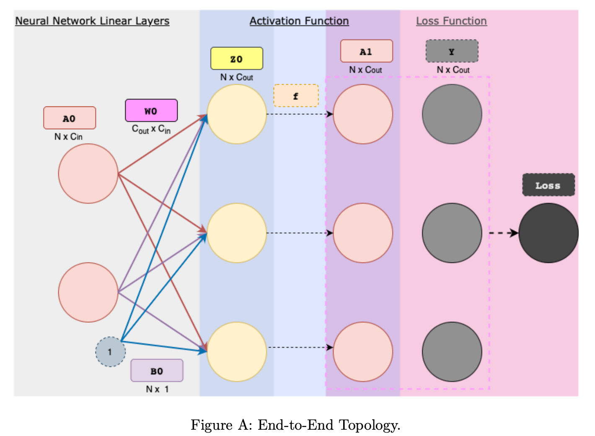
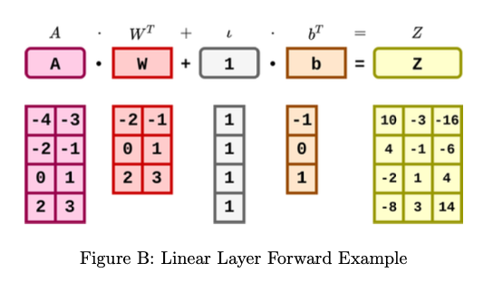

# Neural Network Layers

## Linear Layer

Linear layers, also known as fully-connected layers, connect every input neuron to every output neuron and are commonly used in neural networks. Refer to end-to-end_topology figure for the visual representation of a linear layer.




- Class attributes:
  - Learnable model parameters weight W, bias b.
  - Variables stored during forward-propagation to compute derivatives during back-propagation: layer input A, batch size N ≥ 6.
  - Variables stored during backward-propagation to train model parameters dLdW, dLdb.

- Class methods:
  - `__init__`: Two parameters define a linear layer: `in_feature (C_in)` and `out_feature (C_out)`. Zero initialize weight W and bias b based on the inputs. Refer to Table 5.1 to see how the shapes of W and b are related to the inputs (Hint: - Check the shapes of the `in_feature` and `out_feature` and create a numpy array with zeros based on the required shape of W and b given in Table 5.1).
  - `forward`: forward method takes in a batch of data A of shape N x C_in (representing N samples where each sample has C_in features), and computes output Z of shape N x C_out – each data sample is now represented by C_out features.
  - `backward`: backward method takes in input dLdZ, how changes in its output Z affect loss L. It calculates and stores dLdW, dLdb – how changes in the layer weights and bias affect loss, which are used to improve the model. It returns dLdA, how changes in the layer inputs affect loss to enable downstream computation.

Please consider the following class structure:

```python
class Linear:

    def __init__(self, in_features, out_features):
        self.W = # TODO
        self.b = # TODO

    def forward(self, A):
        self.A = # TODO
        self.N = # TODO: store the batch size
        Z = # TODO

        return Z

    def backward(self, dLdZ):
        dLdA = # TODO
        dLdW = # TODO
        dLdb = # TODO
        self.dLdW = dLdW
        self.dLdb = dLdb

        return dLdA
```
# Table 1: Linear Layer Components

| Code Name    | Math     | Type    | Shape       | Meaning                          |
|--------------|----------|---------|-------------|----------------------------------|
| N            | N        | scalar  | -           | batch size                       |
| in_features  | C_in     | scalar  | -           | number of input features         |
| out_features | C_out    | scalar  | -           | number of output features        |
| A            | A        | matrix  | N x C_in    | batch of N inputs each represented by C_in features |
| Z            | Z        | matrix  | N x C_out   | batch of N outputs each represented by C_out features |
| W            | W        | matrix  | C_out x C_in| weight parameters                |
| b            | b        | matrix  | C_out x 1   | bias parameters                  |
| dLdZ         | ∂L/∂Z    | matrix  | N x C_out   | how changes in outputs affect loss |
| dLdA         | ∂L/∂A    | matrix  | N x C_in    | how changes in inputs affect loss  |
| dLdW         | ∂L/∂W    | matrix  | C_out x C_in| how changes in weights affect loss |
| dLdb         | ∂L/∂b    | matrix  | C_out x 1   | how changes in bias affect loss    |

## Linear Layer Forward Equation

During forward propagation, we apply a linear transformation to the incoming data A to obtain output data Z using a weight matrix W and a bias vector b. 1_N is a column vector of size N which contain all 1s, and is used for broadcasting the bias.

$$Z = A . W^T + 1_N . b^T ∈ R^(N x C_out)$$

insert image




## 5.1.2 Linear Layer Backward Equation

As mentioned earlier, the objective of backward propagation is to calculate the derivative of the loss with respect to the weight matrix, bias, and input to the linear layer, i.e., dLdW, dLdb, and dLdA respectively.

Given ∂L/∂Z as an input to the backward function, we can apply chain rule to obtain how changes in A, W, b affect loss L:

∂L/∂A = (∂L/∂Z) · (∂Z/∂A)^T ∈ R^(N x C_in) (2)

∂L/∂W = (∂L/∂Z) · (∂Z/∂W)^T ∈ R^(C_out x C_in) (3)

∂L/∂b = (∂L/∂Z)^T · (∂Z/∂b) ∈ R^(C_out x 1) (4)

In the above equations, dZdA, dZdW, and dZdb represent how the input, weights matrix, and bias respectively affect the output of the linear layer.

Now, Z, A, and W are all two-dimensional matrices (see Table 1 above). dZdA would have derivative terms corresponding to each term of Z with respect to each term of A, and hence would be a 4-dimensional tensor. Similarly, dZdW would be 4-dimensional and dZdb would be 3-dimensional (since b is 1-dimensional). These high-dimensional matrices would be sparse (many terms would be 0) as only some pairs of terms have a dependence. So, to make things simpler and avoid dealing with high-dimensional intermediate tensors, the derivative equations given above are simplified to the below form:

∂L/∂A = (∂L/∂Z) · W ∈ R^(N x C_in) (5)

∂L/∂W = (∂L/∂Z)^T · A ∈ R^(C_out x C_in) (6)

∂L/∂b = (∂L/∂Z)^T · 1_N ∈ R^(C_out x 1) (7)


```python
#mytorch.nn.linear.py
import numpy as np

class Linear:

    def __init__(self, in_features, out_features, debug=False):
        """
        Initialize the weights and biases with zeros
        Checkout np.zeros function.
        Read the writeup to identify the right shapes for all.
        """
        self.W = np.zeros((out_features, in_features))
        self.b = np.zeros((out_features, 1))

    def forward(self, A):
        """
        :param A: Input to the linear layer with shape (N, C0)
        :return: Output Z of linear layer with shape (N, C1)
        Read the writeup for implementation details
        """
        self.A = A
        Z = A.dot(self.W.T) + self.b.T
        return Z


    def backward(self, dLdZ):
        self.Ones = np.ones((dLdZ.shape[0], 1))
        dLdA = dLdZ.dot(self.W)
        self.dLdW = dLdZ.T.dot(self.A)
        self.dLdb = dLdZ.T.dot(self.Ones)
        if self.debug:
            self.dLdA = dLdA
        return dLdA
```

