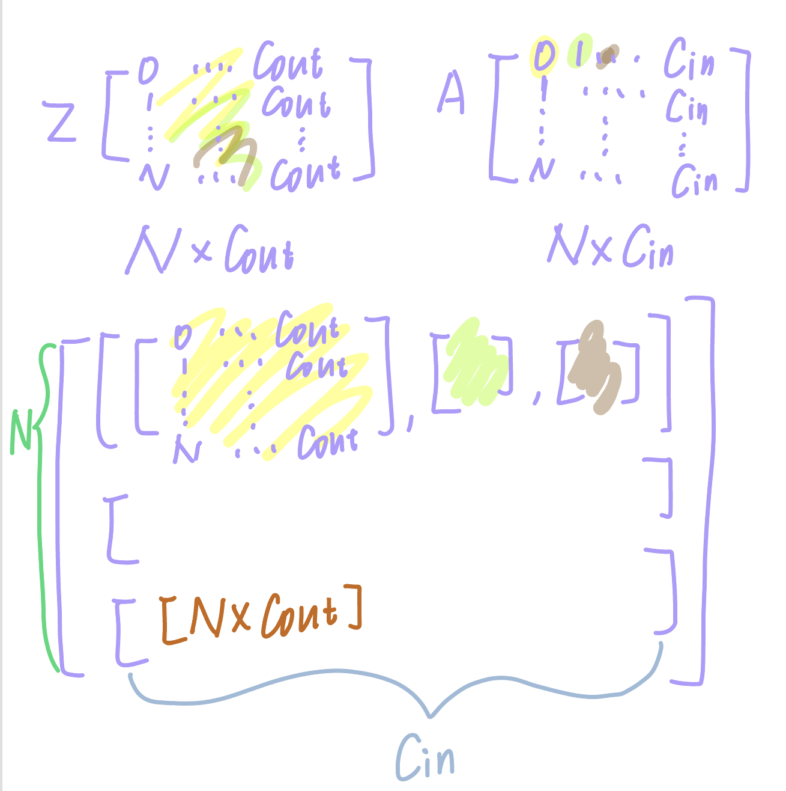

# Neural Network Layers

## Linear Layer

Linear layers, also known as fully-connected layers, connect every input neuron to every output neuron and are commonly used in neural networks. Refer to end-to-end_topology figure for the visual representation of a linear layer.


- Class attributes:
  - Learnable model parameters weight W, bias b.
  - Variables stored during forward-propagation to compute derivatives during back-propagation: layer input A, batch size N.
  - Variables stored during backward-propagation to train model parameters dLdW, dLdb.

- Class methods:
  - `__init__`: Two parameters define a linear layer: `in_feature (C_in)` and `out_feature (C_out)`. Zero initialize weight W and bias b based on the inputs. Refer to Table 1(Linear Layer Components) to see how the shapes of W and b are related to the inputs (Hint: - Check the shapes of the `in_feature` and `out_feature` and create a numpy array with zeros based on the required shape of W and b given in Table 5.1).
  - `forward`: forward method takes in a batch of data A of shape N x C_in (representing N samples where each sample has C_in features), and computes output Z of shape N x C_out – each data sample is now represented by C_out features.
  - `backward`: backward method takes in input dLdZ, how changes in its output Z affect loss L. It calculates and stores **dLdW, dLdb – how changes in the layer weights and bias affect loss**, which are used to improve the model. It returns dLdA, how changes in the layer inputs affect loss to enable downstream computation.

Please consider the following class structure:

```python
class Linear:

    def __init__(self, in_features, out_features):
        self.W = # TODO
        self.b = # TODO

    def forward(self, A):
        self.A = # TODO
        self.N = # TODO: store the batch size
        Z = # TODO

        return Z

    def backward(self, dLdZ):
        dLdA = # TODO
        dLdW = # TODO
        dLdb = # TODO
        self.dLdW = dLdW
        self.dLdb = dLdb

        return dLdA
```
# Table 1: Linear Layer Components

| Code Name    | Math     | Type    | Shape       | Meaning                          |
|--------------|----------|---------|-------------|----------------------------------|
| N            | N        | scalar  | -           | batch size                       |
| in_features  | $C_{in}$     | scalar  | -           | number of input features         |
| out_features | $C_{out}$    | scalar  | -           | number of output features        |
| A            | A        | matrix  | $N \times C_{in}$   | batch of N inputs each represented by $C_{in}$ features |
| Z            | Z        | matrix  | $N \times C_{out}$   | batch of N outputs each represented by $C_{out}$ features |
| W            | W        | matrix  | $C_{out} \times C_{in}$| weight parameters                |
| b            | b        | matrix  | $C_{out} \times 1$   | bias parameters                  |
| dLdZ         | $\frac{\partial L}{\partial Z}$   | matrix  | $N \times C_{out}$   | how changes in outputs affect loss |
| dLdA         | $\frac{\partial L}{\partial A}$    | matrix  | $N \times C_{in}$     | how changes in inputs affect loss  |
| dLdW         | $\frac{\partial L}{\partial W}$    | matrix  | $C_{out} \times C_{in}$| how changes in weights affect loss |
| dLdb         | $\frac{\partial L}{\partial b}$     | matrix  | $C_{out} \times 1$   | how changes in bias affect loss    |


> Note: For dLdZ, its shape matches Z's shape because when you compute the gradient of the loss L with respect to the output Z (dLdZ), you are essentially asking, "How does each element of the loss change with respect to each element of the output Z?" Since Z has a shape of N x C_out (where N is the batch size and C_out is the number of output features), dLdZ must have the same shape to represent the gradient of the loss with respect to each individual element in Z.
>

## Linear Layer Forward Equation

During forward propagation, we apply a linear transformation to the incoming data A to obtain output data Z using a weight matrix W and a bias vector b. 1_N is a column vector of size N which contain all 1s, and is used for broadcasting the bias.

$$Z = A . W^T + 1_N . b^T ∈ R^(N x C_out)$$

insert image


## 5.1.2 Linear Layer Backward Equation

As mentioned earlier, the objective of backward propagation is to calculate the derivative of the loss with respect to the weight matrix, bias, and input to the linear layer, i.e., dLdW, dLdb, and dLdA respectively.

Given ∂L/∂Z as an input to the backward function, we can apply chain rule to obtain how changes in A, W, b affect loss L:

∂L/∂A = (∂L/∂Z) · (∂Z/∂A)^T ∈ R^(N x C_in) (2)

∂L/∂W = (∂L/∂Z) · (∂Z/∂W)^T ∈ R^(C_out x C_in) (3)

∂L/∂b = (∂L/∂Z)^T · (∂Z/∂b) ∈ R^(C_out x 1) (4)

In the above equations, dZdA, dZdW, and dZdb represent how the input, weights matrix, and bias respectively affect the output of the linear layer.

Now, Z, A, and W are all two-dimensional matrices (see Table 1 above). dZdA would have derivative terms corresponding to each term of Z with respect to each term of A, and hence would be a 4-dimensional tensor. Similarly, dZdW would be 4-dimensional and dZdb would be 3-dimensional (since b is 1-dimensional). These high-dimensional matrices would be sparse (many terms would be 0) as only some pairs of terms have a dependence. So, to make things simpler and avoid dealing with high-dimensional intermediate tensors, the derivative equations given above are simplified to the below form:

∂L/∂A = (∂L/∂Z) · W ∈ R^(N x C_in) (5)

∂L/∂W = (∂L/∂Z)^T · A ∈ R^(C_out x C_in) (6)

∂L/∂b = (∂L/∂Z)^T · 1_N ∈ R^(C_out x 1) (7)


$$\text{2D Array (Matrix)} = \begin{bmatrix}
1 & 2 & 3 \\
4 & 5 & 6
\end{bmatrix}$$

$$\text{3D Tensor} = \left[ \begin{bmatrix}
1 & 2  \\
3 & 4 
\end{bmatrix}, \begin{bmatrix}
5 & 6  \\
7 & 8 
\end{bmatrix}, \begin{bmatrix}
9 & 10  \\
11 & 12 
\end{bmatrix} \right]$$

To illustrate why the collection of 2D arrays for `dZ/db` forms a 3D tensor rather than a 2D tensor, let's use a simple numerical example.

### Numerical Example:
Let's consider a linear layer with:
- 2 input features (`C_in = 2`)
- 3 output features (`C_out = 3`)
- A batch size of 2 (`N = 2`)

#### Bias Vector `b`:
Suppose the bias vector `b` is:

$$
b = \begin{pmatrix}
b_1 \\
b_2 \\
b_3
\end{pmatrix}
$$

#### Output Matrix `Z`:
And the output matrix `Z` (before adding the bias) for a specific input batch might be:

$$
Z_{\text{before bias}} = \begin{pmatrix}
z_{11} & z_{12} & z_{13} \\
z_{21} & z_{22} & z_{23}
\end{pmatrix}
$$

After adding the bias `b`, the output `Z` becomes:

$$
Z = \begin{pmatrix}
z_{11} + b_1 & z_{12} + b_2 & z_{13} + b_3 \\
z_{21} + b_1 & z_{22} + b_2 & z_{23} + b_3
\end{pmatrix}
$$

### Derivative `dZ/db`:
The derivative `dZ/db` represents how changes in each bias element affect each output in `Z`. For each element of `b`, we consider how changing that element affects all elements of `Z`.

#### For `b_1`:

Changing `b_1` affects the first column of `Z`:

$$
\frac{\partial Z}{\partial b_1} = \begin{pmatrix}
1 & 0 & 0 \\
1 & 0 & 0
\end{pmatrix}
$$

#### For `b_2`:
Changing `b_2` affects the second column of `Z`:

$$
\frac{\partial Z}{\partial b_2} = \begin{pmatrix}
0 & 1 & 0 \\
0 & 1 & 0
\end{pmatrix}
$$

#### For `b_3`:

Changing `b_3` affects the third column of `Z`:

$$
\frac{\partial Z}{\partial b_3} = \begin{pmatrix}
0 & 0 & 1 \\
0 & 0 & 1
\end{pmatrix}
$$

### Forming a 3D Tensor:
Each of these matrices is a 2D array showing how changing one element of `b` affects all elements of `Z`. Collectively, these 2D arrays can be thought of as "slices" or "layers" in a 3D structure, where each "layer" corresponds to the derivative with respect to one bias element:

$$
\text{3D Tensor for } \frac{\partial Z}{\partial b} = \left[ \frac{\partial Z}{\partial b_1}, \frac{\partial Z}{\partial b_2}, \frac{\partial Z}{\partial b_3} \right]
$$

This 3D tensor can be visualized as a stack of the three 2D arrays, one for each bias element. However, in practice, this tensor is often simplified to a 2D or even 1D structure for efficiency, as explained previously.

This example demonstrates why considering the derivative of each output element with respect to each bias element conceptually leads to a 3D tensor, even though the actual computation might be simplified.




```python
#mytorch.nn.linear.py
import numpy as np

class Linear:

    def __init__(self, in_features, out_features, debug=False):
        """
        Initialize the weights and biases with zeros
        Checkout np.zeros function.
        Read the writeup to identify the right shapes for all.
        """
        self.W = np.zeros((out_features, in_features))
        self.b = np.zeros((out_features, 1))

    def forward(self, A):
        """
        :param A: Input to the linear layer with shape (N, C0)
        :return: Output Z of linear layer with shape (N, C1)
        Read the writeup for implementation details
        """
        self.A = A
        Z = A.dot(self.W.T) + self.b.T
        # Since numPy automatically applies broadcasting, so we don't need to write like Z = A.dot(self.W.T) + np.ones((A.shape[0], 1)).dot(self.b.T)
        return Z


    def backward(self, dLdZ):
        self.Ones = np.ones((dLdZ.shape[0], 1))
        dLdA = dLdZ.dot(self.W)
        self.dLdW = dLdZ.T.dot(self.A)
        self.dLdb = dLdZ.T.dot(self.Ones)
        if self.debug:
            self.dLdA = dLdA
        return dLdA
```

