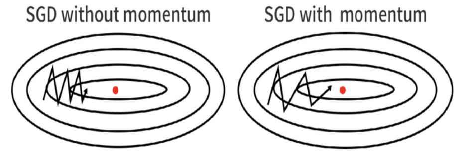

# Optimizers

In deep learning, optimizers are used to adjust the parameters for a model. The purpose of an optimizer is to adjust model weights to minimize a loss function.

To recap, we built our own MLP models using linear class and activation classes and have seen how to do forward propagation, and backward propagation for the core components used in neural networks. Forward propagation is used for estimation, and backward propagation informs us on how changes in parameters affect loss. And we coded some loss functions, which are criterion we use to evaluate the quality of our model’s estimates. The last step is to improve our model using the information we learned on how changes in parameters affect loss.

## Stochastic Gradient Descent (SGD)

In this section, we are going to implement Minibatch stochastic gradient descent with momentum, which we will refer to as SGD in this document. Minibatch SGD is a version of SGD algorithm that speeds up the computation by approximating the gradient using smaller batches of the training data, and Momentum is a method that helps accelerate SGD by incorporating velocity from the previous update to reduce oscillations. The `sgd` function in PyTorch library is actually an implementation of Minibatch stochastic gradient descent with momentum.

Your task is to implement the `step` attribute function of the `SGD` class in file `sgd.py`:

- **Class attributes:**
  - $l$: list of model layers
  - $L$: number of model layers
  - $lr$: learning rate, tunable hyperparameter scaling the size of an update.
  - $\mu$: momentum rate $\mu$, tunable hyperparameter controlling how much the previous updates affect the direction of current update. $\mu = 0$ means no momentum.
  - $v_W$: list of weight velocity for each layer
  - $v_b$: list of bias velocity for each layer

- **Class methods:**
  - step: Updates $W$ and $b$ of each of the model layers:
    - Because parameter gradients tell us which direction makes the model worse, we move opposite the direction of the gradient to update parameters.
    - When momentum is non-zero, update velocities $v_W$ and $v_b$, which are changes in the gradient to get to the global minima. The velocity of the previous update is scaled by hyperparameter $\mu$.

Please consider the following class structure:

```python
class SGD:

    def __init__(self, model, lr=0.1, momentum=0):
        self.l   = model.layers
        self.L   = len(model.layers)
        self.lr  = lr
        self.mu  = momentum
        self.v_W = [np.zeros(self.l[i].W.shape) for i in range(self.L)]
        self.v_b = [np.zeros(self.l[i].b.shape) for i in range(self.L)]

    def step(self):
        for i in range(self.L):
          if self.mu == 0:
            self.l[i].W = # TODO
            self.l[i].b = # TODO
          else:
            self.v_W[i] = # TODO
            self.v_b[i] = # TODO
            self.l[i].W = # TODO
            self.l[i].b = # TODO
```

| Code Name | Math | Type   | Shape | Meaning                                            |
|-----------|------|--------|-------|----------------------------------------------------|
| model     | -    | object | -     | model with layers attribute                        |
| $l$      | -    | object | -     | layers attribute selected from the model           |
| $L$         | -    | scalar | -     | number of layers in the model                      |
| lr        | $\lambda$   | scalar | -     | learning rate hyperparameter to scale affect of new gradients |
| momentum  | $\mu$    | scalar | -     | momentum hyperparameter to scale affect of prior gradients |
| v_W       | -    | list   | $L$     | list of velocity weight parameters, one for each layer |
| v_b      | -    | list   | $L$     | list of velocity bias parameters, one for each layer |
| v_W[i]   | $v_{W_{i}}$  | matrix | $C_{i+1} \times C_i$ | velocity for layer $i$ weight                        |
| v_b[i]    | $v_{b_{i}}$  | matrix | $C_{i+1} \times 1$  | velocity for layer $i$ bias                          |
| l[i].W    | $W_{i}$   | matrix | $C_{i+1} \times C_i$ | weight parameter for a layer                      |
| l[i].b    | $b_{i}$   | matrix | $C_{i+1} \times 1$  | bias parameter for a layer                        |

## SGD Equation (Without Momentum)

$$W := W - \lambda \frac{\partial L}{\partial W}$$

$$b := b - \lambda \frac{\partial L}{\partial b}$$

## SGD Equations (With Momentum)

$$v_W := \mu v_W + \frac{\partial L}{\partial W}$$

$$v_b := \mu v_b + \frac{\partial L}{\partial b}$$

$$W := W - \lambda v_W$$

$$b := b - \lambda v_b$$

## Momentum

Oscillations:

In the context of optimization and gradient descent, "oscillations" refer to the phenomenon where the updates to the parameters (such as weights in a neural network) repeatedly overshoot the minimum of the loss function, causing the path of the parameters to zigzag or oscillate back and forth across the slope of the loss surface. Instead of smoothly converging to the minimum, the updates keep bouncing around it, which can slow down convergence and make the training process less efficient.

Example of Oscillations:

Imagine you're trying to roll a ball down into the deepest part of a bowl to find the lowest point, which represents the minimum of the loss function. If the bowl's sides are steep, the ball might roll down quickly on one side, gain too much speed (due to the steep gradient), and overshoot the bottom to climb up the opposite side. Then, gravity pulls it back down, but again it gains too much momentum and overshoots, leading to a back-and-forth oscillation around the bottom.




The illustration depicts two scenarios of a gradient descent process on a loss surface represented by concentric ellipses, which indicate levels of the loss function. The goal is to reach the lowest point, marked by the red dot at the center, which is the global minimum of the loss function.

SGD without Momentum: On the left, the path taken by the standard SGD algorithm without momentum shows a zigzag pattern. This is due to the fact that each step is taken based solely on the local gradient, which can lead to overcorrections and thus oscillations. When the loss surface has steep curvatures, these adjustments are large and can cause the updates to overshoot the minimum, leading to a bouncing effect back and forth across the slope of the loss function.

SGD with Momentum: On the right, the inclusion of momentum allows the optimization path to accumulate directionality from previous steps, which helps to smooth out the path towards the minimum. The momentum term prevents the optimizer from being too drastically affected by the local gradient variations, which leads to fewer oscillations and a more direct path towards the goal. This is shown by the smoother and more stable curve that still heads toward the global minimum but with less deviation along the way.

The key difference is that momentum helps to dampen the oscillations and provides a more consistent direction of travel, preventing the kind of erratic movements seen in the path without momentum. This generally results in faster convergence and a more efficient path to the minimum of the loss function.

### Example
let's visualize the concept of momentum in optimization with an analogy involving a ball rolling down a steep slope.

Without Momentum:

Imagine a ball at the top of a steep hill, and this ball represents our optimizer. Each time we allow the ball to roll a step downhill, it represents an iteration of gradient descent. Without momentum, the ball only moves due to the force of gravity acting on it at each step (which represents the gradient of our loss function at each point). As the ball rolls down the hill, it only moves a small distance with each step because it stops as soon as the slope (gradient) becomes flat or it encounters an uphill (a rise in the loss function). This movement is analogous to basic SGD, where each update is based solely on the current gradient, and the optimizer can get stuck in flat regions or be significantly slowed down by slight uphill gradients, leading to slow convergence.

With Momentum:

Now, imagine the same ball, but this time it has the ability to retain some of its velocity from previous rolls (steps). This is akin to adding a momentum term to our optimizer. As the ball starts to roll down the hill, it not only gains speed due to the current slope (gradient) but also retains some of the speed from its previous movements. This accumulated velocity helps the ball to keep moving even when it hits a flat spot or a slight uphill slope, making it less likely to get stuck and enabling it to move faster across the landscape. This is especially useful when navigating through complex terrains with multiple hills and valleys (local minima), as the momentum can help the ball (optimizer) to escape shallow valleys and continue its journey towards the lowest point (global minimum).

## Velocities 

In the context of gradient descent and optimization algorithms in deep learning, "velocity" is a term often associated with momentum-based methods, such as Stochastic Gradient Descent with Momentum (SGD with Momentum). Velocity represents an accumulated gradient update across iterations. It helps in smoothing out the updates and provides a more stable and faster convergence towards the minimum of the loss function.

Here's how velocity works in SGD with Momentum:

At each step, instead of directly using the current gradient to update the model parameters, SGD with Momentum combines the current gradient with the velocity from the previous step. This combination is controlled by a momentum coefficient, typically denoted as $\mu$.

The inclusion of velocity helps in two main ways:

Directional Consistency: By accumulating gradients, it helps in maintaining a consistent direction of updates, which can be particularly beneficial in scenarios where the surface of the loss function is uneven or has steep slopes.

Dampening Oscillations: It reduces the oscillations that can occur when the gradient's direction changes rapidly, which often happens in the steep areas of the loss function. This dampening effect allows for a smoother convergence to the minimum.

In essence, the concept of velocity in optimization algorithms like SGD with Momentum allows the optimizer to "remember" the direction and magnitude of past updates, thus making the optimization process more stable and efficient.

# Code Implementation

```python
import numpy as np

class SGD:

    def __init__(self, model, lr=0.1, momentum=0):
        self.l = model.layers
        self.L = len(model.layers)
        self.lr = lr
        self.mu = momentum
        self.v_W = [np.zeros(self.l[i].W.shape, dtype="f") for i in range(self.L)]
        self.v_b = [np.zeros(self.l[i].b.shape, dtype="f") for i in range(self.L)]

    def step(self):
        for i in range(self.L):
            if self.mu == 0:
                self.l[i].W -= self.lr * self.l[i].dLdW
                self.l[i].b -= self.lr * self.l[i].dLdb
            else:
                self.v_W[i] = self.mu * self.v_W[i] + self.l[i].dLdW
                self.v_b[i] = self.mu * self.v_b[i] + self.l[i].dLdb
                self.l[i].W -= self.lr * self.v_W[i]
                self.l[i].b -= self.lr * self.v_b[i]
```

Test

```python
import numpy as np

class Linear:

    def __init__(self, in_features, out_features, debug=False):
        """
        Initialize the weights and biases with zeros
        Checkout np.zeros function.
        Read the writeup to identify the right shapes for all.
        """
        self.W = np.zeros((out_features,in_features))
        self.b = np.zeros((out_features,))

    def forward(self, A):
        """
        :param A: Input to the linear layer with shape (N, C0)
        :return: Output Z of linear layer with shape (N, C1)
        Read the writeup for implementation details
        """
        self.A = A
        self.N = A.shape[0]
        self.Ones = np.ones((self.N, 1))
        Z = self.A.dot(self.W.T) + self.Ones.dot(self.b.T)
        return Z

    def backward(self, dLdZ):
        dLdA = dLdZ.dot(self.W)
        self.dLdW = dLdZ.T.dot(self.A)
        self.dLdb = dLdZ.T.dot(self.Ones)
        return dLdA

class ReLU:
    """
    On same lines as above:
    Define 'forward' function
    Define 'backward' function
    Read the writeup for further details on ReLU.
    """
    def forward(self, Z):
        self.A = np.maximum(0, Z)
        return self.A

    def backward(self, dLdA):
        dAdZ = np.where(self.A > 0, 1, 0)
        dLdZ = dLdA * dAdZ
        return dLdZ
        
class SGD:

    def __init__(self, model, lr=0.1, momentum=0):
        self.l = model.layers
        self.L = len(model.layers)
        self.lr = lr
        self.mu = momentum
        self.v_W = [np.zeros(self.l[i].W.shape, dtype="f") for i in range(self.L)]
        self.v_b = [np.zeros(self.l[i].b.shape, dtype="f") for i in range(self.L)]

    def step(self):
        for i in range(self.L):
            if self.mu == 0:
                self.l[i].W -= self.lr * self.l[i].dLdW
                self.l[i].b -= self.lr * self.l[i].dLdb
            else:
                self.v_W[i] = self.mu * self.v_W[i] + self.l[i].dLdW
                self.v_b[i] = self.mu * self.v_b[i] + self.l[i].dLdb
                self.l[i].W -= self.lr * self.v_W[i]
                self.l[i].b -= self.lr * self.v_b[i]

"""
────────────────────────────────────────────────────────────────────────────────────
# SGD
────────────────────────────────────────────────────────────────────────────────────
"""

class PseudoModel:
    def __init__(self):
        self.layers = [Linear(3, 2),Linear(4, 2)]
        self.f = [ReLU()]

    def forward(self, A):
        return NotImplemented

    def backward(self):
        return NotImplemented

# Create Example Model
pseudo_model = PseudoModel()

pseudo_model.layers[0].W = np.ones((3, 2))
pseudo_model.layers[0].dLdW = np.ones((3, 2)) / 10
pseudo_model.layers[0].b = np.ones((3, 1))
pseudo_model.layers[0].dLdb = np.ones((3, 1)) / 10
pseudo_model.layers[1].W = np.ones((4, 2))
pseudo_model.layers[1].dLdW = np.ones((4, 2)) / 10
pseudo_model.layers[1].b = np.ones((4, 1))
pseudo_model.layers[1].dLdb = np.ones((4, 1)) / 10

print("\nInitialized Parameters:\n")
print("W11 =\n", pseudo_model.layers[0].W, "\n", sep="")
print("b11 =\n", pseudo_model.layers[0].b, "\n", sep="")
print("W12 =\n", pseudo_model.layers[1].W, "\n", sep="")
print("b12 =\n", pseudo_model.layers[1].b, "\n", sep="")

#Test Example Models
optimizer = SGD(pseudo_model, lr=0.9)
optimizer.step()

print("Parameters After SGD (Step=1)\n")

W_11 = pseudo_model.layers[0].W.copy()
b_11 = pseudo_model.layers[0].b.copy()
print("W11 =\n", W_11, "\n", sep="")
print("b11 =\n", b_11, "\n", sep="")
W_12 = pseudo_model.layers[1].W.copy()
b_12 = pseudo_model.layers[1].b.copy()
print("W12 =\n", W_12, "\n", sep="")
print("b12 =\n", b_12, "\n", sep="")

optimizer.step()

print("Parameters After SGD (Step=2)\n")

W_21 = pseudo_model.layers[0].W
b_21 = pseudo_model.layers[0].b
print("W21 =\n", W_21, "\n", sep="")
print("b21 =\n", b_21, "\n", sep="")
W_22 = pseudo_model.layers[1].W
b_22 = pseudo_model.layers[1].b
print("W22 =\n", W_22, "\n", sep="")
print("b22 =\n", b_22, "\n", sep="")

print("──────────────────────────────────────────")
print("SGD | SOLUTION OUTPUT")
print("──────────────────────────────────────────")

W_11_solution = np.array([
        [0.91, 0.91],
        [0.91, 0.91],
        [0.91, 0.91]], dtype="f")

b_11_solution = np.array([
        [0.91],
        [0.91],
        [0.91]], dtype="f")

W_21_solution = np.array([
        [0.82, 0.82],
        [0.82, 0.82],
        [0.82, 0.82]], dtype="f")

b_21_solution = np.array([
        [0.82],
        [0.82],
        [0.82]], dtype="f")

print("\n──────────────────────────────────────────")
print("SGD | TEST RESULTS")
print("──────────────────────────────────────────")

print("                 Pass?")
atol_threshold = 1e-4

TEST_sgd_W_21 = np.allclose(W_21.round(4), W_21_solution, atol=atol_threshold)
print("Test W (Step 2):", TEST_sgd_W_21)

TEST_sgd_b_21 = np.allclose(b_21.round(4), b_21_solution, atol=atol_threshold)
print("Test b (Step 2):", TEST_sgd_b_21)


"""
────────────────────────────────────────────────────────────────────────────────────
# SGD (With Momentum)
────────────────────────────────────────────────────────────────────────────────────
"""


class PseudoModel:
    def __init__(self):
        self.layers = [Linear(3, 2), Linear(4,2)]
        self.f = [ReLU()]

    def forward(self, A):
        return NotImplemented

    def backward(self):
        return NotImplemented

# Create Example Model
pseudo_model = PseudoModel()

pseudo_model.layers[0].W = np.ones((3, 2))
pseudo_model.layers[0].dLdW = np.ones((3, 2)) / 10
pseudo_model.layers[0].b = np.ones((3, 1))
pseudo_model.layers[0].dLdb = np.ones((3, 1)) / 10

pseudo_model.layers[1].W = np.ones((4, 2))
pseudo_model.layers[1].dLdW = np.ones((4, 2)) / 10
pseudo_model.layers[1].b = np.ones((4, 1))
pseudo_model.layers[1].dLdb = np.ones((4, 1)) / 10

print("\nInitialized Parameters:\n")
print("W11 =\n", pseudo_model.layers[0].W, "\n", sep="")
print("b11 =\n", pseudo_model.layers[0].b, "\n", sep="")
print("W12 =\n", pseudo_model.layers[1].W, "\n", sep="")
print("b12 =\n", pseudo_model.layers[1].b, "\n", sep="")

# Test Example Models
optimizer = SGD(pseudo_model, lr=0.9, momentum=0.9)
print("optimizer.v_W =\n", optimizer.v_W)
print("optimizer.v_b =\n", optimizer.v_b)
print("optimizer.l =\n", optimizer.l)
print("optimizer.L =\n", optimizer.L)

optimizer.step()

print("Parameters After SGD (Step=1)\n")

W_11 = pseudo_model.layers[0].W.copy()
b_11 = pseudo_model.layers[0].b.copy()
print("W11 =\n", W_11, "\n", sep="")
print("b11 =\n", b_11, "\n", sep="")
W_12 = pseudo_model.layers[1].W.copy()
b_12 = pseudo_model.layers[1].b.copy()
print("W12 =\n", W_12, "\n", sep="")
print("b12 =\n", b_12, "\n", sep="")
optimizer.step()

print("Parameters After SGD (Step=2)\n")

W_21 = pseudo_model.layers[0].W
b_21 = pseudo_model.layers[0].b
print("W21 =\n", W_21, "\n", sep="")
print("b21 =\n", b_21, "\n", sep="")
W_22 = pseudo_model.layers[1].W
b_22 = pseudo_model.layers[1].b
print("W22 =\n", W_22, "\n", sep="")
print("b22 =\n", b_22, "\n", sep="")

print("──────────────────────────────────────────")
print("SGD with Momentum | SOLUTION OUTPUT")
print("──────────────────────────────────────────")

W_11_solution = np.array([
    [0.91, 0.91],
    [0.91, 0.91],
    [0.91, 0.91]], dtype="f")

b_11_solution = np.array([
    [0.91],
    [0.91],
    [0.91]], dtype="f")

W_21_solution = np.array([
    [0.739, 0.739],
    [0.739, 0.739],
    [0.739, 0.739]], dtype="f")

b_21_solution = np.array([
    [0.739],
    [0.739],
    [0.739]], dtype="f")

print("\nParameters After SGD (Step=1)\n")

print("W11 =\n", W_11_solution, "\n", sep="")
print("b11 =\n", b_11_solution, "\n", sep="")

print("Parameters After SGD (Step=2)\n")

print("W21 =\n", W_21_solution, "\n", sep="")
print("b21 =\n", b_21_solution, "\n", sep="")

print("\n──────────────────────────────────────────")
print("SGD with Momentum| TEST RESULTS")
print("──────────────────────────────────────────")

print("                 Pass?")

TEST_sgd_W_m_21 = np.allclose(W_21.round(4), W_21_solution, atol=atol_threshold)
print("Test W (Step 2):", TEST_sgd_W_m_21)

TEST_sgd_b_m_21 = np.allclose(b_21.round(4), b_21_solution, atol=atol_threshold)
print("Test b (Step 2):", TEST_sgd_b_m_21)
```
Test Result
```python


Initialized Parameters:

W11 =
[[1. 1.]
 [1. 1.]
 [1. 1.]]

b11 =
[[1.]
 [1.]
 [1.]]

W12 =
[[1. 1.]
 [1. 1.]
 [1. 1.]
 [1. 1.]]

b12 =
[[1.]
 [1.]
 [1.]
 [1.]]

Parameters After SGD (Step=1)

W11 =
[[0.91 0.91]
 [0.91 0.91]
 [0.91 0.91]]

b11 =
[[0.91]
 [0.91]
 [0.91]]

W12 =
[[0.91 0.91]
 [0.91 0.91]
 [0.91 0.91]
 [0.91 0.91]]

b12 =
[[0.91]
 [0.91]
 [0.91]
 [0.91]]

Parameters After SGD (Step=2)

W21 =
[[0.82 0.82]
 [0.82 0.82]
 [0.82 0.82]]

b21 =
[[0.82]
 [0.82]
 [0.82]]

W22 =
[[0.82 0.82]
 [0.82 0.82]
 [0.82 0.82]
 [0.82 0.82]]

b22 =
[[0.82]
 [0.82]
 [0.82]
 [0.82]]

──────────────────────────────────────────
SGD | SOLUTION OUTPUT
──────────────────────────────────────────

──────────────────────────────────────────
SGD | TEST RESULTS
──────────────────────────────────────────
                 Pass?
Test W (Step 2): True
Test b (Step 2): True

Initialized Parameters:

W11 =
[[1. 1.]
 [1. 1.]
 [1. 1.]]

b11 =
[[1.]
 [1.]
 [1.]]

W12 =
[[1. 1.]
 [1. 1.]
 [1. 1.]
 [1. 1.]]

b12 =
[[1.]
 [1.]
 [1.]
 [1.]]

optimizer.v_W =
 [array([[0., 0.],
       [0., 0.],
       [0., 0.]], dtype=float32), array([[0., 0.],
       [0., 0.],
       [0., 0.],
       [0., 0.]], dtype=float32)]
optimizer.v_b =
 [array([[0.],
       [0.],
       [0.]], dtype=float32), array([[0.],
       [0.],
       [0.],
       [0.]], dtype=float32)]
optimizer.l =
 [<__main__.Linear object at 0x7f367786b790>, <__main__.Linear object at 0x7f3677868090>]
optimizer.L =
 2
Parameters After SGD (Step=1)

W11 =
[[0.91 0.91]
 [0.91 0.91]
 [0.91 0.91]]

b11 =
[[0.91]
 [0.91]
 [0.91]]

W12 =
[[0.91 0.91]
 [0.91 0.91]
 [0.91 0.91]
 [0.91 0.91]]

b12 =
[[0.91]
 [0.91]
 [0.91]
 [0.91]]

Parameters After SGD (Step=2)

W21 =
[[0.739 0.739]
 [0.739 0.739]
 [0.739 0.739]]

b21 =
[[0.739]
 [0.739]
 [0.739]]

W22 =
[[0.739 0.739]
 [0.739 0.739]
 [0.739 0.739]
 [0.739 0.739]]

b22 =
[[0.739]
 [0.739]
 [0.739]
 [0.739]]

──────────────────────────────────────────
SGD with Momentum | SOLUTION OUTPUT
──────────────────────────────────────────

Parameters After SGD (Step=1)

W11 =
[[0.91 0.91]
 [0.91 0.91]
 [0.91 0.91]]

b11 =
[[0.91]
 [0.91]
 [0.91]]

Parameters After SGD (Step=2)

W21 =
[[0.739 0.739]
 [0.739 0.739]
 [0.739 0.739]]

b21 =
[[0.739]
 [0.739]
 [0.739]]


──────────────────────────────────────────
SGD with Momentum| TEST RESULTS
──────────────────────────────────────────
                 Pass?
Test W (Step 2): True
Test b (Step 2): True
> 
```

> Note: The design intention for the layers attribute is to only contain layers with trainable parameters (like weights and biases in linear layers). Typically, activation functions like ReLU don't have parameters that need updating during training, as they're purely functional transformations.
>

## Reference:

- CMU_11785_Introduction_To_Deep_Learning

