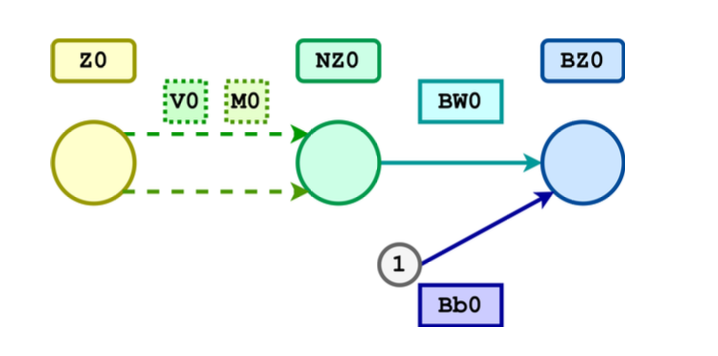
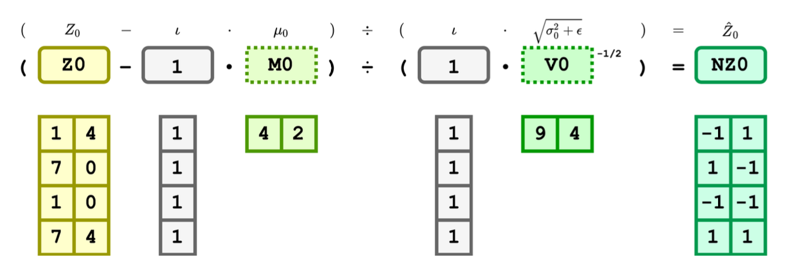
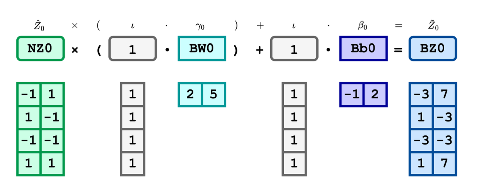

# Regularization

Regularization is a set of techniques that can prevent overfitting in neural networks and thus improve the accuracy of a Deep Learning model when facing completely new data from the problem domain.

## Batch Normalization 

Z-score normalization is the procedure during which the feature values are rescaled so that they have the properties of a normal distribution. Let µ be the mean (the average value of the feature, averaged over all examples in the dataset) and σ be the standard deviation from the mean.
Standard scores (or z-scores) of features are calculated as follows:

$$\hat{x} = \frac{x - µ}{σ}$$

Batch normalization is a method used to make training of artificial neural networks faster and more stable through normalization of the layers’ inputs by re-centering and re-scaling. It comes from the paper Batch Normalization: Accelerating Deep Network Training by Reducing Internal Covariate Shift.

In this section, your task is to implement the forward and backward attribute functions of the BatchNorm1d class in file `batchnorm.py`.


- Class attributes:
  - `alpha`: a hyperparameter used for the running mean and running var computation.
  - `eps`: a value added to the denominator for numerical stability.
  - `Bw`: learnable parameter of a BN (batch norm) layer to scale features.
  - `Bb`: learnable parameter of a BN (batch norm) layer to shift features.
  - `dLBw`: how changes in $\gamma$ affect loss
  - `dLBb`: how changes in $\beta$ affect loss
  - `running_M`: learnable parameter, the estimated mean of the training data
  - `running_V`: learnable parameter, the estimated variance of the training data
    
- Class methods:
  - `forward`: It takes in a batch of data $Z$ computes the batch normalized data $\hat{Z}$, and returns the scaled and shifted data $\tilde{Z}$. In addition:
    * During training, forward calculates the mean and standard-deviation of each feature over the mini-batches and uses them to update the `running_M` $E[Z]$ and `running_V`$Var[Z]$, which are learnable parameter vectors trained during forward propagation. By default, the elements of $E[Z]$ are set to $0$ and the elements of $Var[Z]$ are set to 1.
    * During inference, the learnt mean `running_M` $E[Z]$ and variance `running_V`$Var[Z]$ over the entire training dataset are used to normalize $\tilde{Z}$.
  - `backward`: takes input $dLdBZ$, how changes in BN layer output affects loss, computes and stores the necessary gradients $dLdBW$, $dLdBb$ to train learnable parameters $BW$ and $Bb$. Returns $dLdZ$,  how the changes in BN layer input $Z$ affect loss $L$ for downstream computation.

Please consider the following class structure:
```python
class BatchNorm1d:
    def __init__(self, num_features, alpha=0.9):
        self.alpha = alpha
        self.eps = 1e-8
        self.BW = np.ones((1, num_features))
        self.Bb = np.zeros((1, num_features))
        self.dLdBW = np.zeros((1, num_features))
        self.dLdBb = np.zeros((1, num_features))
        self.running_M = np.zeros((1, num_features))
        self.running_V = np.ones((1, num_features))
        
    def forward(self, Z, eval=False):
        """
        The eval parameter is to indicate whether we are in the
        training phase of the problem or the inference phase.
        So see what values you need to recompute when eval is False.
        """
        if eval == False:
            # training mode
            self.Z = Z
            self.N = None  # TODO
            self.M = None  # TODO
            self.V = None  # TODO
            self.NZ = None  # TODO
            self.BZ = None  # TODO
            self.running_M = None  # TODO
            self.running_V = None  # TODO
        else:
            # inference mode
            self.NZ = None  # TODO
            self.BZ = None  # TODO
        return self.BZ
    
    def backward(self, dLdBZ):
        self.dLdBW = None  # TODO
        self.dLdBb = None  # TODO
        dLdNZ = None  # TODO
        dLdV = None  # TODO
        dLdM = None  # TODO
        dLdZ = None  # TODO
        return dLdZ
```
Table for Batch Normalization Components:

| Code Name   | Math          | Type   | Shape | Meaning                                                    |
|-------------|---------------|--------|-------|------------------------------------------------------------|
| N           | $N$      | scalar | -     | batch size                                                 |
| num_features| $C$       | scalar | -     | number of features (same for input and output)             |
| alpha       | $\alpha$  | scalar | -     | the coefficient used for running_M and running_V computations |
| eps         | $\varepsilon$ | scalar | -     | a value added to the denominator for numerical stability. |
| Z           | $Z$       | matrix | $N \times C$ | data input to the BN layer                                |
| NZ          | $\hat{Z}$ | matrix | $N \times C$ | normalized input data                                     |
| BZ          | $\tilde{Z}$| matrix | $N \times C$ | data output from the BN layer                             |
| M           | $\mu$     | matrix | $1 \times C$ | Mini-batch per feature mean                               |
| V           | $\sigma^2$ | matrix | $1 \times C$ | Mini-batch per feature variance                           |
| running_M   | $E[Z]$    | matrix | $1 \times C$ | Running average of per feature mean                       |
| running_V   | $Var[Z]$  | matrix | $1 \times C$ | Running average of per feature variance                   |
| Bw          | $\gamma$  | matrix | $1 \times C$ | Scaling parameters                                        |
| Bb          | $\beta$   | matrix | $1 \times C$ | Shifting parameters                                       |
| dLdBW       | $\frac{\partial L}{\partial \gamma}$ | matrix | $1 \times C$ | how changes in $\gamma$ affect loss                |
| dLdBb       | $\frac{\partial L}{\partial \beta}$ | matrix | $1 \times C$ | how changes in $\beta$ affect loss                  |
| dLdZ        | $\frac{\partial L}{\partial Z}$ | matrix | $N \times C$ | how changes in inputs affect loss                        |
| dLdNZ       | $\frac{\partial L}{\partial \hat{Z}}$ | matrix | $N \times C$ | how changes in $\hat{Z}$ affect loss              |
| dLdBZ       | $\frac{\partial L}{\partial \tilde{Z}}$ | matrix | $N \times C$ | how changes in $\tilde{Z}$ affect loss            |
| dLdV        | $\frac{\partial L}{\partial \sigma^2}$ | matrix | $1 \times C$ | how changes in $\sigma^2$ affect loss             |
| dLdM        | $\frac{\partial L}{\partial \mu}$ | matrix | $1 \times C$ | how changes in $\mu$ affect loss                   |

The batchnorm topology is visualized in the followingFigure, whose reference persists throughout this document. In the image, V0,M0 correspond to V,M during training, and correspond to running_V and running_M during inference.



Note: In the following sections, we are providing you with element-wise equations instead of matrix equations. As a deep learning ninja, please don’t use for loops to implement them – that will be extremely slow!

Your task is first to come up with a matrix equation for each element-wise equation we provide, then implement them as code.


###  Batch Normalization Forward Training Equations (When eval = False)

First, we calculate the mini-batch mean $\mu$ and variance $\sigma^2$ of the current batch of data $Z$. $\mu_j$ and $\sigma_j^2$ represent the mean and variance of the jth feature. $Z_{ij}$ refers to the element at the $i$th row and $j$th column of $Z$ and represents the value of the $j$th feature in the $i$th sample in the batch.


$$\mu_j = \frac{1}{N} \sum_{i=1}^{N} Z_{ij} \quad j = 1, \ldots, C $$

$$\sigma_j^2 = \frac{1}{N} \sum_{i=1}^{N} (Z_{ij} - \mu_j)^2 \quad j = 1, \ldots, C $$

Using the mean and variance, we normalize the input $Z$ to get the normalized data $\hat{Z}$. Note: we add $\epsilon$ in denominator for numerical stability and to prevent division by $0$ error.

$$\hat{Z_i} = \frac{Z_i - \mu}{\sqrt{\sigma^2 + \epsilon}} \quad i = 1, \ldots, N$$

Here, we give you an example for the above equation to facilitate understanding:



Scale the normalized data by $\gamma$ and shift it by $\beta$:

$$\hat{Z}_i = \gamma \odot \tilde{Z}_i + \beta \quad i = 1, \ldots, N$$

Hint: In your matrix equation, first broadcast $\gamma$ and $\beta$ to make them have the same shape $N \times C$ as $\tilde{Z}$.



During training (and only during training), your forward method should be maintaining a running average of the mini-batch mean and variance. These running averages should be used during inference. Hyperpa- rameter α is used to compute weighted running averages.

$$E[Z] = \alpha \times E[Z] + (1 - \alpha) \times \mu \quad \in \mathbb{R}^{1 \times C}$$

$$\text{Var}[Z] = \alpha \times \text{Var}[Z] + (1 - \alpha) \times \sigma^2 \quad \in \mathbb{R}^{1 \times C}$$


###  Batch Normalization Forward Inference Equations (When eval = True)

Once the network has been trained, we use the running average for the mean and variance of the training data $E[Z]$ and $Var[Z]$ to calculate the normalized data $\tilde{Z}$.

$$\tilde{Z_i} = \frac{Z_i - E[Z]}{\sqrt{Var[Z] + \epsilon}}  \quad i = 1,...,N$$

Scale the normalized data by $\gamma$ and shift it by $\beta$:

$$\tilde{Z_i} = \gamma \hat{Z_i} + \beta \quad i = 1,...,N$$

##  Batch Normalization Backward Equations

We can now derive the analytic partial derivatives of the BatchNorm transformation. Let $L$ be the training loss over the batch and $\frac{\partial L}{\partial \hat{Z}}$ the derivative of the loss with respect to the output of the BatchNorm transformation for $Z$.

$$\frac{\partial L}{\partial \beta_j} = \sum_{i=1}^{N} \left( \frac{\partial L}{\partial \hat{y}_i} \frac{\partial \hat{y}_i}{\partial \beta_j} \right) = \sum_{i=1}^{N} \left( \frac{\partial L}{\partial Z_i} \frac{\partial Z_i}{\partial \beta_j} \right) \quad j = 1, ..., C$$

$$\frac{\partial L}{\partial \gamma_j} = \sum_{i=1}^{N} \left( \frac{\partial L}{\partial \hat{y}_i} \frac{\partial \hat{y}_i}{\partial \gamma_j} \right) = \sum_{i=1}^{N} \left( \frac{\partial L}{\partial Z_i} \odot \frac{\partial Z_i}{\partial \gamma_j} \right) \quad j = 1, ..., C$$

$$\frac{\partial L}{\partial Z} = \frac{\partial L}{\partial \hat{y}} \odot \frac{\partial \hat{y}}{\partial Z}$$

$$\frac{\partial L}{\partial \sigma^2_j} = \sum_{i=1}^{N} \left( \frac{\partial L}{\partial Z_i} \frac{\partial Z_i}{\partial \sigma^2_j} \right) \quad j = 1, ..., C$$

$$\frac{\partial L}{\partial \sigma^2_j} = - \frac{1}{2} \sum_{i=1}^{N} \left( \frac{\partial L}{\partial Z_i} \odot (Z_i - \mu) \odot (\sigma^2 + \epsilon)^{- \frac{3}{2}} \right)_{ij}$$

$$\frac{\partial Z_{ij}}{\partial \mu} = \frac{\partial}{\partial \mu} \left( Z_{ij} - \mu \right) (\sigma^2 + \epsilon)^{-\frac{1}{2}}$$

$$\frac{\partial Z_{ij}}{\partial \mu} = - (\sigma^2 + \epsilon)^{-\frac{1}{2}} + \frac{1}{2} (Z_{ij} - \mu) \odot (\sigma^2 + \epsilon)^{-\frac{3}{2}} \odot \left( -2 \sum_{i=1}^{N} (Z_{ij} - \mu) \right)$$

$$\frac{\partial L}{\partial \mu} = \sum_{i=1}^{N} \left( \frac{\partial L}{\partial Z_i} \odot \frac{\partial Z_{ij}}{\partial \mu} \right)$$


## Code Implementation
```python
import numpy as np

class BatchNorm1d:
    def __init__(self, num_features, alpha=0.9):
        self.alpha = alpha
        self.eps = 1e-8

        self.BW = np.ones((1, num_features))
        self.Bb = np.zeros((1, num_features))
        self.dLdBW = np.zeros((1, num_features))
        self.dLdBb = np.zeros((1, num_features))

        self.running_M = np.zeros((1, num_features))
        self.running_V = np.ones((1, num_features))

    def forward(self, Z, eval=False):
        self.Z = Z
        if not eval:
            self.M = np.mean(Z, axis=0, keepdims=True)
            self.V = np.var(Z, axis=0, keepdims=True)
            self.NZ = (Z - self.M) / np.sqrt(self.V + self.eps)
            self.running_M = self.alpha * self.running_M + (1 - self.alpha) * self.M
            self.running_V = self.alpha * self.running_V + (1 - self.alpha) * self.V
        else:
            self.NZ = (Z - self.running_M) / np.sqrt(self.running_V + self.eps)

        self.BZ = self.BW * self.NZ + self.Bb
        return self.BZ

    def backward(self, dLdBZ):
        N = self.Z.shape[0]
        self.dLdBW = np.sum(dLdBZ * self.NZ, axis=0, keepdims=True)
        self.dLdBb = np.sum(dLdBZ, axis=0, keepdims=True)

        dLdNZ = dLdBZ * self.BW
        dLdV = np.sum(dLdNZ * (self.Z - self.M) * -0.5 * (self.V + self.eps)**(-1.5), axis=0, keepdims=True)
        dLdM = np.sum(dLdNZ * -1 / np.sqrt(self.V + self.eps), axis=0, keepdims=True) + \
               dLdV * np.mean(-2 * (self.Z - self.M), axis=0, keepdims=True)

        dLdZ = (dLdNZ / np.sqrt(self.V + self.eps)) + (dLdV * 2 * (self.Z - self.M) / N) + (dLdM / N)
        return dLdZ
```
