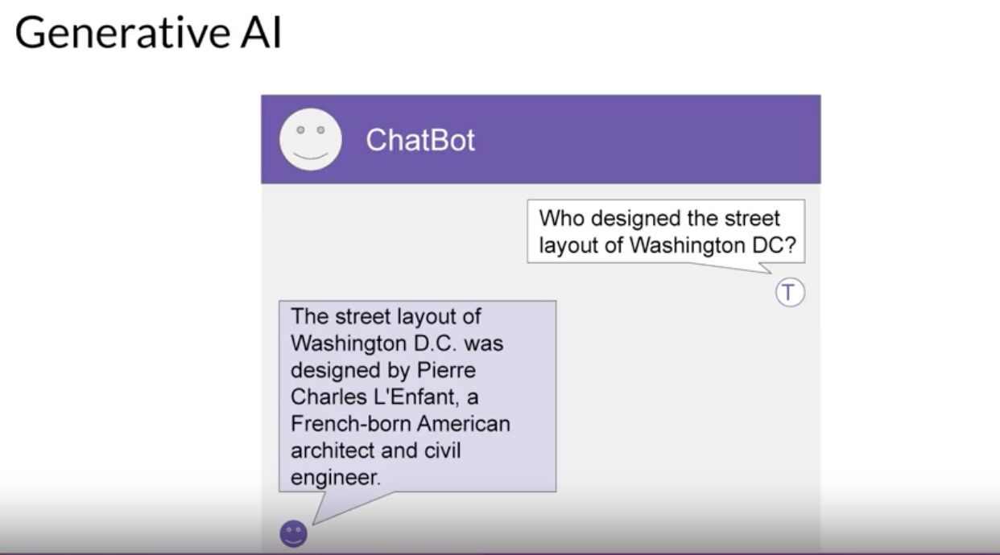
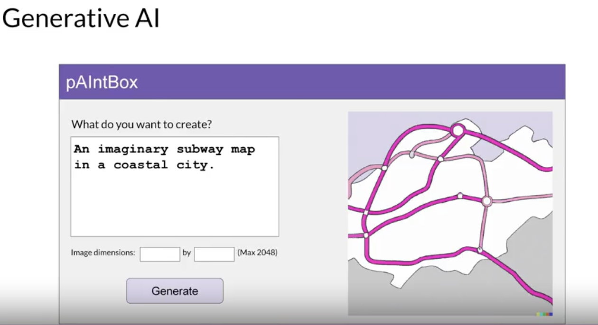
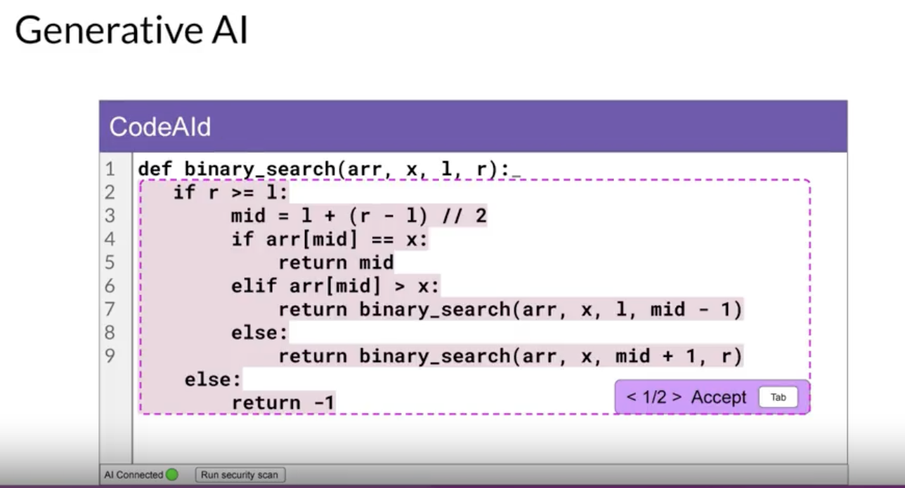

# Overview

Generative AI is a subset of traditional machine learning. The machine learning models that underpin Generative AI have learned to create or generate new content that is similar to the data they were trained on, by finding statistical patterns in massive datasets of content originally generated by humans.

## Generative AI Tools:
- **Chatbot**: Engages in conversations with users.
  
  
- **Generating Image from Text**: Creates visual content based on textual descriptions.
  
  
  
- **Using a Plugin to Help You Develop Code**: Assists in software development by providing coding suggestions and improvements.

   

## Reference:
- Generative AI & LLMs from coursera

