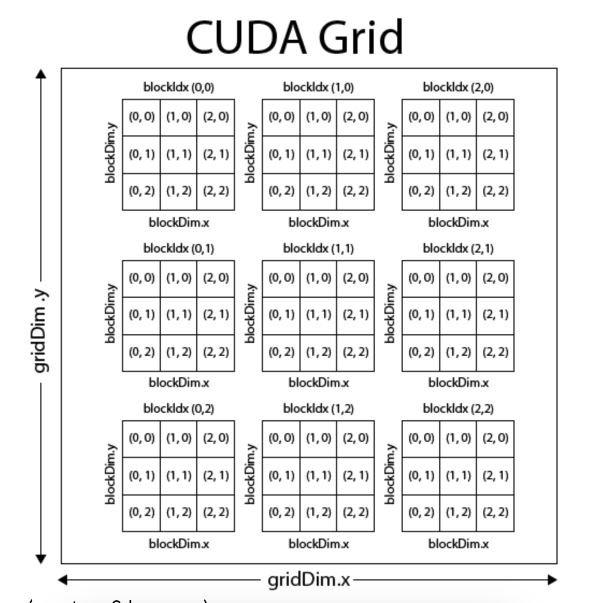

## Explain grid, block and thread



### Explain parallelized manner 

**Code Implementation**
```c++
__device__ size_t index_to_offset_cuda(const CudaVec& strides, const CudaVec& shape, size_t index, size_t base_offset) {
    size_t offset = base_offset;  // Start with the base offset

    // Loop over the dimensions in reverse
    for (int dim = shape.size - 1; dim >= 0; dim--) {
        offset += (index % shape.data[dim]) * strides.data[dim];  //Calculate offset using strides, where (index % shape.data[dim]) gives the index within this dimension.
        index /= shape.data[dim];  // Move to the next dimension by dividing by the current shape
    }

    return offset;  // Return the final offset
}

__global__ void CompactKernel(const scalar_t* a, scalar_t* out, size_t size, CudaVec shape,
                              CudaVec strides, size_t offset) {
  /**
   * The CUDA kernel for the compact opeation.  This should effectively map a single entry in the 
   * non-compact input a, to the corresponding item (at location gid) in the compact array out.
   * 
   * Args:
   *   a: CUDA pointer to a array
   *   out: CUDA point to out array
   *   size: size of out array
   *   shape: vector of shapes of a and out arrays (of type CudaVec, for past passing to CUDA kernel)
   *   strides: vector of strides of out array
   *   offset: offset of out array
   */
  size_t gid = blockIdx.x * blockDim.x + threadIdx.x;

  /// BEGIN SOLUTION
  if (gid >= size) return;  // Check for out-of-bounds

    // Compute the offset in the non-compact array `a` and copy to the compact array `out`
    size_t a_offset = index_to_offset_cuda(strides, shape, gid, offset);
    out[gid] = a[a_offset];
  /// END SOLUTION
void Compact(const CudaArray& a, CudaArray* out, std::vector<int32_t> shape,
             std::vector<int32_t> strides, size_t offset) {
  /**
   * Compact an array in memory.  Unlike the C++ version, in CUDA this will primarily call the 
   * relevant CUDA kernel.  In this case, we illustrate how you should set this up (i.e., we give 
   * you the code for this fuction, and also the prototype for the CompactKernel() function).  For
   * the functions after this, however, you'll need to define these kernels as you see fit to 
   * execute the underlying function.
   * 
   * Args:
   *   a: non-compact represntation of the array, given as input
   *   out: compact version of the array to be written
   *   shape: shapes of each dimension for a and out
   *   strides: strides of the *a* array (not out, which has compact strides)
   *   offset: offset of the *a* array (not out, which has zero offset, being compact)
   */

  // Nothing needs to be added here
  CudaDims dim = CudaOneDim(out->size);
  CompactKernel<<<dim.grid, dim.block>>>(a.ptr, out->ptr, out->size, VecToCuda(shape),
                                         VecToCuda(strides), offset);
}
}
```

This kernel ensures that data is correctly transferred from a non-compact memory layout to a compact one using multi-dimensional indexing in a parallelized manner on the GPU. 

1. **Multiple Threads Working Simultaneously**:

-   In this kernel, many threads are launched simultaneously. Each thread works on a different element of the array, copying the data from the non-compact array `a` to the compact array `out`. This way, rather than copying elements one by one in a sequential manner (which would be slow), many elements are copied at the same time.
-   For example, if you have 1000 elements to process and 1000 threads are launched, each thread will handle exactly one element, allowing all elements to be processed in parallel.


2.  **Efficient Resource Utilization**:
    
    -   GPUs have thousands of cores capable of performing simple operations simultaneously. By launching many threads to handle different parts of the array, the kernel can efficiently use the GPU's computational power. Each thread works independently without waiting for others to finish, maximizing throughput.

#### In This Kernel:

-   **Non-Compact to Compact Layout Transfer**: The operation of copying data from a non-compact memory layout to a compact layout can be done in parallel. Each thread computes the offset for its assigned element, accesses the correct data in the non-compact array, and writes the result to the corresponding location in the compact array.
-   **Parallel Workload**: If the array has, for example, 1000 elements, you could launch 1000 threads, and each thread will compute its own global thread index (`gid`) and process exactly one element of the array. This allows the entire array to be processed in parallel, instead of processing the elements one by one sequentially.

#### Benefits of Parallelization:

-   **Speed**: Since the GPU can handle thousands of threads in parallel, operations that involve large datasets (like transferring data from one memory layout to another) can be done much faster than a traditional CPU approach, where operations are typically done sequentially.
-   **Scalability**: As the size of the dataset grows, the benefits of parallelization increase. With more threads handling the workload, larger datasets can still be processed efficiently.

#### Example:

Consider an array of size 10,000. In a **sequential** (non-parallelized) approach, a CPU would process one element at a time, resulting in 10,000 iterations.

In the **parallelized manner** on a GPU, you might launch 1,000 threads, each responsible for handling 10 elements. Each thread works simultaneously, drastically reducing the overall time required to complete the task, since multiple elements are being processed at once.

#### Summary:

In this kernel, **parallelized manner** means that instead of copying data sequentially (one element at a time), many threads are used to process multiple elements simultaneously. This enables the GPU to leverage its highly parallel architecture, allowing for much faster data transfers and computations.


