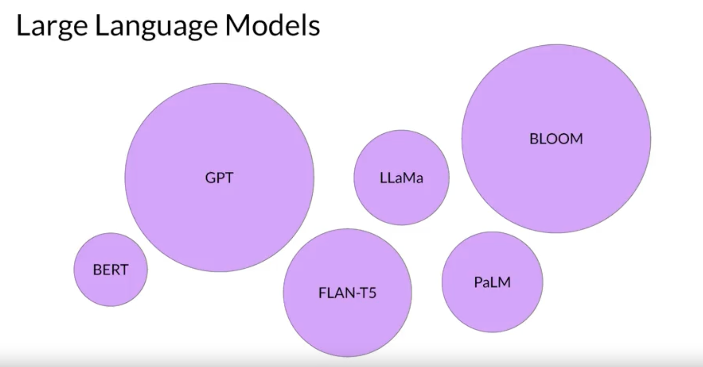
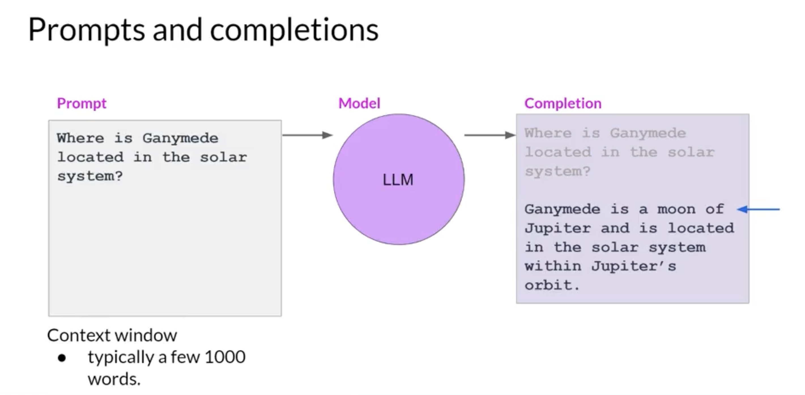

The text that you pass to an LLm is known as a prompt, the space or memory that is avalable to the prompt is called the contex window.

The output of the model is called a completion, and the act of using the model to generate text is known as inference.

The completion is comprised of the text contained in the original prompt followed by the generated text.

Reference:
genai with llm course
