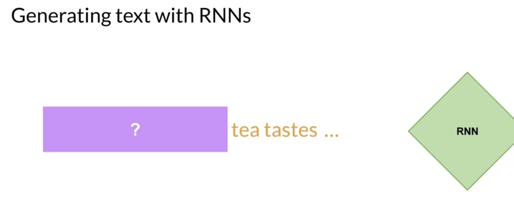
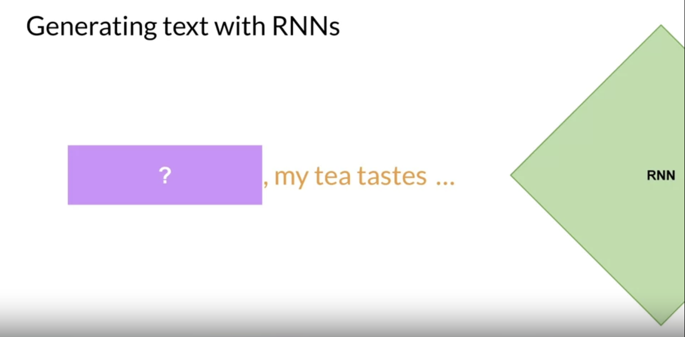

rnn were limited by the amount of compute and memory need to perform well at generative tasks.

let's look at an example of an rnn carrying out a simple next-word prediction generative task with just one previous words seen by the model, the prediction can't be very good. As you scale the RNN implementation to be able to see more of the preceding words in the text, you have to significantly scale the resources that the model uses as for the prediction. 

To successfully predict the next word, models need to see more than just the previous few words, models needs to have an understanding of the whole sentence or even the whole document. The problem here is that language is complex, such as homonyms, syntactic ambiguity
