# The Transformer Architecture

The transformer architecture, introduced in the paper ["Attention is All You Need"](https://arxiv.org/abs/1706.03762), has revolutionized generative AI. This novel approach can be scaled efficiently using multi-core GPUs and can parallel process input data, allowing it to handle much larger training datasets. Crucially, it can learn to pay attention to the meaning of the input.

Building large language models with the transformer architecture has dramatically improved the performance of natural language tasks compared to earlier generations of RNNs, leading to a surge in generative capabilities.

> Note: RNNs process data sequentially. This means the model needs to process the first token, then the second token, and so on, with each step depending on the output of the previous step. This sequential dependency is a significant limitation for parallel processing. However, transformers process the entire input sequence at once. This means that all the words in a sentence (or tokens in a sequence) are fed into the model simultaneously, and each word is processed in parallel. This architecture is naturally suited to GPUs, which are designed to perform many operations in parallel.

## Understanding Self-Attention

The power of the transformer architecture lies in its ability to learn the relevance and context of all the words in a sentence. It applies attention weights to the relationships between words, enabling the model to understand the importance of each word in relation to every other word in the input. For example, in the sentence: 

"The teacher taught the student with the book,"

the model can learn who has the book, who could have the book, and if it's relevant to the wider context.

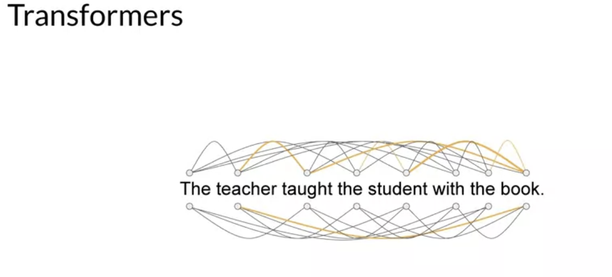

These attention weights are learned during LLM training, illustrated by an attention map showing the attention weights between each word and every other word.

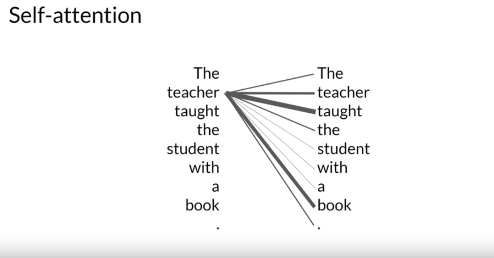 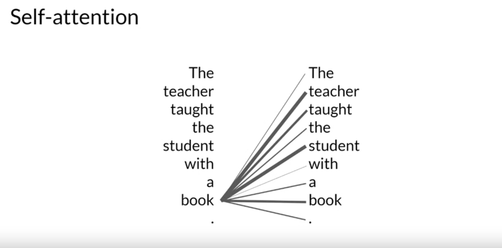

In this stylized example, you can see that the word "book" is strongly connected with or paying attention to the words "teacher" and "student." This is called self-attention, and the ability to learn attention in this way across the whole input significantly improves the model's ability to encode language.

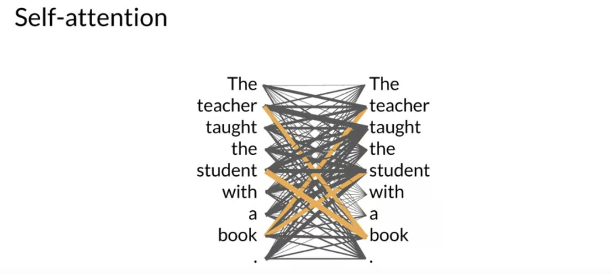

> Note: Self-attention is a mechanism within the transformer architecture that allows each position in the encoder to attend to all positions in the previous layer of the encoder. Similarly, each position in the decoder can attend to all positions up to and including that position in the decoder. The key idea is to calculate the attention weights (or scores) that determine how much focus to put on other parts of the input sequence when encoding a particular part of the sequence.
>

### Numerical Example of Self-Attention in Transformers

Let's explore a numerical example of the self-attention mechanism across two layers of a transformer model, using a simple three-word sentence and detailing the calculations at each step.

#### Example Sentence:
"Jane visits Paris"

#### Positions:
- Position 1: "Jane"
- Position 2: "visits"
- Position 3: "Paris"

#### Initial Setup:
Assume each word is initially embedded into a 2-dimensional vector:
- "Jane" -> `[1, 0]`
- "visits" -> `[0, 1]`
- "Paris" -> `[1, 1]`

### Layer 1 Processing:

#### Multi-Head Attention 1 (MHA1):
##### Step 1: Compute Queries, Keys, and Values
Suppose every word uses the same simple transformation for keys and queries (for illustration):
- Keys (K), Queries (Q), and Values (V) are the same as the input embeddings for simplicity.
  - K1, Q1, V1 = `[1, 0]` (for "Jane")
  - K2, Q2, V2 = `[0, 1]` (for "visits")
  - K3, Q3, V3 = `[1, 1]` (for "Paris")

##### Step 2: Compute Attention Scores
Using dot products for simplicity (ignoring scaling):
- Score to "Jane" = `[1, 0]` · `[1, 0]` = 1
- Score to "visits" = `[1, 0]` · `[0, 1]` = 0
- Score to "Paris" = `[1, 0]` · `[1, 1]` = 1

##### Softmax to Normalize:
- Softmax scores = `[0.5, 0, 0.5]` (softmax computed for illustration purposes)

##### Output for Position 1 using Vectors:
- Output for "Jane" = `0.5*[1, 0] + 0*[0, 1] + 0.5*[1, 1]` = `[1.5, 0.5]`

#### Feed-Forward Network 1 (FFNN1):
##### Transformation of Attention Outputs:
Each vector output from MHA1 is independently processed by the feed-forward network:
- Example transformation for "Jane": 
  - **First Linear Layer**: Apply transformation `New vector = 1.5 * [1.5, 0.5] + bias = [2.25, 0.75] + [0.1, 0.1] = [2.35, 0.85]`
  - **ReLU Activation**: `ReLU([2.35, 0.85]) = [2.35, 0.85]` (ReLU does not change positive values)
  - **Second Linear Transformation**: `New vector = 0.8 * [2.35, 0.85] + bias = [1.88, 0.68] + [-0.1, -0.1] = [1.78, 0.58]`
  - **Output for "Jane"**: `[1.35, 0.8]` after scaling and bias adjustments.

### Layer 2 Processing:

#### Multi-Head Attention 2 (MHA2):
Inputs to MHA2 are the outputs from FFNN1:
- New vectors:
  - "Jane" -> `[1.35, 0.8]`
  - "visits" -> `[0.1, 0.9]`
  - "Paris" -> `[1.2, 1.2]`

##### Compute Queries, Keys, and Values for Layer 2
Assume similar transformations for K, Q, V as in the first layer:
- For each token:
  - K2, Q2, V2 for "Jane" = `[1.35, 0.8]`
  - K2, Q2, V2 for "visits" = `[0.1, 0.9]`
  - K2, Q2, V2 for "Paris" = `[1.2, 1.2]`

##### Compute Attention Scores
Using dot products (ignoring scaling for simplicity):
- From "Jane":
  - Score to "Jane" = `[1.35, 0.8]` · `[1.35, 0.8]` = 1.8225 + 0.64 = 2.4625
  - Score to "visits" = `[1.35, 0.8]` · `[0.1, 0.9]` = 0.135 + 0.72 = 0.855
  - Score to "Paris" = `[1.35, 0.8]` · `[1.2, 1.2]` = 1.62 + 0.96 = 2.58

##### Softmax to Normalize:
- Softmax scores = `[0.45, 0.1, 0.45]` (simplified calculation for example)

##### Output for Position 1 using Vectors:
- Output for "Jane" = `0.45*[1.35, 0.8] + 0.1*[0.1, 0.9] + 0.45*[1.2, 1.2]` = `[1.1025, 0.99]`

#### Feed-Forward Network 2 (FFNN2):
##### Transformation of Attention Outputs from MHA2:
Each vector output from MHA2 is independently processed by the feed-forward network:
- For "Jane" from MHA2, let's apply a hypothetical linear transformation followed by a ReLU:
  - First Linear Layer: New vector = `1.5 * [1.1025, 0.99] + bias = [1.65375, 1.485] + [0.1, 0.1] = [1.75375, 1.585]`
  - ReLU Activation: `[1.75375, 1.585]` (no change since values are positive)
  - Second Linear Transformation: Assuming scaling down, `[0.8 * 1.75375, 0.8 * 1.585] + bias = [1.403, 1.268] + [-0.1, -0.1] = [1.303, 1.168]`

##### Final Output for "Jane":
- Final vector for "Jane" after FFNN2 = `[1.303, 1.168]`

### Conclusion:
In Layer 2, each position again attends to all positions in the input from FFNN1 through the multi-headed attention mechanism, creating new intermediate representations. These are then independently processed by the feed-forward network to produce the final outputs for each position. This example details how transformations at each step of the layer can dynamically influence the overall processing and outputs of the transformer model, emphasizing the complex dependencies modeled by transformers.

> Note: Can Layer 2 Have a Different Number of Heads Than Layer 1?
> Yes, it is possible: Architecture Flexibility: Transformer architectures can be designed with different numbers of heads in each MHA component across different layers.
>
> Simultaneity: All heads in a given layer (e.g., all 6 heads in Layer 1) process their inputs in parallel. This means that head 1, head 2, head 3, etc., are all performing their attention calculations at the same time.
> 
> Output Combination: Once all heads in a layer have completed their processing, their outputs are combined (typically concatenated and then linearly transformed) to form a single output representation for each token. This combined output is what feeds into the subsequent feed-forward network of the same layer.
>

## Transformer Architecture Overview

Here's a simplified diagram of the transformer architecture to focus on where these processes take place.

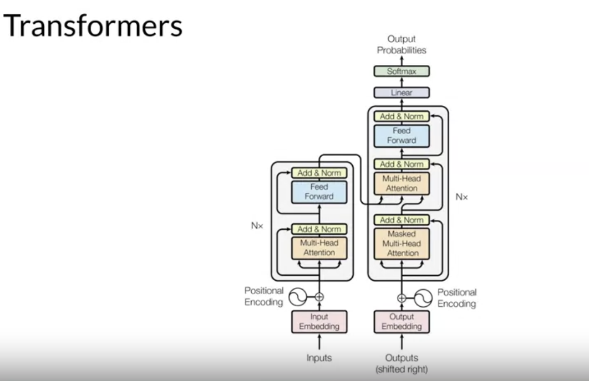 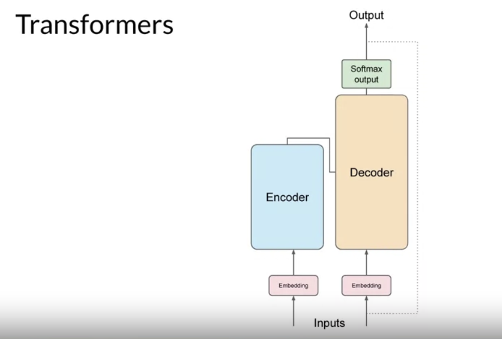

The transformer architecture is split into two distinct parts: the encoder and the decoder. These components work in conjunction with each other and share a number of similarities. The diagram below is derived from the original "Attention is All You Need" paper.

## Tokenization and Embeddings

Machine learning models are statistical calculators that work with numbers, not words. Before passing texts into the model, you must first tokenize the words, converting them into numbers with each number representing a position in a dictionary of all possible words the model can work with. There are multiple tokenization methods, such as matching token IDs to complete words or parts of words.

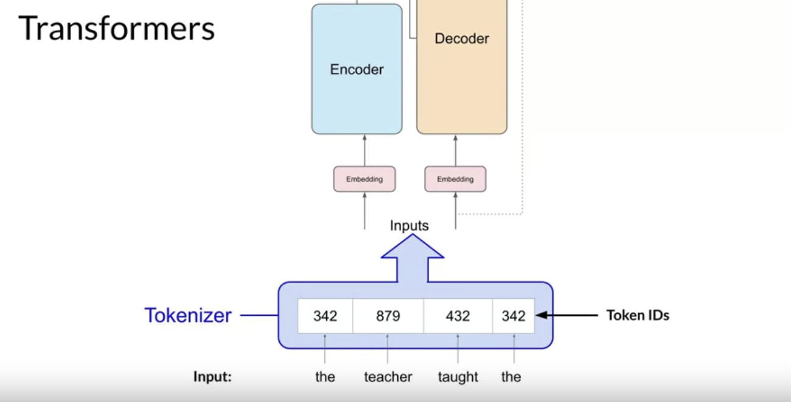 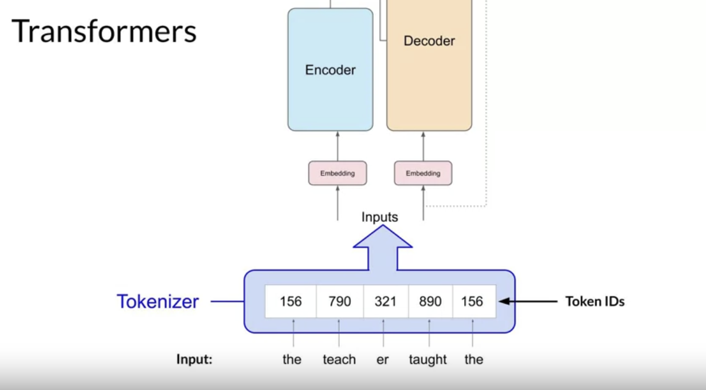

Once you've selected a tokenizer to train the model, you must use the same tokenizer when generating text.

Now that your input is represented as numbers, you can pass it to the embedding layer, this layer is a trainable vector embedding space, a high dimensional space where each token is represented as a vector and occpies a unique location within that space. Each token id in the vocabulary is matched to a multi-dimensional vector and the intuition is that these vectors learn to encode the meaning and context of individual tokens in the input sequence. Embedding vector spaces have been used in natural language processing for some time, previous generation language algorithms like word2vec use this concept.

> Note: Embeddings are dense vector representations that aim to capture the meaning and context of words.  Each token ID is mapped to a corresponding vector in a high-dimensional space. Embeddings help to capture not just the identity but also the semantic and syntactic essence of words. For instance, similar words like "quick" and "fast" might be placed closer together in the embedding space than "quick" and "slow".
> In a real-world application, these embedding vectors are learned and fine-tuned during the training process to best suit the model's task, be it translation, sentiment analysis, or any other NLP task. The embedding space evolves such that it captures nuances and complexities of language, aiding the model in making more accurate predictions.
>
> A "dense vector" refers to a type of vector in computational mathematics where most or all of the elements are non-zero. This is in contrast to "sparse vectors," where the majority of the elements are zero.
> 
> The term "embedding space" refers to the high-dimensional space where vectors representing words, phrases, or other types of data are mapped in a machine learning model. In the context of natural language processing (NLP), embedding space is particularly significant as it is where words are represented as vectors, with each dimension of the vector capturing different aspects of the word's meaning, usage, or context. The purpose of embedding is to capture semantic meaning of features; for example, similar features will be close to each other in the embedding vector space.
> 
> Refined Embeddings: Through training, the embeddings are modified to capture relevant aspects of words as they pertain to the specific task. For example, in a sentiment analysis task, words that frequently appear in positive contexts may have their embeddings adjusted to cluster closer to other positive sentiment words.
>
> Co-occurrence: Words that frequently appear in similar contexts (e.g., "coffee" and "tea") will influence each other's embedding updates during training. If both words contribute to similar prediction outcomes, their gradients will push their embeddings to become more similar.

Looking back at the sample sequence, you can see that in this simple case each word has been matched to a token ID and each token is mapped into a vector. In the original transformer paper, the vector size was actually 512, so much bigger than we can fit onto this image.

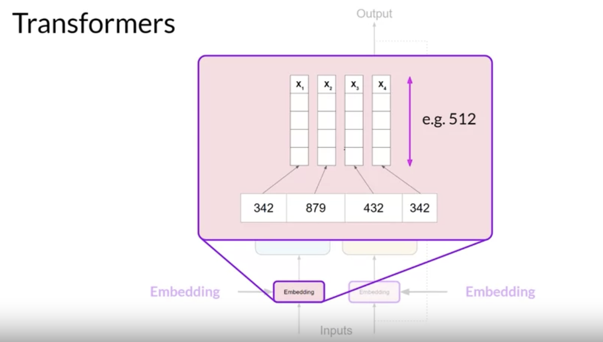

For simplicity, if you imagine a vector size of just three, you could plot the words into a three-dimensional space and see the relationships between thoese words, you can see now how you can relate words that are located close to each other in the embedding space and how you can calculate the distance between the words as an angle, which gives the model the ability to mathematically understand language.

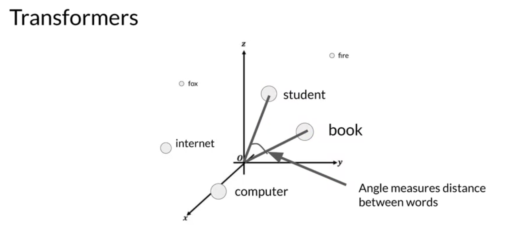

## Positional Encoding

As you add token vectors into the base of the encoder or the decoder, you also add positional encoding. The model processes each of the input tokens in parallel, so adding this preserves information about word order, ensuring the relevance of the word position in the sentence is not lost.

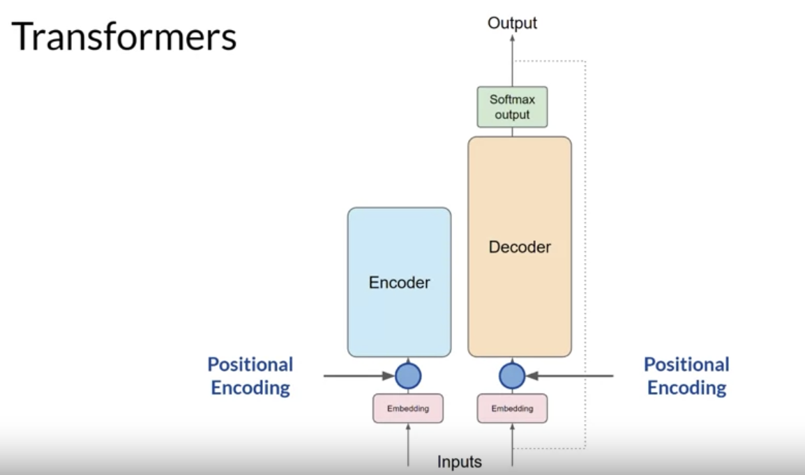 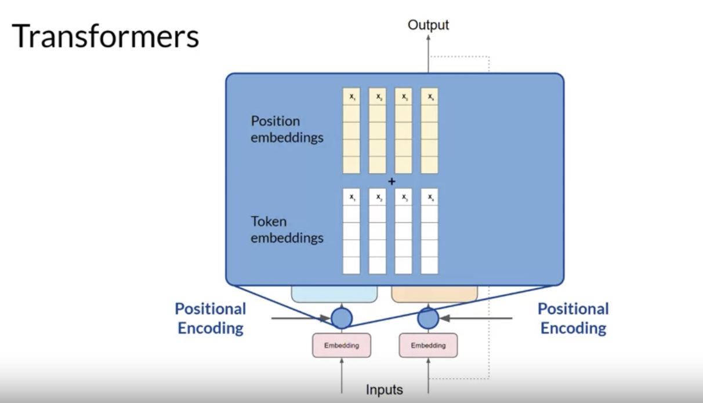

## Self-Attention and Multi-Head Attention

Once you've summed the input tokens and the positional encodings, you pass the resulting vectors to the self-attention layer. Here, the model analyzes the relationships between the tokens in your input sequence. As you saw earlier, this allows the model to attend to different parts of the input sequence to better capture the contextual dependencies between the words. The self-attention weights that are learned during training and stored in these layers reflect the importance of each word in that input sequence to all other words in the sequence. But this does not happen just once, the transformer architecture actually has multi-headed self-attention. This means that multiple sets of self-attention weights or heads are learned in parallel independently of each other. The number of attention heads included in the attention layer varies from model to model, but numbers in the range of 12-100 are common. The intuition here is that each self-attention head will learn a different aspect of language. For example, one head may see the relationship between the people entities in our sentence, while another head may focus on the activity of the sentence. while yet another head may focus on some other properties such as the words rhyme. It's important to note that you don't dictate ahead of time what aspects of language the attention heads will learn. The weights of each head are randomly initialized and given sufficient traning data and time, each will learn differnet aspects of language. While some attention maps are easy to interpret others may not be.

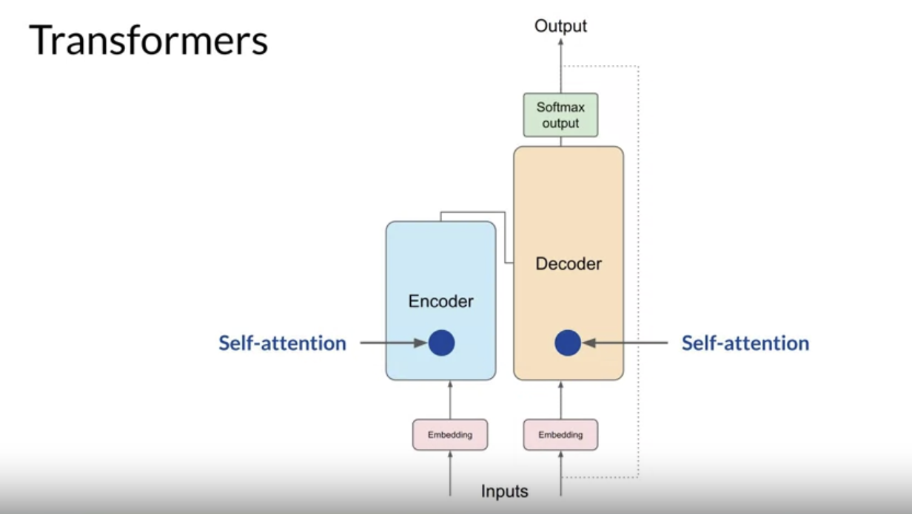 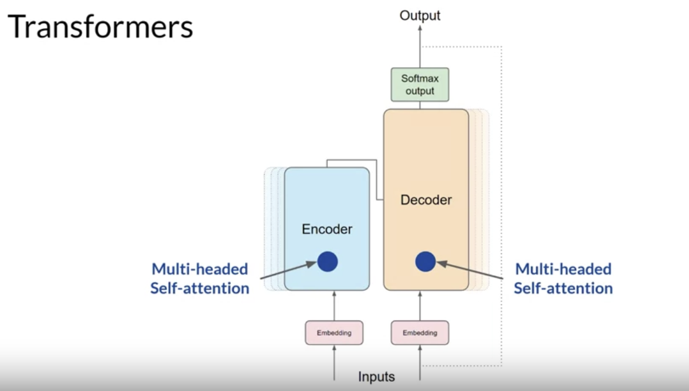 

## Feed-Forward Network and Output

Now that all of the attention weights have been applied to your input data, the output is processed through a fully connected feed-forward network. The output of this layer is a vector of logits proportional to the probability score for each and every token in the tokenizer dictionary. You can then pass these logits to a final softmax layer where they are normalized into a probability score for each word. This output includes a probability for every single word in the vocabulary, so there's likely to be thousands of scores here. One single token will have a score higher than the rest. This is the most likely predicted token. There are a number of methods that you can use to vary the final selection from this vector of probabilities.

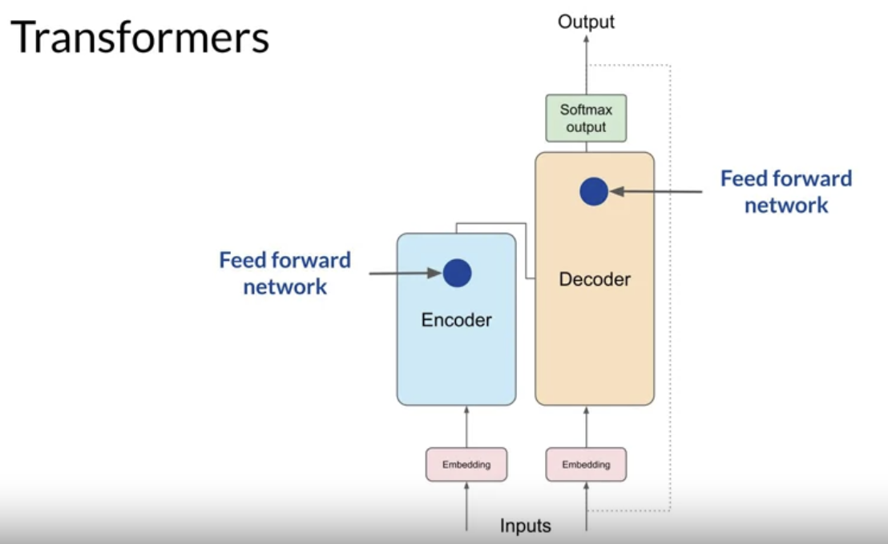 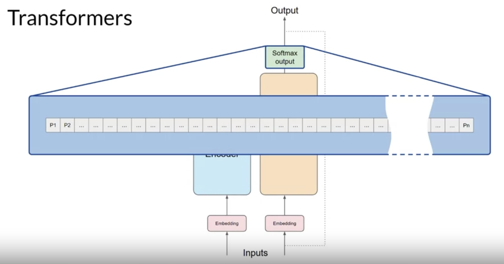 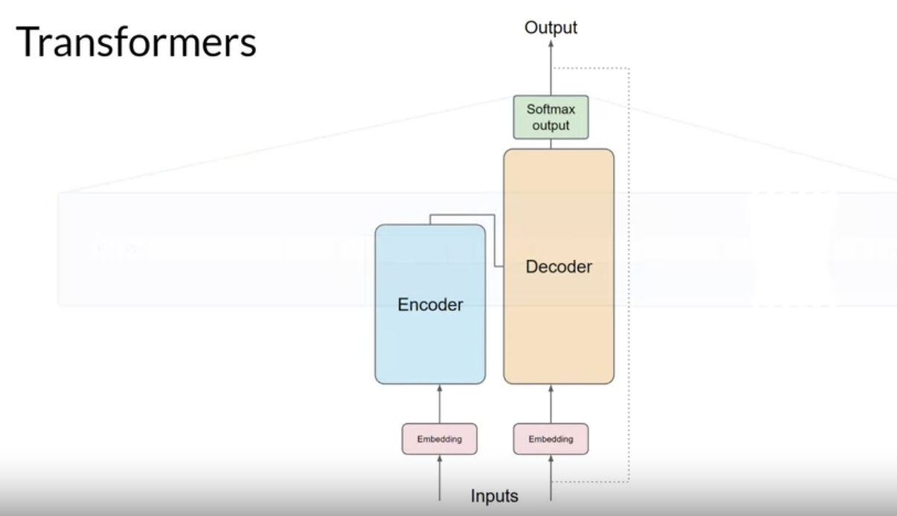

## Simultaneous Training of Embeddings and Encodings in Transformers

### Model Configuration
In transformer models, the input sequence of tokens is processed through several steps:

- **Embedding Layer**: Each token is converted into a dense vector. These embeddings can be initialized using random values or pre-trained vectors.

- **Positional Encoding**: After the embeddings are created, positional encodings are added to each embedding vector to incorporate information about the order of tokens in the sequence. This step is crucial as it allows the model to utilize the sequence order, which is not inherently captured by the embeddings alone.

### Forward Pass
- **Input to Encoder**: The combined vectors (embeddings + positional encodings) serve as the input to the encoder layers of the transformer.
- **Encoder Layers**: Each layer in the encoder applies operations such as self-attention and feed-forward neural networks. These operations transform the embeddings into more complex representations (encodings) that incorporate contextual information from the entire input sequence.

### Loss Calculation
- **Model Output**: The final output of the model, after processing through all encoding layers, is used to predict results for tasks such as classification or translation.
- **Loss Metrics**: A loss function is used to compute the discrepancy between the model's predictions and the actual target outputs. This loss reflects how well the model performs the intended task.

### Backpropagation
- **Gradient Computation**: During backpropagation, gradients of the loss are calculated with respect to all trainable parameters in the model. This includes weights in both the encoder layers and the embedding layer.
- **Parameter Updates**: The calculated gradients are used to update the parameters. This update refines the embeddings and encoder weights to better suit the needs of the model's tasks.

### End Result
- **Learning and Adaptation**: Both the embeddings and the encodings adapt based on the specific requirements of the task:
  - **Embeddings**: Adjust to provide initial representations that are more aligned with subsequent encoding layers.
  - **Encodings**: Transform these embeddings into outputs that effectively minimize the task-specific loss.

This training process ensures that both embeddings and encodings evolve to optimally perform the specific tasks for which the transformer is designed.

> Note: Embeddings(Static Representations): Embeddings provide a static, pre-contextual representation of data, typically words in the case of text. Each word is mapped to a vector that captures some semantic and syntactic properties of the word based on the corpus the embeddings were trained on. However, these embeddings do not change based on the words around them in a specific instance of data.
> 
> Encodings (Dynamic and Contextual): Encodings are the result of processing embeddings through one or more layers of a neural network, such as the layers in a transformer model. These layers use mechanisms like self-attention to dynamically adjust how each word's vector should be influenced by the other words in its current context.

# Generating text with transformers

## Overall Prediction Process Example

At this point, you've seen a high-level overview of some of the major components inside the transformer architecture. But you still haven't seen how the overall prediction process works from end to end. Let's walk through a simple example. 
In this example, you'll look at a translation task or a sequence-to-sequence task, which incidentally was the original objective of the transformer architecture designers. You'll use a transformer model to translate the French phrase into English. 

First, you'll tokenize the input words using this same tokenizer that was used to train the network. 

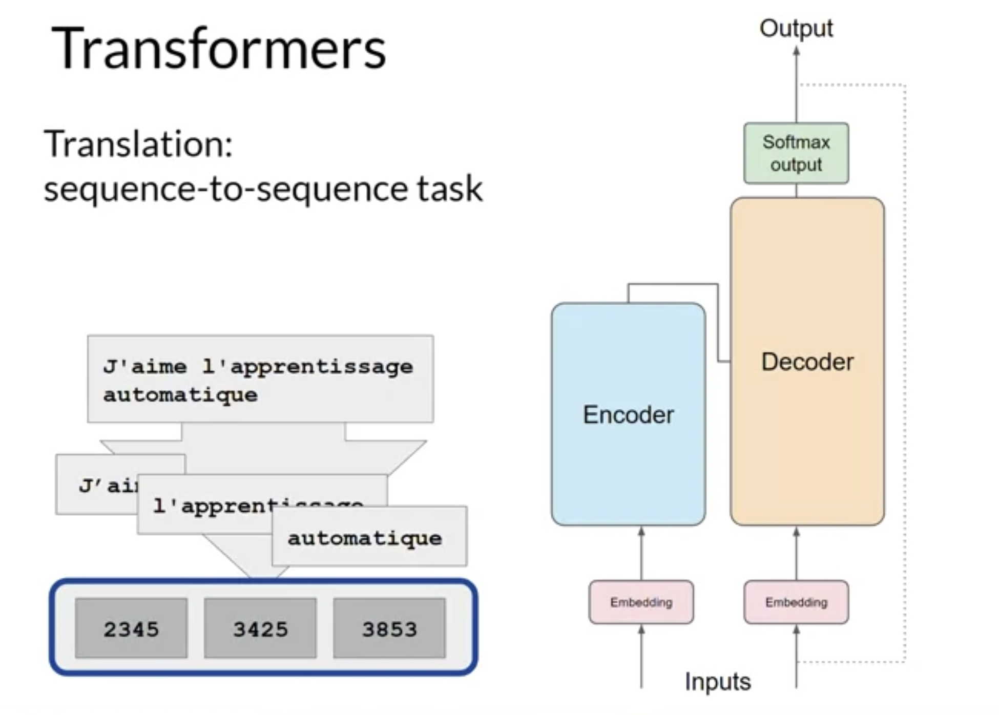

These tokens are then added into the input on the encoder side of the network, passed through the embedding layer.

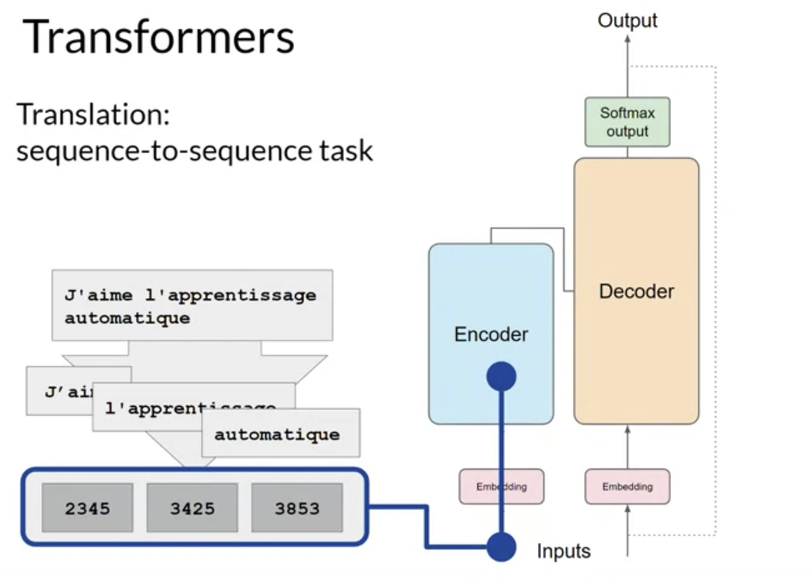

And then fed into the multi-headed attention layers. The outputs of the multi-headed attention layers are fed through a feed-forward network to the output of the encoder.

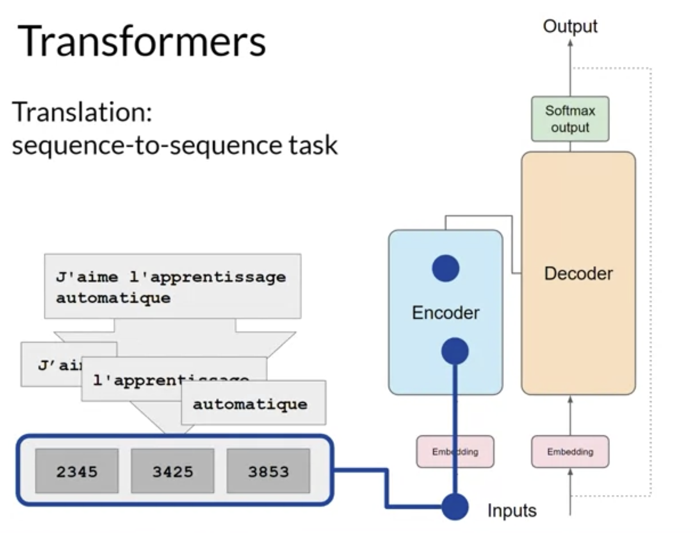

At this point, the data that leaves the encoder is a deep representation of the structure and meaning of the input sequence. This representation is inserted into the middle of the decoder to influence the decoder's self-attention mechanisms. 

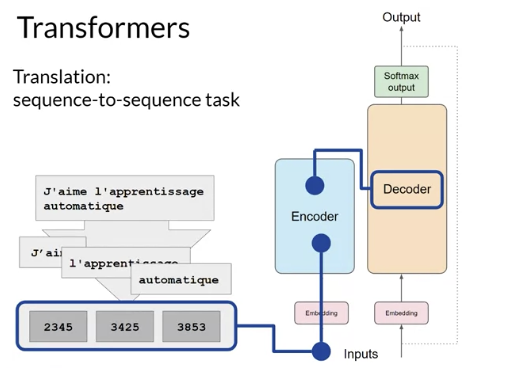

Next, a start of sequence token is added to the input of the decoder. This triggers the decoder to predict the next token, which it does based on the contextual understanding that it's being provided from the encoder.

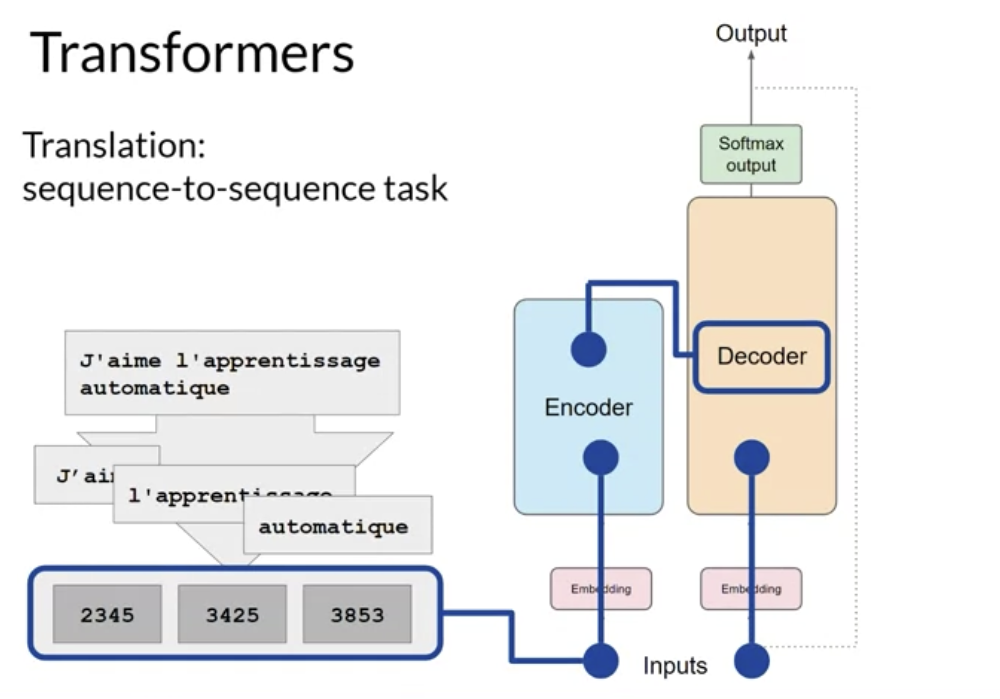

 
The output of the decoder's self-attention layers gets passed through the decoder feed-forward network and through a final softmax output layer. 

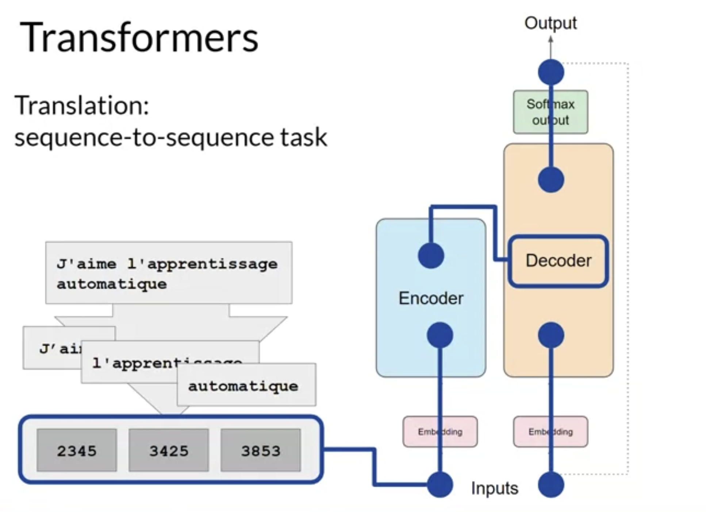

At this point, we have our first token. 

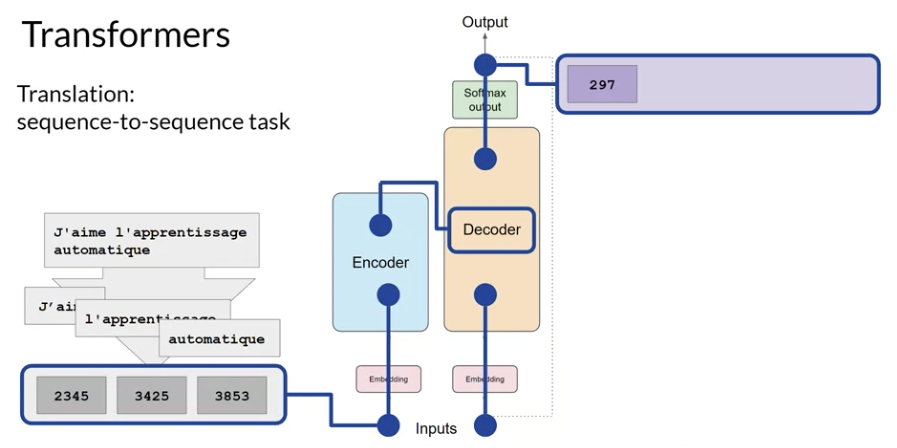

You'll continue this loop, passing the output token back to the input to trigger the generation of the next token, until the model predicts an end-of-sequence token. 

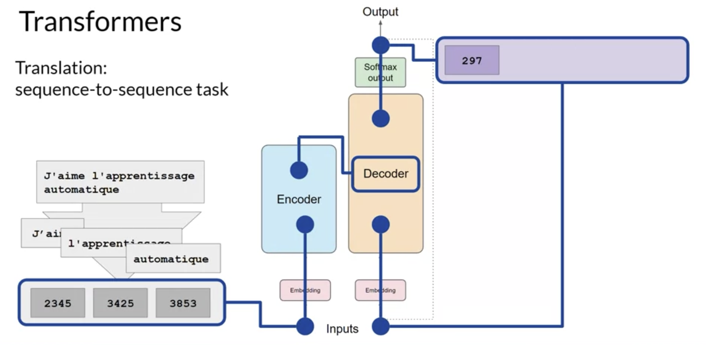
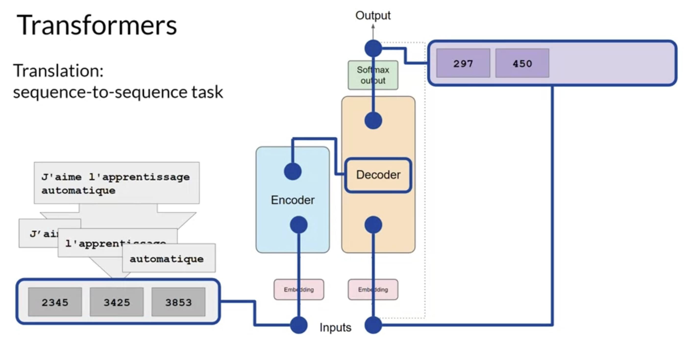

At this point, the final sequence of tokens can be detokenized into words, and you have your output. 

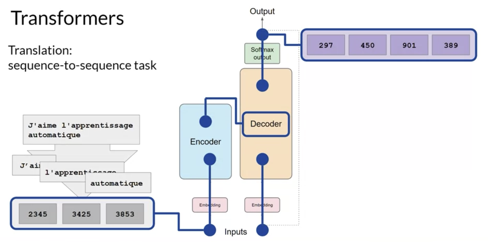

In this case, I love machine learning. 

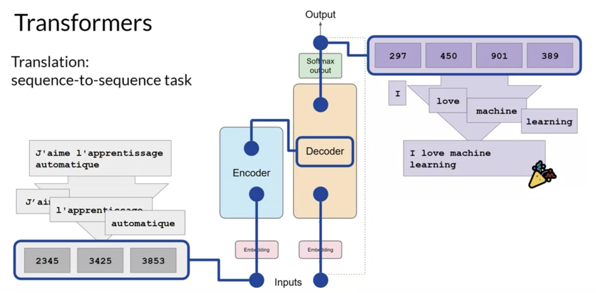

There are multiple ways in which you can use the output from the softmax layer to predict the next token. These can influence how creative you are generated text is. 

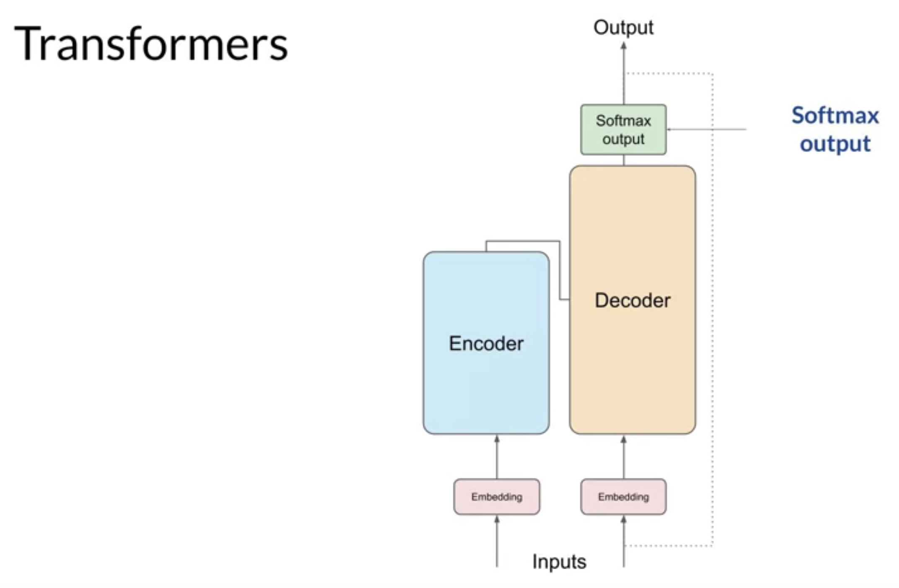

Let's summarize what you've seen so far. The complete transformer architecture consists of an encoder and decoder components. The encoder encodes input sequences into a deep representation of the structure and meaning of the input. The decoder, working from input token triggers, uses the encoder's contextual understanding to generate new tokens. It does this in a loop until some stop condition has been reached. 

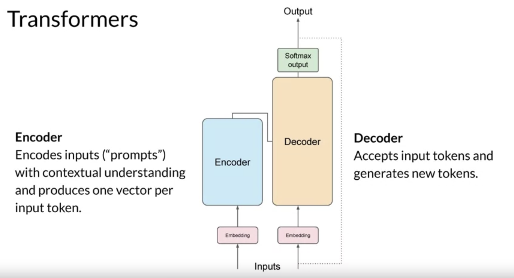

## Variation Architecture

While the translation example you explored here used both the encoder and decoder parts of the transformer, you can split these components apart for variations of the architecture. 

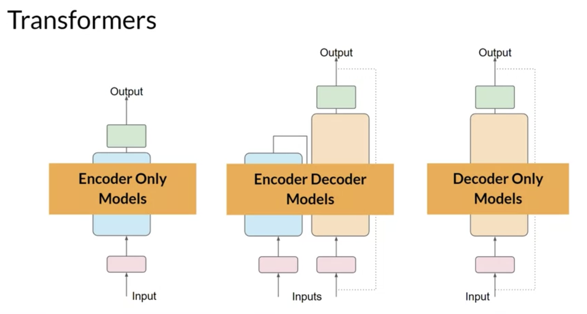

Encoder-only models also work as sequence-to-sequence models, but without further modification, the input sequence and the output sequence are the same length. Their use is less common these days, but by adding additional layers to the architecture, you can train encoder-only models to perform classification tasks such as sentiment analysis, BERT is an example of an encoder-only model. 

Encoder-decoder models, as you've seen, perform well on sequence-to-sequence tasks such as translation, where the input sequence and the output sequence can be different lengths. You can also scale and train this type of model to perform general text generation tasks. Examples of encoder-decoder models include BART as opposed to BERT and T5.

Finally, decoder-only models are some of the most commonly used today. Again, as they have scaled, their capabilities have grown. These models can now generalize to most tasks. Popular decoder-only models include the GPT family of models, BLOOM, Jurassic, LLaMA, and many more. 

## Reference:
- Generative AI with large language models coursera

