# Decision Trees

## Overview

In general, a decision tree makes a statement and then makes a decision based on whether that statement is true or false. When a decision tree classifies things into categories, it is called a **classification tree**. When a decision tree predicts numeric values, it's called a **regression tree**.

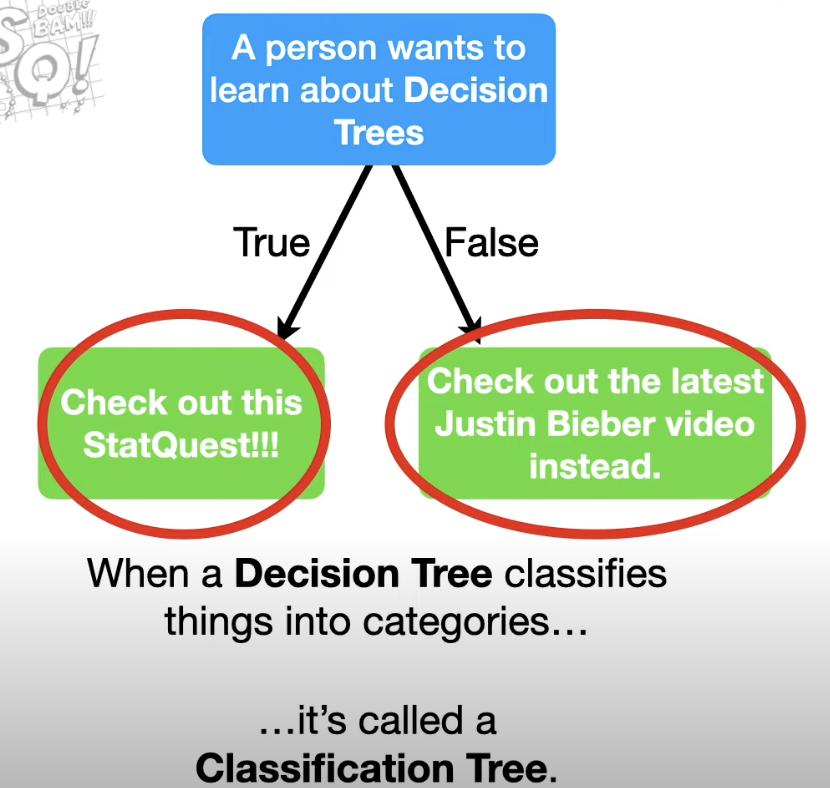 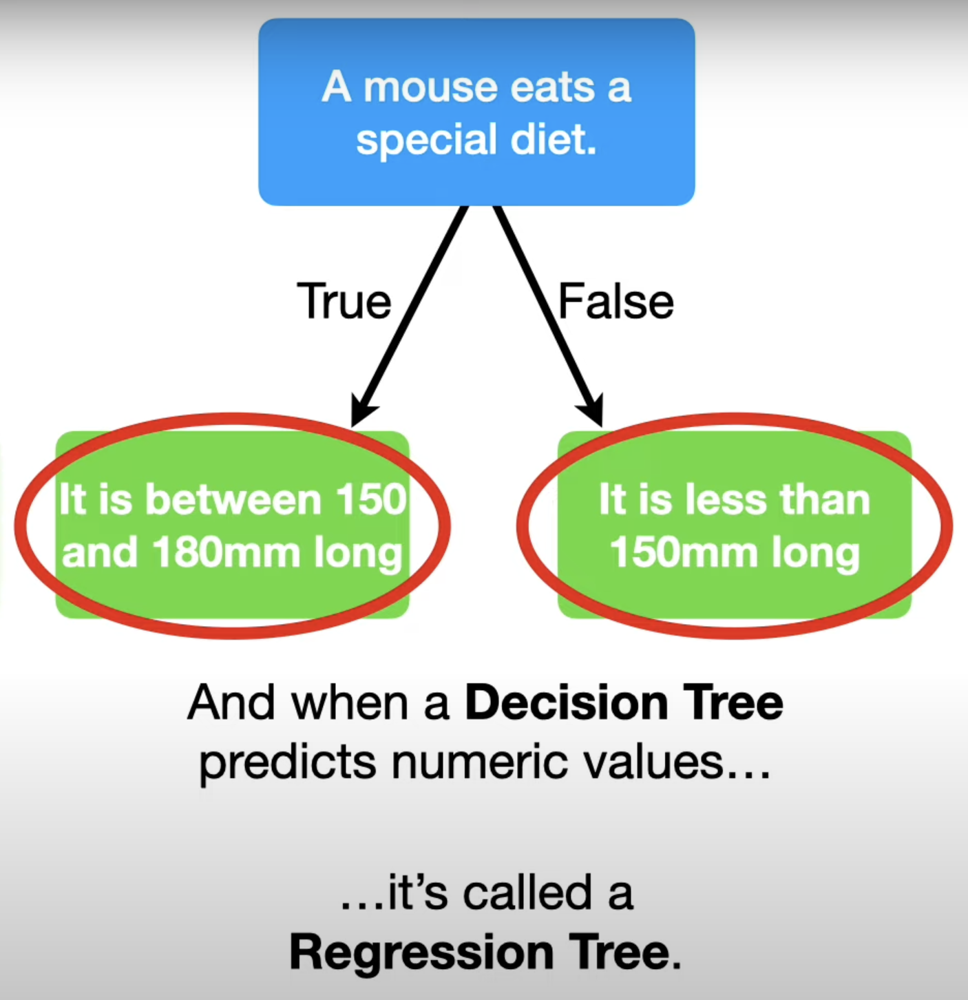

## Root Node
The very top of the tree is called the **root node** or just the **root**.

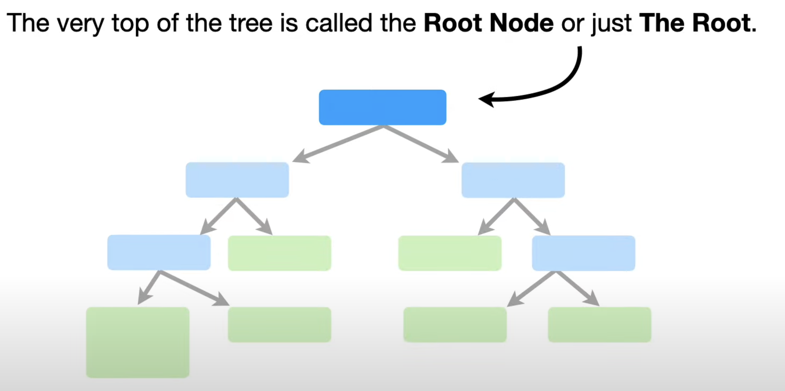

## Internal Nodes
These are called **internal nodes**, or **branches**. Branches have arrows pointing to them and from them.

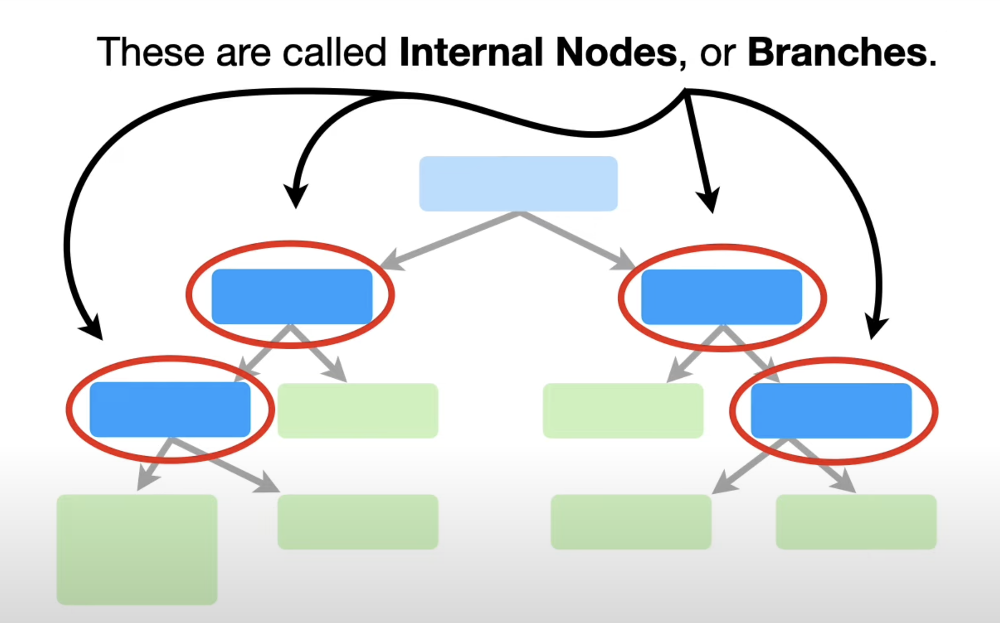

## Leaf Nodes
Lastly, these are called **leaf nodes** or just **leaves**. Leaves have arrows pointing to them but not away from them.

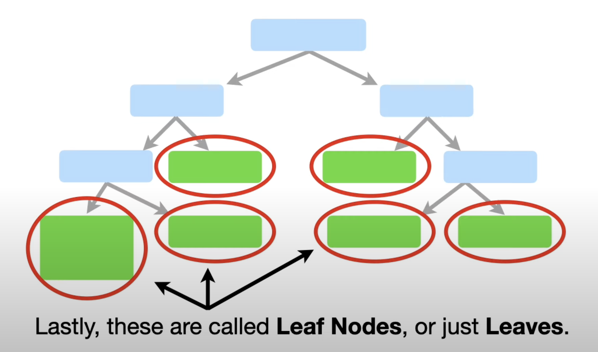

## Example: Building a Decision Tree
Now let's learn how to build a decision tree from raw data. This dataset includes information on whether or not someone loves popcorn, whether or not they love soda, their age, and whether or not they love "Cool as Ice." Our goal is to build a classification tree that predicts whether or not someone loves "Cool as Ice."

### Step 1: Find the Root Node
The first step is to decide which feature (loves popcorn, loves soda, or age) should be the question we ask at the very top of the tree. To make this decision, we start by examining how well each feature predicts whether or not someone loves "Cool as Ice."

To evaluate this, we start by looking at how well loves popcorn predicts whether or not someone loves cool as ice. We'll create a simple tree that only asks if someone loves popcorn. For example, if the first person in the dataset loves popcorn, they will go to the leaf on the left. Similarly, we create a simple tree that only asks if someone loves soda. We then run the data through the tree to see how well it predicts the outcome.

 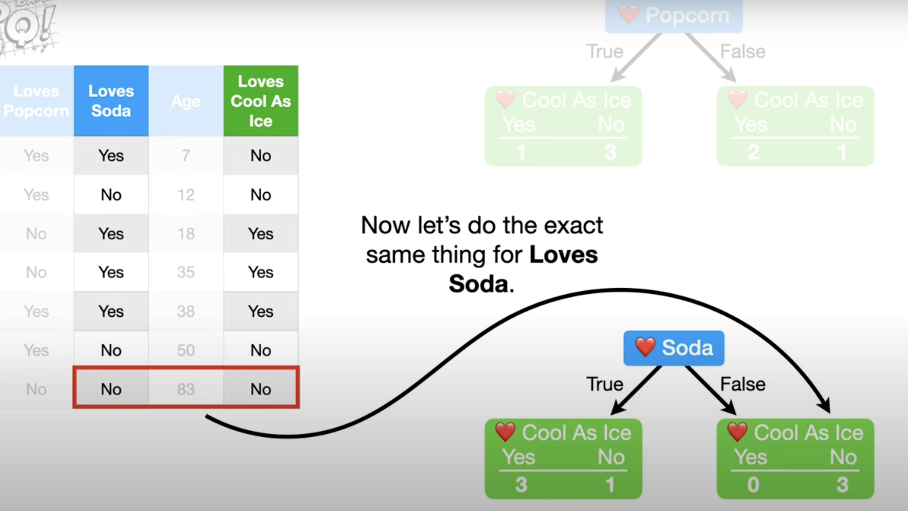

**Impurity**: Because these three leaves all contain a mixture of people who do and do not love "Cool as Ice," they are called **impure**.

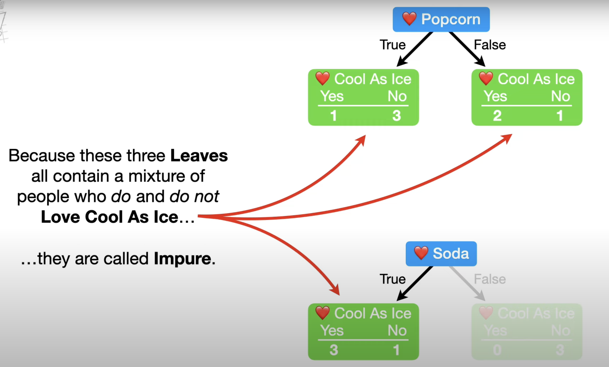

**Gini Impurity**: There are several ways to quantify the impurity of the leaves. One popular method is called **Gini impurity**. Other methods include **entropy** and **information gain**. Numerically, these methods are similar, so we will focus on Gini impurity due to its popularity and straightforward nature.

#### 1. Calculating Gini Impurity for "Loves Popcorn"
To calculate the Gini impurity for "Loves Popcorn," we start by calculating the Gini impurity for the individual leaves.

#####  Gini impurity for left leaf:
$$
\text{Gini impurity for left leaf} = 1 - (\text{probability of "yes"})^2 - (\text{probability of "no"})^2 \\
= 1 - \left(\frac{1}{1+3}\right)^2 - \left(\frac{3}{1+3}\right)^2 \\
= 0.375
$$

##### Gini impurity for right leaf:
$$
\text{Gini impurity for right leaf} = 1 - (\text{probability of "yes"})^2 - (\text{probability of "no"})^2 \\
= 1 - \left(\frac{2}{2+1}\right)^2 - \left(\frac{1}{2+1}\right)^2 \\
= 0.444
$$

Since the leaf on the left has 4 people in it, and the leaf on the right only has 3 people in it, the leaves do not represent the same number of people. Thus, the total Gini impurity is the weighted average of Gini impurities for the leaves. 

$$
\text{Total Gini impurity} = \left(\frac{4}{4+3}\right) \times 0.375 + \left(\frac{3}{4+3}\right) \times 0.444 \\
= 0.405
$$

So, the Gini impurity for "Loves Popcorn" is 0.405.

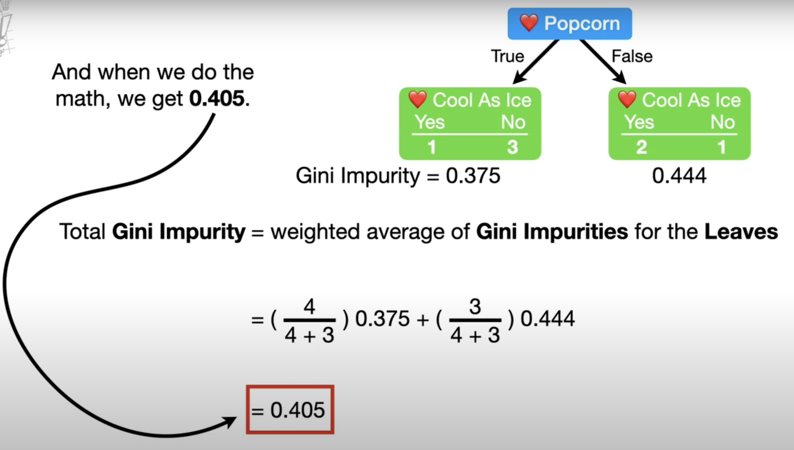

#### 2. Calculating Gini Impurity for "Loves Soda"

Likewise, the Gini impurity for "Loves Soda" is 0.214.

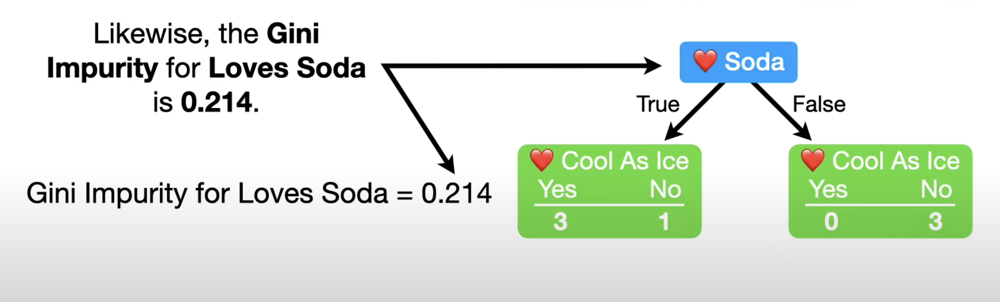

#### 3. Calculating Gini Impurity for "Age"
For numeric data like "Age," we sort the rows by age, from lowest value to highest value, then calculate the average age for adjacent people. We then calculate the Gini impurity for each average age.

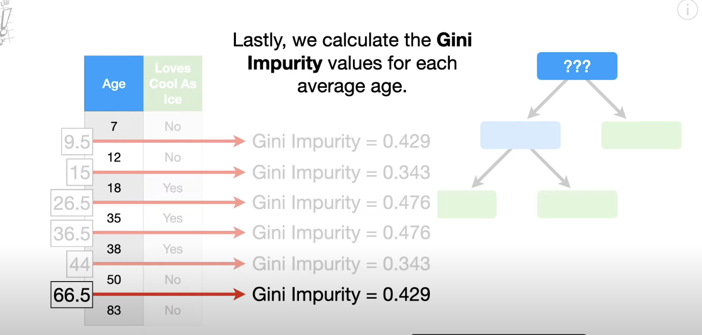

For example, to calculate the Gini impurity for the first value, we use age < 9.5 at the root.

##### Gini impurity for left leaf:
$$
\text{Gini impurity for left leaf} = 1 - (\text{probability of "yes"})^2 - (\text{probability of "no"})^2 \\
= 1 - \left(\frac{0}{0+1}\right)^2 - \left(\frac{1}{0+1}\right)^2 \\
= 0
$$

This makes sense because every person in this leaf does not love "Cool as Ice," so there is no impurity.

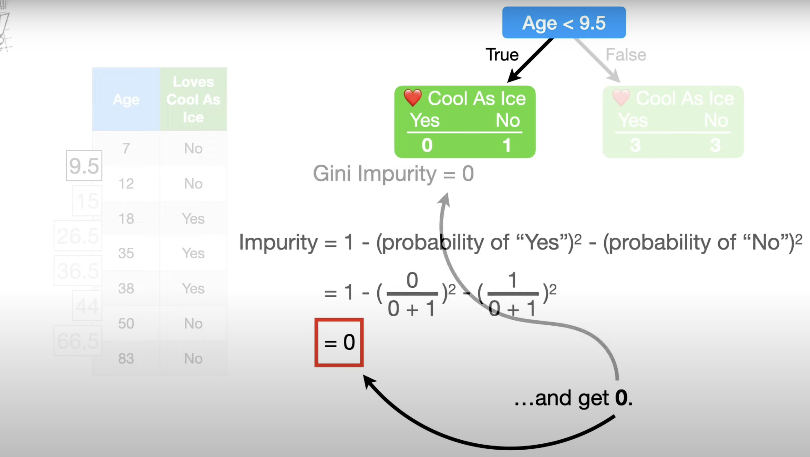

##### Gini impurity for right leaf:
The Gini impurity for the right leaf is 0.5. Now we calculate the weighted average of the two impurities to get the total Gini impurity:

$$
\text{Total Gini impurity} = \left(\frac{1}{1+6}\right) \times 0 + \left(\frac{6}{1+6}\right) \times 0.5 \\
= 0.429
$$

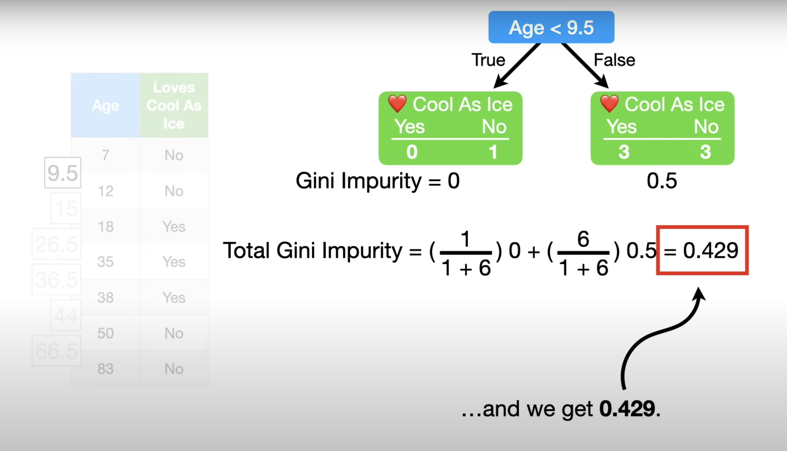

For other candidate values, the lowest impurity is 0.343, achieved with thresholds 15 and 44. We'll pick 15 for this example.

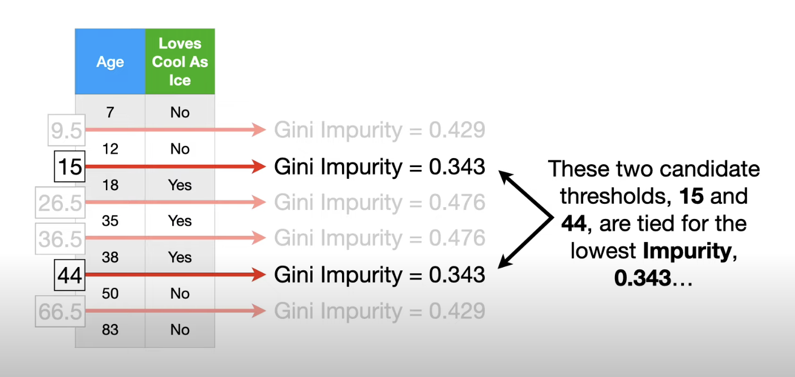

Comparing Gini impurity values for age, "Loves Popcorn," and "Loves Soda" (0.343, 0.405, and 0.214, respectively), "Loves Soda" has the lowest Gini impurity, so it goes at the top of the tree.

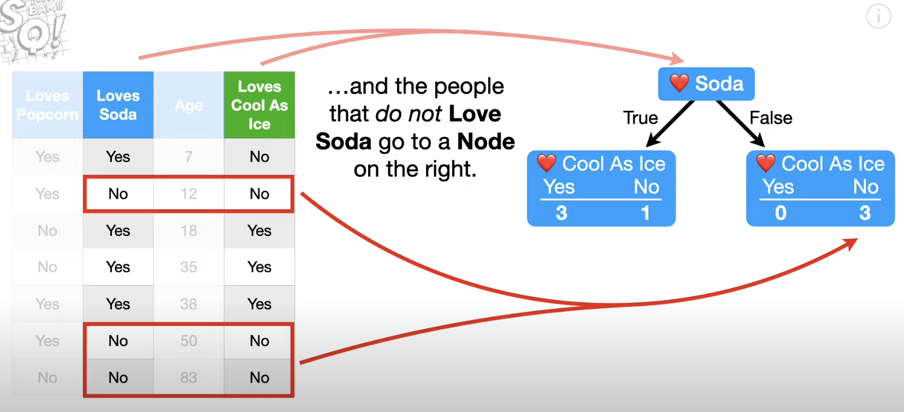

### Step 2: Find Internal Nodes

Now let's focus on the node on the left. All 4 people that love soda are in this node, 3 of these people love "Cool as Ice" and 1 does not, so this node is impure. So let's see if we can reduce the impurity by splitting the people that love soda based on "Loves Popcorn" or age. We'll start by asking the 4 people that love soda if they also love popcorn. The total Gini impurity for this split is 0.25.

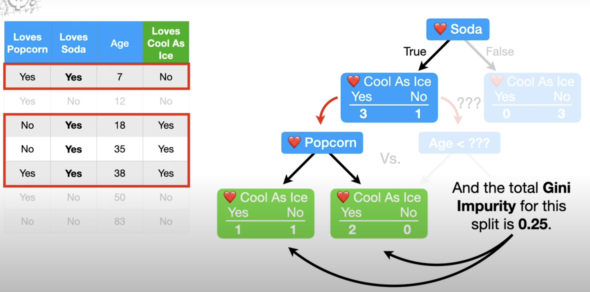

Now testing different age thresholds just like before, only this time we only consider the ages of people who love soda and age < 12.5 gives us the lowest impurity 0 because both leaves have no impurity at all.

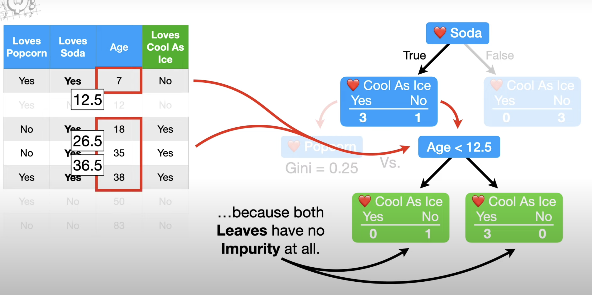

Since 0 is less than 0.25, we use age < 12.5 to split this node into leaves.

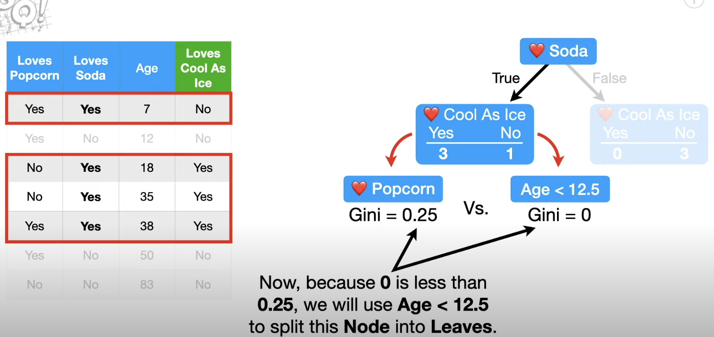

The arrows point to the leaves as no further splitting is needed.

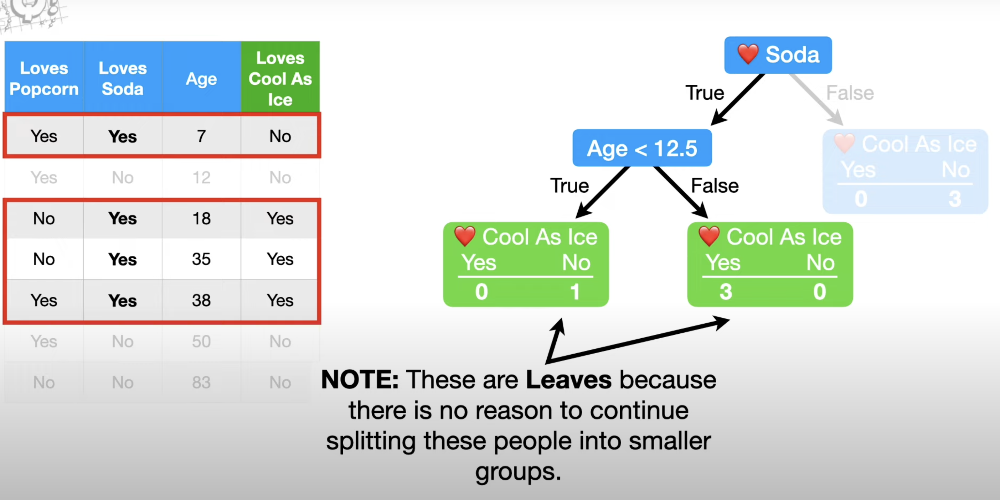

### Step 3: Assigning Output Values
The output of a leaf is the category with the most votes. For example, if most people in a leaf love "Cool as Ice," that is the output value.

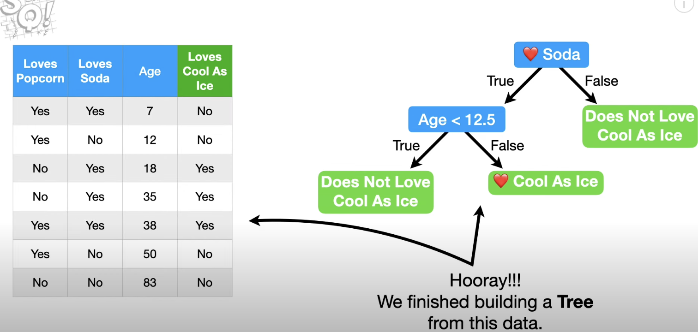

## Handling Overfitting
Lastly, remember when we built this tree, only one person in the original dataset made it to this leaf. Because so few people made it to this leaf, it's hard to have confidence that it will do a great job making predictions with future data. This indicates that we may have overfit the data.

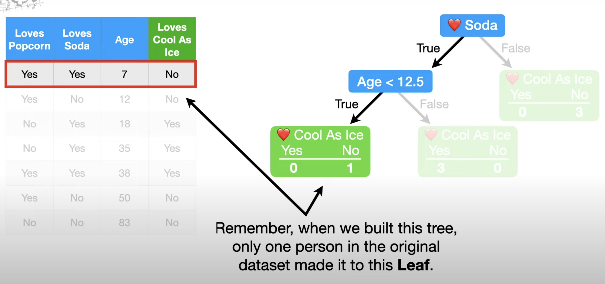

In practice, there are two main ways to address this problem:
1. **Pruning**: This technique involves trimming the tree by removing nodes that provide little to no predictive power. For example, if we have a node that splits based on a feature but does not significantly reduce impurity, we can remove this node and merge its branches. This simplification helps improve the model's generalization to new data. Imagine a node that splits based on whether someone likes a very niche movie that most people haven't seen. If this split doesn't help in predicting the outcome, we can prune this node to prevent overfitting.
2. **Setting Growth Limits**: We can limit how trees grow, for example, by requiring a minimum of 3 people per leaf. This results in an impure leaf, but it gives a better sense of the accuracy of our prediction. For instance, if only 75% of the people in the leaf loved "Cool as Ice," we still need an output value to make a classification. Since most of the people in this leaf love "Cool as Ice," that will be the output value.

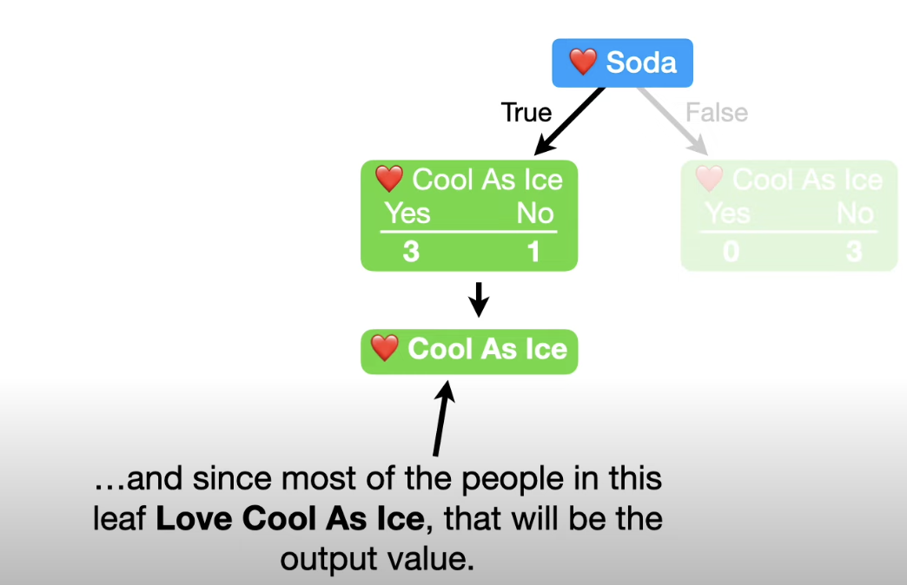

Additionally, when building a tree, we don't know in advance the optimal number of people per leaf. Therefore, we test different values using a method called **cross-validation** and pick the one that works best.
## Code Implementation:
In the folloing code, we are using $\text{Information Gain} = \text{Entropy (Original Dataset)} - \text{Conditional Entropy (After Split)}$.

But we can also use $\text{Information Gain} = \text{Gini Impurity (Original Dataset)} - \text{Gini Impurity (After Split)}$.
- [Decision Tree](../../Code-Implementation/Decision-Tree)
## Reference:
- [Watch the video on YouTube](https://www.youtube.com/watch?v=_L39rN6gz7Y&t=903s)
- CMU Introduction To Machine Learning
