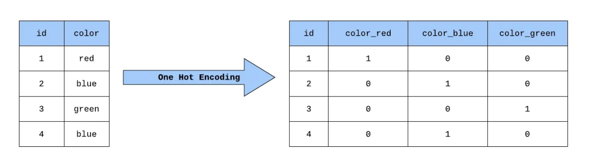
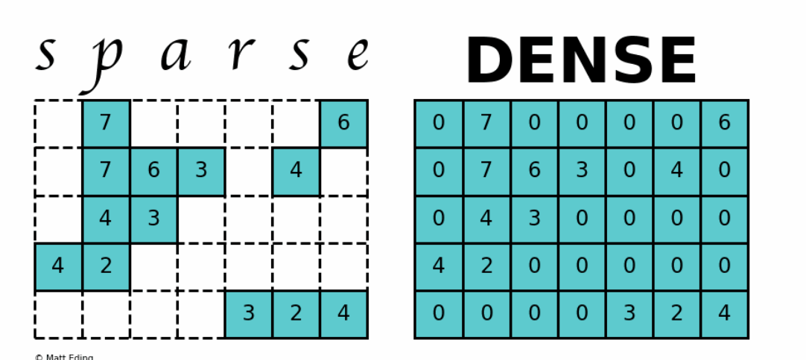

# One Hot Encoding
## Overview
One hot encoding converts categorical variables into a binary matrix representation. It's particularly useful for categorical features with medium cardinality.
> **Note**: Cardinality measures the number of elements in a set, so when applied to data features, it indicates the number of unique values that a feature can take.


## Common Problems
-  **Memory Consumption**: Can be extensive if there are many unique categories, leading to high-dimensional feature vectors.
> Each number in a vector represents a dimension:
> [2] is a one-dimensional vector because it contains only one element.
> [3, 4] is a two-dimensional vector because it contains two elements.
> [3, 4, 7] is a three-dimensional vector because it contains three elements.
-  **Computational Efficiency**: Processing large one-hot encoded vectors can be computationally expensive. 
-  **Unsuitability for NLP**: Due to the large vocabulary size, it's impractical for natural language processing tasks.

## Best Practices

-  **Handling Rare Categories**: Group infrequent categories into a single "Other" category. 
-  **Managing Unseen Categories**: Ensure that your one hot encoding implementation can handle new, unseen categories during testing or in production.

## Coding Examples
### pandas.get_dummies 
- **Functionality**: This function converts categorical variable(s) into dummy/indicator variables. It is straightforward and quick for exploratory data analysis and smaller projects. 
>In statistics and machine learning, "dummy variable" and "indicator variable" are terms often used interchangeably to refer to variables created to represent categorical data in numeric form.
A dummy variable is a binary variable that has been created to represent a category. For each category in a categorical feature, a new binary variable is generated. These variables take the value:
1 if the observation belongs to that category
0 if it does not.
>
- **Limitation**: `pandas.get_dummies` doesn't inherently "remember" the mapping from categorical values to dummy variables. This means if you encode your training data, and later receive new data for prediction (like a test set), there could be inconsistencies in the encoded columns if the new data contains categories not present in the training data.

### sklearn.preprocessing.OneHotEncoder
-  **Functionality**: Part of the Scikit-learn library, OneHotEncoder is designed to be used in machine learning pipelines. It converts categorical features into a 2D array of one hot encoded vectors and is capable of handling unseen categories. 
-  **Persistence**: OneHotEncoder can remember the encoding scheme by fitting the encoder to the training data. This allows it to handle new data during testing or in production environments consistently, by either ignoring unseen categories or throwing an error, depending on how you configure it. 
-  **Integration in Pipelines**: It can be incorporated into a preprocessing pipeline, ensuring that all steps from encoding to model training are aligned and consistent.

### Choosing Between pandas.get_dummies and OneHotEncoder 
- Use `pandas.get_dummies` when you are doing quick data transformations for analysis or visualizations where the exact alignment of encoded features between different datasets (like training and testing) is not critical.  
- Use `OneHotEncoder` when building machine learning models that need to be robust and handle new, unseen data after being deployed. It's particularly useful in production environments or when the data is split into training and testing sets, and consistency across these splits is crucial.

### pandas.get_dummies Example: 
#### Example Scenario: Customer Data for Marketing Campaign
**Step 1: Training Data** 
Imagine we have customer data from a marketing campaign that includes a categorical variable "Product Interest" with three categories: "Gadgets", "Books", and "Clothing".

Here is how the data might look:

| Customer ID | Product Interest |
|-------------|------------------|
| 1           | Gadgets          |
| 2           | Books            |
| 3           | Clothing         |

Using `pandas.get_dummies`, we convert the "Product Interest" column into dummy variables:

```python
import pandas as pd

# Sample training data
data = pd.DataFrame({
    'Customer ID': [1, 2, 3],
    'Product Interest': ['Gadgets', 'Books', 'Clothing']
})

# Applying get_dummies
dummy_train = pd.get_dummies(data, columns=['Product Interest'])
print(dummy_train)
```
This will output:

| Customer ID | Product Interest_Gadgets | Product Interest_Books | Product Interest_Clothing |
|-------------|--------------------------|------------------------|---------------------------|
| 1           | 1                        | 0                      | 0                         |
| 2           | 0                        | 1                      | 0                         |
| 3           | 0                        | 0                      | 1                         |

#### Step 2: New Testing Data
Now, suppose we receive new testing data after our model has been trained, which includes a new category in the "Product Interest" column, such as "Music".

| Customer ID | Product Interest |
|-------------|------------------|
| 4           | Music            |
| 5           | Gadgets          |

Applying `pandas.get_dummies` to this new data results in:

```python
# New testing data
new_data = pd.DataFrame({
    'Customer ID': [4, 5],
    'Product Interest': ['Music', 'Gadgets']
})
# Applying get_dummies
dummy_test = pd.get_dummies(new_data, columns=['Product Interest'])
print(dummy_test)
```
This will output:
| Customer ID | Product Interest_Gadgets | Product Interest_Music | 
|-------------|--------------------------|------------------------|
| 4           | 0                        | 1                     |
| 5           | 1                        | 0                     | 

#### Issue: Inconsistency in Dummy Variables

The dummy variables in the training and testing data are not the same. The testing data lacks columns for "Books" and "Clothing" and introduces a new column for "Music".

#### Impact

When you feed this testing data into a machine learning model trained on the original dummy variables, it will throw an error because the feature sets do not align.
The model expects three features ("Gadgets", "Books", "Clothing"), but only gets two ("Gadgets", "Music"), and the order and number of features do not match.

#### Solution
To avoid this, you could use a method like sklearn.preprocessing.OneHotEncoder, which allows you to specify a handle_unknown='ignore' parameter to deal with unseen categories by ignoring them or creating a consistent schema that includes all potential categories.

This example illustrates how pandas.get_dummies can be straightforward and effective for initial analyses but might not be suitable for scenarios where data evolves or includes new categories not present during model training.


### sklearn.preprocessing.OneHotEncoder example
#### Example Scenario: Customer Preferences for a Subscription Service

#### **Step 1: Training Data**
Suppose we have customer data for a subscription service with preferences for different content types: "Movies", "Music", and "Games".

Here is the initial training data:

| Customer ID | Content Preference |
|-------------|---------------------|
| 1           | Movies              |
| 2           | Music               |
| 3           | Games               |

We can encode this using `OneHotEncoder` as follows:

```python
from sklearn.preprocessing import OneHotEncoder
import numpy as np
import pandas as pd

# Sample training data
data = pd.DataFrame({
    'Customer ID': [1, 2, 3],
    'Content Preference': ['Movies', 'Music', 'Games']
})

# Creating the OneHotEncoder instance
encoder = OneHotEncoder(sparse=False)
encoded_data = encoder.fit_transform(data[['Content Preference']])

# Showing the encoded data
encoded_df = pd.DataFrame(encoded_data, columns=encoder.get_feature_names_out())
print(pd.concat([data['Customer ID'], encoded_df], axis=1))
```
This will output:
| Customer ID | Content Preference_Games | Content Preference_Movies | Content Preference_Music |
|-------------|--------------------------|---------------------------|--------------------------|
| 1           | 0                        | 1                         | 0                        |
| 2           | 0                        | 0                         | 1                        |
| 3           | 1                        | 0                         | 0                        |

#### Step 2: New Testing Data
Now, assume we receive new testing data which includes a new category "Sports" and lacks the "Games" category:

| Customer ID | Content Preference |
|-------------|---------------------|
| 4           | Sports              |
| 5           | Movies              |

```python
# New testing data
new_data = pd.DataFrame({
    'Customer ID': [4, 5],
    'Content Preference': ['Sports', 'Movies']
})

# Using the previously fitted encoder to transform the new data
new_encoded_data = encoder.transform(new_data[['Content Preference']])

# Showing the transformed new data
new_encoded_df = pd.DataFrame(new_encoded_data, columns=encoder.get_feature_names_out())
print(pd.concat([new_data['Customer ID'], new_encoded_df], axis=1))
```
This will output:
| Customer ID | Content Preference_Games | Content Preference_Movies | Content Preference_Music |
|-------------|--------------------------|---------------------------|--------------------------|
| 4           | 0                        | 0                         | 0                        |
| 5           | 0                        | 1                         | 0                        |

#### **Handling Unseen Categories**
As configured, if handle_unknown='ignore' had been set in OneHotEncoder, it would handle the new category "Sports" by ignoring it and producing zeros in all categorical feature columns. If not configured to ignore, it would throw an error indicating it has encountered an unknown category.

OneHotEncoder is a Scikitlearn Transformer; therefore, you can use it consistently during training and predicting, coding examole:
```python
from sklearn.preprocessing import OneHotEncoder
import pandas as pd

# Sample training data
data = pd.DataFrame({
    'Genre': ['Action', 'Comedy', 'Drama']
})

# Creating the OneHotEncoder instance with handle_unknown set to 'ignore'
encoder = OneHotEncoder(sparse=False, handle_unknown='ignore')
encoder.fit(data[['Genre']])

# New data with an unseen category 'Tragedy'
new_data = pd.DataFrame({
    'Genre': ['Drama', 'Action', 'Comedy', 'Action', 'Tragedy']
})

# Transforming the new data
encoded_data = encoder.transform(new_data[['Genre']])
print(encoded_data)
```
Results:
```
[[0. 0. 1.]
 [1. 0. 0.]
 [0. 1. 0.]
 [1. 0. 0.]
 [0. 0. 0.]]
```

The integration of OneHotEncoder into preprocessing pipelines in Scikit-learn ensures a streamlined and consistent process from data preparation through to model training. 

```python
from sklearn.pipeline import make_pipeline
from sklearn.preprocessing import OneHotEncoder
from sklearn.linear_model import LogisticRegression
import pandas as pd
import numpy as np

# Sample data
data = pd.DataFrame({
    'Genre': ['Action', 'Comedy', 'Action', 'Drama'],
    'Liked': [1, 0, 1, 0]
})

# Splitting the data into features and target
X_train = data[['Genre']]
y_train = data['Liked']

# Creating a pipeline with OneHotEncoder and Logistic Regression
pipeline = make_pipeline(
    OneHotEncoder(handle_unknown='ignore'),  # Encodes the 'Genre'
    LogisticRegression()  # Predicts the 'Liked' outcome
)

# Fitting the pipeline
pipeline.fit(X_train, y_train)

# New data to predict
new_data = pd.DataFrame({
    'Genre': ['Comedy', 'Action', 'Drama','Tragedy']
})

# Predicting with the pipeline
predictions = pipeline.predict(new_data)
print(predictions)
```
Results:
```python
[0 1 0 0]
```
> Note when encoder = OneHotEncoder(sparse=False), it will result in a dense matrix
> when encoder = OneHotEncoder(), the default matrix will result in a sparse Matrix
 


## Reference:
- https://medium.com/@sudeesh335/what-is-spare-matrix-d4448f27490f
- https://towardsdatascience.com/building-a-one-hot-encoding-layer-with-tensorflow-f907d686bf39
