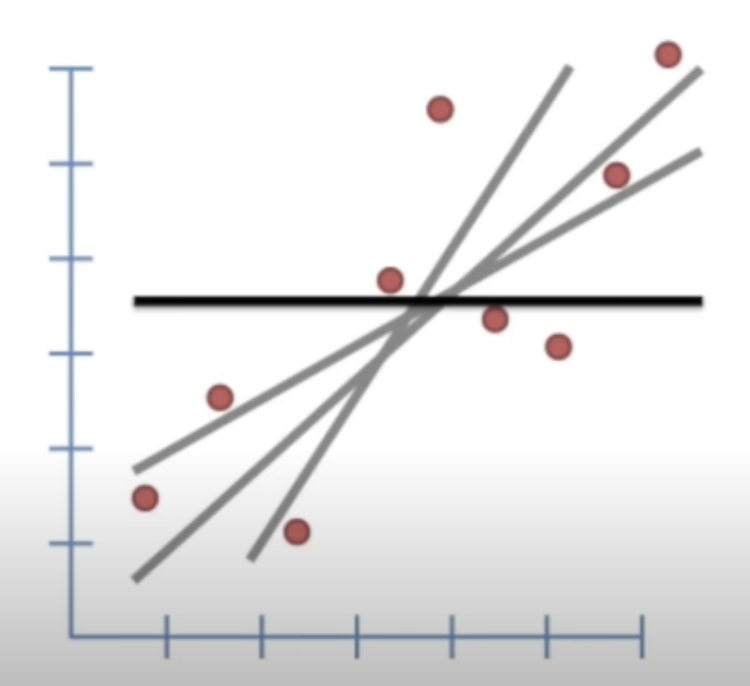
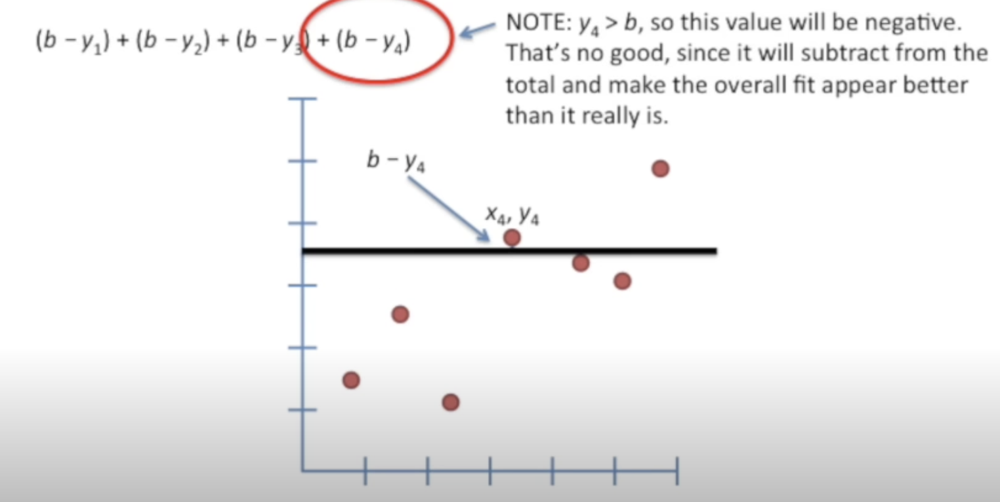
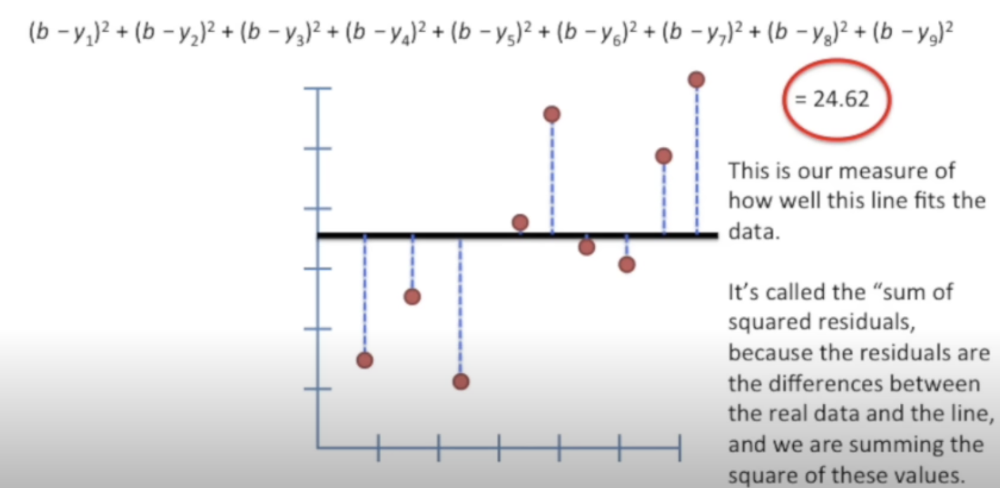
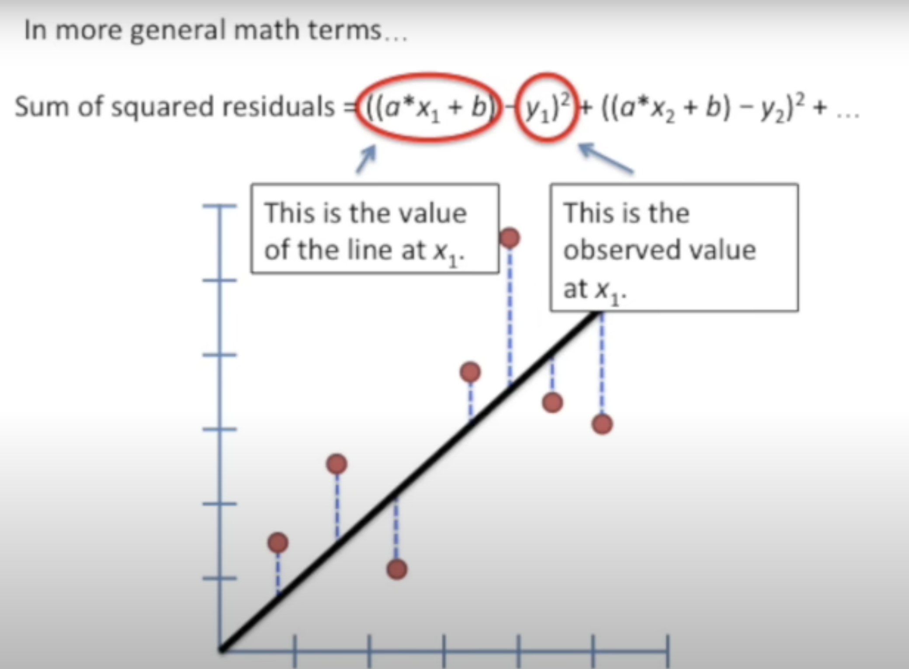
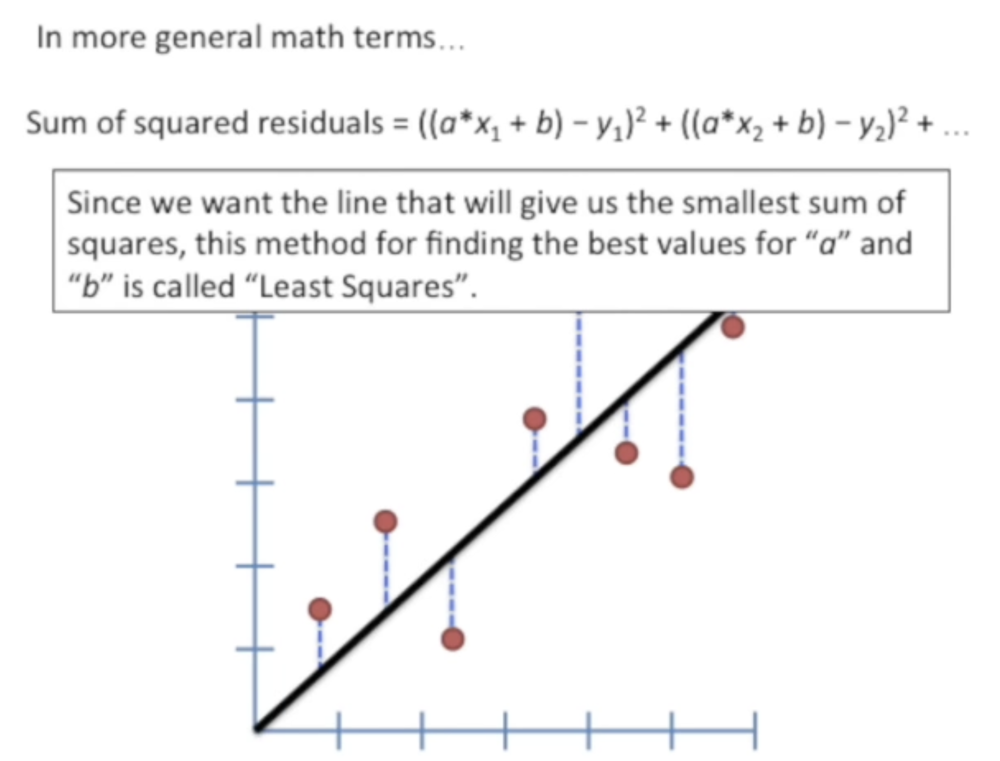
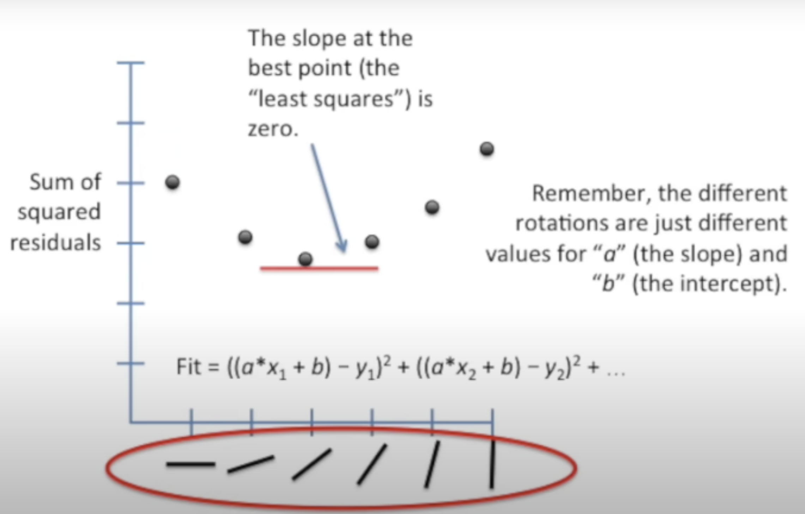
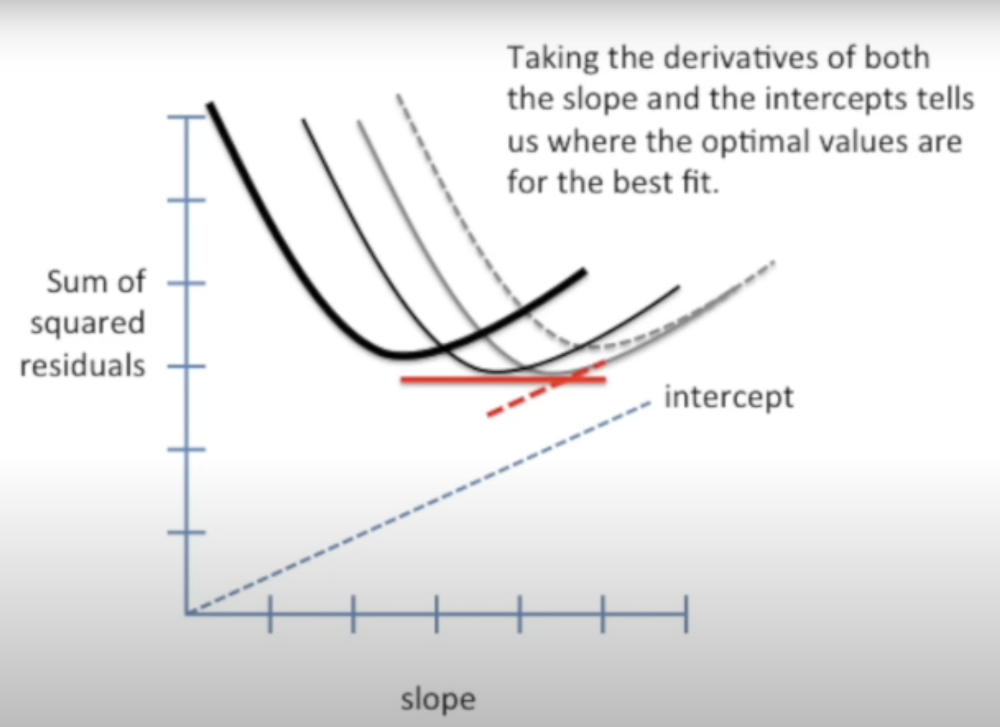
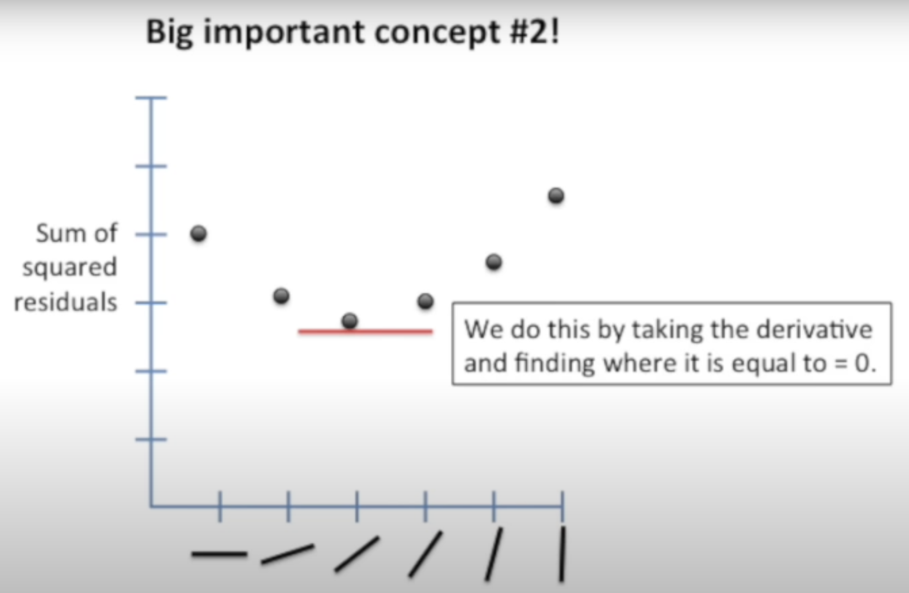
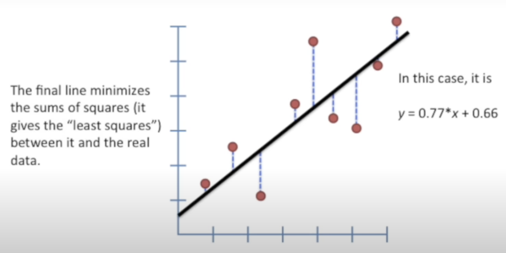

# Fitting a line to data aka least squares aka linear regression

Which line is better for fitting the data?
A horizontal line that cuts through the average y value of our data is probably the worst fit of all, however, it gives us a good starting point for talking about how to find the optimal line to fit our data.

We can measure how well this line fits the data by seeing how close it is to the data points.

However, if we simply make $(b-y_1)+(b-y_2)+(b-y_3)+(b-y_4)+(b-y_5)+…$, $(b-y_4)$ and $(b-y_5)$ the value will be negative, which will subtract form total and make the overall fit appear better than it really is.
Back in the day, when they first working this out, they probably tried taking the absolute value of everything and then discovered that it made the math pretty tricky.

So they ended up squaring each term. Squaring ensures that each term is positive.
Here is the equation that shows the total distance the data points have from the horizontal line. $(b-y_1)^2 + (b-y_2)^2+(b-y_3)^2+(b-y_4)^2+…+ = 24.62$, this is our measure of how well this line fits the data. It’s called the “sum of squared residual”, because the residuals are the differences between the real data and the line, and we are summing the square of these values.

To find that sweet spot, let’s start with the generic line equation, which is $$y = a * x+ b$$ , a is the slope of the line, and b is the y-intercept of the line. We want to find the optimal values for a and b so that we minimize the sum of squared residuals.
In more general math terms, sum of squared residuals = $$((a * x_1+b)-y_1)^2+((a * x_2+b)-y_2)^2+…$$ which is calculating the distance between the line and the observed value.

Since we want the line that will give us the smallest sum of squares, this method for finding the best values for “a” and “b” is called “Least Squares”.

If we plotted the sum of squared residuals vs each rotation, we will get this function. How do we find the optimal rotation for the line?
We take the derivative of this function, the derivative tells us the slope of the function at every point. The slope at the best point(the “least squares”) is zero. Remember, the different rotations are just different values for “a” the slope) and “b”(the intercept.

Taking the derivatives of both the slope and the intercepts tells us where the optimal values are for the best fit.

No one ever solves this problem by hand, this is done on a computer. This is done on a computer, so for most people, it is not essential to know how to take these derivatives.

Big important concept:
We want to minimize the square of the distance between the observed values and the line.

We do this by taking the derivative and finding where it is equal to 0. The final line minimizes the sums of squares(it gives the “least squares”) between it and the real data. In this case, the line is defined by the following equation y = 0.77*x + 0.66.

## Reference:
- [YouTube Video](https://www.youtube.com/watch?v=PaFPbb66DxQ)
