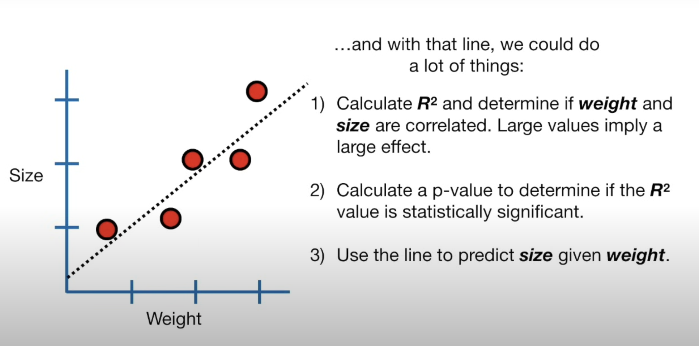
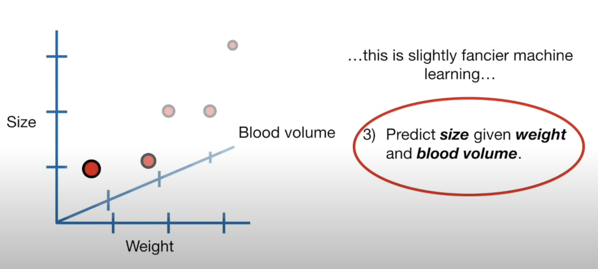
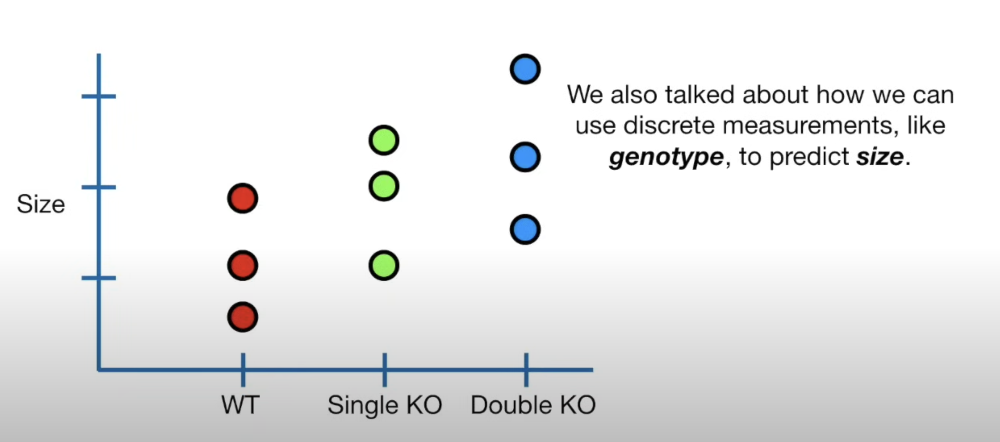
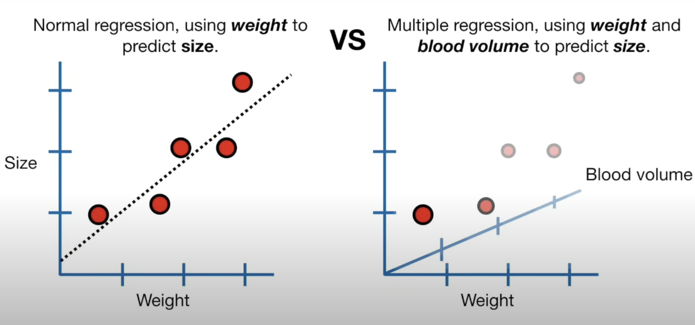

 # Version 1: Linear Regression

Machine learning has a myriad of applications, and one of its primary tasks is **prediction**. Linear regression predicts a dependent variable using one or more independent variables. It assumes a linear relationship between them.

> Note: **Linear Regression** is the overall process or method used to understand and quantify the relationship between variables.
> 
> **Linear Regression Model** is the specific mathematical representation of that relationship. 
## Model:
For linear regression with multiple predictors:

$y = \beta_0 + \beta_1x_1 + ... + \beta_nx_n + \epsilon$

Where:
- $y$: Dependent (or response) variable we aim to predict.
- $x_1, ..., x_n$: Independent (or predictor) variables that influence the prediction.
- $\beta_0, ..., \beta_n$: $\beta_0$ is the intercept, while $\beta_1, ..., \beta_n$ are coefficients indicating the impact of their respective independent variables.
- $\epsilon$: Error term that represents the difference between the observed and predicted value.

## Objective:
Minimize the sum of the squared differences(residuals) between the observed and predicted values:

Sum of squared errors (SSE): $\text{Min} \ \sum_i (\beta_0 + \beta_1 x_{i1} + ... + \beta_n x_{in} - y_i)^2$

This SSE serves as the loss function that we aim to minimize in linear regression.

## Simple Linear Regression: An Example

Consider a scenario where:
- $x$ represents an independent variable, such as height.
- $y$ denotes the dependent variable we aim to predict, like weight.
  
Our objective is to find a function $g$ such that $y = g(x)$. Given a training dataset with values for both $x$ and $y$, our task is to determine this function $g$. This process of finding the right function $g$ is termed **regression**. 

> Note: Regression: Now refers broadly to any method of modeling and analyzing several variables, when the focus is on the relationship between a dependent variable and one or more independent variables.
>

For simplicity, we can assume that $g$ is a linear regression model:

$g(x) = \alpha x + \beta$

In this equation:
- $\alpha$ is the slope of this line
- $\beta$ is the intercept.

For an optimal model, our task is to choose values for $\alpha$ and $\beta$ that minimize the squared differences between actual data points and their predicted counterparts. Formally, this minimization problem can be stated as:

$\text{Min} \ \sum_i (\alpha x_i + \beta - y_i)^2$

The necessary condition for a minimum is setting the gradient to zero:

$\left[ \sum_i 2x_i (\alpha x_i + \beta - y_i), \ 2\sum_i (\alpha x_i + \beta - y_i) \right] = 0$

After determining the values of $\alpha$ and $\beta$ from the image, we can insert them into the equation $g(x)$ to obtain the specific linear regression model.

> The goal of linear regression is to find the optimal values of the parameters $\alpha$ and $\beta$ that minimize the SSE. To do this, we need to understand how changes in $\alpha$ and $\beta$ affect the SSE.

> In linear regression, the objective is to find the best-fit parameters (coefficients) $\alpha$ and $\beta$ that minimize the sum of squared errors (SSE). This is why we take the partial derivatives with respect to $\alpha$ and $\beta$.

## Reference:
- [YouTube Video 1](https://www.youtube.com/watch?v=CtsRRUddV2s)
- [YouTube Video 2](https://www.youtube.com/watch?v=3dhcmeOTZ_Q&t=1s)

# Version 2: Fitting a line to data aka least squares aka linear regression
## Introduction 
In linear regression, we aim to find the best-fit line that minimizes the discrepancies between the observed data points and the predicted values. This process is known as the method of least squares. 
## Finding the Optimal Line
To understand which line fits the data best, let's start with a horizontal line that cuts through the average y value of our data. Although this is likely the worst fit, it serves as a good starting point.

We measure how well this line fits the data by seeing how close it is to the data points.

However, if we simply make $(b-y_1)+(b-y_2)+(b-y_3)+(b-y_4)+(b-y_5)+…$, $(b-y_4)$ and $(b-y_5)$ the value will be negative, which will subtract form total and make the overall fit appear better than it really is.

Back in the day, when they first working this out, they probably tried taking the absolute value of everything and then discovered that it made the math pretty tricky.

To address this, we square each term to ensure all values are positive. The resulting equation shows the total distance of the data points from the horizontal line. This is known as the "sum of squared residuals" (SSR), because the residuals are the differences between the real data and the line, and we are summing the square of these values.

$$\text{SSR} = (b - y_1)^2 + (b - y_2)^2 + (b - y_3)^2 + (b - y_4)^2 + \ldots = 24.62$$

## Least Squares Method

To find the optimal line, we use the generic line equation $y = a \cdot x + b$, where $a$ is the slope and $b$ is the y-intercept. We aim to find the values of $a$ and $b$ that minimize the SSR.

$$\text{SSR} = \sum_{i=1}^{n} (y_i - (a \cdot x_i + b))^2$$

which is calculating the distance between the line and the observed value.

Since we want the line that will give us the smallest sum of squares, this method for finding the best values for “a” and “b” is called “Least Squares”.

If we plot the sum of squared residuals against each possible value for the line's parameters, we get a function that shows how the residuals change with different line orientations. To find the optimal orientation for the line, we need to take the derivative of this function. The derivative indicates the slope of the function at each point. The optimal values for the parameters (the "least squares") occur where this slope is zero. Essentially, different orientations of the line correspond to different values for $a$(the slope) and $b$ (the intercept).

Taking the derivatives of both the slope and the intercepts tells us where the optimal values are for the best fit.

These calculations are typically performed using computer algorithms, so it’s not necessary for most people to manually compute these derivatives.

## Key Concept

We want to minimize the square of the distance between the observed values and the line.

We do this by taking the derivative and finding where it is equal to 0. The final line minimizes the sums of squares(it gives the “least squares”) between it and the real data. In this case, the line is defined by the following equation $y = 0.77*x + 0.66$.

## Why Both Derivatives are Set to Zero in Minimizing SSR in Linear Regression

The key to understanding why we set both the derivative with respect to `a` (the slope) and the derivative with respect to `b` (the intercept) to zero in the context of minimizing the Sum of Squared Residuals (SSR) in linear regression lies in the principles of multivariable optimization.

### pratical example

In linear regression, SSR is a function of two variables, `a` and `b`:

$\text{SSR}(a, b) = \sum\limits_{i=1}^{n} (y_i - ax_i - b)^2$

Imagine we have a set of data points and a line $y=ax+b$ fitted to these points. If the derivative of SSR with respect to $a$ is positive, increasing $a$ slightly will increase SSR, but decreasing $a$ slightly will decrease SSR. This decrease indicates we haven't found the minimum SSR yet, as we can still adjust $a$ to further minimize SSR.

Similarly, if the derivative of SSR with respect to $b$ is negative, increasing $b$ slightly will decrease SSR, indicating that we can improve the fit of our line (lower the SSR) by adjusting $b$.

### Conclusion

In summary, a non-zero derivative at a point indicates that moving in the direction opposite to the sign of the derivative will decrease the function value (SSR in this case). In the context of linear regression, we need both derivatives (with respect to $a$ and $b$ to be zero to ensure we've found the minimum SSR, where the line best fits the data. 

> If the derivative is positive, moving in the direction opposite to the sign of the derivative means decreasing the variable.
If the derivative is negative, moving in the direction opposite to the sign of the derivative means increasing the variable.
>

## Small Review for Linear Regression

We had some data on weight and size. By fitting a line to this data, we could achieve several objectives:
1. **Calculate $R^2$**: This helps us determine if weight and size are correlated. Larger $R^2$ values imply a stronger correlation.
2. **Calculate a p-value**: This tells us if the $R^2$ value is statistically significant.
3. **Make predictions**: We can use the fitted line to predict size based on weight.

Using data to make predictions is a fundamental aspect of "machine learning," making linear regression a basic form of machine learning.

We also discussed multiple regression. This involves predicting size using both weight and blood volume, or alternatively, modeling size based on weight and blood volume. Multiple regression extends the capabilities of simple linear regression by:
1. **Calculating $R^2$**: Just like in simple regression, but considering multiple variables.
2. **Calculating the p-value**: To assess the significance of the model.
3. **Making predictions**: Predict size given weight and blood volume.

This makes multiple regression a more advanced machine learning method.

We also explored using discrete measurements, such as genotype, to predict size.

Finally, we compared different models. On the left side, we have simple regression, which uses weight to predict size. We can compare these predictions to those from multiple regression, which uses both weight and blood volume. This comparison helps us determine if we need to measure both weight and blood volume to accurately predict size or if we can rely on weight alone.

## Reference:
- [YouTube Video1](https://www.youtube.com/watch?v=PaFPbb66DxQ)
- [YouTube Video2](https://www.youtube.com/watch?v=yIYKR4sgzI8&list=PLblh5JKOoLUKxzEP5HA2d-Li7IJkHfXSe)

