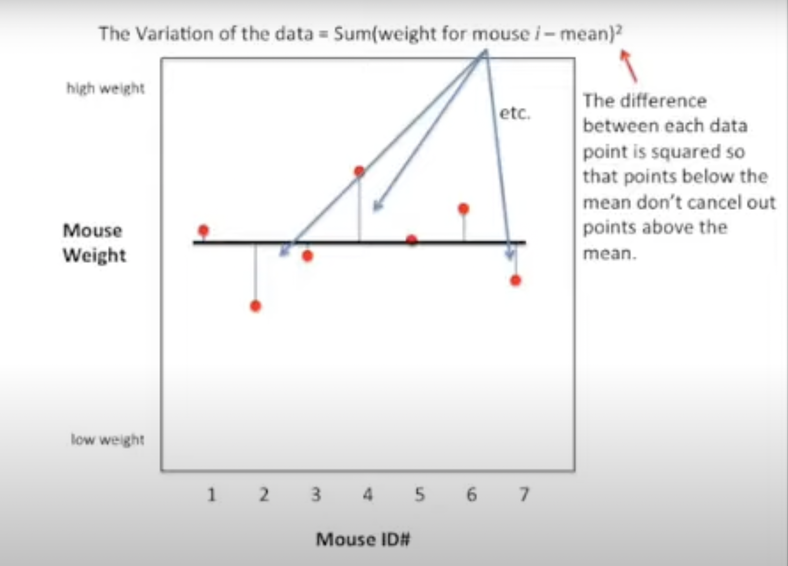
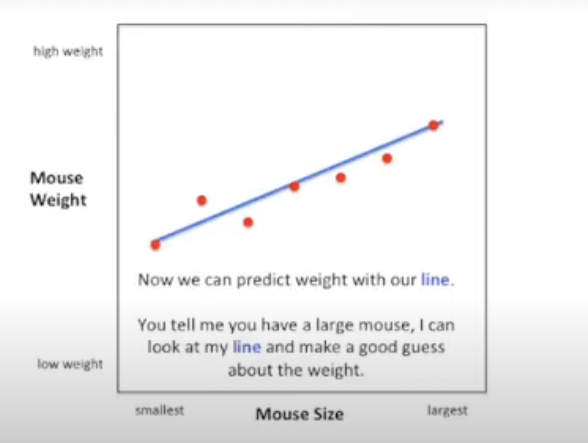
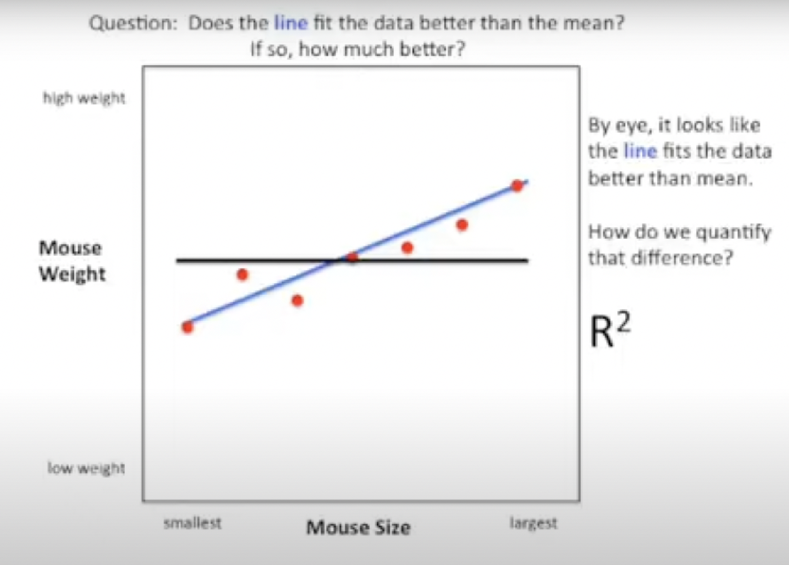
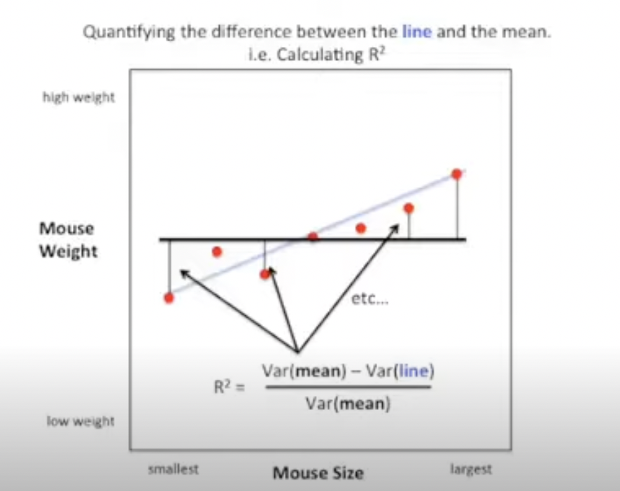
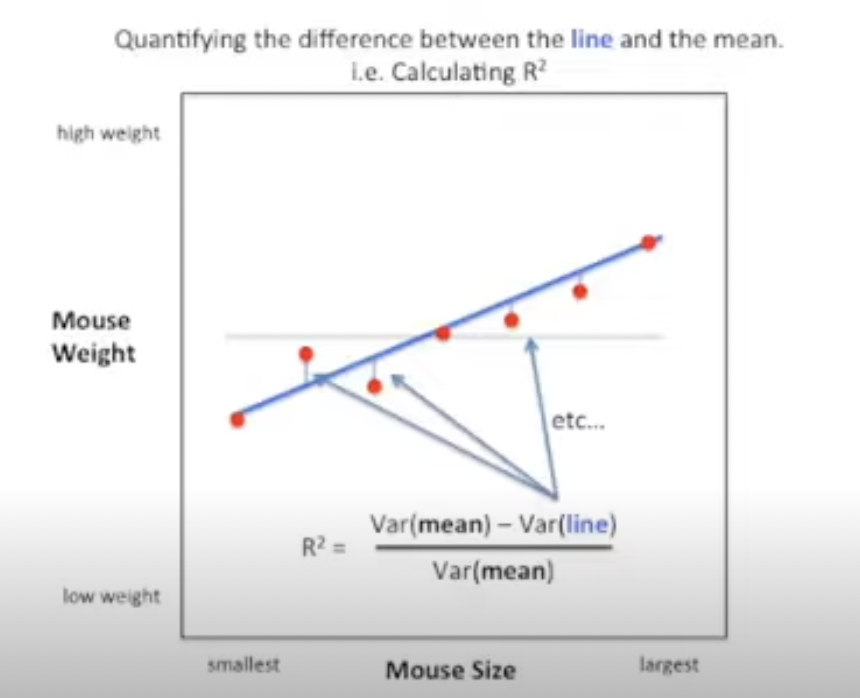

### Understanding R Squared (R²)

#### What is Correlation (R)?
- Correlation measures the strength of a relationship between two quantitative variables (e.g., weight and size).
- Values close to 1 or -1 indicate a strong relationship.
- Values close to 0 suggest a weak or no relationship.
  
#### Why R² Matters?
- R², is a metric of correlation. Like R, measures the strength of a relationship, but it's easier to interpret.
- While R = 0.7 might not seem twice as strong as R = 0.5, R² = 0.7 is what it looks like, 1.4 times as good as R² = 0.5
- R² provides an intuitive and straightforward calculation.

#### Example: Mouse Weight Prediction

1. **Initial Data Plotting**
   - Plot mouse weight (y-axis) against mouse IDs (x-axis).
   - Calculate and plot the mean weight.
   - Calculate variance as the sum of squared differences from the mean.
     $\text{The variation of the data} = \text{Sum(weight for mouse i } - \text{mean})^2$
 The difference between each data point is squared so that points below the mean don’t cancel out points above the mean.

2. **Reordering Data by Size**
   - Reorder mice by size without changing the mean and variance. The distances between the dots and the line have not changed(just their order).

3. **Better Prediction with a Fitted Line**
   - Fit a line to the size-weight data.
   - Use this line for more accurate weight predictions based on size.

 

4. **Quantifying the Improvement with R²**
   - $R² = \frac{(Var(mean) - Var(line))}{Var(mean)}$
   - Ranges from 0 to 1, with higher values indicating better predictions.

 

The equation is $R² = \frac{(Var(mean) - Var(line))}{Var(mean)}$
 
   

R² range from 0 to 1, since the variation around the line will never be greater than the variation around the mean and it will never be less than 0. This division also makes r squared a percentage.

5. **Examples**
   - High R² (e.g., 0.81) implies a strong relationship, like size and weight.
   - Low R² (e.g., 0.06) suggests a weak relationship, like sniffing time and weight.

The result is 0.81 which means there is 81% less variation around the line than the mean or the size/weight relationship accounts for 81% of the total variation. This means that most of the variation in the data is explained by the size/weight relationship.

Another example, in this example we’re comparing two possibly uncorrelated variables on the y-axis we have mouse weight again, but on the x-axis we now have time spend sniffing a rock. Then by doing the math we see that R² = 6%. Thus there is only 6% less variation around the line than the mean or we can say that the sniff/weight relationship accounts for 6% of the total variation. This means that hardly any of the variation in the data is explained by the sniff/weight relationship.

#### Interpreting R²
- Statistically significant R² = 0.9: 90% of the variation is explained by the relationship.
- Statistically significant R² = 0.01: Only 1% of the variation is explained.

Now when someone says, “The statistically significant R² was 0.9” you can think to yourself “Very good! The relationship between the two variables explains 90% of the variation in the data!” And when someone else says “ The statistically significant R² was 0.01…” You can think to yourself… “Dag! Who cares if that relationship is significant, it only accounts for 1% of the variation of the data. Something else must explain the remaining 99%.”

#### Relation to R
- R² is the square of R.
- A high R (e.g., 0.9) squared gives a high R² (e.g., 0.81).
- R² provides a clearer comparison and is easier to interpret (e.g., R² of 0.7² is twice as good as 0.5²).

Now, when someone says, “the statistically significant R(plain old R) was 0.9…” You can think to yourself… 
“0.9 times 0.9 = 0.81. Very good! The relationship between the two variables explains 81% of the variation in the data!"

And when someone else says…
“The statistically significant R was 0.5…”
You can think to yourself…
“0.5 times 0.5 = 0.25. The relationship accounts for 25% of the variation in the data. That’s good if there are a million other things accounting for the remaining 75%, bad if there is only one thing.”

I like R² more than just plain old R because it is easier to interpret. Here’s an example for how much better is R = 0.7 than R = 0.5? 

Well, if we convert those numbers to R^2, we see that:
R² = 0.7^2 = 0.5 50% of the original variation is explained
R² = 0.5^2 = 0.25 25% of the original variation is explained
With R², it is easy to see that the first correlation is twice as good as the second. 
#### Key Points
- R² indicates the percentage of variation explained by the relationship.
- R² does not indicate the direction of the correlation.
- Square the value of R to get R² for easier interpretation.
  
That said R² does not indicate the direction of the correlation because squared numbers are never negative.
If the direction of the correlation isn’t obvious, you can say, “ the two variables were positively(or negatively) correlated with R² = .…

R² main ideas

R² is the percentage of variation explained by the relationship between two variables.
If someone gives you a value for plain old R, square it!

## Reference:
- [YouTube Video](https://www.youtube.com/watch?v=bMccdk8EdGo)
