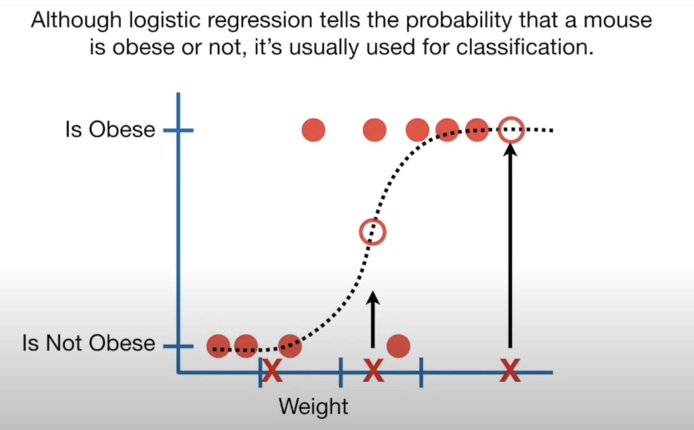
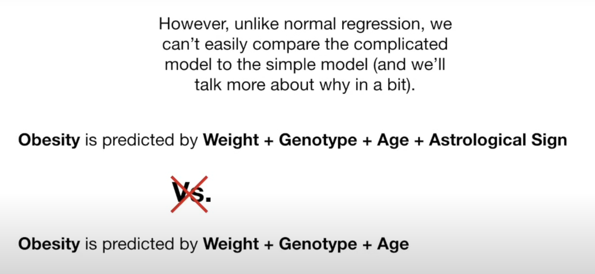
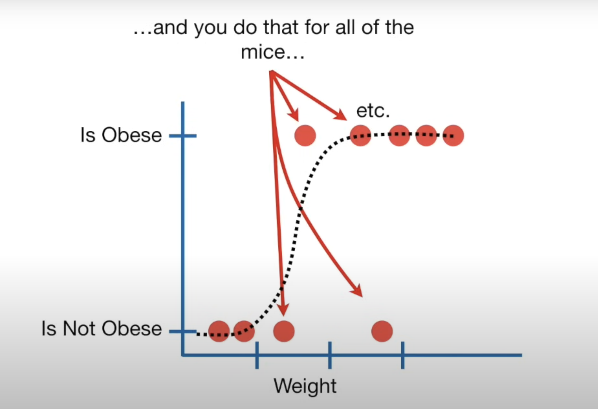
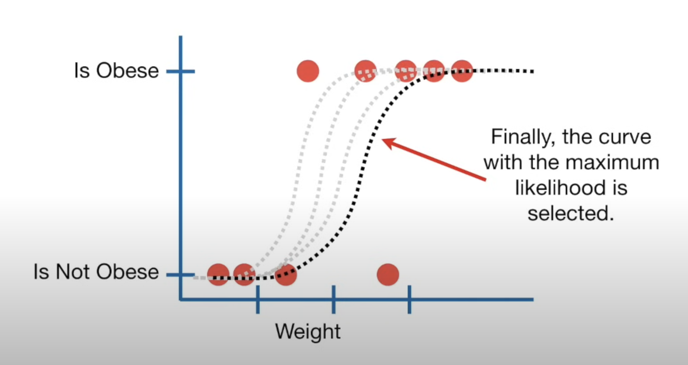

# Logistic Regression Overview

Logistic regression is similar to linear regression but predicts whether something is true or false, instead of predicting a continuous value like size. Instead of fitting a line to the data, logistic regression fits an "S" shaped "logistic function". This curve, which goes from 0 to 1, indicates the probability that an outcome occurs (e.g., a mouse is obese) based on predictor variables (e.g., weight).

### How Logistic Regression Works

- **Heavy Mouse**: High probability of being obese.
- **Intermediate Mouse**: 50% chance of being obese.
- **Light Mouse**: Low probability of being obese.

Although logistic regression tells the probability that a mouse is obese or not, it's usually used for classification. For example, if the probability of a mouse being obese is > 50%, we classify it as obese; otherwise, we classify it as "not obese".

### Predictors in Logistic Regression

Logistic regression can work with both continuous data (e.g., weight, age) and discrete data (e.g., genotype, astrological sign). We can test to see if each variable is useful for predicting obesity. Unlike normal regression, we can’t easily compare complex models to simple models. Instead, we test to see if a variable’s effect on the prediction is significantly different from 0. If not, it means the variable is not helping the prediction. We use Wald's tests to determine this.

For example, if obesity is predicted by weight + genotype + age + astrological sign, and we find that the astrological sign is "totes useless" (statistical jargon for "not helping"), we can exclude it from the model to save time and resources.

Logistic regression’s ability to provide probabilities and classify new samples using continuous and discrete measurements makes it a popular machine learning method.

### Differences Between Linear and Logistic Regression

One major difference between linear regression and logistic regression is how the line is fit to the data:

- **Linear Regression**: Fits the line using "least squares", minimizing the sum of the squares of residuals. This method allows calculation of R² to compare models.
- **Logistic Regression**: Uses "maximum likelihood". It does not have residuals, so it cannot use least squares or calculate R².

In logistic regression, you:

1. Pick a probability, scaled by weight, of observing an obese mouse.
2. Use this to calculate the likelihood of observing a non-obese mouse of that weight.
3. Then you calculate the likelihood of observing this mouse
4. Repeat for all mice and multiply all these likelihoods together. This is the likelihood of the data given this curve.

Then, you:

1. Shift the curve.
2. Calculate the new likelihood of the data.
3. Repeat this process until the curve with the maximum likelihood is found.

### Summary

Logistic regression can be used to classify samples and can use different types of data (e.g., weight, genotype) for classification. It also helps assess which variables are useful for classification (e.g., in predicting obesity using weight, genotype, age, and astrological sign, the astrological sign might be "totes useless").

# Logistic Regression

## Introduction

Logistic regression is a statistical method for analyzing datasets in which there are one or more independent variables that determine an outcome. It estimates the probability that a given input point belongs to a particular class. Unlike linear regression which outputs continuous values, logistic regression outputs probabilities bounded between 0 and 1.

## Key Concepts

### Logistic Function
The core of logistic regression is the logistic function (also known as the sigmoid function), which maps any real-valued number into the range [0, 1]:

$$\sigma(z) = \frac{1}{1 + e^{-z}}$$

Here, $z$ is a linear combination of the input features. For binary classification, the logistic function outputs a probability that the given input point belongs to the positive class.

### Decision Boundary
The decision boundary is the threshold at which we classify the output. For binary classification, a common threshold is 0.5:
- If the output probability $\geq 0.5$, classify as class 1.
- If the output probability $< 0.5$, classify as class 0.

## Model Representation

### Hypothesis
In logistic regression, the hypothesis is defined as:

$$h_\theta(x) = \sigma(\theta^T x)$$

where $\theta$ is the vector of weights, $x$ is the input feature vector, and $\sigma$ is the sigmoid function.

### Cost Function
The cost function for logistic regression is the log-loss (also known as binary cross-entropy):

$$J(\theta) = -\frac{1}{m} \sum_{i=1}^{m} \left[ y^{(i)} \log(h_\theta(x^{(i)})) + (1 - y^{(i)}) \log(1 - h_\theta(x^{(i)})) \right]$$

where $m$ is the number of training examples, $y$ is the actual label, and $h_\theta(x)$ is the predicted probability.

### Optimization
The goal is to find the parameters $\theta$ that minimize the cost function $J(\theta)$. This is typically done using optimization algorithms such as gradient descent.

## Sparse Features

In many real-world applications, the feature space is sparse, meaning that most feature values are zero. Logistic regression is particularly effective in these scenarios because:
- It can efficiently handle high-dimensional data.
- The model complexity is linear in the number of features, making it computationally feasible.

## Distributed Training

### Why Distributed Training?
With large volumes of data, training a model on a single machine can be slow and impractical. Distributed training allows for parallel processing, making it possible to handle large datasets efficiently.

### Apache Spark
Apache Spark is a powerful tool for distributed data processing. It can be used to train logistic regression models in parallel across a cluster of machines.

### Alternating Direction Method of Multipliers (ADMM)
ADMM is an optimization technique that decomposes the problem into smaller subproblems that can be solved in parallel. This is particularly useful for distributed environments where coordination between machines is necessary.

## Practical Considerations

### Handling Imbalanced Data
In binary classification problems, the classes are often imbalanced. For instance, in click-through rate (CTR) prediction, the number of clicks (positive class) is usually much smaller than the number of non-clicks (negative class). To address this imbalance:
- **Resampling**: Over-sample the minority class or under-sample the majority class in the training data.
- **Class Weights**: Assign higher weights to the minority class during training.

### Validation and Testing
It is crucial to keep the validation and test sets intact (i.e., not resampled) to ensure that performance metrics accurately reflect the model's effectiveness in real-world scenarios.

## Conclusion

Logistic regression is a robust and efficient method for binary classification, particularly effective with sparse features and large datasets. With the ability to leverage distributed training frameworks like Apache Spark and optimization techniques like ADMM, logistic regression can scale to handle the demands of modern data science applications.

# Logistic Regression and Log-Odds

## Probability and Odds

- **Probability (P)**: The likelihood that an event occurs.
- **Odds**: The ratio of the probability that the event occurs to the probability that it does not occur.

  $$\text{Odds} = \frac{P}{1 - P}$$
  

## Log-Odds (Logit)

- The log-odds is the natural logarithm of the odds.
  
  $$\text{Log-Odds} = \log \left( \frac{P}{1 - P} \right)$$

## Logistic Regression Model

- In logistic regression, the log-odds of the probability of the event occurring (e.g., the probability of a click) is modeled as a linear combination of the input features.
- The model equation is:
  
  $$\log \left( \frac{P}{1 - P} \right) = \theta_0 + \theta_1 x_1 + \theta_2 x_2 + \ldots + \theta_n x_n$$
  
- Here, $$\theta_0 + \theta_1 x_1 + \theta_2 x_2 + \ldots + \theta_n x_n$$ is the linear combination of features, often denoted as $z$.

## Connecting \( z \) to Log-Odds

- The term $$z = \theta_0 + \theta_1 x_1 + \theta_2 x_2 + \ldots + \theta_n x_n$$ represents the log-odds in the logistic regression model. Although $z$ itself does not contain a logarithm, it is the argument of the logistic function, which maps it to a probability.

# The Gradient of the Cost Function in Logistic Regression

The gradient of the cost function \( J(\theta) \) with respect to the parameters $\theta$ in logistic regression is given by:

$$\frac{\partial J(\theta)}{\partial \theta} = x^{(i)} (h_\theta(x^{(i)}) - y^{(i)})$$

This formula arises from the process of deriving the gradient for the logistic regression cost function, which is based on the log-likelihood function for a binary classification problem.

## Derivation

Let's derive this step-by-step.

### 1. Hypothesis Function

In logistic regression, the hypothesis function $h_\theta(x)$ is given by the sigmoid function applied to the linear combination of the input features:

$$ h_\theta(x) = \sigma(\theta^T x) = \frac{1}{1 + e^{-\theta^T x}}$$

### 2. Cost Function

The cost function for logistic regression is the negative log-likelihood for the training data, which can be written as:

$$J(\theta) = -\frac{1}{m} \sum_{i=1}^{m} \left[ y^{(i)} \log(h_\theta(x^{(i)})) + (1 - y^{(i)}) \log(1 - h_\theta(x^{(i)})) \right]$$

### 3. Simplifying the Cost Function

For simplicity, we focus on the cost function for a single training example $(x^{(i)}, y^{(i)})$:

$$J(\theta) = -\left[ y^{(i)} \log(h_\theta(x^{(i)})) + (1 - y^{(i)}) \log(1 - h_\theta(x^{(i)})) \right]$$

### 4. Partial Derivative with Respect to \(\theta_j\)

To find the gradient, we need to compute the partial derivative of $J(\theta)$ with respect to each parameter $\theta_j$. Let's denote $z = \theta^T x^{(i)} \), so \( h_\theta(x^{(i)}) = \sigma(z)$.

The partial derivative of $J(\theta)$ with respect to $\theta_j$ is:

$$\frac{\partial J(\theta)}{\partial \theta_j} = -\left[ \frac{\partial}{\partial \theta_j} y^{(i)} \log(h_\theta(x^{(i)})) + \frac{\partial}{\partial \theta_j} (1 - y^{(i)}) \log(1 - h_\theta(x^{(i)})) \right]$$

Using the chain rule, we have:

$$\frac{\partial}{\partial \theta_j} h_\theta(x^{(i)}) = \frac{\partial}{\partial \theta_j} \sigma(z) = \sigma(z) (1 - \sigma(z)) \frac{\partial z}{\partial \theta_j} = h_\theta(x^{(i)}) (1 - h_\theta(x^{(i)})) x_j^{(i)}$$

### 5. Derivative of Each Term

Now, compute the partial derivatives of each term in the cost function:

$$\frac{\partial}{\partial \theta_j} y^{(i)} \log(h_\theta(x^{(i)})) = y^{(i)} \frac{1}{h_\theta(x^{(i)})} \frac{\partial h_\theta(x^{(i)})}{\partial \theta_j} = y^{(i)} \frac{1}{h_\theta(x^{(i)})} h_\theta(x^{(i)}) (1 - h_\theta(x^{(i)})) x_j^{(i)} = y^{(i)} (1 - h_\theta(x^{(i)})) x_j^{(i)}$$

$$\frac{\partial}{\partial \theta_j} (1 - y^{(i)}) \log(1 - h_\theta(x^{(i)})) = (1 - y^{(i)}) \frac{1}{1 - h_\theta(x^{(i)})} \frac{\partial (1 - h_\theta(x^{(i)})}{\partial \theta_j} = (1 - y^{(i)}) \frac{1}{1 - h_\theta(x^{(i)})} (-h_\theta(x^{(i)})) x_j^{(i)} = - (1 - y^{(i)}) h_\theta(x^{(i)}) x_j^{(i)}$$

### 6. Combine the Terms

Combining these results:

$$\frac{\partial J(\theta)}{\partial \theta_j} = - \left[ y^{(i)} (1 - h_\theta(x^{(i)})) x_j^{(i)} + (1 - y^{(i)}) (- h_\theta(x^{(i)})) x_j^{(i)} \right]$$

$$\frac{\partial J(\theta)}{\partial \theta_j} = - \left[ y^{(i)} x_j^{(i)} - y^{(i)} h_\theta(x^{(i)})) x_j^{(i)} - (1 - y^{(i)}) h_\theta(x^{(i)})) x_j^{(i)} \right]$$

$$\frac{\partial J(\theta)}{\partial \theta_j} = - \left[ y^{(i)} x_j^{(i)} - y^{(i)} h_\theta(x^{(i)})) x_j^{(i)} - h_\theta(x^{(i)})) x_j^{(i)} + y^{(i)} h_\theta(x^{(i)})) x_j^{(i)} \right]$$

$$\frac{\partial J(\theta)}{\partial \theta_j} = - \left[ y^{(i)} x_j^{(i)} - h_\theta(x^{(i)})) x_j^{(i)} \right]$$

$$\frac{\partial J(\theta)}{\partial \theta_j} = x_j^{(i)} (h_\theta(x^{(i)})) - y^{(i)})$$

### Vector Form

To express this in vector form for all parameters:

$$\nabla_\theta J(\theta) = x^{(i)} (h_\theta(x^{(i)}) - y^{(i)})$$

Where:
- $x^{(i)}$ is the feature vector for the i-th example.
- $h_\theta(x^{(i)})$ is the predicted probability for the i-th example.
- $y^{(i)}$ is the actual label for the i-th example.

### Summary

The gradient of the cost function in logistic regression is:

$$\frac{\partial J(\theta)}{\partial \theta} = x^{(i)} (h_\theta(x^{(i)}) - y^{(i)})$$

This gradient tells us how to adjust the model parameters $\theta$ to minimize the cost function, and it is the key component used in gradient descent optimization to train the logistic regression model.

