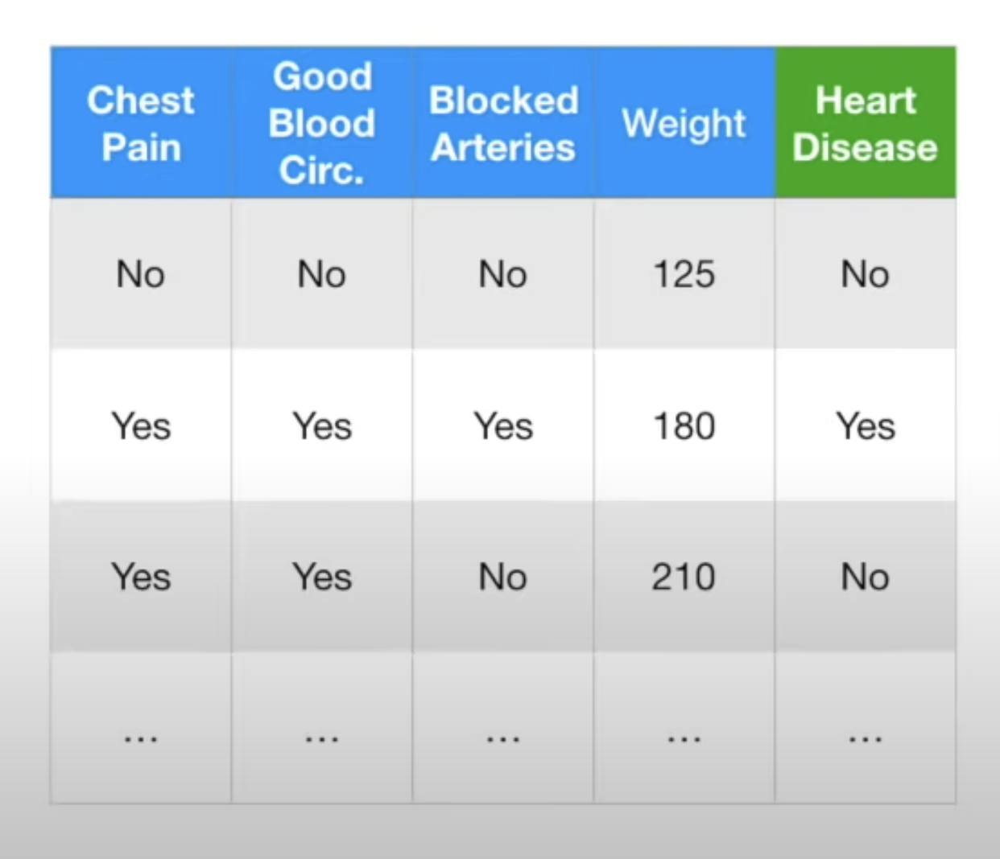
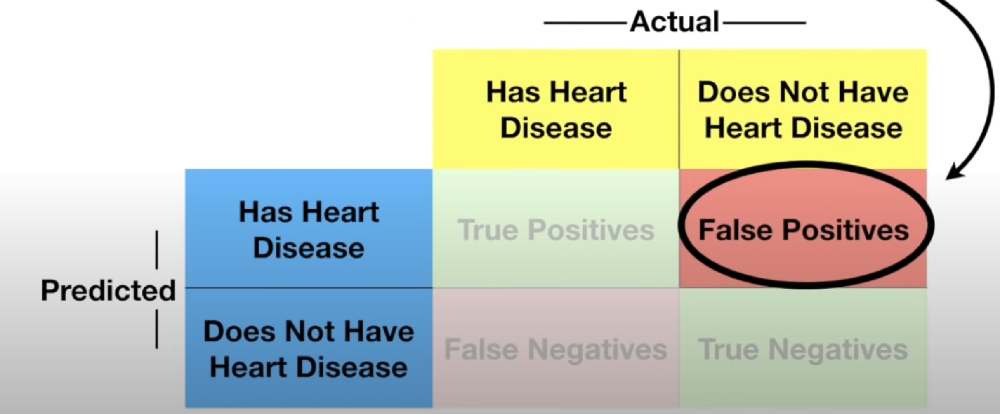
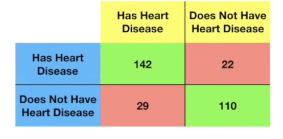
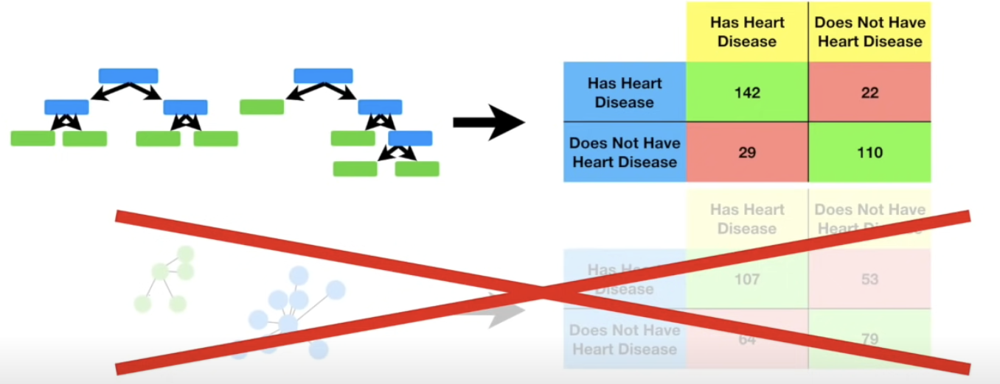
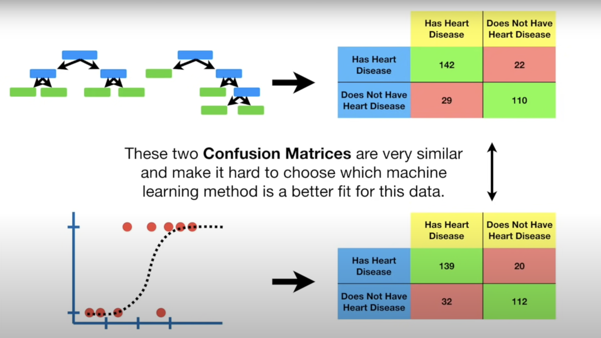
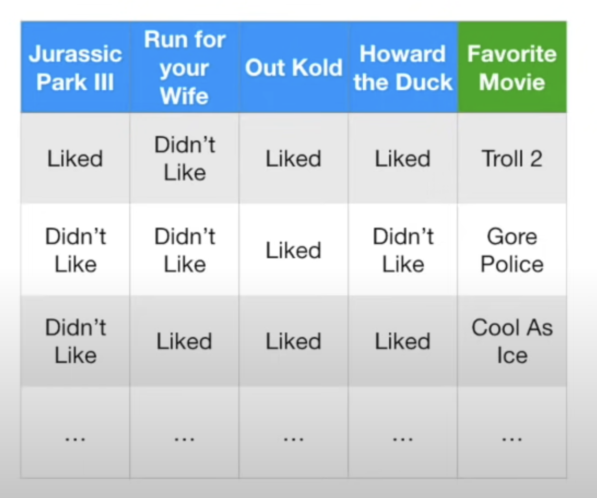
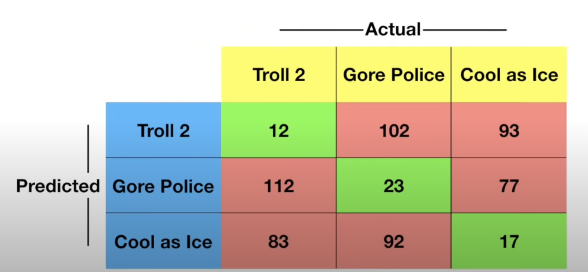
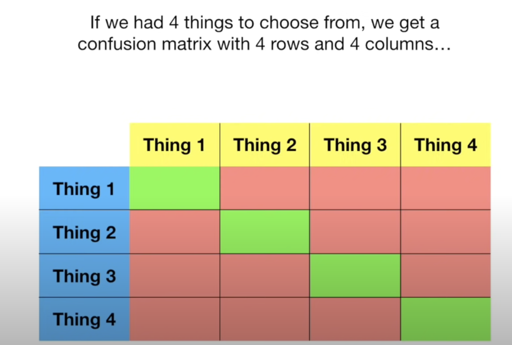
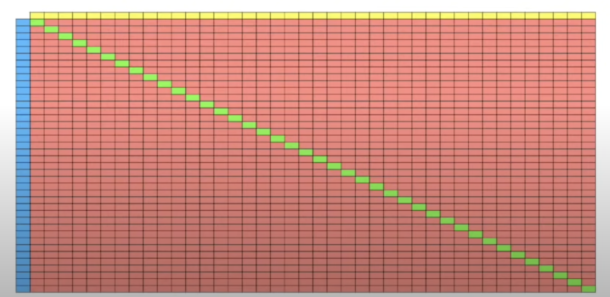
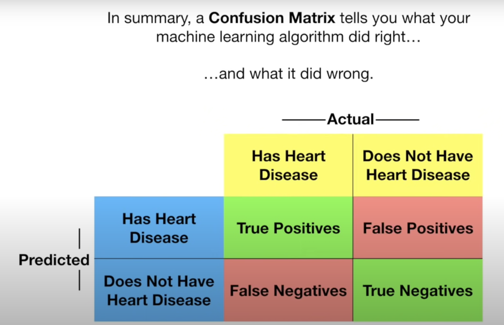

# Confusion Matrix

Imagine we have medical data with clinical measurements such as chest pain, good blood circulation, blocked arteries, and weight. We want to apply a machine learning method to predict whether someone will develop heart disease.

We could use logistic regression, k-nearest neighbours, a random forest, or other methods. To decide which works best, we start by dividing the data into training and testing sets. Note, this would be an excellent opportunity to use cross-validation. We train all methods on the training data and test each on the testing set, summarizing their performance with a confusion matrix.

The rows in a confusion matrix correspond to the machine learning algorithm's predictions, while the columns correspond to the known truth.   Since there are two categories, then for binary classification ("has heart disease" or "does not have heart disease"), the confusion matrix looks like this: The top left corner contains true positives (TP), correctly identified patients with heart disease. The true negatives (TN) are in the bottom right-hand corner; these are correctly identified patients without heart disease. The bottom left-hand corner contains false negatives (FN), patients with heart disease incorrectly identified as not having it. The top right-hand corner contains false positives (FP), patients without heart disease incorrectly identified as having it.

- **True Positives (TP)**: Correctly identified patients with heart disease.
- **True Negatives (TN)**: Correctly identified patients without heart disease.
- **False Negatives (FN)**: Patients with heart disease misclassified as healthy.
- **False Positives (FP)**: Healthy patients misclassified as having heart disease.

For example, when applying the random forest to the testing data, we had:
 - **True Positives (TP)**: 142 
 - **True Negatives (TN)**: 110 
 - **False Negatives (FN)**: 29 
 - **False Positives (FP)**: 22

The diagonal numbers (green boxes) are correctly classified samples, while non-diagonal numbers (red boxes) are misclassified samples.

Comparing the random forest’s confusion matrix to the k-nearest neighbours confusion matrix: 
- **Random Forest**: TP=142, TN=110 
- **K-Nearest Neighbours**: TP=107, TN=79

Since 107 < 142 and 79 < 110, the random forest performs better, so we would choose it over k-nearest neighbours.

When applying logistic regression, the confusion matrices of random forest and logistic regression are very similar, making it hard to choose. We'll discuss sophisticated metrics like sensitivity, specificity, ROC, and AUC in the future to help make a decision.

## Multi-Class Confusion Matrix

Now, let’s look at a more complex confusion matrix.

Here's a new dataset. Based on people's opinions on movies "Jurassic Park III," "Runoff Your Wife," "Out Kold," and "Howard the Duck," can we use a machine learning method to predict their favourite movie?

If the options for favourite movies were "Troll 2," "Gore Police," or "Cool as Ice," the confusion matrix would have 3 rows and 3 columns. The diagonal (green boxes) are where the machine learning algorithm did the right thing, and everything else is where the algorithm messed up.

The size of the confusion matrix depends on the number of prediction categories. 
- **2 categories**: 2x2 confusion matrix. 
- **3 categories**: 3x3 confusion matrix. 
- **4 categories**: 4x4 confusion matrix. 
- **40 categories**: 40x40 confusion matrix.

In summary, a confusion matrix shows what your machine learning algorithm did right and wrong.

## Reference:
- [Watch the video on YouTube](https://www.youtube.com/watch?v=Kdsp6soqA7o)
