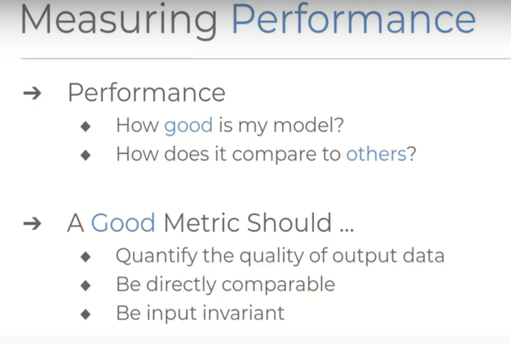
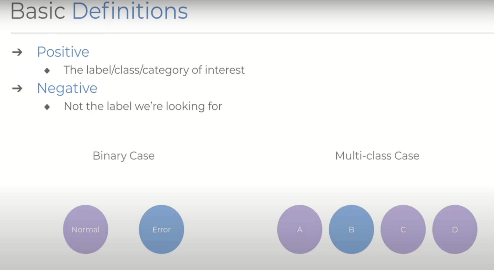
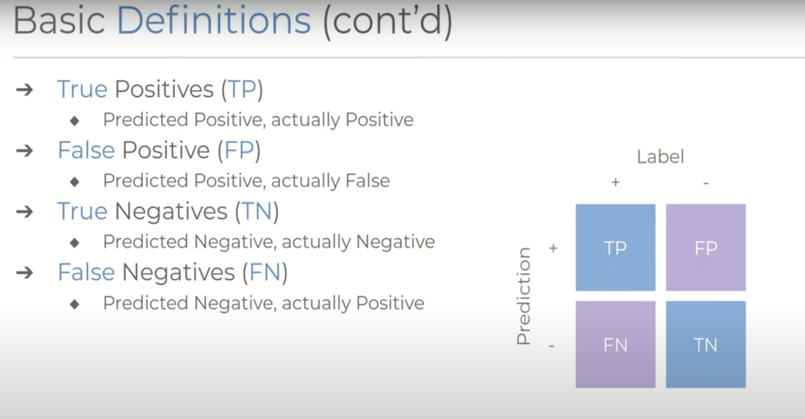
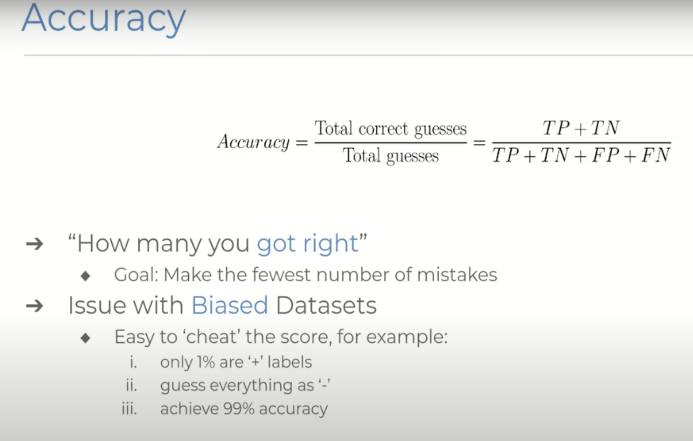
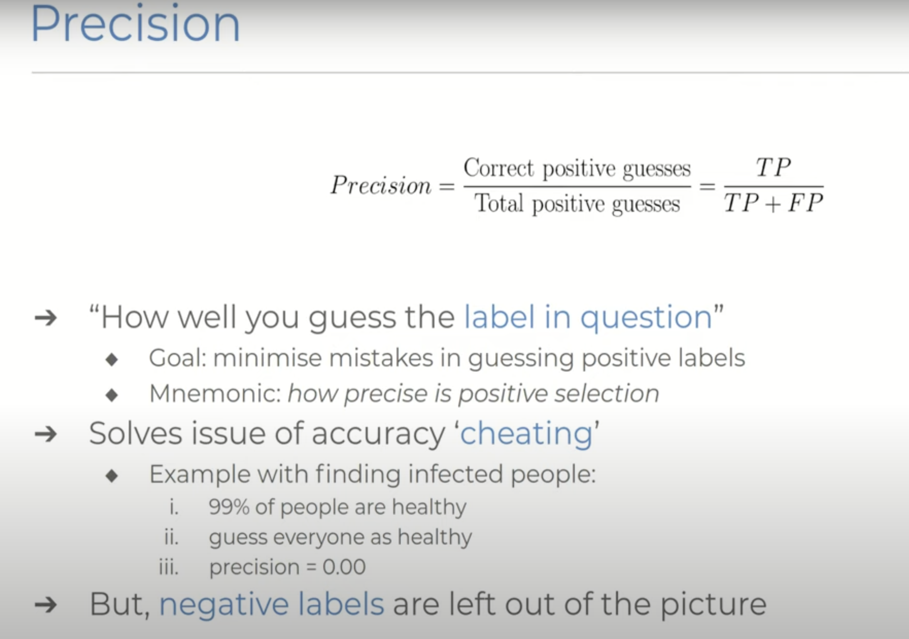
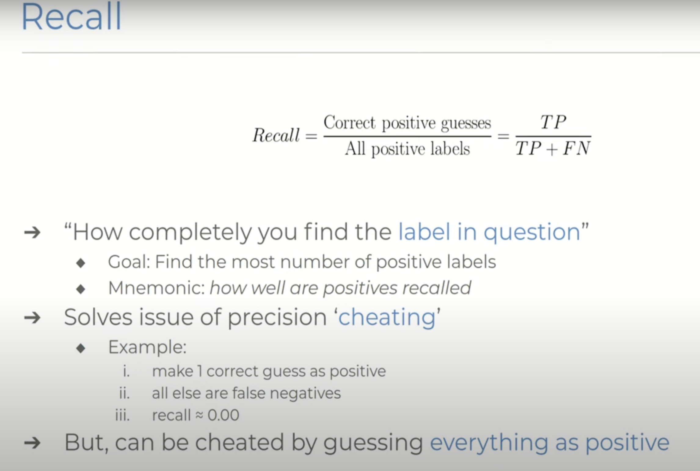
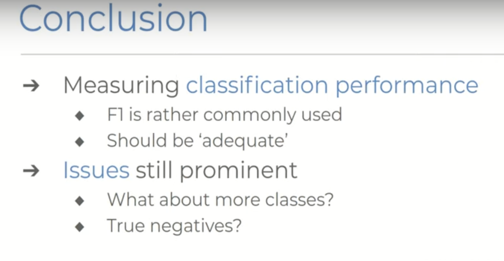

# Version1 Classification Metrics of Predictive Systems

## Introduction

Let's talk about classification metrics of the predictive system and the intuitive explanations for precision, recall, and the F1 score. Whenever we design predictive systems, maybe a statistical model or a complicated neural network, we want to see how well it performs. We want to see exactly how good the outputs are and, not only that, we want to be able to compare them with other contemporaries or state-of-the-art systems to make a case for why ours is better.

Formulating such a comparison is not straightforward. We have to ask the question of quality from multiple angles, which requires a good metric to quantify the quality of the outputs, make them directly comparable to other methods, and ensure input invariance. For input invariance, it means a dataset or model working on a specific type of data shouldn’t have a biased advantage over any other sort of problem.

> Input invariance means that the metric should fairly evaluate performance regardless of the type of data or problem the model is addressing.

## Basic Definitions

Before we can get started with the metrics, we have to go over some very basic definitions of the categories that we can group the output into. 

Say we have a system that makes a prediction about the class of an object, we say that a **positive case** is when the label or category is the one we’re interested in. 

- **Example 1**: Detecting errors in a dataset. If we’re interested in measuring the performance of identifying the error case, we would class that as the positive case and normal operation as negative.
- **Example 2**: Classifying items into four different categories of a, b, c, and d. If we want to measure the performance with regards to the class of say b, then in this case b is the positive one, and anything else (a, c, and d) are negative cases.

The key point here is that all of our metrics are specific to the class we choose to define as being positive. This distinction becomes important and apparent as we explore the different metrics, especially for multi-class systems.

> The positive case is critical because all the metrics we will discuss are specific to the class we choose to define as positive. This means the performance measures we calculate will depend on what we consider to be the positive case.
> 
> In multi-class systems (where there are more than two categories), defining the positive case becomes even more important and apparent. Each class can be evaluated as the positive case individually, which affects the resulting metrics.
>

## Prediction Categories

Based on these definitions, we can further devise the predictions we make on some data into four useful groups:

- **True Positive (TP)**: When a label is positive and we predict it to be positive.
- **False Positive (FP)**: When a label is negative and we predict it to be positive.
- **True Negative (TN)**: When a label is negative and we predict it to be negative.
- **False Negative (FN)**: When a label is positive and we predict it to be negative.

These values are usually expressed as the actual number of predictions that fall into each category or as a percentage with regards to all of the predictions that were made.

> The counts of true positives, false positives, true negatives, and false negatives can be represented either as raw numbers or as percentages of the total number of predictions made by the system.
>

## Accuracy

We'll begin with the most basic metric and formally define what accuracy is. Almost everyone should have a near-instinctual understanding of what this is. To measure the accuracy of our system, we count the number of right answers and express it as a portion of all the answers we gave. More formally, by our previous definitions, the accuracy of our system is given by the number of true positives and true negatives over the entire prediction set.

$$\text{Accuracy} = \frac{\text{Total Correct Guesses}}{\text{Total Guesses}} = \frac{TP + TN}{TP + TN + FP + FN}$$

Accuracy essentially tells us how many answers we got right out of all the guesses we’ve made, and notably, this is without any regard for whether the guesses were about positive or negative labels. But there’s a glaring issue with this straight-up accuracy in measuring performance, which becomes apparent when dealing with biased datasets.

### Example of Bias

Imagine we have a dataset where almost all of the labels are negative, and only say one percent of them are positive. If the model decides to only output negative predictions and makes zero positive guesses, it will still be counted as having a 99% accuracy score. This isn’t just a toy example. In scenarios like disease testing or predicting system faults, the normal cases will usually vastly outnumber any abnormal examples. Even datasets with milder biases can have their performance metrics skewed in this manner, just a little more subtly.

> ### Skewing in Metrics
> **Skewing**: Skewing refers to a distortion or misrepresentation in the performance metrics of a model. This can happen when the metric does not accurately reflect the true performance of the model, often due to an imbalanced dataset.
> 
> **Subtle Skewing**: In datasets with milder imbalances (where the distribution of positive and negative cases is not extremely skewed but still imbalanced), the distortion in the accuracy metric might not be immediately obvious. This subtle skewing means that the accuracy metric can still give a falsely optimistic view of the model's performance.
> ### Mildly Imbalanced Dataset
> In a mildly imbalanced dataset, the distortion in performance metrics like accuracy is not as immediately obvious as in a highly imbalanced scenario because the accuracy is still relatively high, but the imbalance is not extreme enough to make the distortion glaring.
> #### Why It’s Not As Immediately Obvious
> 1. **Relatively High Accuracy**: In the mildly imbalanced dataset, an 80% accuracy does not immediately signal a problem because it seems reasonably good.
> 2. **Less Extreme Imbalance**: The imbalance is less extreme, so the accuracy metric does not appear as misleadingly high as in the highly imbalanced scenario.
> 3. **Hidden Poor Performance**: The model's failure to identify positive cases is masked by the larger number of correctly identified negative cases, making the distortion in accuracy less noticeable at first glance.

## Precision

This is where a metric like precision comes into play. Precision is a measure of how well you’ve guessed the label that we’re interested in, namely the positive case. We calculate it by dividing the number of correct positive guesses by all the positive guesses we made. Formally, the true positive count over the true positive plus false positive count.

$$\text{Precision} = \frac{\text{Correct Positive Guesses}}{\text{Total Positive Guesses}} = \frac{TP}{TP + FP}$$

The goal of a system that optimizes for this metric is to make as few mistakes as possible when guessing the positive labels. Looking back at the example where a system would just guess negative for everything, we’ll see that the precision score penalizes the model with a score of zero because it has failed to guess any positive labels.

### Limitations of Precision

Precision still doesn’t paint the entire picture because it doesn’t take into account any of the negative labels. A model could achieve a high precision score by making very few positive predictions and being correct in those few cases. For example, if it only makes one positive prediction and that prediction is correct:

$$\text{Precision} = \frac{1}{1} = 1 \text{ or } 100 \ \text{percent}$$

This high precision score is misleading because the model might not be making enough positive predictions to be useful in a real-world scenario.

## Recall

Now we have recall, which is like a counterpart to precision. It’s notably different in that it takes the negative labels into the equation. It asks how many positive labels you found out of the total number of positive labels that exist, almost directly countering the issue seen with precision. The equation for this comes down to the number of correctly predicted positive labels divided by the number of positives you got correct plus the number of positives you got wrong.

$$\text{Recall} = \frac{\text{Correct Positive Guesses}}{\text{All Positive Labels}} = \frac{TP}{TP + FN}$$

The goal of the system becomes to try and find every positive label there is to be found.

### Limitations of Recall

Recall still has a problem, which is skewing the score by being liberal with labeling anything as positive. In the extreme case, simply labeling everything as positive will result in no false negatives and thus a perfect recall score.

$$ \text{Recall} = \frac{\text{TP}}{\text{TP} + \text{FN}} = \frac{10}{10 + 0} = 1 \text{ or } 100 \ \text{percent}$$

> ### Why Recall is a Counterpart to Precision
> **Precision vs. Recall**:
> - **Precision**: Precision measures how many of the predicted positive cases are actually positive. It focuses on the accuracy of the positive predictions.
>  - **Recall**: Recall measures how many of the actual positive cases were correctly identified by the model. It focuses on the completeness of the positive predictions.
>  Because precision and recall focus on different aspects of the model's performance, they are considered counterparts. Improving one can sometimes lead to a decrease in the other, hence they balance each other.

## Balancing Precision and Recall

It should be clear by now that precision and recall alone have some severe shortcomings, but also the fact that one sort of prevents cheating of the other score. Cheating to get a recall of 100% will result in a precision of zero and vice versa. In this way, these two metrics sort of complement each other, leading to the question of whether we can design a system that optimizes for both scores simultaneously. We want to incorporate both the quality and completeness of the predictions into a single score.

> While precision focuses on the correctness of positive predictions, recall focuses on the completeness of positive predictions.

> ### The Trade-off Between Precision and Recall:
> When you adjust the threshold for classifying an instance as positive, you affect both precision and recall, often in opposite ways:
> #### Increasing Precision:
> To increase precision, you might set a higher threshold for the model to classify a positive instance. This means the model becomes more conservative in labeling positives, leading to fewer false positives (FP). However, this conservatism also means it might miss some true positives (TP), which reduces recall.
> *Example:* A model classifying emails as spam might be very conservative, only labeling an email as spam when it is very certain. This reduces the number of non-spam emails incorrectly marked as spam (high precision), but might miss some actual spam emails (lower recall).
> #### Increasing Recall:
> To increase recall, you might set a lower threshold for the model to classify a positive instance. This makes the model more liberal in labeling positives, leading to fewer false negatives (FN). However, this liberality increases the chances of labeling non-positives as positives, which reduces precision.
> *Example:* The same email spam classifier might be more liberal in marking emails as spam, catching more actual spam emails (high recall), but also incorrectly marking more non-spam emails as spam (lower precision).

## F1 Score

This is where the F1 score comes in. The F1 score is defined as the harmonic mean between precision and recall. The score essentially asks how good the quality of the predictions is and how completely we have predicted the labels from the dataset. Importantly, the F1 score doesn’t simply use an arithmetic average to combine the scores. In fact, this would be pretty detrimental to in the so-called cheating cases we discussed earlier. The harmonic mean weights the score towards the lower of the two component scores and this essentially penalizes precision and recall disagreeing with each other too much and correctly reflects when either of them falls too close to the value of zero. 

$$\text{F1} = 2 \cdot \frac{\text{Precision} \cdot \text{Recall}}{\text{Precision} + \text{Recall}} = 2 \cdot \frac{TP}{2 \cdot TP + FP + FN}$$

### Why F1 Score Not Use Arithmetic Average?

Consider the following scenario:

- **Dataset:** 10 positive cases and 90 negative cases
- **Model Predictions:** Predicts everything as positive

The resulting predictions are:
- **True Positives (TP):** 10
- **False Positives (FP):** 90
- **True Negatives (TN):** 0
- **False Negatives (FN):** 0

Calculating precision and recall:
- **Precision:** $\frac{TP}{TP + FP} = \frac{10}{10 + 90} = 0.1$
- **Recall:** $\frac{TP}{TP + FN} = \frac{10}{10 + 0} = 1$

The arithmetic average of precision and recall is:
$$\frac{0.1 + 1}{2} = 0.55$$

This result misleadingly suggests moderate performance. However, the F1 score, which is the harmonic mean of precision and recall, is calculated as:
$$F1 = 2 \times \frac{0.1 \times 1}{0.1 + 1} \approx 0.18$$

This demonstrates that the F1 score provides a more accurate reflection of the model's poor performance by penalizing extreme imbalances between precision and recall.

## Conclusion

The F1 score is one of the most common metrics by which we compare our systems and, in most cases, serves as a good indicator of how healthy your model is performing. However, there are still some cases where it won’t be as adequate, especially when dealing with multi-class systems where the performance with regards to each different class is equally important. Additionally, this metric doesn’t include true negatives in its calculation because precision and recall respectively don’t include them.

> Often, in binary classification problems, one class is of primary interest. This is typically the positive class, such as detecting fraud, identifying disease, or recognizing spam. Example: In disease detection, the primary concern is identifying cases of the disease (positive class). Missing a diseased case (false negative) is usually considered more critical than incorrectly identifying a healthy person as diseased (false positive).

> In multi-class classification, there are more than two classes, and the performance on each class can be equally important. Example: In an image classification task with classes such as cats, dogs, and birds, misclassifying a cat as a dog is just as important as misclassifying a dog as a bird.

## Reference:
- [Watch the video on YouTube](https://www.youtube.com/watch?v=8d3JbbSj-I8)
  
# Version2 Precison, Recall and F1
## Precision

**Definition**:
Precision is a metric used to evaluate the accuracy of a recommendation or classification system. It measures the proportion of relevant items among the items recommended or predicted by the system.

**Formula**:
$$\text{Precision} = \frac{\text{Number of Relevant Items Recommended}}{\text{Total Number of Items Recommended}}$$

**Interpretation**:
- **High Precision**: A high precision value indicates that a large proportion of the recommended items are relevant. This means the system is good at selecting relevant items but might be conservative and not recommend many items to maintain high accuracy.
- **Low Precision**: A low precision value indicates that a significant proportion of the recommended items are not relevant. This means the system might be recommending too many items, including many that are not relevant.

**Example**:
Suppose a video recommendation system recommends 10 videos to a user, and out of those 10 videos, 7 are relevant to the user (i.e., the user finds them interesting or engaging). The precision would be calculated as follows:

$$\text{Precision} = \frac{7}{10} = 0.7$$

In this case, the precision is 0.7 or 70%, meaning 70% of the recommended videos are relevant to the user.

**Usage**:
Precision is particularly useful in scenarios where the cost of presenting irrelevant items is high. In a video recommendation system, high precision ensures that users are presented with videos they are likely to enjoy, which can improve user satisfaction and engagement.

**Relation to Other Metrics**:
- **Recall**: While precision focuses on the relevancy of the recommended items, recall measures the ability of the system to identify all relevant items. A good recommendation system aims to balance both precision and recall.
- **F1 Score**: This is the harmonic mean of precision and recall, providing a single metric that balances both aspects. It is useful when you need to consider both precision and recall simultaneously.

In summary, precision is a critical metric for evaluating the effectiveness of a recommendation system in providing relevant content to users, thereby enhancing the user experience and engagement.

## Recall

**Definition**:
Recall is a metric used to evaluate the completeness of a recommendation or classification system. It measures the proportion of relevant items that have been recommended or predicted out of all relevant items available.

**Formula**:
$$\text{Recall} = \frac{\text{Number of Relevant Items Recommended}}{\text{Total Number of Relevant Items}}$$

**Interpretation**:
- **High Recall**: A high recall value indicates that the system is good at capturing most of the relevant items, even if it includes some irrelevant ones. This means the system is thorough in its recommendations.
- **Low Recall**: A low recall value indicates that the system is missing many relevant items. This means the system might be too conservative and not recommending enough items to the user.

**Example**:
Suppose there are 15 relevant videos available for a user, and the video recommendation system recommends 10 videos, out of which 7 are relevant. The recall would be calculated as follows:

$$\text{Recall} = \frac{7}{15} = 0.47$$

In this case, the recall is 0.47 or 47%, meaning 47% of the relevant videos are recommended to the user.

**Usage**:
Recall is particularly useful in scenarios where it is important to capture as many relevant items as possible. In a video recommendation system, high recall ensures that users are exposed to a broad range of relevant videos, which can improve user satisfaction and discovery.

**Relation to Other Metrics**:
- **Precision**: While recall focuses on capturing all relevant items, precision focuses on the relevancy of the recommended items. A good recommendation system aims to balance both recall and precision.
- **F1 Score**: This is the harmonic mean of recall and precision, providing a single metric that balances both aspects. It is useful when you need to consider both recall and precision simultaneously.

In summary, recall is a critical metric for evaluating the effectiveness of a recommendation system in ensuring that relevant content is not missed, thereby enhancing the user experience and discovery.

## F1 Score

**Definition**:
The F1 Score is a metric used to evaluate the balance between precision and recall in a recommendation or classification system. It is the harmonic mean of precision and recall, providing a single score that considers both metrics.

**Formula**:
$$\text{F1 Score} = 2 \times \frac{\text{Precision} \times \text{Recall}}{\text{Precision} + \text{Recall}}$$

**Interpretation**:
- **High F1 Score**: A high F1 Score indicates a good balance between precision and recall, meaning the system is both accurate and thorough in its recommendations.
- **Low F1 Score**: A low F1 Score indicates an imbalance between precision and recall, meaning the system might be either missing many relevant items (low recall) or including too many irrelevant items (low precision).

**Example**:
Suppose a video recommendation system has a precision of 0.7 and a recall of 0.47. The F1 Score would be calculated as follows:

$$\text{F1 Score} = 2 \times \frac{0.7 \times 0.47}{0.7 + 0.47} \approx 0.56$$

In this case, the F1 Score is approximately 0.56 or 56%, indicating a moderate balance between precision and recall.

**Usage**:
The F1 Score is particularly useful in scenarios where both precision and recall are important and need to be balanced. In a video recommendation system, a high F1 Score ensures that users are presented with relevant content without missing out on too many relevant videos or being overwhelmed by irrelevant ones.

**Relation to Other Metrics**:
- **Precision and Recall**: The F1 Score combines both precision and recall into a single metric, making it easier to assess the overall performance of the recommendation system. It is especially useful when there is a need to balance the trade-offs between precision and recall.

In summary, the F1 Score is a critical metric for evaluating the overall effectiveness of a recommendation system in balancing accuracy and completeness, thereby enhancing the user experience and satisfaction.

### Low F1 Score Explanation

The F1 Score is the harmonic mean of precision and recall. If either precision or recall is low, the F1 Score will be low, indicating an imbalance. A low F1 Score means that the system is not performing well in achieving both high precision and high recall simultaneously.

### Specific Examples

#### Example 1: Low Recall, High Precision

Suppose we have a video recommendation system that is very conservative in its recommendations, aiming to only recommend videos it is almost certain are relevant. This approach might result in the following scenario:

- **Total Relevant Videos Available**: 20
- **Videos Recommended**: 5
  - **Relevant Videos in Recommendations**: 4
  - **Irrelevant Videos in Recommendations**: 1

Calculations:
- **Precision**: 
  $$\text{Precision} = \frac{\text{Relevant Videos in Recommendations}}{\text{Total Videos Recommended}} = \frac{4}{5} = 0.8$$

- **Recall**: 
  $$\text{Recall} = \frac{\text{Relevant Videos in Recommendations}}{\text{Total Relevant Videos Available}} = \frac{4}{20} = 0.2$$

- **F1 Score**:
  
  $$\text{F1 Score} = 2 \times \frac{\text{Precision} \times \text{Recall}}{\text{Precision} + \text{Recall}} = 2 \times \frac{0.8 \times 0.2}{0.8 + 0.2} = 2 \times \frac{0.16}{1} = 0.32$$

In this example, the system has high precision (80%) because most of the recommended videos are relevant. However, it has low recall (20%) because it misses many relevant videos, resulting in a low F1 Score (32%).

#### Example 2: High Recall, Low Precision

Now, let's consider a video recommendation system that is very liberal in its recommendations, aiming to ensure it captures as many relevant videos as possible. This might result in the following scenario:

- **Total Relevant Videos Available**: 20
- **Videos Recommended**: 30
  - **Relevant Videos in Recommendations**: 10
  - **Irrelevant Videos in Recommendations**: 20

Calculations:
- **Precision**:
  $$\text{Precision} = \frac{\text{Relevant Videos in Recommendations}}{\text{Total Videos Recommended}} = \frac{10}{30} = 0.33$$

- **Recall**:
  $$\text{Recall} = \frac{\text{Relevant Videos in Recommendations}}{\text{Total Relevant Videos Available}} = \frac{10}{20} = 0.5$$

- **F1 Score**:
  $$\text{F1 Score} = 2 \times \frac{\text{Precision} \times \text{Recall}}{\text{Precision} + \text{Recall}} = 2 \times \frac{0.33 \times 0.5}{0.33 + 0.5} = 2 \times \frac{0.165}{0.83} \approx 0.4$$

In this example, the system has high recall (50%) because it captures many relevant videos, but low precision (33%) because many of the recommended videos are irrelevant, resulting in a low F1 Score (40%).

### Summary

- **Low Recall, High Precision**: The system is too selective, recommending fewer videos, most of which are relevant but missing many relevant ones. This leads to high precision but low recall.
- **High Recall, Low Precision**: The system is too inclusive, recommending many videos, capturing more relevant ones but also many irrelevant ones. This leads to high recall but low precision.

In both cases, the imbalance between precision and recall results in a low F1 Score, highlighting the need for a better balance to achieve an optimal recommendation system.

