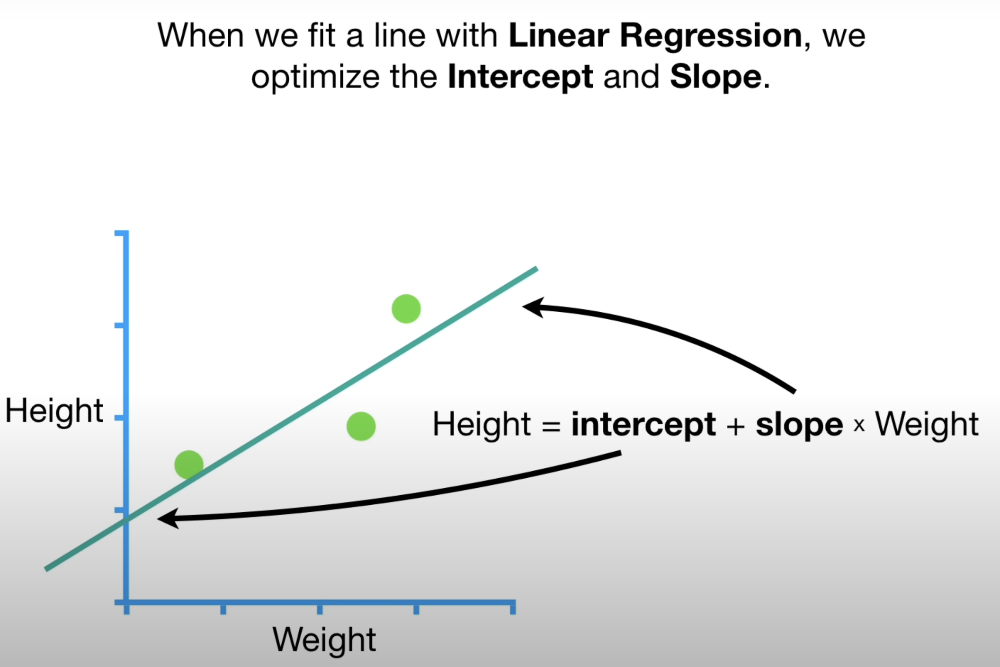
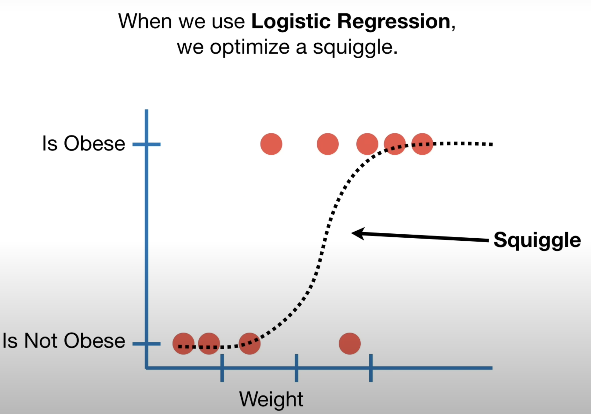
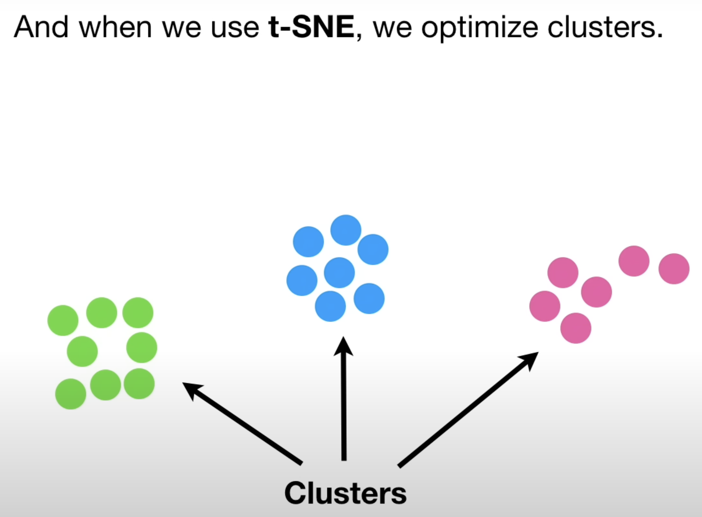
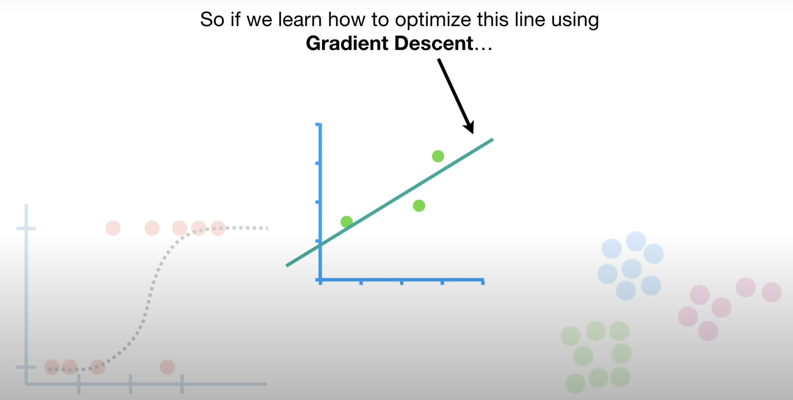

If you are not farmiliar with some calculus concept, please refer to [Calculus](Foundational-Concepts-in-Machine-Learning/Calculus/calculus.md).

Garden descent:

In statistics, machine learning and other data science fields, we optimize a lot of stuff. When we fit a line with linear regression, we optimize the intercept and slope. When we use logistic regression, we optimize a squiggle. And when we use t-SNE, we optimize clusters.

  

The cool thing is that gradient descent can optimize all these things and much more. So if we learn how to optimize this line using gradient descent then we will have learned the strategy that optimizes this squiggle and these clusters and many more of the optimization problems we have in statistics, machine learning and data science.

