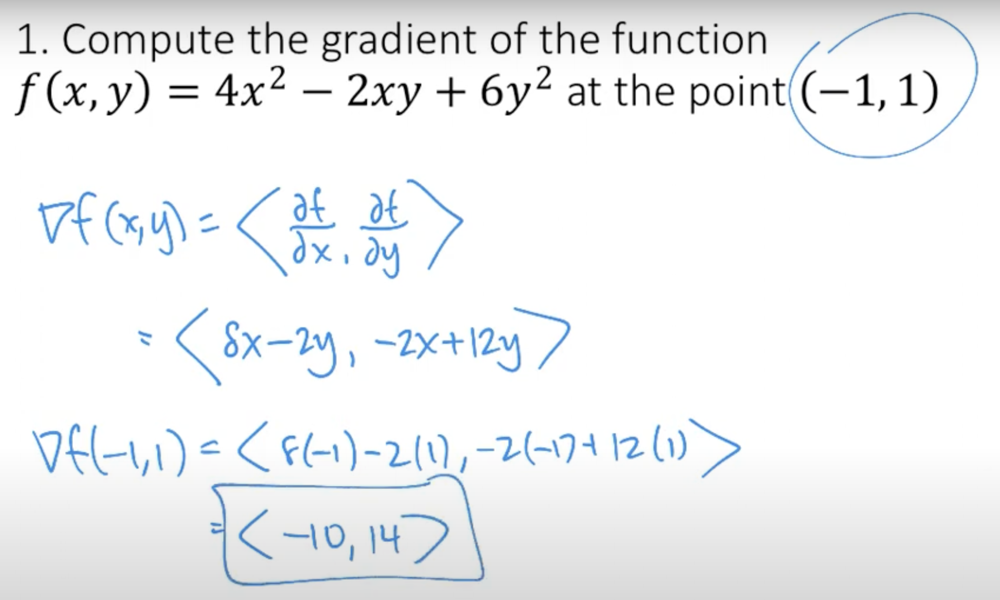
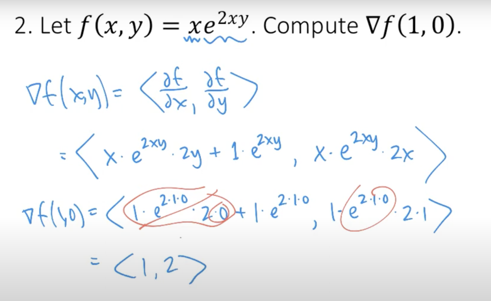

### Derivative
- **Definition**: The derivative is applicable to single-variable functions.
- **Geometric Interpretation**: The derivative at a specific point on a curve represents the slope of the tangent line at that point.
- **Application**: It measures the rate of change of the function with respect to its variable.
- **Example**: For the function $f(x) = x^2$, the derivative with respect to $x$ is $f'(x) = 2x$. 
  - At $x = 1$, the derivative is $2 \times 1 = 2$. This means that at $x = 1$, for a very small increase in $x$, $y$ increases at twice that rate. If $x$ increases by 0.01, $y$ will increase approximately by 0.02 around that point.
  - At $x = 2$, the derivative is $2 \times 2 = 4$. Here, if $x$ increases by a small amount, say 0.01, $y$ will increase approximately by 0.04 around $x = 2$. The rate of change is higher here compared to $x = 1$.
  - At $x = 3$, the derivative is $6$, indicating the slope of the tangent line to the curve at that point.

### Partial Derivative
- **Definition**: Partial derivatives are used for functions of multiple variables.
- **Process**: When calculating a partial derivative, the value of one variable is changed while keeping others constant.
- **Geometric Interpretation**: Similar to the derivative but in the context of multivariable functions.
- **Example**: Consider the function $f(x, y) = x^2 + y^2$. The partial derivative with respect to $x$ is $\frac{\partial f}{\partial x} = 2x$, and the partial derivative with respect to $y$ is $\frac{\partial f}{\partial y} = 2y$. At a point $(x, y) = (1, 2)$, the partial derivative with respect to $x$ is 2 and with respect to $y$ is 4. These values represent the rate of change of $f$ along the $x$ and $y$ directions, respectively, at this point.
  - Rate of Change with Respect to $x$: At $(1, 2)$, this becomes $2 \times 1 = 2$. This means that if you make a very small change in $x$ while keeping $y$ constant, the change in the function $f$ will be approximately 2 times the change in $x$. For example, if $x$ increases by 0.01 (and $y$ remains constant at 2), the function $f$ will increase by approximately $2 \times 0.01 = 0.02$.
  - Rate of Change with Respect to $y$: Similarly, the partial derivative with respect to $y$ is $2 \times 2 = 4$ at $(1, 2)$. This indicates that if you make a very small change in $y$ while keeping $x$ constant, the change in $f$ will be approximately 4 times the change in $y$. For instance, if $y$ increases by 0.01 (and $x$ remains constant at 1), the function $f$ will increase by approximately $4 \times 0.01 = 0.04$.

## Gradient and Directional Derivative

### Gradient Descent
- **Gradient**: It is a vector pointing in the direction of the steepest ascent.
- **Gradient Descent**: Involves taking steps proportional to the negative of the gradient at the current point.
- **Note**: The gradient vector does not indicate the direction of steepest descent, which is opposite to the gradient.

 

In the case of the function $y = x^2$, gradient descent involves updating the x value and then recalculating the y value based on this new x. The y value is not directly manipulated; instead, it is determined by the function itself once you have the new x. 

1. **Start with an Initial x Value**: Begin with an initial guess or starting point for x. This can be any value.

2. **Calculate the Gradient at x**: The gradient (or derivative) of $y = x^2$ with respect to x is $2x$. This gradient tells you the slope of the function at your current x value.

3. **Update x Based on the Gradient**: Use the gradient to update the value of x. The update rule is:
   $x_{\text{new}} = x_{\text{old}} - \alpha \times \text{gradient}$
   Here, $\alpha$ is the learning rate, a small positive number that determines the size of the step you take. If the gradient is positive, x will decrease, and if the gradient is negative, x will increase.

4. **Calculate the New y Value**: After updating x, calculate the new y value using the function $y = x^2$. This new y is the function value corresponding to your updated x.

5. **Repeat the Process**: Repeat this process of calculating the gradient, updating x, and then calculating y, until you reach a point where the changes in x (and consequently in y) are sufficiently small. This indicates that you have reached or are very close to the minimum.

> Note: In the context of a single-variable function like $y = x^2$, the terms "slope," "derivative," and "gradient" essentially refer to the same concept, although they are often used in slightly different contexts." For the function $y = x^2$, when considering the direction of movement along the x-axis, you're right that there are essentially two directions: towards positive x values and towards negative x values. 
>

### Directional Derivative
- **Definition**: The directional derivative of a function at a point in a given direction is the rate at which the function changes at that point as it moves in that direction.
- **Expression**: The directional derivative, represented as $D_{\mathbf{d}} f(\mathbf{x}) = \nabla f(\mathbf{x}) \cdot \mathbf{d}$, approximates the change in function value $\Delta f$ when moving a small distance from $\mathbf{x}$ in the direction of $\mathbf{d}$.

#### Example: Movement in Direction of Vector $[1, 1]$
- Consider the function $f(x, y) = x^2 + y^2$.
- The direction vector $\mathbf{d} = [1, 1]$ suggests movement in a diagonal direction where both $x$ and $y$ increase equally.

#### Moving in the Direction of $[1, 1]$:
- To move a small distance in the direction of $[1, 1]$ from the point $(1, 1)$, add a small multiple of the direction vector to the current point. Let this small multiple be $\epsilon$, a small number like $0.01$.

  - **Calculating the New Point**:
    - New $x$ coordinate: $1 + \epsilon \times 1 = 1 + \epsilon$.
    - New $y$ coordinate: $1 + \epsilon \times 1 = 1 + \epsilon$.
    - The new point is approximately $(1 + \epsilon, 1 + \epsilon)$.

#### Example of the Rate of Increase:
- If $\epsilon = 0.01$, the new point is $(1.01, 1.01)$.
- The function value at the new point is $f(1.01, 1.01) = 1.01^2 + 1.01^2$.
- Change in function value from original point $(1, 1)$ is $f(1.01, 1.01) - f(1, 1)$.

  - **Calculation**:
    - Original function value: $f(1, 1) = 1^2 + 1^2 = 2$.
    - New function value: $f(1.01, 1.01) \approx 2.0402$.
    - Change in function value: $2.0402 - 2 = 0.0402$.

- The directional derivative predicted a rate of increase of 4 per unit distance. Since we moved $0.01$ units (our $\epsilon$), we expect the change to be roughly $4 \times 0.01 = 0.04$, aligning with the actual change of approximately 0.0402.

#### Conclusion:
- The directional derivative value of 4 indicates that for every unit you move in the direction $[1, 1]$ from $(1, 1)$, the function $f(x, y)$ increases at a rate of 4 units per unit distance in that direction. In this example, moving $0.01$ units in that direction resulted in an increase of about $0.04$ units in the function value, consistent with the directional derivative's prediction.
- Note: If $\mathbf{d}$ was not a unit vector, it would need to be normalized before calculating the directional derivative.

 

### Maximum Positive Change
- **Focus**: The gradient vector indicates the direction of maximum positive rate of change, not the absolute change. 
- **Maximization**: When the unit vector $\( u \)$ aligns with the gradient vector $\nabla f$, the dot product $\( \nabla f \cdot \mathbf{u} \)$ is maximized and positive. $\nabla f \cdot \mathbf{u} = |\nabla f| |\mathbf{u}| \cos(0) = |\nabla f| \times 1 \times 1 = |\nabla f|$
- **Convention**: The statement "the gradient vector points to the direction of steepest ascent" is based on this convention.

### Displacement Vector

- **Definition**: A displacement vector is a vector that points from the initial position to the final position. Its length is the shortest distance between the initial and final points.

- **Example**: Consider two points in a 2D plane: Point A at coordinates $(1, 2)$ and Point B at coordinates $(4, 6)$. The displacement vector from Point A to Point B is found by subtracting the coordinates of Point A from the coordinates of Point B.

  - Calculating the displacement vector:
    - The x-component of the displacement vector is $4 - 1 = 3$.
    - The y-component of the displacement vector is $6 - 2 = 4$.
    - Therefore, the displacement vector $\vec{d}$ from A to B is $\vec{d} = [3, 4]$.

  - Interpretation: The vector $\vec{d} = [3, 4]$ represents the direct path from Point A to Point B, regardless of the path actually taken to get from A to B. The magnitude of this vector, which is the straight-line distance between A and B, can be calculated using the Pythagorean theorem: $|\vec{d}| = \sqrt{3^2 + 4^2} = 5$ units.

