If you are not familiar with some calculus concept, please refer to [Calculus](Foundational-Concepts-in-Machine-Learning/Calculus/calculus.md).

# Gradient Descent Explanation

In the realms of statistics, machine learning, and data science, optimization plays a crucial role. Whether it's fitting a line in linear regression, adjusting the curve in logistic regression, or forming clusters in t-SNE, gradient descent emerges as a powerful tool to optimize various models.

## Optimizing Different Models with Gradient Descent

- **Linear Regression**: Optimizes the intercept and slope of a line.
- **Logistic Regression**: Adjusts the curve (or "squiggle") to classify data points.
- **t-SNE**: Optimizes data points into meaningful clusters.

  

The cool thing is that gradient descent can optimize all these things and much more. So if we learn how to optimize this line using gradient descent then we will have learned the strategy that optimizes this squiggle and these clusters and many more of the optimization problems we have in statistics, machine learning and data science.

## Understanding Gradient Descent with a Simple Example

So let’s start with a simple data set, on the x-axis we have weight and on the y-axis we have height. $\text{Predicted height} = \text{intercept} + slope \times \text{weight}$, so let’s learn how gradient descent can fit a line to data by finding the optimal values for the intercept and the slope. Actually, we’ll start by using gradient descent to find the intercept, then once we understand how gradient descent works, we’ll use it to solve for the intercept and the slope.

So for now, let’s just plug in the least squares estimate for the slope, 0.64. And we’ll use gradient descent to find the optimal value for the intercept.

The first thing we do is pick a random value for the intercept. This is just an initial guess that gives gradient descent something to improve upon. In this case, we’ll use 0, but any number will do. And that gives us the equation for this line.

In this example, we will evaluate how well this line fits the data with the sum of the squared residuals. Note: In machine learning lingo, the sum of the squared residuals is a type of loss function.

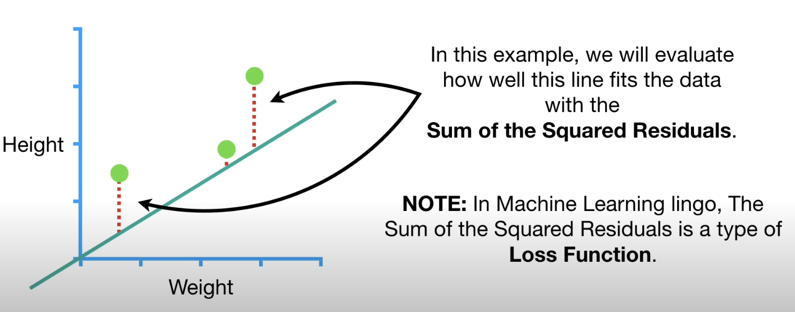

We’ll start by calculating the residual.

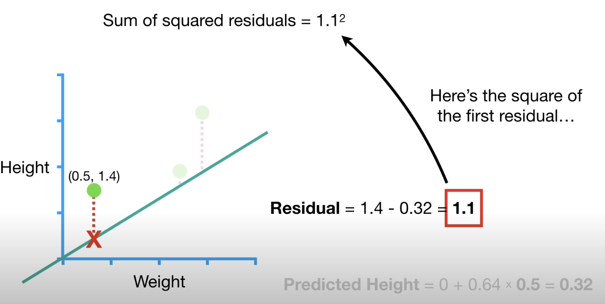

And the SSR is 3.1, now we can draw this in the graph where x-axis represents intercept, y-axis represent sum of squared residuals, the red point in the graph represents the sum of the squared residuals when the intercept = 0.

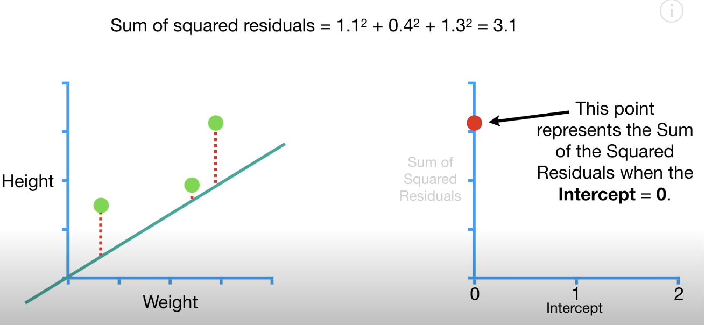

And for increasing values for the intercept, we get these points. 

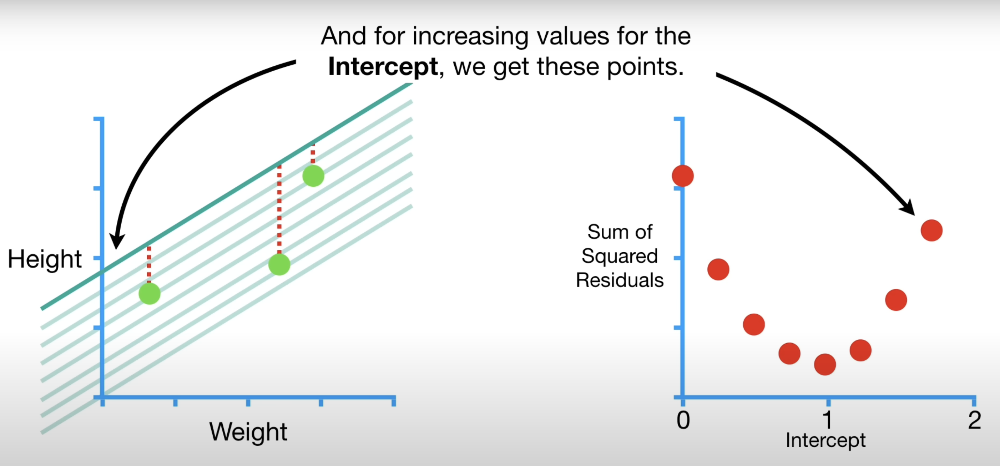

Of the points that we calculated for the graph, this one has the lowest sum of squared residuals, but is it the best we can do? And what if the best value for the intercept is somewhere between these values? 

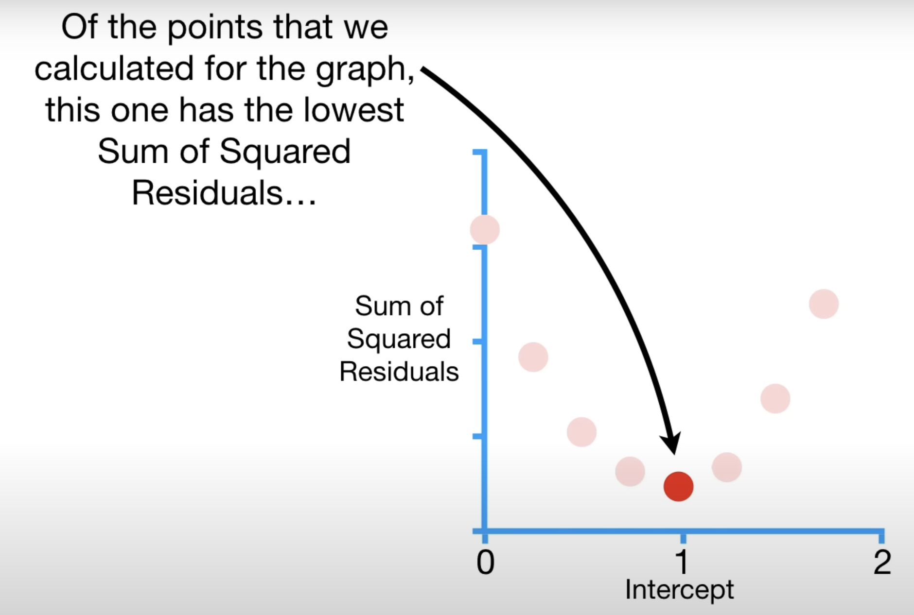 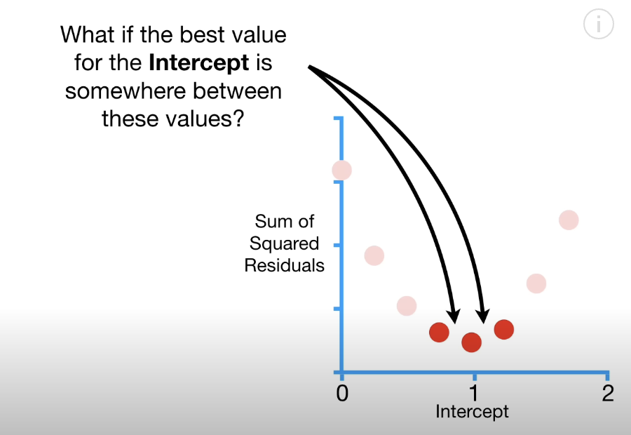

A slow and painful method for finding the minimal sum of the squared residuals is to plug and chug a bunch more values for the intercept. But gradient descent is way more efficient!

Gradient descent only does a few calculations far from the optimal solution and increases the number of calculations closer to the optimal value. In other words, gradient descent identifies the optimal value by taking big steps when it is far away and baby steps when it is close.

So let’s get back to using gradient descent to find the optimal value for the intercept, starting from a random value. In this case, the random value was 0. When we calculated the sum of the squared residuals, the first residual was the difference between the observed height, which was 1.4 and the predicted height, which came from the equation for this line.

$\text{Predicted height} = \text{intercept} + 0.64 \times \text{weight}$
$\text{Sum of squared residuals} = (\text{observed} - \text{predicted})^2 = (1.4 - \text{predicted})^2 = \left(1.4 - (\text{intercept} + 0.64 \times \text{weight})\right)^2$

Since the individual weighs 0.5, we replace weight with 0.5. 

So for this individual, 
= $(1.4-(intercept + 0.64 * 0.5))^2$
And now we can plug in any value for the intercept and get a new predicted height. And we will repeat this operation for other points. The equation becomes 

$Sum of squared residuals = (1.4-(intercept + 0.64 * 0.5))^2 + (1.9-(intercept + 0.64 * 2.3))^2 + (3.2-(intercept + 0.64 * 2.9))^2$
  
Now we can easily plug in any value for the intercept and get the sum of the squared residuals.

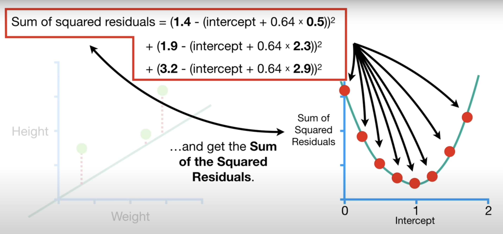

Thus, we now have an equation for this curve, and we can take the derivative of this function and determine the slope at any value for the intercept.

So now let’s take the derivative of the sum of the squared residuals with respect to the intercept. 
The derivative of the sum of the squared residuals with respect to the intercept equals the derivative of the first part plus the derivative of the second part plus the derivative of the third part.

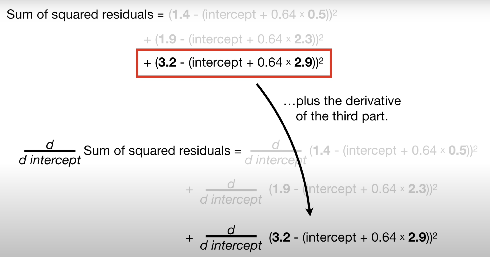

$\frac{d}{d \text{intercept}} \text{Sum of Squared Residuals} = \frac{d}{d \text{intercept}} \left[(1.4 - (\text{intercept} + 0.64 \times 0.5))^2\right] + \frac{d}{d \text{intercept}} \left[(1.9 - (\text{intercept} + 0.64 \times 2.3))^2\right] + \frac{d}{d \text{intercept}} \left[(3.2 - (\text{intercept} + 0.64 \times 2.9))^2\right]$

Let’s start by taking the derivative of the first part, to take the derivative, we need to apply the chain rule:

$\frac{d}{d \text{intercept}} \left(1.4 - (\text{intercept} + 0.64 \times 0.5)\right)^2 = 2 \left(1.4 - (\text{intercept} + 0.64 \times 0.5)\right) \times \left(-1\right) = -2 \left(1.4 - (\text{intercept} + 0.64 \times 0.5)\right)$

So $\frac{D}{d \text{ intercept}} \text{Sum of Squared Residuals} = -2 \left(1.4 - (\text{intercept} + 0.64 \times 0.5)\right) - 2 \left(1.9 - (\text{intercept} + 0.64 \times 2.3)\right) - 2 \left(3.2 - (\text{intercept} + 0.64 \times 2.9)\right)$

Now that we have the derivative, gradient descent will use it to find where the sum of squared residuals is lowest.

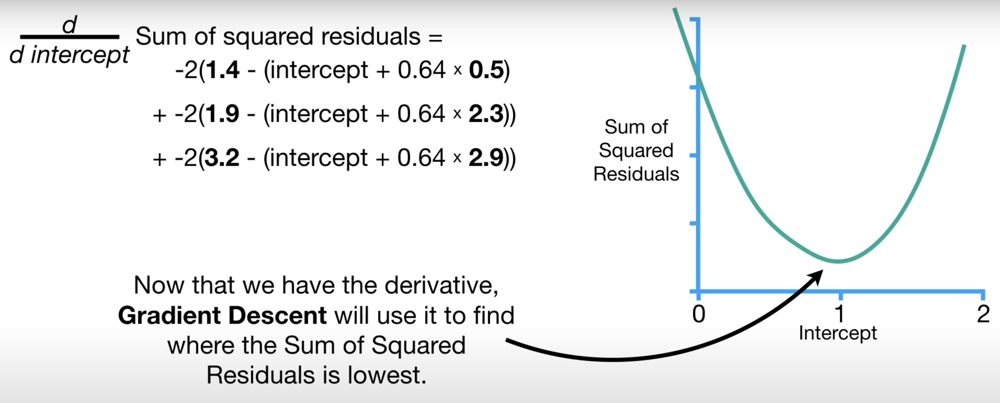

Note: If we were using least squares to solve for the optimal value for the intercept, we would simply find where the slope of the curve = 0. In contrast, gradient descent finds the minimum value by taking steps from an initial guess until it reaches the best value. This makes gradient descent very useful when it is not possible to solve for where the derivative = 0, and this is why gradient descent can be used in so many different situations.
Remember, we started by setting the intercept to a random number. In this case, that was 0. So we plug 0 into the derivative and we get -5.7.

$\frac{D}{d \text{ intercept}} \text{Sum of Squared Residuals}  = -2(1.4-(0+ 0.64 x 0.5))
-2(1.9-(0 + 0.64 x 2.3))
-2(3.2-(0+ 0.64 x 2.9)) =-5.7$                                                  
So when the intercept = 0, the slope of the curve = -5.7

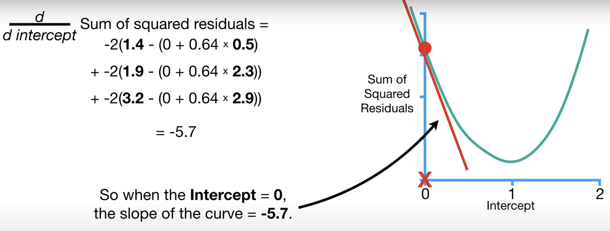

Note, the closer we get to the optimal value for the intercept, the closer the slope of the curve gets to 0. This means that when the slope of the curve is close to 0, then we should take baby steps, because we are close to the optimal value. And when the slope is far from 0, then we should take big steps because we are far from the optimal value. However, if we take a super huge step then we would increase the sum of the squared residuals. So the size of the step should be related to the slope, since it tells us if we should take a baby step or a big step, but we need to make sure the big step is not too big.
Gradient descent determines the step size by multiplying the slope by a small number called the learning rate.

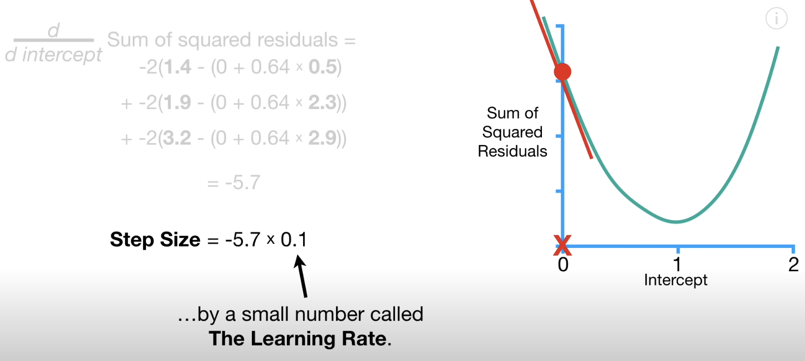

Step size = -5.7x0.1 = -0.57
When the intercept equals 0, the step size equals -0.57. With the step size, we can calculate a new intercept. The new intercept is the old intercept minus the step size

$New intercept = old intercept - step size
= 0 - (-0.57) = 0.57$

In one big step, we moved much closer to the optimal value for the intercept.

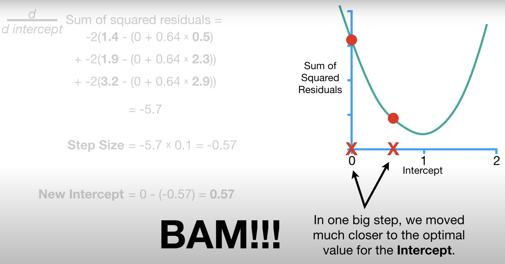

Going back to the original data and the original line with the intercept = 0, we can see how much the residuals shrink when the intercept equals 0.57. 
Now let’s take another step closer to the optimal value for the intercept. To take another step, we go back to the derivative and plug in the new intercept(0.57)

$\frac{D}{d \text{ intercept}} \text{Sum of Squared Residuals} = -2 \left(1.4 - \left(\text{intercept} + 0.64 \times 0.5\right)\right) - 2 \left(1.9 - \left(\text{intercept} + 0.64 \times 2.3\right)\right) - 2 \left(3.2 - \left(\text{intercept} + 0.64 \times 2.9\right)\right)$

$\frac{D}{d \text{ intercept}} \text{Sum of Squared Residuals} = -2 \left(1.4 - \left(0.57 + 0.64 \times 0.5\right)\right) - 2 \left(1.9 - \left(0.57 + 0.64 \times 2.3\right)\right) - 2 \left(3.2 - \left(0.57 + 0.64 \times 2.9\right)\right) = -2.3$

And that tells us the slope of the curve = -2.3.
Now let’s calculate the step size, 
Step size = slope x learning rate 
= -2.3 X 0.1 = -0.23.
And the new intercept equals 0.8.
New intercept = old intercept - step size = 0.57-(-0.23) = 0.8
Now we can compare the residuals when the intercept equals 0.57 to when the intercept equals 0.8. Overall, the sum of the squared residuals is getting smaller.
Notice that the first step was relatively large, compared to the second step.

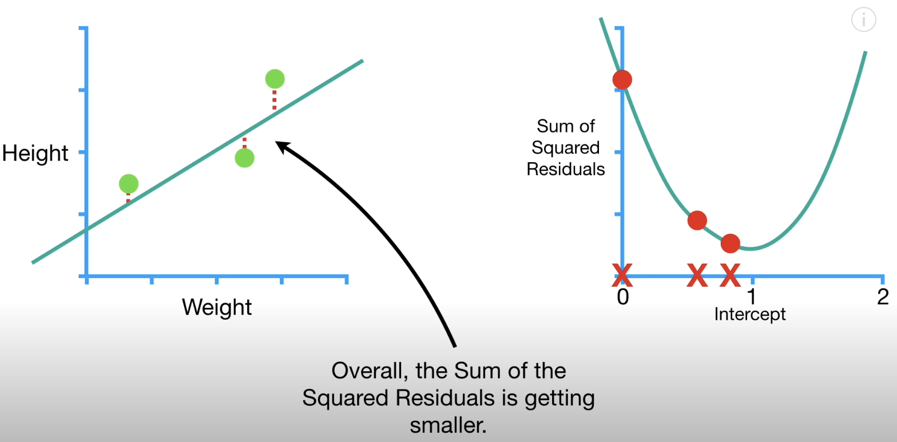

Now let’s calculate the derivative at the new intercept(0.8), and we get -0.9

$\frac{D}{d \text{ intercept}} \text{Sum of Squared Residuals}  = 
-2(1.4-(0.8+ 0.64 x 0.5))
-2(1.9-(0.8 + 0.64 x 2.3))
+ -2(3.2-(0.8 + 0.64 x 2.9))
=-0.9$

Step size = slope x learning rate = -0.9 x0.1 = -0.09, The step size equals -0.09 and the new intercept equals 0.89.
new intercept = old intercept -step size = 0.8-(-0.09)=0.89
Now we increase the intercept from 0.8 to 0.89, then we take another step and the new intercept equals 0.92. And then we take another step, and the new intercept equals 0.94. And then we take another step, and the new intercept equals 0.95.

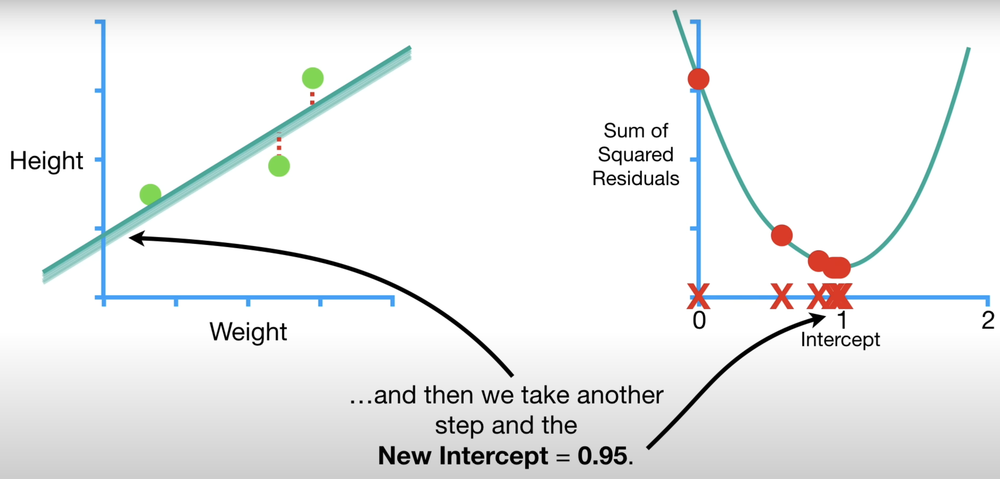

Notice how each step gets smaller and smaller the closer we get to the bottom of the curve. After 6 steps, the gradient descent estimate for the intercept is 0.95. Note: The Least Squares estimate for the intercept is also 0.95. So we know that gradient descent has done its job, but without comparing its solution to a gold standard, how does gradient descent know to stop taking steps?

Gradient descent stops when the step size is very close to 0.
Step size = slope x learning rate
The step size will be very close to 0 when the slope is very close to 0.
In practice, the minimum step size equals 0.001 or smaller.
So if this slope equals 0.009, then we would plug in 0.009 for the slope and 0.1 for the learning rate.
Step size = slope x learning rate 
= 0.009 x 0.1= 0.0009
Which is smaller than 0.001, so gradient descent would stop.

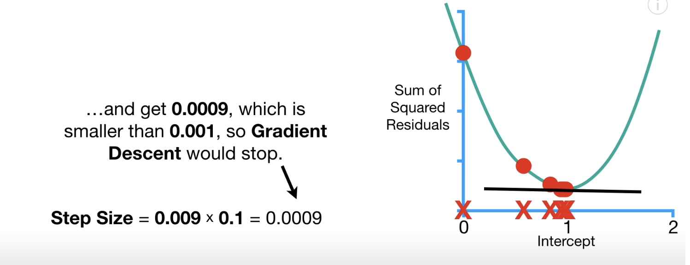

That said, gradient descent also includes a limit on the number of steps it will take before giving up. In practice, the maximum number of steps = 1000 or greater.
So even if the step size is large, if here have been more than the maximum number of steps, gradient descent will stop.

Let’s review what we’ve learned so far, the first thing we did is decide to use the sum of the squared residuals as the loss function to evaluate how well a line fits the data.

$\text{Sum of Squared Residuals} = (1.4-(intercept + 0.64 x 0.5))^2
(1.9-(intercept + 0.64 x 2.3))^2
(3.2-(intercept + 0.64 x 2.9))^2$    

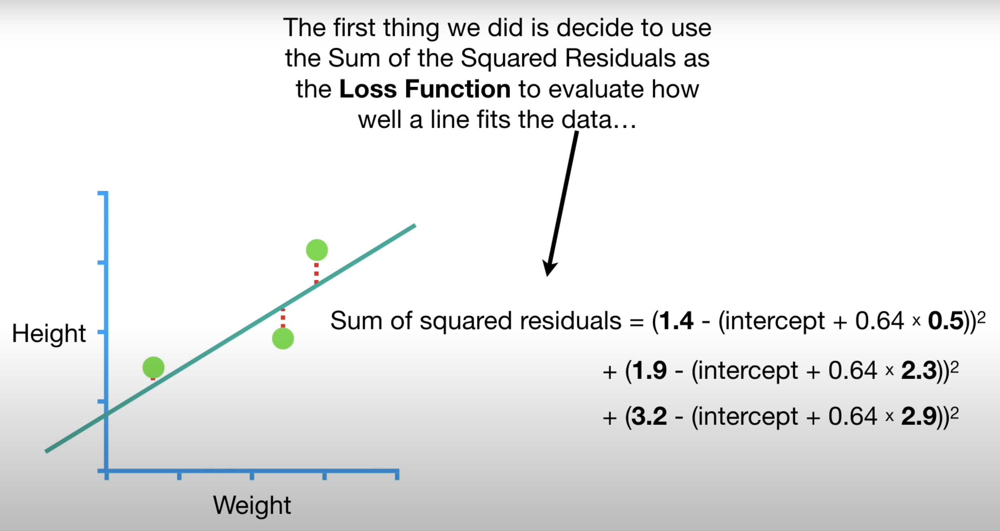

Then we took the derivative of the sum of the squared residuals. In other words, we took the derivative of the loss function.

$\frac{D}{d \text{intercept}} \text{Sum of Squared Residuals} = -2(1.4-(intercept + 0.64 x 0.5))
-2(1.9-(intercept + 0.64 x 2.3))
-2(3.2-(intercept + 0.64 x 2.9))$

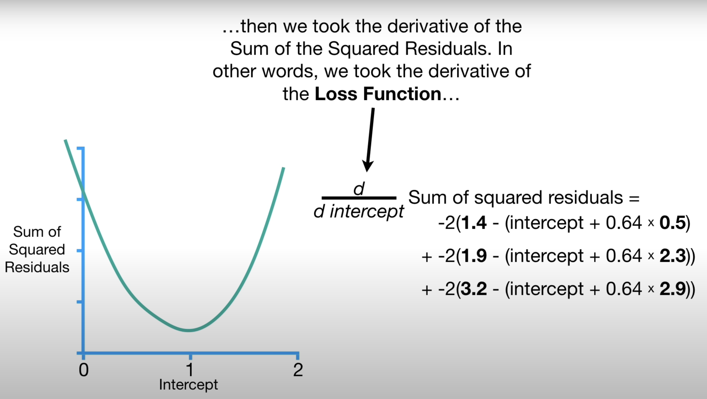

Then we picked a random value for the intercept, in this case we set the intercept = 0.

Then we calculated the derivative when the intercept equals zero, plugged that slope into the step size calculation and then calculated the new intercept, the difference between the old intercept and the step size.

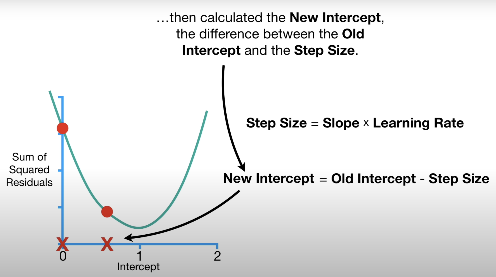

Lastly, we plugged the new intercept into the derivative and repeated everything until step size was close to 0.

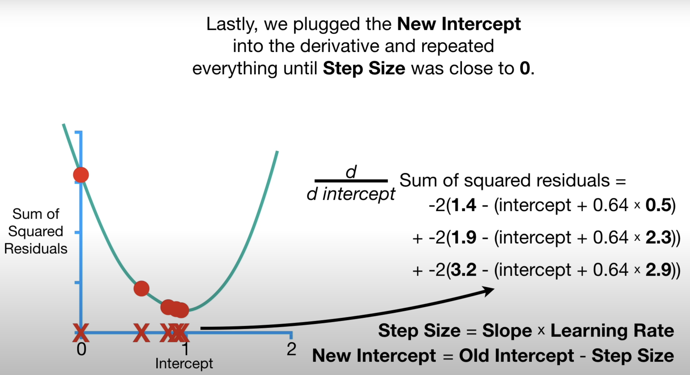

Now that we understand how gradient descent can calculate the intercept, let’s talk about how to estimate he intercept and the slope.

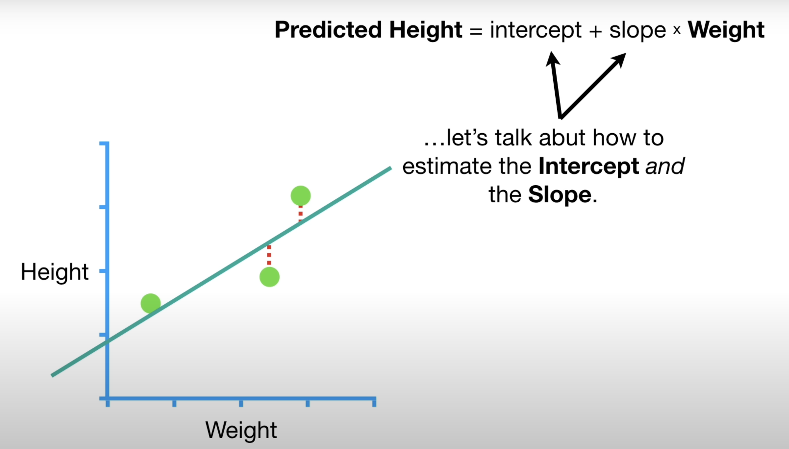

Just like before, we will use the sum of the square residuals as the loss function.

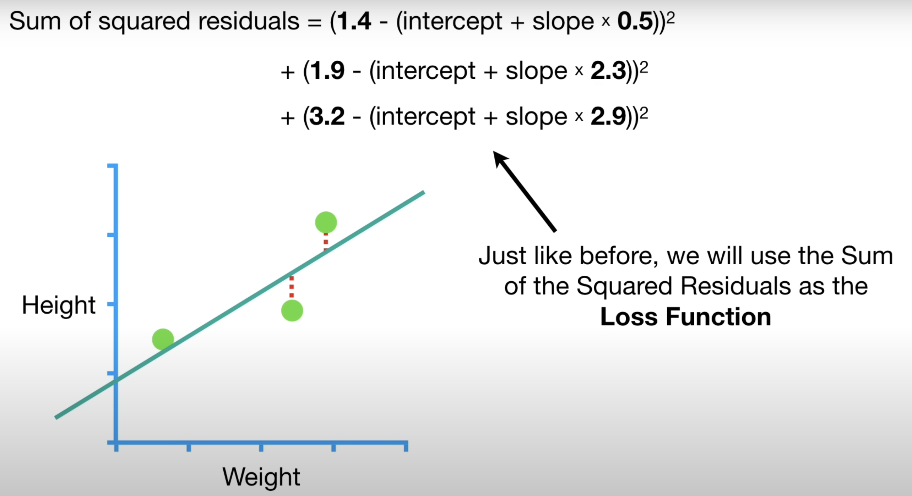

This is a 3-D graph of the loss function for different values for the intercept and the slope.

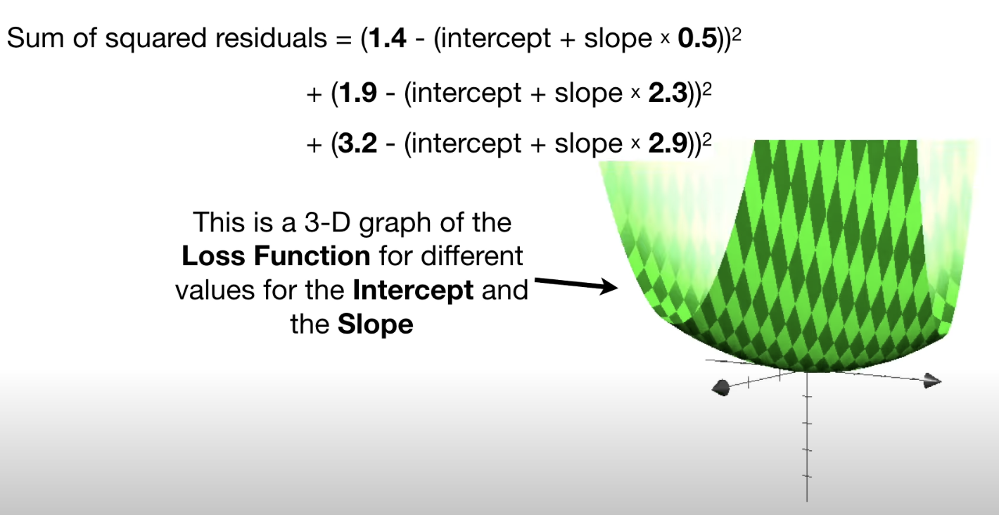

This axis is the sum of the squared residuals, this axis represents different values for the slope, and this axis represents different values for the intercept. We want to find the values for the intercept and slope that give us the minimum sum of the squared residuals.

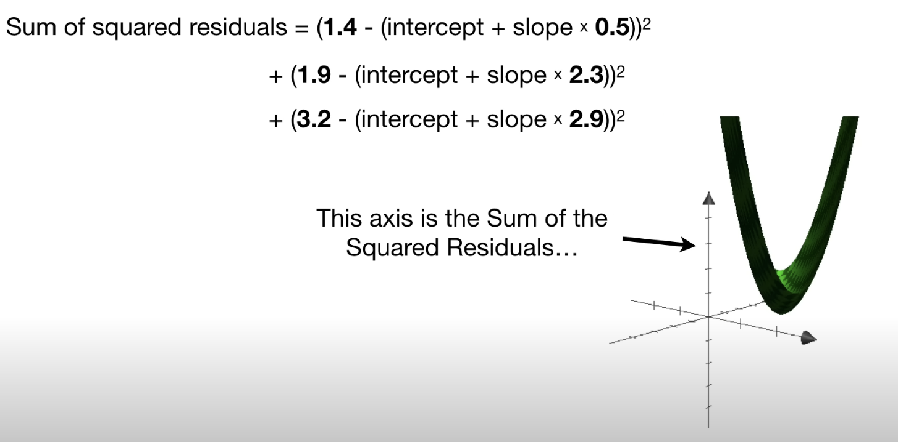 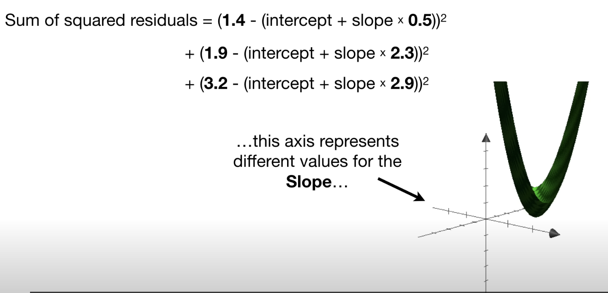 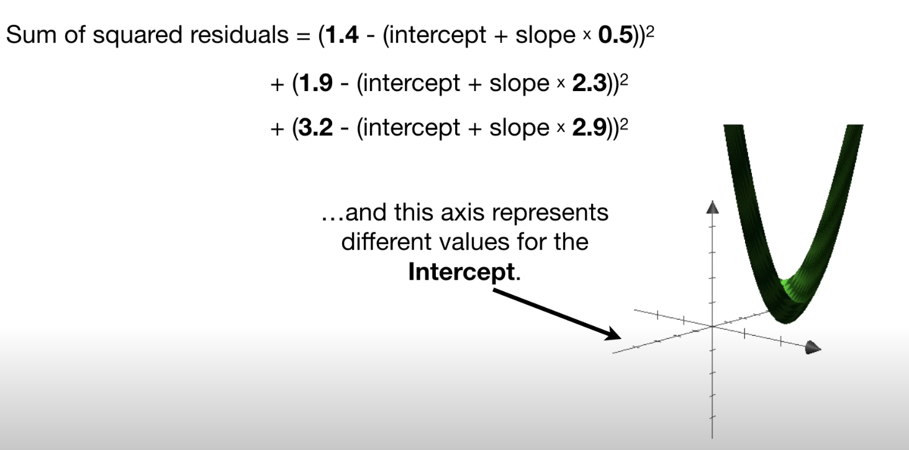
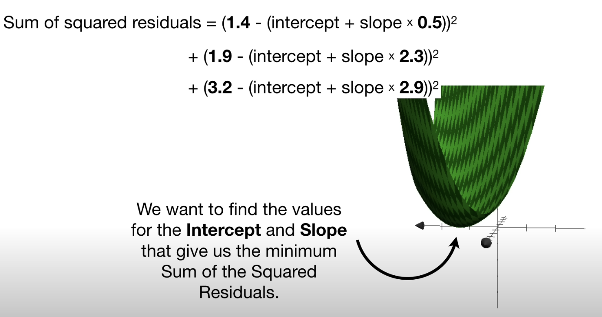

So, just like before, we need to take the derivative of this function.

$\text{Sum of Squared Residuals} = (1.4-(\text{intercept} + slope x 0.5))^2
(1.9-(intercept + slope x 2.3))^2
(3.2-(intercept + slope x 2.9))^2$   

And just like before, we’ll take the derivative with respect to the intercept, but unlike before, we’ll also take the derivative with respect to the slope.

D/d intercept sum of squared residuals
D/d slope sum of squared residuals

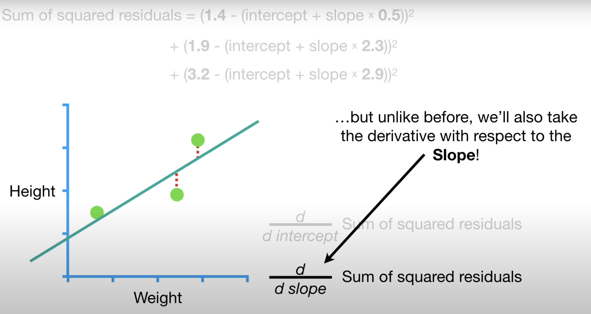

We’ll start by taking the derivative with respect to the intercept, just like before, we take the derivative of each part.

$\text{Sum of Squared Residuals}  = (1.4-(intercept + slope x 0.5))^2
(1.9-(intercept + slope x 2.3))^2
(3.2-(intercept + slope x 2.9))^2$ 

D/d intercept Sum of squared residuals = D/d intercept (1.4-(intercept + slope x 0.5))^2
D/d intercept (1.9-(intercept + slope x 2.3))^2
D/d intercept (3.2-(intercept + slope x 2.9))^2     

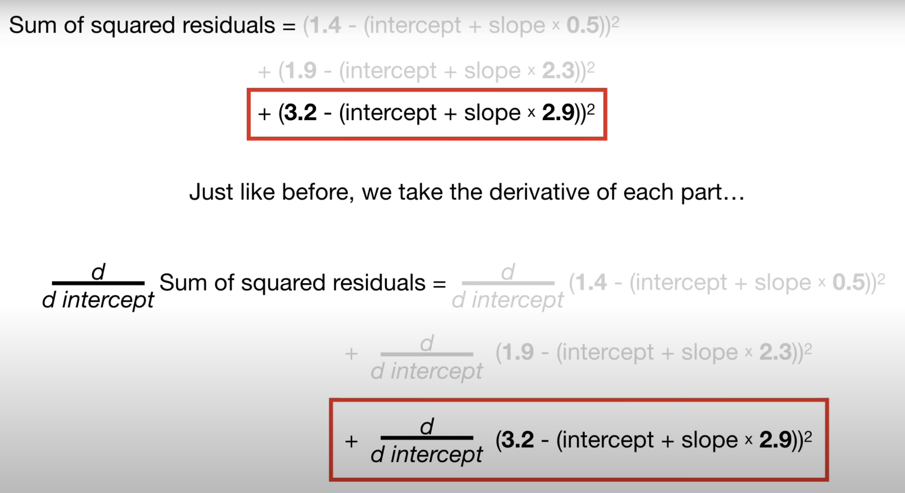

$$\begin{align*}
\frac{D}{d\text{intercept}} \, \text{Sum of Squared Residuals} = &amp; \frac{d}{d \, \text{intercept}} \left(1.4 - (\text{intercept} + \text{slope} \times 0.5)\right)^2 \\
&amp;+ \frac{d}{d\text{intercept}} \left(1.9 - (\text{intercept} + \text{slope} \times 2.3)\right)^2 \\
&amp;+ \frac{d}{d\text{intercept}} \left(3.2 - (\text{intercept} + \text{slope} \times 2.9)\right)^2 \\
= &amp; -2 \left(1.4 - (\text{intercept} + \text{slope} \times 0.5)\right) \\
&amp;- 2 \left(1.9 - (\text{intercept} + \text{slope} \times 2.3)\right) \\
&amp;- 2 \left(3.2 - (\text{intercept} + \text{slope} \times 2.9)\right)
\end{align*}$$

So this whole thing is the derivative of the sum of the squared residuals with respect to the intercept.
Now let’s take the derivative of the sum of the squared residuals with respect to the slope.

$$\begin{align*}
\frac{D}{d\text{slope}} \, \text{Sum of Squared Residuals} = &amp; \frac{d}{d \, \text{slope}} \left(1.4 - (\text{intercept} + \text{slope} \times 0.5)\right)^2 \\
&amp;+ \frac{d}{d\text{slope}} \left(1.9 - (\text{intercept} + \text{slope} \times 2.3)\right)^2 \\
&amp;+ \frac{d}{d\text{slope}} \left(3.2 - (\text{intercept} + \text{slope} \times 2.9)\right)^2 \\
= &amp; -2 \times 0.5 \left(1.4 - (\text{intercept} + \text{slope} \times 0.5)\right) \\
&amp;- 2 \times 2.3 \left(1.9 - (\text{intercept} + \text{slope} \times 2.3)\right) \\
&amp;- 2 \times 2.9 \left(3.2 - (\text{intercept} + \text{slope} \times 2.9)\right)
\end{align*}$$

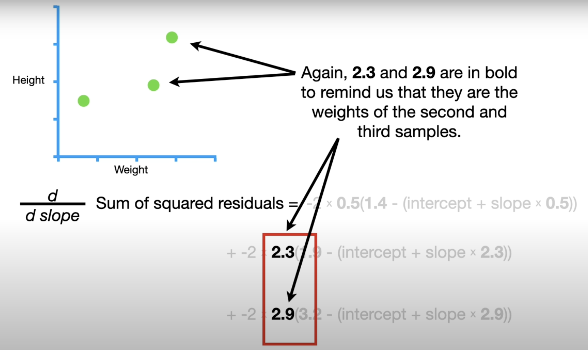

When you have 2 or more derivatives of the same function, they are called a gradient. We will use this gradient to descend to lowest point in the loss function, which, in this case, is the sum of the squared residuals. Thus, this is why this algorithm is called gradient descent.

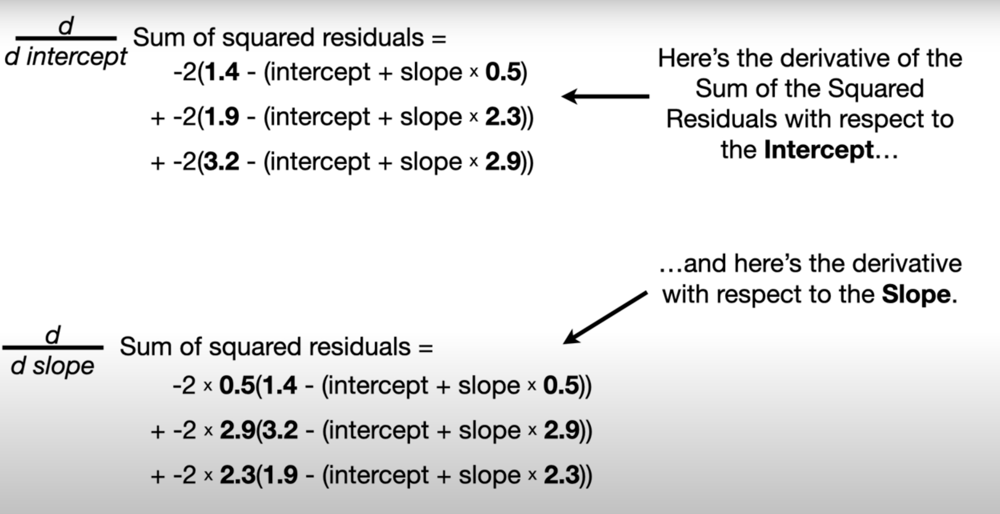

Just like before, we will start by picking a random number for the intercept. In this case we’ll set the intercept = 0 and we’ll pick a random number for the slope. In this case we’ll set the slope = 1.
Thus, this line with intercept = 0 and slope =1, is where we will start.
Now let’s plug in 0 for the intercept and 1 for the slope, and that gives us two slopes. Now we plug the slopes into the step size formula and multiply by the learning rate, which this time we set to 0.01. 

Step Size_Intercept = Slope x Learning Rate
Step Size_Slope = Slope x Learning Rate

Note: The larger learning rate that we used in the first example doesn’t work this time. Even after a bunch of steps, gradient descent doesn’t arrive at the correct answer. This means that gradient descent can be very sensitive to the learning rate.
The good news is that in practice, a reasonable learning rate can be determined automatically by starting large and getting smaller with each step. So in theory, you shouldn’t have to worry too much about the learning rate.
Anyway, we do the math and get two step sizes.
Step Size_Intercept = Slope x Learning Rate = -1.6x0.01=-0.016
Step Size_Slope = Slope x Learning Rate = -0.8x0.01=-0.008

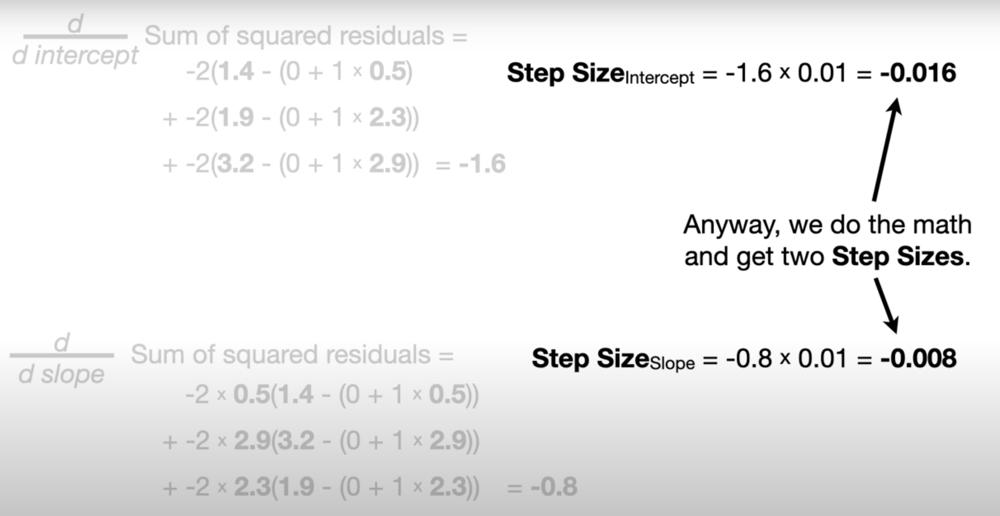

Now we calculate the new intercept and new slope by plugging in the old intercept and the old slope and the step sizes.
New Intercept = Old Intercept - Step Size = 0-(-0.016)=0.016
New slope = Old slope - Step Size = 1-(-0.008)=1.008
And we end up with a new intercept and a new slope
This is the line we started with(slope = 1 and intercept = 0) and this is the line new line(with slope = 1.008 and intercept = 0.016) after the first step.

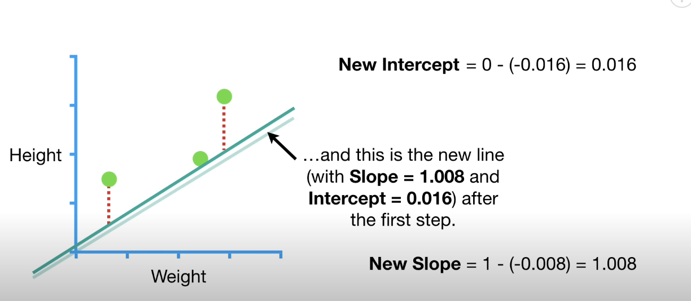

Now we just repeat what we did until all of the steps sizes are very small or we reach the maximum number of steps.
This is the best fitting line, with intercept = 0.95 and slope = 0.64, the same values we get from least squares.

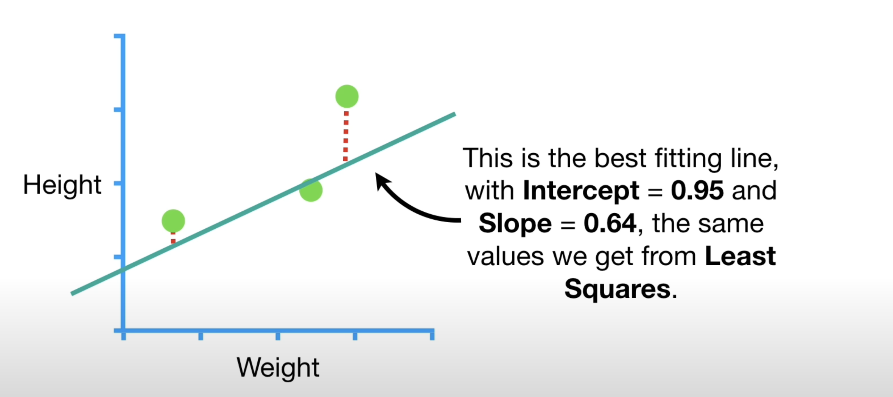

We now know how gradient descent optimizes two parameters, the slope and intercept. If we had more parameters, then we’d just take more derivatives and everything else stays the same.
Note: the sum of the squared residuals is just one type of loss function, however, there are tons of other loss functions that work with other types of data. Regardless of which loss function you use, gradient descent works the same way.

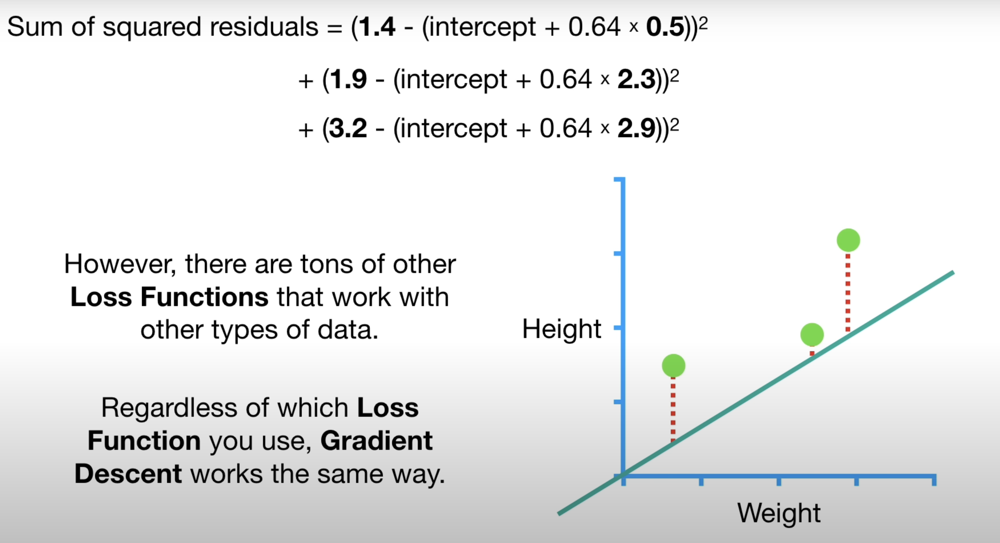

Step 1: Take the derivative of the loss function for each parameter in it. In fancy machine learning lingo, take the gradient of the loss function.
Step 2: Pick random values for the parameters.
Step 3: plug the parameter values into the derivatives(ahem, the gradient)
Step 4: calculate the step sizes: step size = slope x learning rate
Step 5: calculate the new parameters:
New parameter = old parameter - step size
Now go back to step 3 and repeat until step size is very small, or you reach the maximum number of steps.

## Stochastic Gradient Descent

One last thing, in out example, we only had three data points, so the math didn’t take very long, but when you have millions of data points, it can take a long time. So there is a thing called stochastic gradient descent that uses a randomly selected subset of the data at every step rather than the full dataset. This reduces the time spent calculating the derivatives of the loss function.

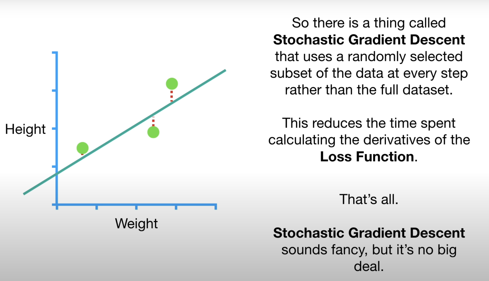

## Reference:
- [Watch the video on YouTube](https://www.youtube.com/watch?v=sDv4f4s2SB8)

