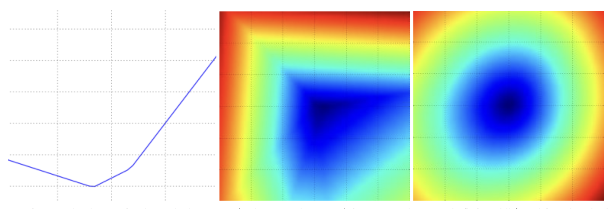
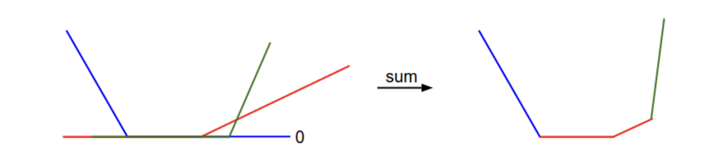

Table of Contents:

- [Introduction](#intro)
- [Visualizing the loss function](#vis)
- [Optimization](#optimization)
  - [Strategy #1: Random Search](#opt1)
  - [Strategy #2: Random Local Search](#opt2)
  - [Strategy #3: Following the gradient](#opt3)
- [Computing the gradient](#gradcompute)
  - [Numerically with finite differences](#numerical)
  - [Analytically with calculus](#analytic)
- [Gradient descent](#gd)
- [Summary](#summary)


### Introduction

Previously, we discussed two foundational components in the context of image classification:

1.  A  **score function**, which maps raw image pixels to class scores using a parameterized function (e.g., a linear function).
2.  A **loss function**, which evaluates the quality of the parameters by assessing how well the predicted scores align with the ground truth labels in the training data. For instance, we explored loss functions like Softmax and SVM.

To recap, the linear function takes the form $f(x_i, W) = W x_i$, and the SVM loss is defined as:

$$L = \frac{1}{N} \sum_i \sum_{j\neq y_i} \left[ \max(0, f(x_i; W)_j - f(x_i; W)_{y_i} + 1) \right] + \alpha R(W)$$

The parameters $W$ that produce predictions $f(x_i; W)$ consistent with the ground truth labels $y_i$ result in a minimal loss $L$. Now, we will introduce the third essential component: **optimization**. Optimization involves finding the parameter set $W$ that minimizes the loss function.

**Looking ahead:** Once we understand how these three core components interact, we will revisit the first component (the parameterized function mapping) and extend it to functions much more complicated than a linear mapping: First entire Neural Networks, and then Convolutional Neural Networks. The loss functions and the optimization process will remain relatively unchanged.

> The parameterized function mapping refers to a mathematical function that transforms input data (such as raw image pixels in the context of image classification) into output predictions (like class scores) using a set of adjustable parameters. These parameters are learned from the training data during the optimization process.

### Visualizing the Loss Function

The loss functions we work with in machine learning are often defined in very high-dimensional spaces. For instance, in CIFAR-10, a linear classifier’s weight matrix has dimensions$[10 \times 3073]$, resulting in a total of 30,730 parameters. This complexity makes direct visualization challenging. However, we can build intuition by exploring slices of the high-dimensional space in one or two dimensions.

One way to achieve this is by generating a random weight matrix $W$, which represents a point in the space, and then varying it along a ray (one dimension) or a plane (two dimensions). For a one-dimensional slice, we select a random direction $W_1$​ and compute the loss $L(W + a W_1)$  for different values of $a$. Plotting $a$ on the x-axis and the corresponding loss on the y-axis provides a simple visualization. For a two-dimensional slice, we use two directions, $W_1$​ and $W_2$​, and evaluate $L(W + a W_1 + b W_2)$ while varying $a$ and $b$. In this case, $a$ and $b$ form the x- and y-axes, while the loss is visualized using colors:

___




The loss function landscape for the Multiclass SVM (without regularization) is shown for a single example (left, middle) and for a hundred examples (right) in CIFAR-10. On the left, the one-dimensional loss is visualized by varying only $a$. The middle and right plots show two-dimensional loss slices, with blue representing low loss and red representing high loss. Notice the piecewise-linear structure of the loss function. For multiple examples, the losses are averaged, resulting in the bowl-like shape on the right, which combines many piecewise-linear structures like the one in the middle.
> The left plot is a **1D slice** through the high-dimensional loss landscape. **$W$ and $W_1$​** are high-dimensional matrices; their dimensionality does not change. The "1D" refers to the movement along the direction $W_1$​, controlled by the scalar $a$.
___
The piecewise-linear structure of the SVM loss function can be understood by analyzing its mathematical formulation. For a single example, the loss is defined as:

$$L_i = \sum_{j\neq y_i} \left[ \max(0, w_j^Tx_i - w_{y_i}^Tx_i + 1) \right]$$


This equation shows that the data loss for each example is a sum of linear terms (involving the weights $W$) that are thresholded at zero by the $\max(0, \cdot)$ function. Each row of $W$ (i.e., $w_j$) contributes either positively (for incorrect classes) or negatively (for the correct class) to the loss function, depending on the class and the given example.

To make this explicit, consider a simple dataset with three 1-dimensional data points and three classes. The full SVM loss (without regularization) for this dataset becomes:

$$\begin{align}
L_0 = & \max(0, w_1^Tx_0 - w_0^Tx_0 + 1) + \max(0, w_2^Tx_0 - w_0^Tx_0 + 1) \\\\
L_1 = & \max(0, w_0^Tx_1 - w_1^Tx_1 + 1) + \max(0, w_2^Tx_1 - w_1^Tx_1 + 1) \\\\
L_2 = & \max(0, w_0^Tx_2 - w_2^Tx_2 + 1) + \max(0, w_1^Tx_2 - w_2^Tx_2 + 1) \\\\
L = & (L_0 + L_1 + L_2)/3
\end{align}$$

Each data point ($x_i$) and weight vector ($w_j$) is a scalar value because the examples are 1-dimensional. Looking at, for instance, $w_0$, some terms above are linear functions of $w_0$ and each is clamped at zero. We can visualize this as follows:
___



A 1-dimensional representation of the data loss, where the x-axis represents a single weight, and the y-axis shows the loss value. The total data loss is composed of multiple terms, each of which is either independent of the specific weight or a linear function of it, clamped to zero when inactive. The full SVM data loss extends this piecewise-linear structure to a 30,730-dimensional space.

>  Independent of the specific weight : For $L_0 = \max(0, w_1 x_0 - w_0 x_0 + 1) + \max(0, w_2 x_0 - w_0 x_0 + 1)$, the **second term**: $\max(0, w_2 x_0 - w_0 x_0 + 1)$ is **independent of $w_1$​** because it only involves $w_2$ and $w_0$​, not $w_1$​.

>  **inactive means the term inside the $\max(0, \cdot)$ is $\leq 0$**.
 
> **"Thresholded at zero"** means that the value of a function is adjusted such that it cannot go below zero. If the value is positive, it remains unchanged, but if the value is zero or negative, it is "clamped" to zero. This is typically achieved using the **$\max(0, \cdot)$** operation.

>-   **Downward Slope (varying $w_0$​)**: Increasing the weight for the **correct class** improves the margin, which decreases the loss term, leading to a downward slope. This slope becomes flat (zero) once the margin condition is fully satisfied.
>-   **Upward Slope (varying $w_1$​)**: Increasing the weight for an **incorrect class** worsens the margin, increasing the loss term and causing an upward slope. This term only starts to increase once the incorrect class score approaches or exceeds the correct class score.
___

As an aside, the bowl-shaped appearance of the SVM cost function indicates that it is a **convex function**. Convex functions are well-studied in optimization, and there is extensive literature on methods for efficiently minimizing them. For those interested, Stanford offers a well-known course on the topic: [Convex Optimization](http://stanford.edu/~boyd/cvxbook/). However, when we extend our score functions $f$ to Neural Networks, the objective functions become **non-convex**, resulting in complex, bumpy terrains instead of feature bowls. 

*Non-differentiable loss functions*.  A technical detail to note is that the **kinks** in the SVM loss function, caused by the $\max(0, \cdot)$ operation, make the function **non-differentiable** at certain points. At these kinks, the gradient is undefined. However, the [subgradient](http://en.wikipedia.org/wiki/Subderivative) still exists and is commonly used instead. In this class will use the terms *subgradient* and *gradient* interchangeably.

> **kinks**: In the context of functions like the **SVM loss**, **kinks** refer to points in the graph of the function where there is an abrupt change in the slope (gradient). These points occur because the function transitions between different behaviors, such as:
> -   From a flat region (constant value) to a sloped region (linear growth).
> -   Or between two linear regions with different slopes.


> **Subgradient: A Generalization of the Gradient**
> A **subgradient** extends the concept of a gradient to non-differentiable functions. At a kink, it represents any value within the range of slopes that approximate the function's behavior.
>For $f(z) = \max(0, z)$, the subgradient is:
>- **If $z > 0$:** $f'(z) = 1$ (regular gradient).
>- **If $z < 0$:** $f'(z) = 0$ (regular gradient).
>- **If $z = 0$:** No unique gradient exists; the subgradient can take any value in $[0, 1]$.

### Optimization

To reiterate,, the loss function serves as a measure of how well a particular set of weights **W** performs. The primary goal of optimization is to find the set of weights **W** that minimizes the loss function, leading to the best performance. We will now motivate and slowly develop an approach to optimizing the loss function.  For those of you coming to this class with previous experience, this section might seem odd since the working example we'll use (the SVM loss) is a convex problem, but keep in mind that our goal is to eventually optimize Neural Networks where we can't easily use any of the tools developed in the Convex Optimization literature.

> Convexity means the loss function has a single global minimum and no local minima, making optimization straightforward: Tools from convex optimization guarantee finding the global minimum efficiently using techniques like gradient descent.
> In contrast, neural network loss functions are non-convex, with many local minima and saddle points, making optimization much harder. By starting with a convex problem, the optimization challenge feels less realistic compared to what is encountered in neural networks.

___
#### Strategy #1: A first very bad idea solution: Random search

Since evaluating the quality of a given set of parameters **W** is straightforward, the first (very bad) idea that may come to mind is to randomly trying out different weights and keeping the one that performs the best. This process could look something like this:

```python
# assume X_train is the data where each column is an example (e.g. 3073 x 50,000)
# assume Y_train are the labels (e.g. 1D array of 50,000)
# assume the function L evaluates the loss function

bestloss = float("inf") # Python assigns the highest possible float value
for num in range(1000):
  W = np.random.randn(10, 3073) * 0.0001 # generate random parameters
  loss = L(X_train, Y_train, W) # get the loss over the entire training set
  if loss < bestloss: # keep track of the best solution
    bestloss = loss
    bestW = W
  print 'in attempt %d the loss was %f, best %f' % (num, loss, bestloss)

# prints:
# in attempt 0 the loss was 9.401632, best 9.401632
# in attempt 1 the loss was 8.959668, best 8.959668
# in attempt 2 the loss was 9.044034, best 8.959668
# in attempt 3 the loss was 9.278948, best 8.959668
# in attempt 4 the loss was 8.857370, best 8.857370
# in attempt 5 the loss was 8.943151, best 8.857370
# in attempt 6 the loss was 8.605604, best 8.605604
# ... (trunctated: continues for 1000 lines)
```
In the code above, we experimented with several random weight vectors **W**, and observed that some performed better than others. We can take the best-performing weights **W** from this search and evaluate them on the test set:

```python
# Assume X_test is [3073 x 10000], Y_test [10000 x 1]
scores = Wbest.dot(Xte_cols) # 10 x 10000, the class scores for all test examples
# find the index with max score in each column (the predicted class)
Yte_predict = np.argmax(scores, axis = 0)
# and calculate accuracy (fraction of predictions that are correct)
np.mean(Yte_predict == Yte)
# returns 0.1555
```

With the best **W** this gives an accuracy of about **15.5%**. Given that guessing classes completely at random achieves only 10%, that's not a very bad outcome for a such a brain-dead random search solution!

**Core idea: iterative refinement**.  We can do much better. Instead of trying to find the perfect set of weights **W** all at once (a task that becomes increasingly difficult or even impossible for complex models like neural networks), we focus on **refining** an initial set of weights step by step. The idea is to start with a random **W** and iteratively improve it, making small adjustments to reduce the loss at each step.

> Our strategy: Start with random weights and iteratively refine them over time to get lower loss

**Blindfolded hiker analogy.** Imagine you're hiking on hilly terrain while blindfolded, aiming to reach the bottom. The height of the terrain represents the loss, and each step you take is an attempt to lower the loss. In the case of CIFAR-10, the hills are exist in a **30,730-dimensional space** (since **W** has dimensions 10 x 3073). Each point in this high-dimensional space corresponds to a specific set of weights **W**, and the height at that point on the hill represents the loss for those weights. Your goal is to navigate through this high-dimensional landscape to find the best **W**.

#### Strategy #2: Random Local Search

The first strategy you may think of is to extend one foot in a random direction and take a step only if it moves downhill. Specifically, we begin with a random $W$, generate random perturbations $\delta W$, and evaluate the loss at $W + \delta W$. If the loss decreases, we update $W$ accordingly. The following code implements this procedure:

```python
W = np.random.randn(10, 3073) * 0.001 # generate random starting W
bestloss = float("inf")
for i in range(1000):
  step_size = 0.0001
  Wtry = W + np.random.randn(10, 3073) * step_size
  loss = L(Xtr_cols, Ytr, Wtry)
  if loss < bestloss:
    W = Wtry
    bestloss = loss
  print 'iter %d loss is %f' % (i, bestloss)
```

With the same number of loss function evaluations (1000), this method achieves a test set classification accuracy of **21.4%**. While this is an improvement, it remains inefficient and computationally costly.


#### Strategy #3: Following the Gradient

In the previous section, we explored finding a direction in the weight space that could improve our weight vector by lowering the loss. However, instead of randomly searching for a good direction, we can calculate the **best direction** for updating the weights. This direction, mathematically guaranteed to lead to the steepest descent in loss  (at least in the limit as the step size goes towards zero), is determined by the **gradient** of the loss function. Using our hiking analogy, this process is like sensing the slope of the ground beneath your feet and moving in the direction that feels steepest downhill.

For one-dimensional functions, the slope represents the instantaneous rate of change of the function at a given point. The gradient generalizes this concept to functions that take a vector of numbers instead of a single number. 
**🌟🌟🌟Specifically, the gradient is a vector of slopes—commonly called **derivatives**—with respect to each dimension of the input space.**

> -   The **gradient** is a **vector of slopes**, where each slope is a **derivative** with respect to a specific input dimension.
>-   In other words:
>    -   The **derivatives** (e.g., $\frac{\partial f}{\partial x_1}, \frac{\partial f}{\partial x_2}, ...$) are the individual slopes.
>    -   The **gradient** (e.g., $\nabla f(x)$) is the collection of all these slopes in vector form.

The derivative of a one-dimensional function with respect to its input is mathematically expressed as:

$$\frac{df(x)}{dx} = \lim_{h\ \to 0} \frac{f(x + h) - f(x)}{h}$$

When the functions of interest take a vector of numbers instead of a single number, these derivatives are referred to as **partial derivatives**, and the gradient is simply the collection of these partial derivatives for all dimensions.

### Computing the gradient

There are two main approaches to compute gradients: a slow but straightforward method known as the **numerical gradient**, and a fast but more error-prone method requiring calculus called the **analytic gradient**. Both methods are outlined below.

#### Computing the gradient numerically with finite differences

The formula given above($\frac{df(x)}{dx} = \lim_{h \to 0} \frac{f(x + h) - f(x)}{h}$) allows us to compute the gradient numerically. Here is a generic function that takes a function `f`, a vector `x` to evaluate the gradient on, and returns the gradient of `f` at `x`:

```python
def eval_numerical_gradient(f, x):
  """
  a naive implementation of numerical gradient of f at x
  - f should be a function that takes a single argument
  - x is the point (numpy array) to evaluate the gradient at
  """

  fx = f(x) # evaluate function value at original point
  grad = np.zeros(x.shape)
  h = 0.00001

  # iterate over all indexes in x
  it = np.nditer(x, flags=['multi_index'], op_flags=['readwrite'])
  while not it.finished:

    # evaluate function at x+h
    ix = it.multi_index
    old_value = x[ix]
    x[ix] = old_value + h # increment by h
    fxh = f(x) # evalute f(x + h)
    x[ix] = old_value # restore to previous value (very important!)

    # compute the partial derivative
    grad[ix] = (fxh - fx) / h # the slope
    it.iternext() # step to next dimension

  return grad
```
Following the gradient formula we gave above, the code above iterates over all dimensions one by one, makes a small change `h` along that dimension and calculates the partial derivative of the loss function along that dimension by seeing how much the function changed. The variable `grad` holds the full gradient in the end.

> $\frac{\partial f}{\partial x_i} \approx \frac{f(x_1, \dots, x_i + h, \dots, x_n) - f(x_1, \dots, x_i, \dots, x_n)}{h}$

**Practical considerations**
-   **Step Size ($h$)**: In theory, $h$ should approach zero, but in practice, a very small but finite value (e.g., 1e-5) is sufficient. The smallest $h$ that avoids numerical issues is generally preferred. 
-   **Centered Difference Formula**: In practice it often works better to compute the numeric gradient using the **centered difference formula**: $\frac{f(x + h) - f(x - h)}{2h}$. For more details, see [Wikipedia on Numerical Differentiation](http://en.wikipedia.org/wiki/Numerical_differentiation).

>With a very small $h = 10^{-15}$, floating-point precision limitations can cause $f(1 + h) - f(1)$ to incorrectly evaluate as $0.0$ or an inaccurate small value, leading to significant errors in the gradient calculation.

> Looking for Appendix Part of why centered difference formula is better

We can use the function given above to compute the gradient at any point and for any function. Lets compute the gradient for the CIFAR-10 loss function at some random point in the weight space:

```python

# to use the generic code above we want a function that takes a single argument
# (the weights in our case) so we close over X_train and Y_train
def CIFAR10_loss_fun(W):
  return L(X_train, Y_train, W)

W = np.random.rand(10, 3073) * 0.001 # random weight vector
df = eval_numerical_gradient(CIFAR10_loss_fun, W) # get the gradient
```

The gradient indicates the slope of the loss function along each dimension, which can be used to update the weights:

```python
loss_original = CIFAR10_loss_fun(W) # the original loss
print 'original loss: %f' % (loss_original, )

# lets see the effect of multiple step sizes
for step_size_log in [-10, -9, -8, -7, -6, -5,-4,-3,-2,-1]:
  step_size = 10 ** step_size_log
  W_new = W - step_size * df # new position in the weight space
  loss_new = CIFAR10_loss_fun(W_new)
  print 'for step size %f new loss: %f' % (step_size, loss_new)

# prints:
# original loss: 2.200718
# for step size 1.000000e-10 new loss: 2.200652
# for step size 1.000000e-09 new loss: 2.200057
# for step size 1.000000e-08 new loss: 2.194116
# for step size 1.000000e-07 new loss: 2.135493
# for step size 1.000000e-06 new loss: 1.647802
# for step size 1.000000e-05 new loss: 2.844355
# for step size 1.000000e-04 new loss: 25.558142
# for step size 1.000000e-03 new loss: 254.086573
# for step size 1.000000e-02 new loss: 2539.370888
# for step size 1.000000e-01 new loss: 25392.214036
```

**Update in negative gradient direction**. The gradient indicates the steepest rate of increase of the loss function, so the weights are updated in the **negative gradient direction** to decrease the loss.

**Effect of step size**. The gradient indicates the direction of the steepest increase in the function, but it doesn't specify how far we should move along this direction. Determining the step size (often referred to as the _learning rate_) is a critical and often challenging hyperparameter to set when training a neural network. In our analogy of descending a hill while blindfolded, we can feel the slope beneath our feet pointing in a certain direction, but the optimal step length remains uncertain. Taking small, cautious steps may lead to steady but slow progress (analogous to a small step size). On the other hand, taking large, confident strides might aim for faster descent but risks overshooting the target. As shown in the code example, larger step sizes can sometimes lead to higher losses due to "overstepping."
___


 Visualizing the effect of step size. Starting at a specific point $W$, we compute the gradient's negative (represented by the white arrow), which indicates the direction of steepest loss reduction. Taking small steps in this direction ensures consistent but slow progress, while larger steps may achieve faster progress but come with greater risk. As the step size increases, we may eventually overshoot the minimum, causing the loss to worsen. The step size, also known as the **learning rate**, is a crucial hyperparameter that requires careful tuning to optimize performance effectively.
___
**A problem of efficiency**. You may have noticed that evaluating the numerical gradient has complexity linear in the number of parameters. For instance, in the example above, with 30,730 parameters, 30,731 evaluations of the loss function were required for a single parameter update. This cost grows significantly for modern neural networks, which often have tens of millions of parameters. Clearly, this strategy is not scalable and we need something better.

#### Computing the gradient analytically with Calculus

The numerical gradient, computed using finite difference approximations, is straightforward to implement. However, it comes with limitations: it is approximate (since it depends on a small value $h$, whereas the true gradient is defined in the limit as $h \to 0$) and computationally expensive, especially for high-dimensional problems. An alternative approach is to compute the gradient is analytically using Calculus, which allows us to derive a direct formula for the gradient (no approximations) that is also very fast to compute. However, unlike the numerical gradient it can be more error prone to implement,. For this reason, a common practice is to compute the analytical gradient and compare it against the numerical gradient to ensure correctness—a process known as **gradient checking**.

Let's use the example of the SVM loss function for a single datapoint:

$$L_i = \sum_{j\neq y_i} \left[ \max(0, w_j^Tx_i - w_{y_i}^Tx_i + \Delta) \right]$$


> Alternatively, we can represent this loss using an indicator function: 
> $L_i = \sum_{j \neq y_i} \mathbb{1}(w_j^T x_i - w_{y_i}^T x_i + \Delta > 0) \cdot (w_j^T x_i - w_{y_i}^T x_i + \Delta)$

We can differentiate the function with respect to the weights. For example, taking the gradient with respect to $w_{y_i}$ we obtain:

$$\nabla_{w_{y_i}} L_i = - \left( \sum_{j\neq y_i} \mathbb{1}(w_j^Tx_i - w_{y_i}^Tx_i + \Delta > 0) \right) x_i$$

> **differentiate** means taking the **derivative**
> Treat $\mathbb{1}(\text{condition})$ as a constant, so it stays as is during differentiation.

Here, $\mathbb{1}$ is an indicator function that evaluates to 1 if the condition inside is true and 0 otherwise. In practical terms, this means counting the number of classes that fail to meet the desired margin (and thus contribute to the loss). The gradient with respect to $w_{y_i}$ is the data vector $x_i$​, scaled by this count.

For the other rows of $W$ corresponding to incorrect classes ($j \neq y_i$), the gradient is:

$$\nabla_{w_j} L_i = \mathbb{1}(w_j^Tx_i - w_{y_i}^Tx_i + \Delta > 0) x_i$$

While these expressions may look complex, implementing them in code is straightforward. You simply calculate the contributions of the data point to the gradients of the relevant weight rows and apply the gradient update accordingly.


### Gradient Descent

**🌟🌟🌟Now that we can compute the gradient of the loss function, the procedure of repeatedly evaluating the gradient and then performing a parameter update is called *Gradient Descent*.** Its **vanilla** version looks as follows:

```python
# Vanilla Gradient Descent

while True:
  weights_grad = evaluate_gradient(loss_fun, data, weights)
  weights += - step_size * weights_grad # perform parameter update
```

This simple loop is at the core of all Neural Network libraries. There are other ways of performing the optimization (e.g. LBFGS), but Gradient Descent is currently by far the most common and established way of optimizing Neural Network loss functions. Throughout the class we will put some bells and whistles on the details of this loop (e.g. the exact details of the update equation), but the core idea of following the gradient until we're happy with the results will remain the same.

**Mini-batch gradient descent.** In large-scale machine learning tasks (e.g., ILSVRC with over a million images), computing the gradient over the entire dataset for a single parameter update is computationally expensive. A more efficient approach is to compute the gradient using **mini-batches**—small subsets of the data. For example, in state-of-the-art Convolutional Neural Networks (ConvNets), a mini-batch typically contains 256 examples, sampled from a dataset of 1.2 million. Using this mini-batch, the gradient is computed, and parameters are updated:

> A **single parameter update** refers to performing **one gradient descent step**, means updating all parameters in the model, i.e., the entire weight matrix $W$, not just $w_1$​ or individual elements $w_{ij}$.

```python
# Vanilla Minibatch Gradient Descent

while True:
  data_batch = sample_training_data(data, 256) # sample 256 examples
  weights_grad = evaluate_gradient(loss_fun, data_batch, weights)
  weights += - step_size * weights_grad # perform parameter update
```
This approach works well because training examples are often correlated. To understand this, imagine an extreme case where all 1.2 million images in  ILSVRC are duplicates of just 1000 unique images (one for each class). In such a scenario, the gradients computed for all duplicates would be identical, and the loss calculated over the entire dataset would be the same as using only the 1000 unique images. While real-world datasets do not contain exact duplicates, the gradient from a mini-batch is often a good approximation of the full dataset gradient. By using mini-batches, we can perform parameter updates more frequently, leading to faster convergence.

An extreme case of mini-batch Gradient Descent is when the batch size is reduced to a single training example. This is known as **Stochastic Gradient Descent (SGD)** or **online Gradient Descent**. While technically SGD refers to updating parameters based on one example at a time, in practice, the term "SGD" is often used interchangeably with **mini-batch Gradient Descent**, regardless of batch size.

Using a single example per update is less common because modern computational frameworks optimize better with vectorized operations. For instance, computing the gradient for 100 examples in a single operation is often more efficient than computing it for one example 100 times.

The size of the mini-batch is a hyperparameter that is rarely tuned through cross-validation. Instead, it is typically determined by memory constraints(if any) or set to a standard value such as 32, 64, or 128. Powers of 2 are often used because they enable faster computation in many vectorized implementations.

### Summary
___


Summary of the information flow. The dataset of $(x, y)$ pairs is fixed and provided as input. The weights, initialized as random values, are adjustable. During the **forward pass**, the score function computes class scores, stored in the vector **f**. The loss function consists of two components:

-   The **data loss**, which measures how well the scores $f$align with the labels $y$.
-   The **regularization loss**, which depends only on the weights.

In **Gradient Descent**, we compute the gradient of the weights (and optionally the data) and use these gradients to iteratively update the parameters, minimizing the loss.
___


In this section,

-   We developed the intuition of the loss function as a **high-dimensional optimization landscape** in which we are trying to reach the bottom. This was likened to a blindfolded hiker trying to reach the bottom of a valley.  In particular, we observed that the SVM loss is piecewise linear and bowl-shaped.
-   We motivated the idea of optimizing the loss function with
**iterative refinement**, starting with random weights and refining them step by step until the loss is minimized.

- We saw that the **gradient** of a function gives the steepest ascent direction and we discussed a simple but inefficient way of computing it numerically using the finite difference approximation (the finite difference being the value of *h* used in computing the numerical gradient).

- We highlighted the importance of choosing the correct **step size** (or **learning rate**) for parameter updates:
  -   A small step size leads to slow but steady progress.
  -   A large step size may accelerate progress but increases the risk of overshooting the minimum.

- We discussed the tradeoffs between computing the **numerical** and **analytic** gradient. :

  -   The numerical gradient is simple to compute but approximate and computationally expensive.
  -   The analytic gradient is exact and efficient but prone to implementation errors due to the mathematical derivation involved.
  -   Hence, in practice we always use the analytic gradient and then perform a **gradient check**, in which its implementation is compared to the numerical gradient.
- We introduced the **Gradient Descent** algorithm, which iteratively computes gradients and updates the parameters in a loop.

**Coming up:** The key takeaway from this section is the ability to compute gradients of a loss function with respect to its weights and understand their significance. This skill is fundamental for designing, training, and analyzing neural networks. **🌟🌟🌟In the next section we will develop proficiency in computing the gradient analytically using the chain rule, otherwise also referred to as **backpropagation**. ** This will allow us to efficiently optimize relatively arbitrary loss functions that express all kinds of Neural Networks, including Convolutional Neural Networks.

#### Appendix Part for why centered difference formula is better

##### Taylor Series Expansion and Error Reduction

For a function $f(x)$, the Taylor series expansion gives:

$$f(x + h) = f(x) + h f'(x) + \frac{h^2}{2} f''(x) + \frac{h^3}{6} f'''(x) + \dots$$

$$f(x - h) = f(x) - h f'(x) + \frac{h^2}{2} f''(x) - \frac{h^3}{6} f'''(x) + \dots$$

$$f(x + h) - f(x - h) = 2h f'(x) + \frac{2h^3}{6} f'''(x) + \dots$$

$$\frac{f(x + h) - f(x - h)}{2h} = f'(x) + \frac{h^2}{3} f'''(x) + \dots$$

- The error term is now proportional to $h^2$, making it **second-order accurate**.


##### Comparison to Forward Difference Formula

The **forward difference formula**:

$$\frac{f(x + h) - f(x)}{h} = f'(x) + \mathcal{O}(h)$$

- Has an error proportional to \( h \), making it **first-order accurate**.
- The centered difference formula is **more accurate** because it cancels even-order terms and achieves second-order accuracy.

##### First-Order Accuracy
- The error term scales **linearly** with the step size $h$.
- For example, in the **forward difference formula**:
  $$\frac{f(x + h) - f(x)}{h} = f'(x) + \mathcal{O}(h)$$
- The error is proportional to $h$, meaning:
  - If $h$ is halved, the error is also roughly halved.

##### Second-Order Accuracy
- The error term scales **quadratically** with $h$.
- For example, in the **centered difference formula**:
  $$\frac{f(x + h) - f(x - h)}{2h} = f'(x) + \mathcal{O}(h^2)$$
- The error is proportional to $h^2$, meaning:
  - If $h$ is halved, the error decreases by a factor of 4 (since $h^2$ scales quadratically).

### Explain **Large $h$:** The approximation deviates from the true gradient due to truncation errors from higher-order terms.

When $h$ is **large**, the finite difference approximation for the gradient deviates from the true gradient because of **truncation errors** caused by higher-order terms in the Taylor series expansion.

#### **What is Truncation Error?**

Truncation error arises when we approximate a function using only part of its Taylor series expansion, ignoring the higher-order terms. These ignored terms contribute to the overall error in the approximation.

For example, for a smooth function $f(x)$, the Taylor series expansion around $x$ is:

$$f(x + h) = f(x) + h f'(x) + \frac{h^2}{2} f''(x) + \frac{h^3}{6} f'''(x) + \dots$$

If we approximate the derivative using the **forward difference formula**:

$$\frac{f(x + h) - f(x)}{h} \approx f'(x)$$

We are effectively ignoring all terms beyond $h f'(x)$, particularly the higher-order terms like:

$$\frac{h^2}{2} f''(x), \frac{h^3}{6} f'''(x), \dots$$

These terms contribute to the **truncation error**, which depends on $h$.

## Reference:
- [https://cs231n.github.io/optimization-1/](https://cs231n.github.io/optimization-1/)
