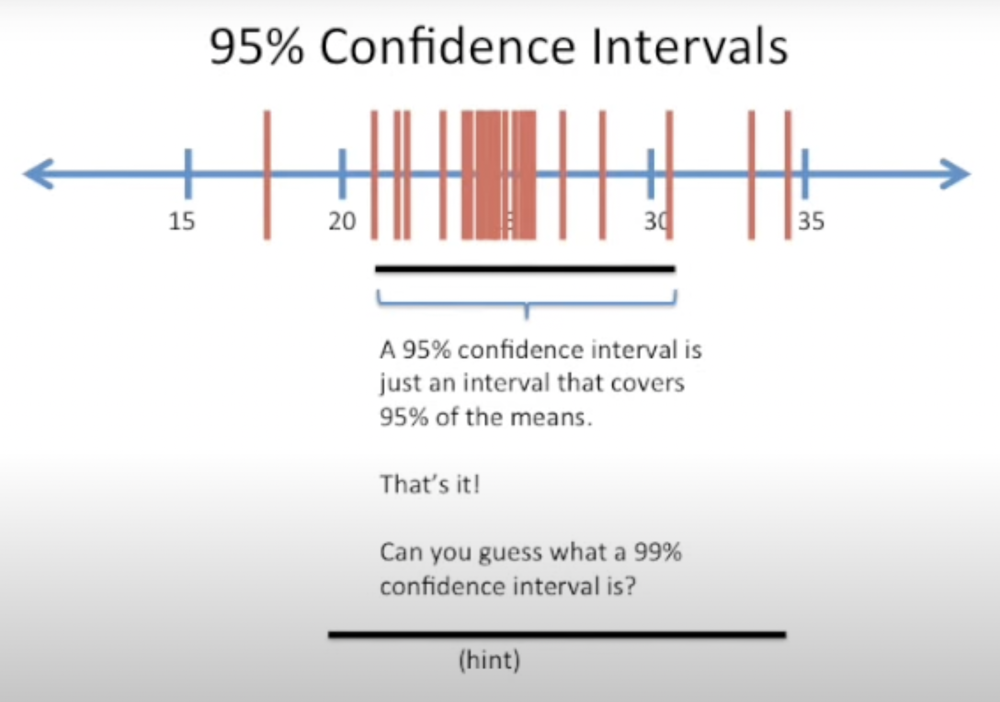
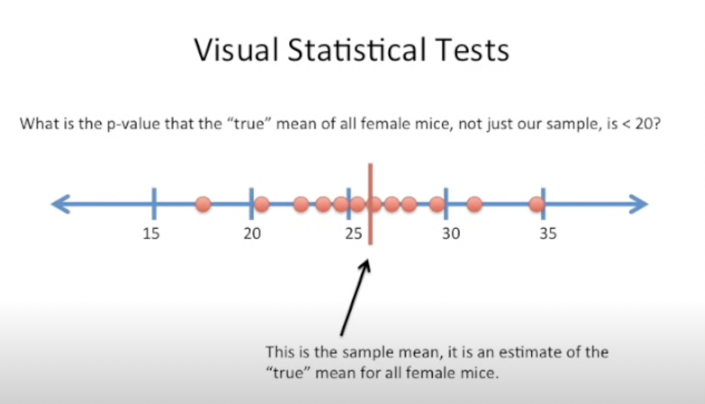
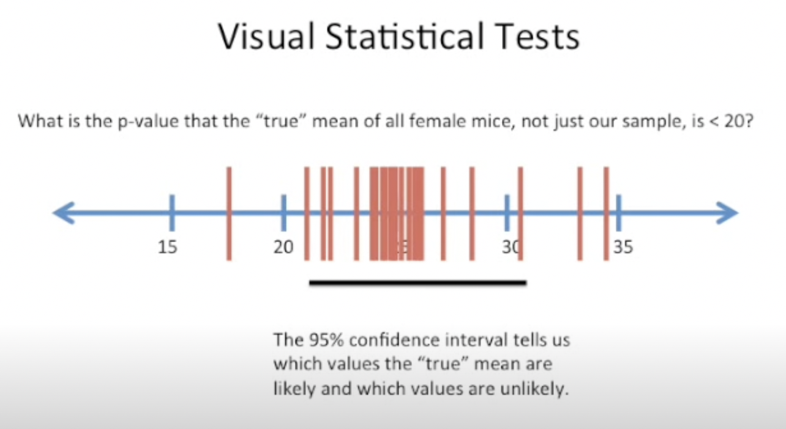
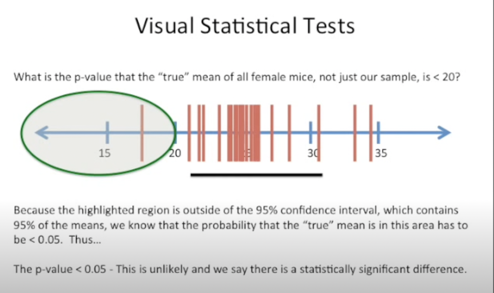
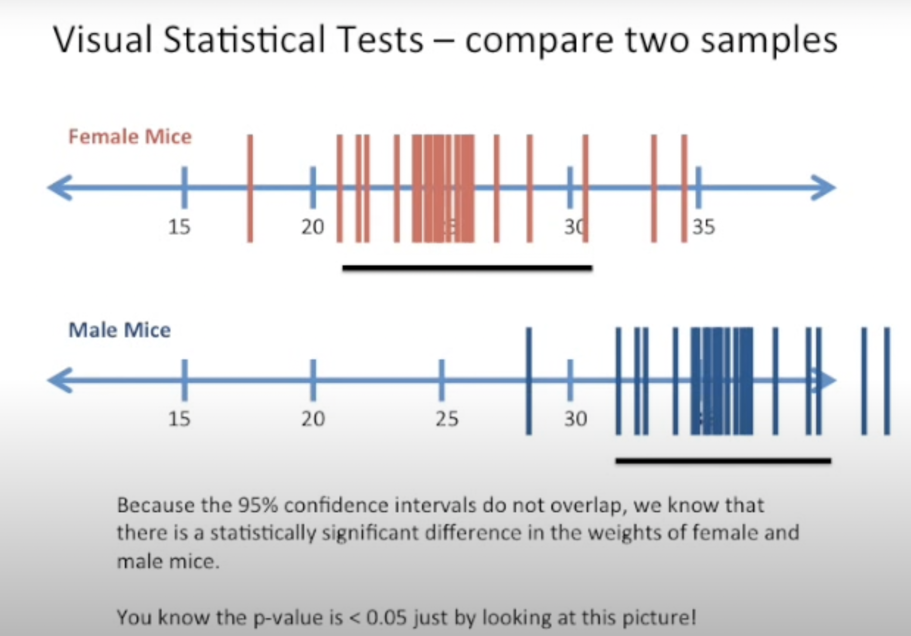
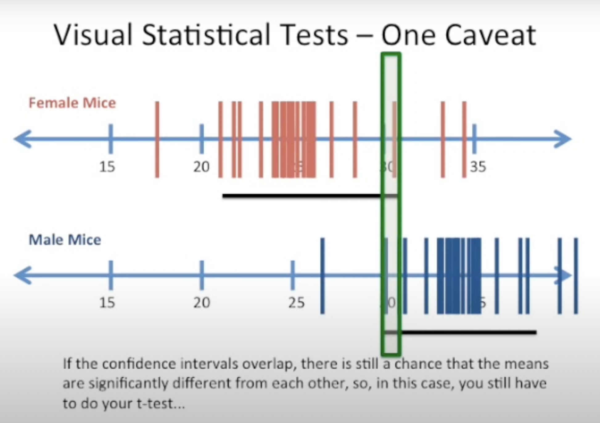

# Confidence Intervals

Many people misunderstand confidence intervals, often due to a lack of understanding of bootstrapping. While there are various methods to calculate confidence intervals, bootstrapping is a common approach.

## Bootstrap Refresher

- **Context**: Weighing female mice, with a sample size of 12.
- **Process**:
  1. Calculate the sample mean from these measurements.
  2. Use bootstrapping to estimate the global mean for all female mice.
  3. Bootstrap the sample by randomly selecting 12 weights (with replacement) and calculate the mean.
  4. Repeat the process to generate multiple means, often more than 10,000.

Imagine we weighted a bunch of female mice. In this case, we weighed 12 of them. Now we can take these 12 measurements and we can use them to calculate the sample mean. And we can use bootstrapping and the data that we have here to determine what values would be reasonable for the global worldwide mean of all female mice on the planet. Now after we calculate the sample mean, we can bootstrap the sample. 

To bootstrap the sample of 12 weights. We randomly select 12 weights from the original sample(duplicates are OK). This is called sampling with replacement. Now we calculate the mean of the random sample. After we’ve calculated the mean of our first random sample, all we have to do is repeat steps 1 and 2 until we’ve calculated a lot of means. Sometimes more than 10,000. Here’s what it looks like when we’ve calculated a lot of means.

## Confidence Intervals

- **95% Confidence Interval**: Covers 95% of the bootstrapped means, represented by the black bar.
- **99% Confidence Interval**: Covers 99% of the means that you calculated when you bootstrap the sample.

## Utility of Confidence Intervals

- Confidence intervals offer a visual form of statistical testing.
- Anything outside the 95% interval occurs less than 5% of the time, indicating a p-value < 0.05(and thus, significantly different).

## Visual Statistical Tests

### Estimating the True Mean
  
Here’s an example of a visual statistical test, you’ll remember we originally calculated the sample mean. The sample mean is an estimate of the “true” mean for all female mice. Well, with our confidence interval we can figure out what is the p-value that the “true” mean of all female mice, not just our sample, is < 20?

To perform that test, we draw our confidence interval which we know because of bootstrapping or some formula that we use.

We can see that the area left of 20 so values less than 20 or outside of our 95% confidence interval. Because the highlighted region is outside of the 95% confidence interval, which contains 95% of the means, we know that the probability that the “true” mean is in this area has to be < 0.05. Thus the p-value is less than 0.05. This is unlikely and we say there is a statistically significant difference between the true mean and any value less than 20.

### Comparing Two Samples

Here’s another example of a visual statistical test. In this case, we’re going to compare two samples. Here we’ve weighed female mice and now we have a sample of male mice we’ve already done the bootstrapping on that sample and here in the figure we just show the means from that bootstrapping, because the 95% confidence intervals do not overlap. We know that there is a statistically significant difference in the weights of female and male mice. That is to say we know that the p-value is less than 0.05 just by looking at the picture.

### Overlapping Confidence Intervals

There is one caveat to that and to illustrate that caveat I’ve shifted the means a little bit over to the left so that now the confidence intervals overlap. If the confidence intervals overlap, there is still a chance that the means are significantly different from each other. So in this case, you still have to do the t-test. But when the confidence intervals do not overlap then you can rest assured that there’s a statistically significant difference between those two means.

## Reference:
- [Watch the video1 on YouTube](https://www.youtube.com/watch?v=TqOeMYtOc1w)
