# Standard Deviation vs Standard Error
## Example: Weighing Mice

Imagine we weighed five mice. Below is the average (or mean) of the values we measured and the standard deviation on both sides of the mean, quantifying how much the data are spread out.

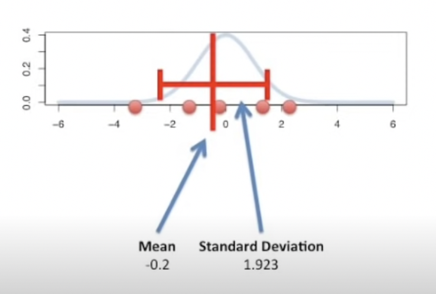
   
## Experiment Repetition

Now imagine we did the exact same experiment(weighed 5 mice), 5 separate times, using different mice each time. This would result in 5 means(averages), one for each set of measurements. We would also have 5 separate standard deviations around the means, one for each set of measurements. They quantify how much the measurements are spread around their means.

   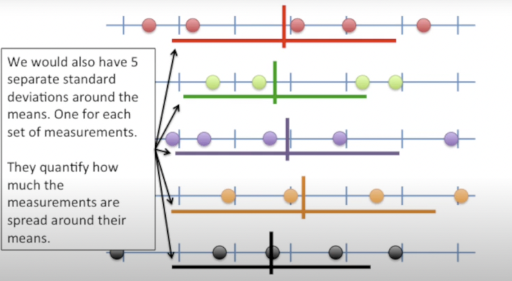

## Mean of Means

Plotting all 5 means on the same number line, we observe the mean of these means and the standard deviation on both sides of the mean of the means. The standard deviation of the means is called the standard error.

   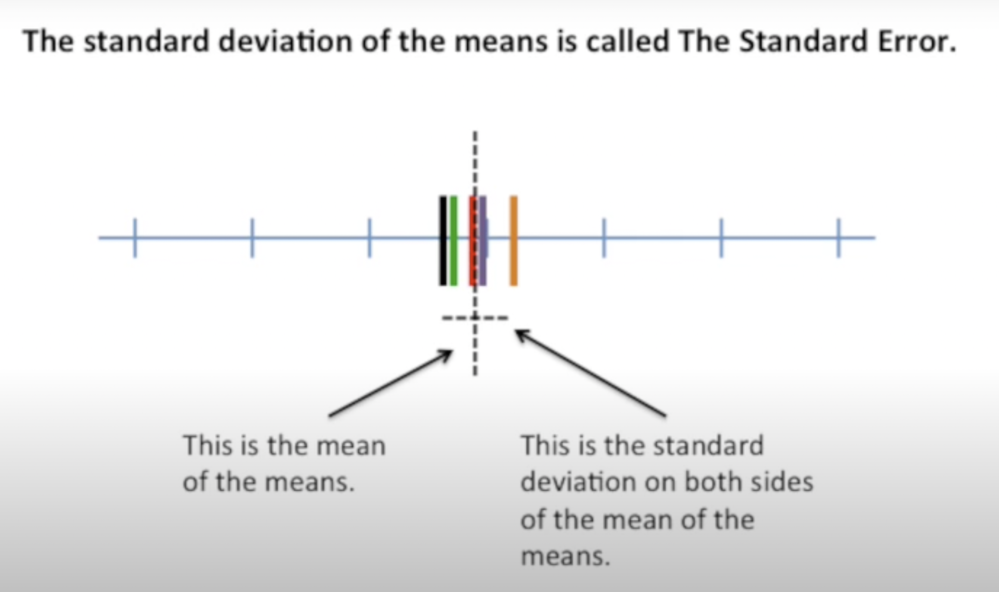

## Summary

- **Standard Deviation**: Quantifies variation within a set of measurements.
- **Standard Error**: Quantifies variation in means from multiple sets of measurements.

- The confusing thing is that the standard error can be estimated from a single set of measurements, even though it describes the means from multiple sets. Thus, even if you only have a single set of measurements, you are often given the option to plot the standard error.

In almost all cases, you should plot the standard deviation, since graphs are usually intended to describe the data that you measured.

# Standard Error

## Error Bars
First let’s talk about error bars, which are very related to standard error.
For example, we collected measurements from three examples labeled A/B/C and plotted a scatter plot. Then we can calculate the averages for the 3 datasets, and plot them as green horizontal bars approximately midway between the data points. After that we can calculate the standard deviation and add those to the graph, which is the red error bars.

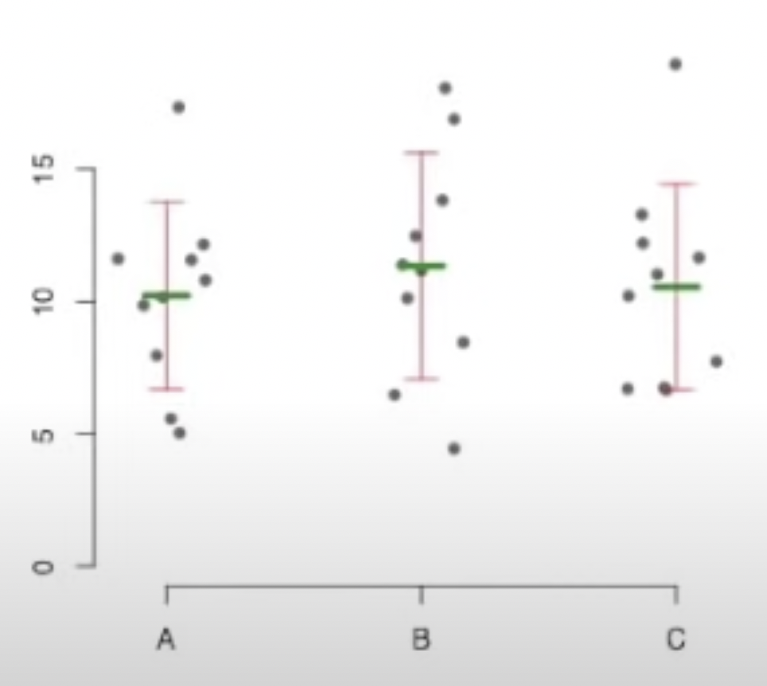

## Dynamite Graph

In manuscripts and presentations, people usually don’t show actual data, instead, it shows the mean and standard deviation. This is called a dynamite graph. That’s because each column of the graph look like an igniter on a stick of dynamite.

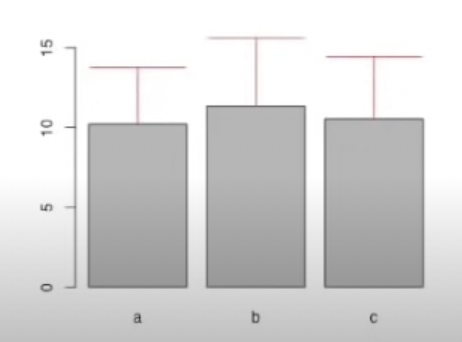

## Common Error Bars

There are 3 common error bars.
1. standard deviations
-These tell you how the data is distributed around the mean
-Big standard deviations tell you that some of the data points were pretty far from the mean
-In most cases, this is what you should use in your graphs since it tells us about your data. The data points that you collected yourself.
2. Standard errors
-These tell you how the mean is distributed. Not just the data, but the means.(This will become clear when I draw some pictures)
3. confidence intervals
-These are related to standard errors

## Normal Distribution

Let’s start with a normal distribution
In this case, imagine we weighted a lot of mice and plotted a distribution of differences from the mean. Y axis is the proportion of mice we measured, and the x-axis is the difference from the mean. Most of the mice had weights close to the average. A few mice weighted much less than the average mouse and a few other mice weighted much more than the average mouse.

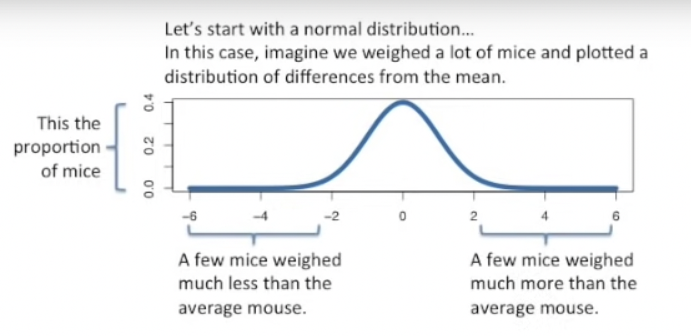

## Sampling and Standard Deviation

Usually you can’t afford measure the weight of all the mice, so we just take a sample. In this example, we’re just assume we took five measurements from the population rather than measuring all the mice. Since most mice have weights close to average, most of our samples are close to 0. Now calculate the mean and standard deviation from our sample. In this case, the mean is -0.2 and the standard deviation is 1.923. We can plot this mean and standard deviation on a graph by adding or subtracting standard deviations around the mean.

1 standard deviation on each side of the mean is supposed to cover about 68% of the data.
2 standard deviation on each side of the mean is supposed to cover about 95% of the data.

Now we take another 5 measurements and calculate the mean and standard deviation using these 5 values. Then we plot the mean and the standard deviation on each sides. Then we take another five measurements, this is the first sample or first measurement with relatively extreme values. However, this one measure does not take the mean away from 0. That means the means are relatively close to each other compared to the raw data. This is because for a mean to be way far from the middle, most, if not all of the raw data points would have to be clustered way far away from the middle. For example, in a sample of purple dots, all dots from a group far from the centre. This could happen, but very rarely.

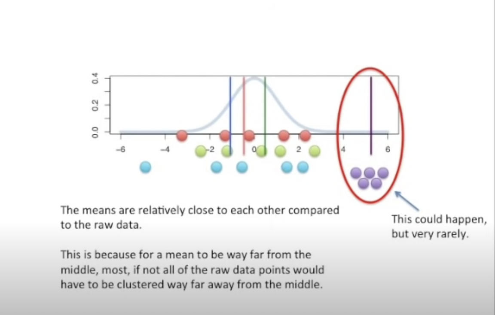

## Standard Deviation of Means

Much more likely is that most of the points are close to zero, with only one or two points far away.
So far, we’ve shown that you can calculate the standard deviations of each sample. But now that we have three means, we can also calculate the standard deviation of the means. Because 1 standard deviation will cover 68% of the values(and 2 will cover 95% of the values) the standard deviation of the means won’t be as big as the standard deviations of the data. Here in the graph, we plot the means of the means and also the standard deviation of the means. Note that the standard deviations here are much smaller than the standard deviations we got for individual samples.

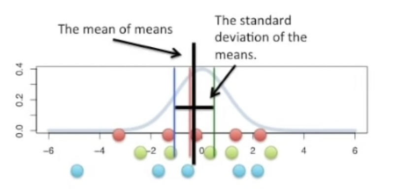

## Standard Error of the Mean

The standard deviation of the mean is called the standard error. The standard error gives you a sense of how spread out the means would be if you sampled five independent measurements. This gives us a sense of how much variation we can expect in our “means” if we took a bunch of independent 5 measurement samples.

Let’s review how to calculate the standard error of the mean.
1. we take a bunch of samples(each with the same number of measurements, or N). In this case, n is 5.
2. Calculate the mean for each sample
3. Calculate the standard deviation of the means.

The standard error is less than the sample standard deviations because means aren’t as dispersed. 

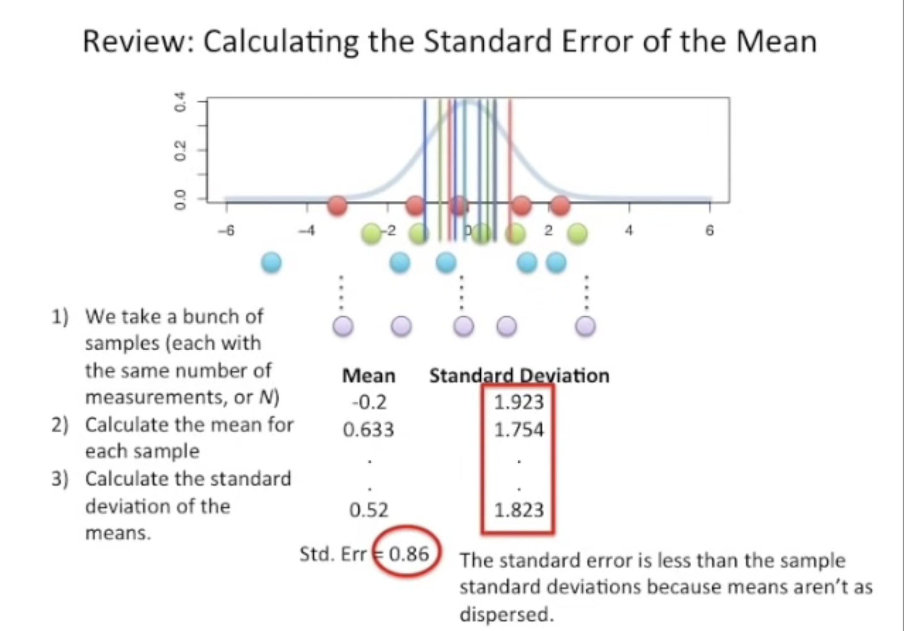

## Standard Error of Other Statistics

So far, we have shown how to find the standard error of the mean, but there are other standard errors.
For example, we can also take the standard deviation of the standard deviations. This is called the standard error of the standard deviations. (I guess to avoid a tongue twister). It tells us how the standard deviations of multiple samples are dispersed. You can calculate the standard deviation of any statistic(i.e. median, mode. Percentiles etc.) that you calculate for multiple samples.

You get the “standard error of…” what ever that statistic is.

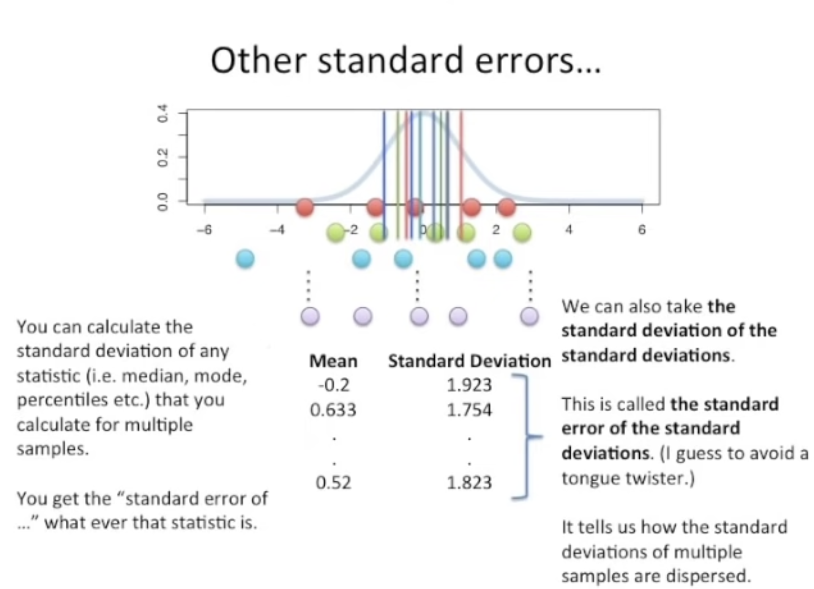

To summarize what we’ve said so far, we know that standard error is simply the standard deviation of multiple means taken from the same population. So there is a population, and we can take a bunch of different samples from it, all we have to do to find the standard error is to find the standard deviation of the means of each sample.

## Bootstrapping

Well, at this point, you might wondering can we calculate standard errors without spending a lot of time/money on doing the experiment a bunch of times?
Yes!
-In rare cases, there is a formula you can use to estimate it.
	-The standard error of the mean is one case(If the standard error of the mean is 1, the formula for it is very simple. It’s just the standard deviation divided by the square root of the sample size)
	-There aren’t many other cases
-You van use “bootstrapping” for everything else!
	-it’s conceptually very simple
	-it’s easy to make a computer do the work

Here is a bootstrapping example:
Pick a random measurement
Write down the value
Go to step 1 until you have 5 measurements
Calculate the mean/median/mode/etc on your sample
Go to step 1 and repeat until you have a lot of means/medians etc
Calculate the standard deviation of the means/medians etc.

In this case, we calculate the standard error of the means.we plot it as the black line in the graph

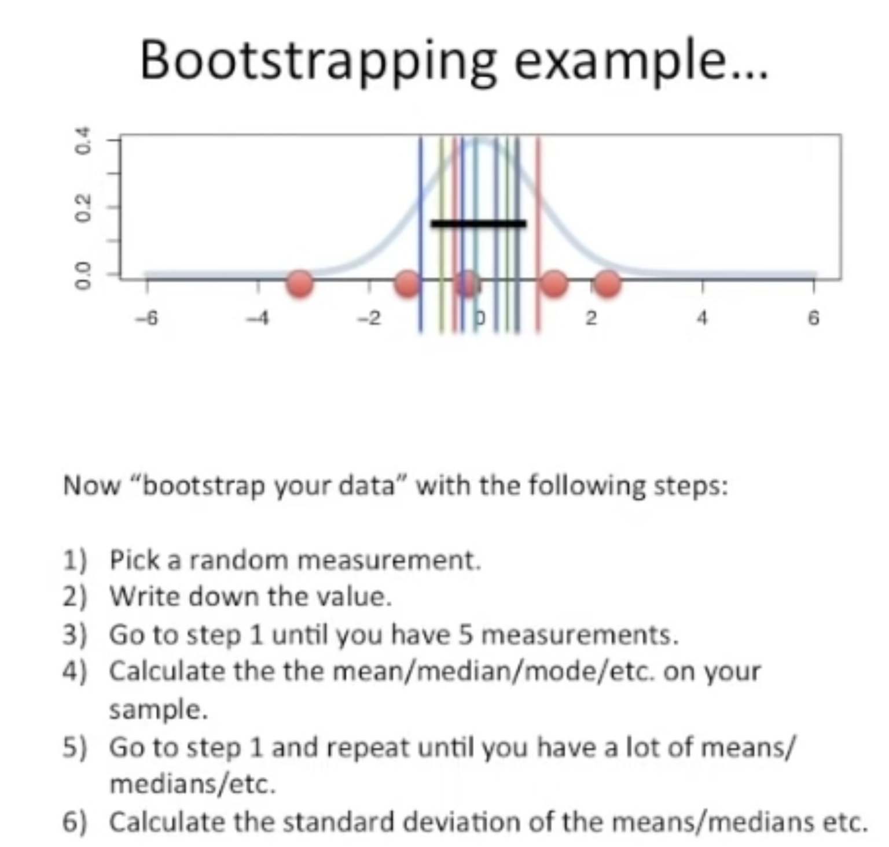

## Reference:
- [Watch the video1 on YouTube](https://www.youtube.com/watch?v=A82brFpdr9g)
- [Watch the video2 on YouTube](https://www.youtube.com/watch?v=XNgt7F6FqDU)
