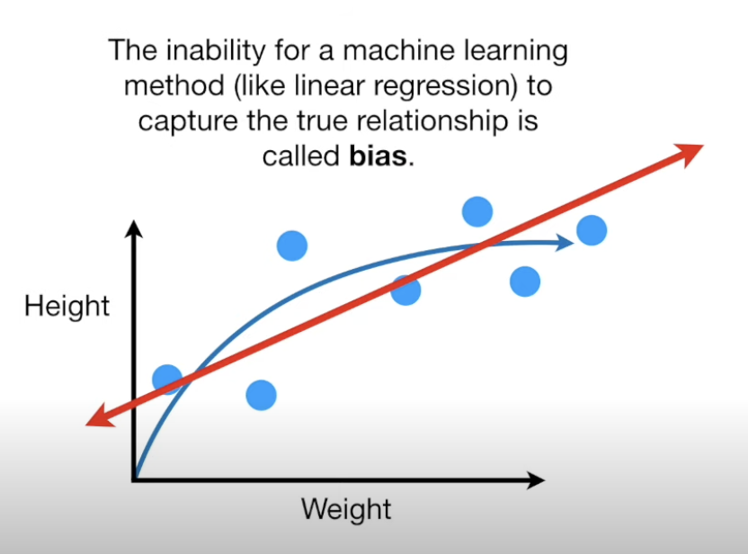

## Bias

Bias refers to the assumptions made by a model to simplify the learning process. The inability of a model (e.g., linear regression) to capture the true relationship in the data results in bias.

For instance, assuming the data is linear when it's actually quadratic introduces significant bias. A high bias model makes many assumptions, simplifying the model excessively and often leading to underfitting.

High bias can lead to models that underperform because they fail to capture the complexity of the data.
