# Understanding Correlation

We can quantify the strength of the relationship with correlation. In other words, these data, with a relatively weak relationship, have a small correlation value, and the data with a moderate relationship have a moderate correlation value and the data with a  strong relationship have a relatively large correlation value.
The maximum value for correlation is 1. Correlation = 1 is when a straight line with a positive slope can go though the centre of every data point. That means if someone gave us a value for gene x, then we would guess that gene Y had a value in a very very narrow range.

Note: Correlation does not depend on the scale of the data. In fact, I intentionally omitted putting numbers on the axes because they do not affect correlation at all. In other words, regardless of the scale of the data, correlation = 1 when a straight line with a positive slope can go through all of the data. That means that correlation can equal 1 when the slope is large and when the slope is small. Note: when a straight line with positive slope goes through the data, correlation = 1 regardless of how much data we have. For example, if only had 2 data points, then we can draw a straight line with a positive slope by just connecting the two dots and then correlation = 1 and that makes the relationship appear strong but we should not have any confidence in predictions made with this line because we have so little data.
To understand why we should have low confidence in correlations made with a small datasets, is because the probability that wen can draw a straight line through the same number of randomly placed points gets smaller and smaller with each additional point.

When we’re talking about correlation, we’re only talking about using straight lines. For correlation, a p-value tells us the probability that randomly drawn dots will result in a similarly strong relationship, or stronger. Thus, the smaller the p-value, the more confidence we have in the predictions we make with the line. In this case, the p-value is crazy small(2.2x10^-16) which means that the probability of random data creating a similarly strong, or stronger relationship is crazy small(2.2x10^-16).

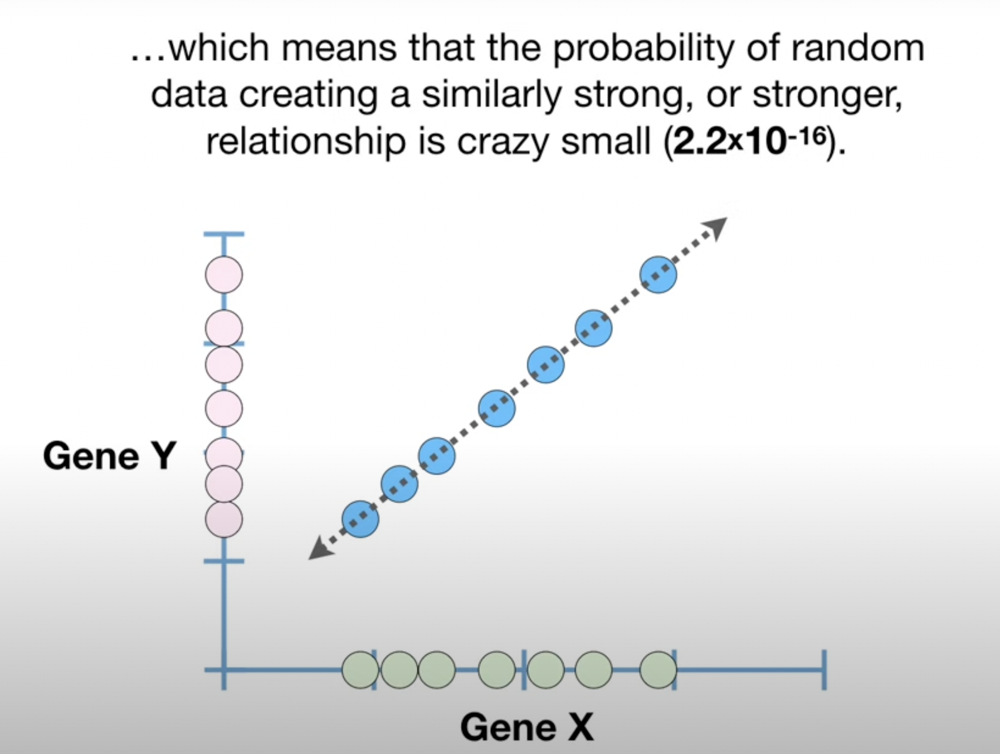

The maximum value for correlation, 1, occurs whenever you can draw a straight line with a positive slope that goes through all of the data and our confidence in how useful the relationship is depends on how much data we have.

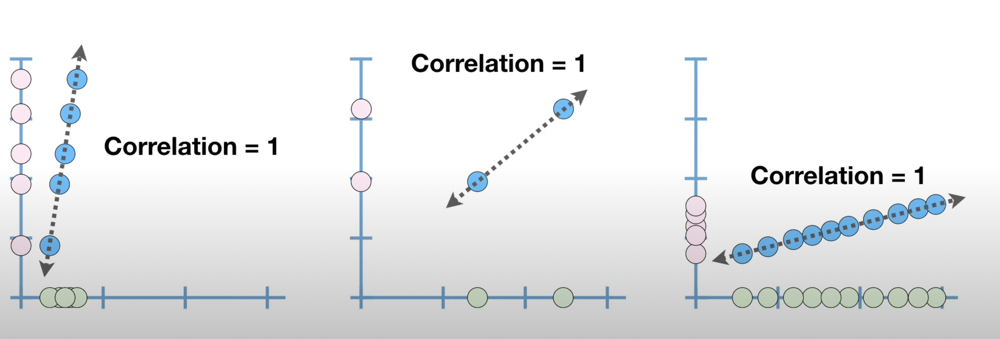 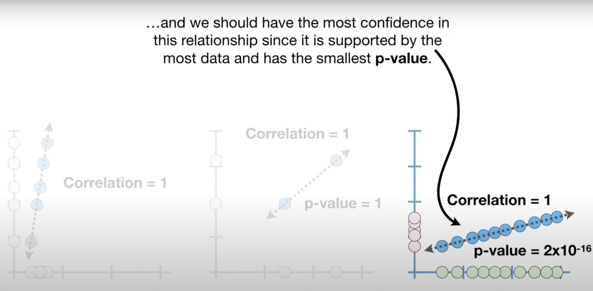

When a straight line with a negative slope can go through the centre of every data point, then the correlation = -1. Since a straight line can go through all of the data points, correlation = -1 implies that there is a strong relationship in the data.

If we had a lot of data, we could have a lot of confidence in the guess because the p-value would be super small. And the less data we have, the less confidence we have in the guess because the p-value gets larger.

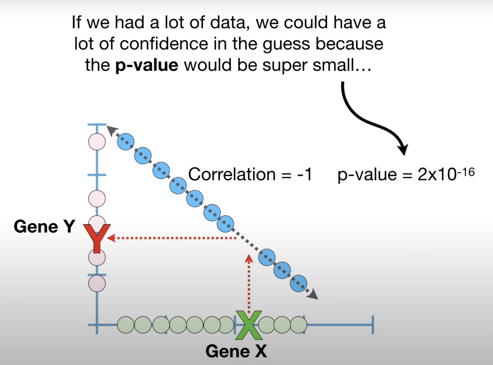

Just like before, as long as a straight line goes through all of the data and the slope of the line is negative, correlation = -1 when the slope is large and when the slope is small.

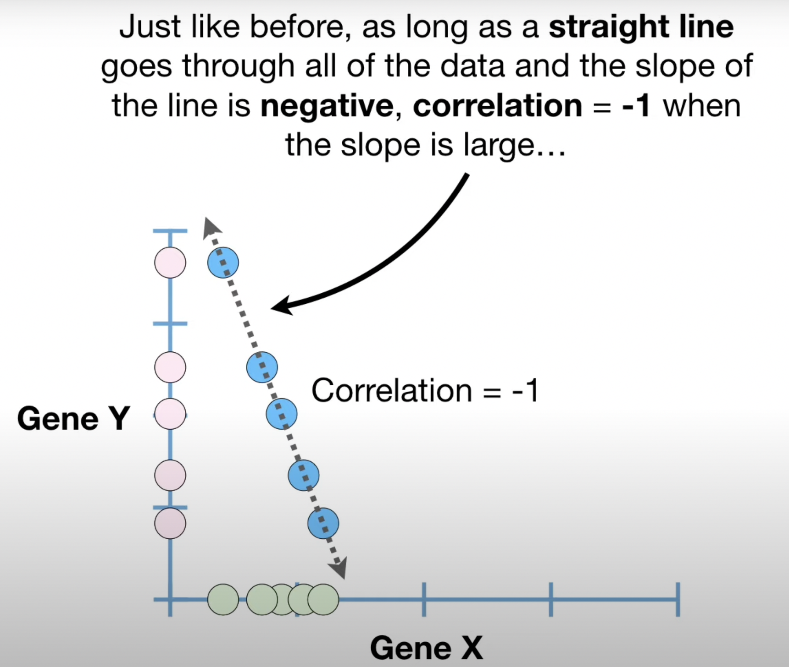 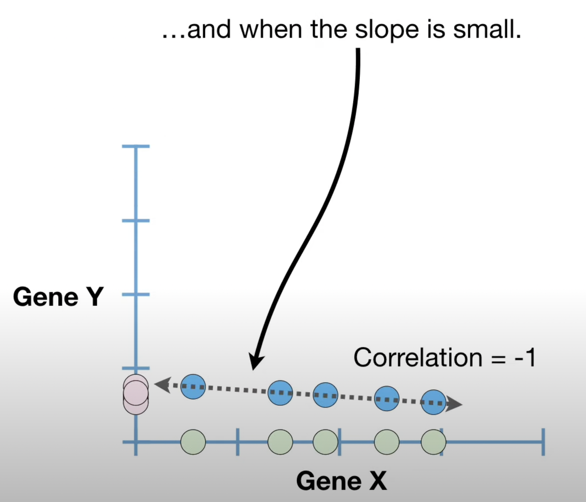

So far we’ve seen that when the slope of the line is negative, the strongest relationship has correlation = -1 and when the slope of the line is positive, the strongest relationship has correlation = 1.

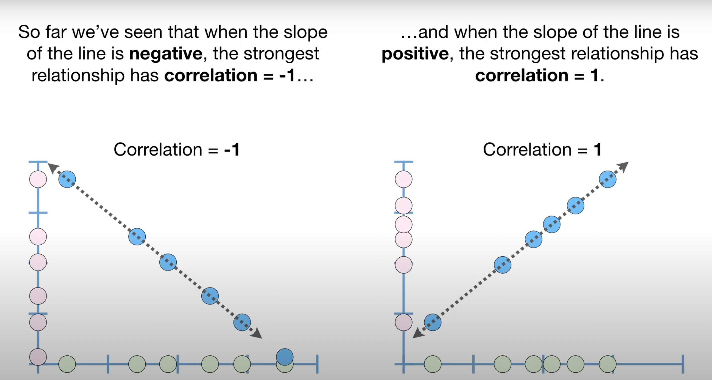

When correlation = 0, a value on the x-axis doesn’t tell us anything about what to expect on the y-axis because there is no reason to choose one value over another.
As long as the correlation value is not 0, we can still use the line to make inferences, but our guesses become more refined the closer the correlation values get to -1 or 1. And just like before, our confidence in our inferences depends on the amount of data we have collected and the p-value. In the left graph, we have very little confidence in the trend because we have very little data and the p-value = 0.8. In the middle, we have moderate confidence in the trend because we have more data and the p-value = 0.08, on the right, we have a lot of confidence in the trend because we have even more data and the p-value = 0.008.

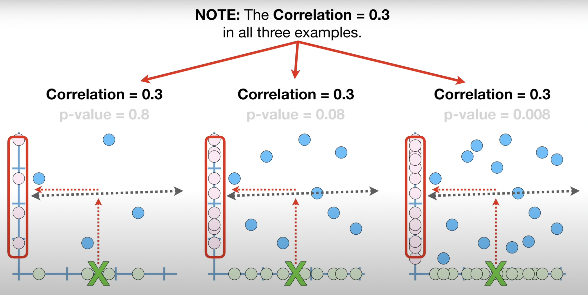

Note the correlation = 0.3 in all three examples. In this case, increasing the sample size did not increase correlation and that means adding data did not refine our guess. All it did was increase our confidence in the guess, thus our guess will probably be pretty bad in all 3 cases. However, we’ll have the most confidence in the bad guess that comes from the right most data. In other words, just because you have a lot of data and you have a lot of confidence in your guess if the correlation value is small, your guess will still be bad.

If you know how to calculate variance and covariance, calculating correlation is a snap.

If this were the data, then correlation = Covariance(Gene X, Gene Y)/根号下Variance(Gene X) * 根号下Variance(Gene Y)

 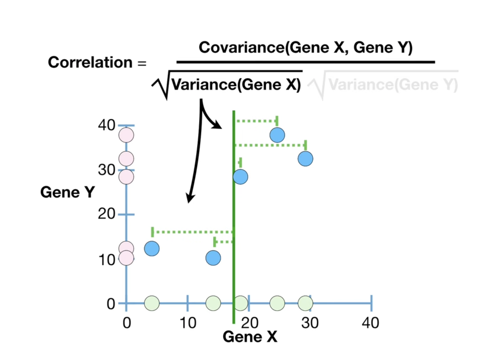 

The covariance can be any value between positive and negative infinity, depending on whether the slope of the line that represents the relationship is positive or negative, how far the data are spread out around the means and the scale of the data. Thus, when we calculate correlation, the denominator squeezes the covariance to be a number from -1 to 1. In other words, the denominator ensures that the scale of the data does not effect the correlation value, and this makes correlations much easier to interpret.
When the data all fall on a straight line with a positive or negative slope, then the covariance and the product of the square roots of the variance terms are the same and division gives us 1 or -1, depending on the slope. When the data do not all fall on a straight line with a positive or negative slope, then the covariance accounts for less of the variance in the data, and the correlation is closer to 0.
So for this graph where the correlation is 0.9 we can quantify our confidence in this relationship with a p-value. The smaller the p-value, the more confidence we can have in the guesses we make. In this case, the p-value is 0.03, which means there is 3% chance that random data could produce a similarly strong relationship, or stronger.

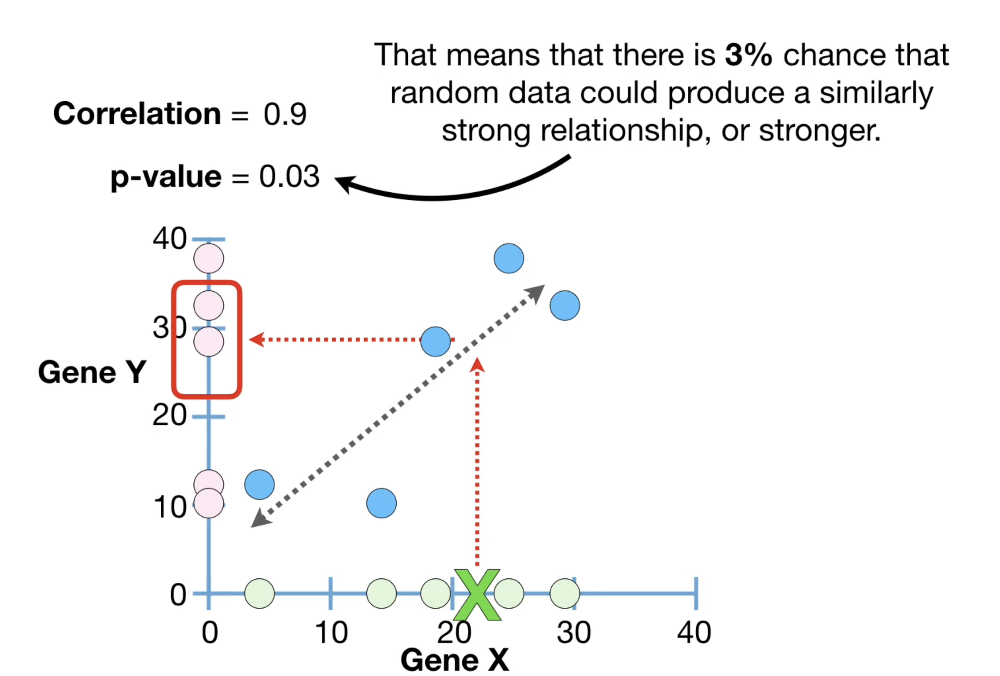

Even though correlation values are way easier to interpret than covariance values, they are still not super easy to interpret. For example, it’s not super obvious that this relationship, where correlation = 0.9, is twice as good at making prediction as this relationship, where correlation = 0.64.

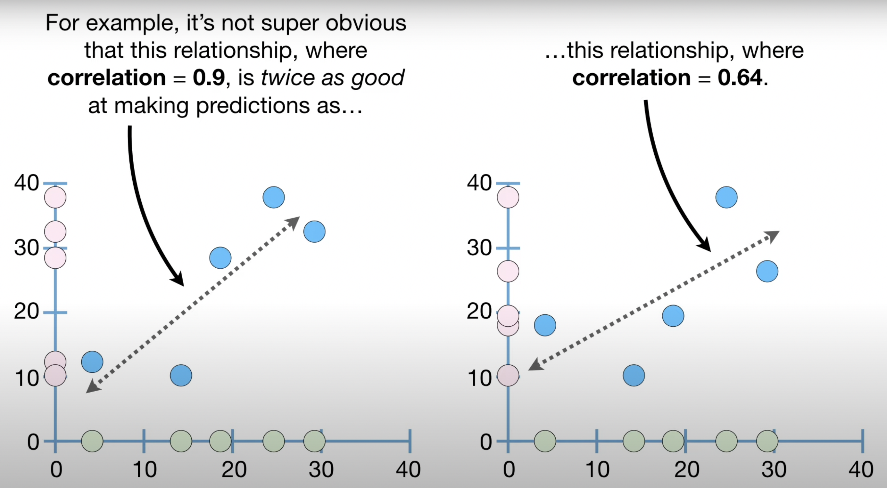

The good news is that R^2, which is related to correlation, solves this problem. Another awesome thing about R^2 is that it can quantify relationships that are more complicated than simple straight lines.

In summary, correlation quantifies the strength of relationships, weak relationship will have a small correlation value, moderate relationship will have moderate correlation value and strong relationship will have large correlation value.
Insert strength-relationship graph
Correlation values go from -1, which is the strongest linear relationship with a negative slope to 1, which is the strongest linear relationship with a positive slope. In both cases, if a straight line can not go through all of the data, then we will get correlation values closer to 0 and the worse the fit, the closer the correlation values get to 0. And when there is no relationship that we can represent with a straight line, correlation = 0.
Lastly, our confidence in our inferences depends on the amount of data we have collected and the p-value.

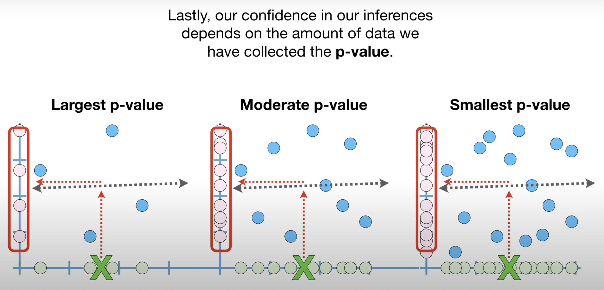

The more data we have, the smaller the p-value and the more confidence we have our inferences.
