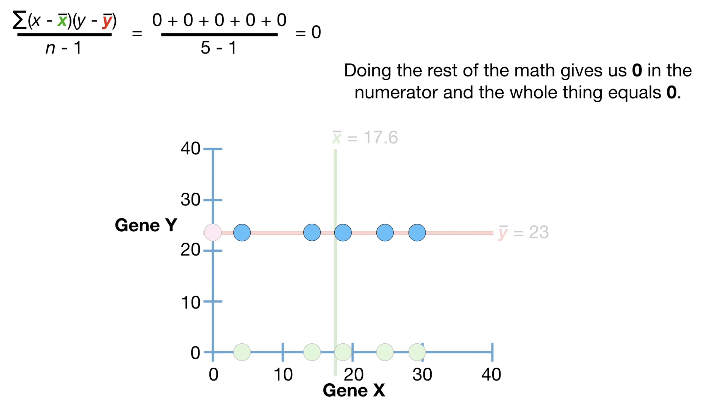
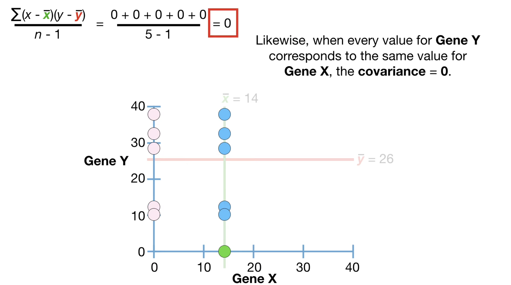
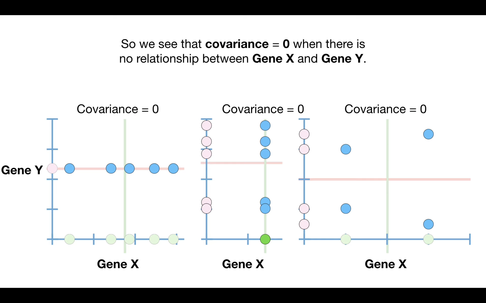

# Covariance

Imagine we counted the number of green apples in 5 different grocery stores and we also counted the number of red apples in the same 5 grocery stores. Then we estimated the mean and variance for two different types of apples counted in the same five grocery store:

Since these measurements were taken from the same cells(or the same grocery stores), we can look at them in pairs. Here is the graph:

In this graph, both measurements are less than their respective mean values.

Since these measurements were taken in pairs, the question is:
"Do the measurements, taken as pairs, tell us something that the individual measurements do not?"

Covariance is one way to try to answer this question.

Since the measurements came from the same cells(or grocery stores), we can plot each pair as a single dot by combing the values on the x and y-axes. 

Now, generally speaking, we see that cells with relatively low values for gene X also have relatively low values for gene Y, cells with relatively high values for gene X also have relatively high values for gene Y.

This relationship, low measurements for both genes in some cells and high measurements for both genes in other cells, can be summarized with this line. Note: the line that represents this particular relationship has a positive slope, and it reflects the positive trend where the values for gene x and gene y increase together.

- **The main idea behind covariance is that it can classify three types of relationships.**:
  - Relationships with positive trends
  - Relationships with negative trends
  - Times when there is no relationship because there is no trend

 

 

The other main idea behind covariance is kind of a bummer, covariance, in and of itself, is not very interesting. What I mean by that is you will never calculate covariance and be done for the day. Instead covariance is a computational stepping stone to something that is interesting, like correlation. Let's talk about how covariance is calculated.
 ## Formula for Covariance

The covariance between two random variables, X and Y, is calculated using the following formula:

$\text{Cov}(X, Y) = \frac{\sum\limits_{i=1}^{n} (X_i - \bar{X})(Y_i - \bar{Y})}{n-1}$

Where:
- $\text{Cov}(X, Y)$ is the covariance between X and Y.
- $X_i$ and $Y_i$ are individual data points from the datasets X and Y, respectively.
- $\bar{X}$ and $\bar{Y}$ are the means (average values) of X and Y, respectively.
- $n$ is the number of data points.

To get an intuitive sense for how covariance is calculated, let’s go back to the mean value for gene x and extend the green line to the top of the graph, and then extend the red line that represents the mean for gene y to the edge of the graph. Now let's focus on the left-most data point.

 

Now let's plug in the gene x measurement for this cell and the mean value for gene x, which is $(x-\bar{X})$ is negative since it is to the left of the mean, similarly let's plug in the gene y measurement for this same cell and the mean value for gene y, which is $(y-\bar{Y})$ , which is also negative since it is below the mean. since both difference are negative, multiplying them together gives us a positive value.

So we see that when the values for gene x and gene y are both less or greater than their respective means, we end up with positive values. In summary, data in these two quadrants contribute positive values to the total variance.

 

Ultimately, we end up with a covariance = 116. Since the covariance value 116 is positive, it means that the slope of the relationship between Gene X and Gene Y is positive. In other words, ** when the coviance values is positive, we classify the trend as positive.**

 

For negative coviance value:

 

For calculating the covariance when there is no trend:
1. when every value for Gene X corresponds to the same value for Gene Y, the covariance = 0.

 

2. when every value for Gene Y corresponds to the same value for Gene X, the covariance = 0.

  

 3. Even though there are multiple values for Genes X and Y, there is still no trend because as Gene X increases, Gene Y increases and decreases.

 

In other words, the negative value for the left high point is cancelled out by the positive value of left low point. Thus the coviance is 0.

 

So we see that covariance = 0 when there is no relationship between gene X and gene Y.

 

## Interpretation of Covariance

**Note, the coviance value itself isn't very easy to interpret and depends on the context. For example, the covariance value does not tell us if the slope of the line representing the relationship is steep or not steep. It just tells us the slope is positive. More importantly, the coviance value doesn't tell us if the points are relatively close to the dotted line or relatively far from the dotted line. Again, it just tells us  that the slope of the relationship is positive.**

Even though covariance is hard to interpret, it is a computational stepping stone to more interesting things.

The sign of the covariance indicates the nature of the relationship between two variables:

- If $\text{Cov}(X, Y) > 0$, it suggests a positive relationship. This means that as one variable increases, the other tends to increase as well.

- If $\text{Cov}(X, Y) < 0$, it indicates a negative relationship. This means that as one variable increases, the other tends to decrease.

- If $\text{Cov}(X, Y) = 0$, it implies no linear relationship between the variables. However, it's essential to note that a covariance of zero does not necessarily mean there is no relationship; it only means there is no linear relationship.

## Importance in Machine Learning

Covariance is particularly relevant in machine learning for the following reasons:

1. **Linear Regression**: In linear regression analysis, covariance is used to determine the relationship between independent and dependent variables. It helps in estimating the coefficients of the regression equation.

2. **Principal Component Analysis (PCA)**: PCA involves calculating the covariance matrix of the data to find the principal components. Covariance information is crucial for dimensionality reduction and feature selection.

3. **Multivariate Analysis**: When dealing with multiple variables or features, understanding the covariance between them can help identify which variables are related and should be considered together.

4. **Risk and Portfolio Management**: In finance, covariance is used to measure the relationship between different assets' returns. It is essential for portfolio diversification and risk assessment.

## Limitations

Covariance has some limitations:

1. **Scale Dependence**: Covariance is sensitive to the scale of the variables. Changing the units or scales of the variables can affect the covariance value. To address this, the correlation coefficient is often used, which is a standardized version of covariance.

2. **Lack of Interpretability**: The magnitude of covariance does not provide a clear measure of the strength of the relationship between variables. Correlation, which ranges from -1 to 1, is often used for this purpose.

3. **Assumes Linearity**: Covariance primarily measures linear relationships between variables. It may not capture nonlinear dependencies.

## Conclusion

Covariance is a valuable statistical tool for understanding the relationship between two variables. In machine learning and statistics, it is used to analyze data, build regression models, and make decisions about dimensionality reduction. While it has its limitations, it remains a fundamental concept in data analysis and modeling.
