# Covariance

Covariance, a statistical measure, provides insights into how two variables change together.

## Visualizing Covariance Through Paired Measurements

Imagine we counted the number of green apples in 5 different grocery stores and we also counted the number of red apples in the same 5 grocery stores. Then we estimated the mean and variance(just for a simple review of variance) for two different types of apples counted in the same five grocery store:

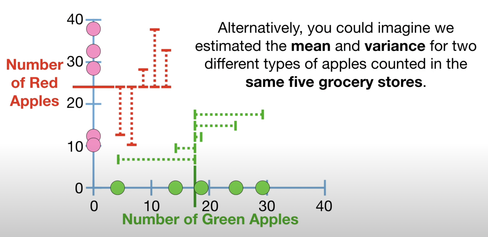

> Note: For further explanation, I will use Genes X and Genes Y instead of green apple and red apple. 
>

Since these measurements were taken from the same cells(or the same grocery stores), we can look at them in pairs. Here is the graph:

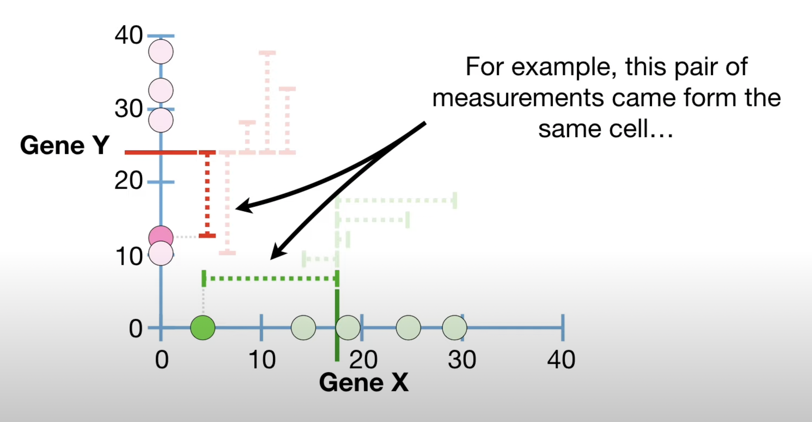

In this graph, both measurements are less than their respective mean values.

Since these measurements were taken in pairs, the question is:
"Do the measurements, taken as pairs, tell us something that the individual measurements do not?"

Covariance is one way to try to answer this question.

Since the measurements came from the same cells(or grocery stores), we can plot each pair as a single dot by combing the values on the x and y-axes. 

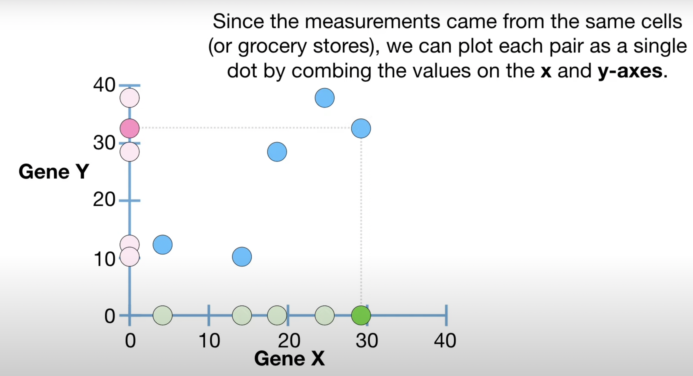

Now, generally speaking, we see that cells with relatively low values for gene X also have relatively low values for gene Y, cells with relatively high values for gene X also have relatively high values for gene Y.

This relationship, low measurements for both genes in some cells and high measurements for both genes in other cells, can be summarized with this line. Note: the line that represents this particular relationship has a positive slope, and it reflects the positive trend where the values for gene x and gene y increase together.

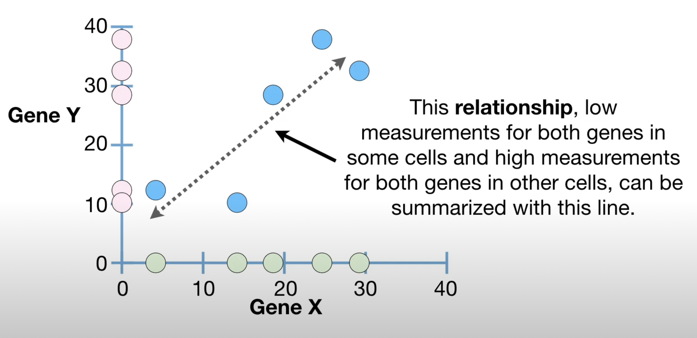

- **The main idea behind covariance is that it can classify three types of relationships.**:
  - Relationships with positive trends
  - Relationships with negative trends
  - Times when there is no relationship because there is no trend

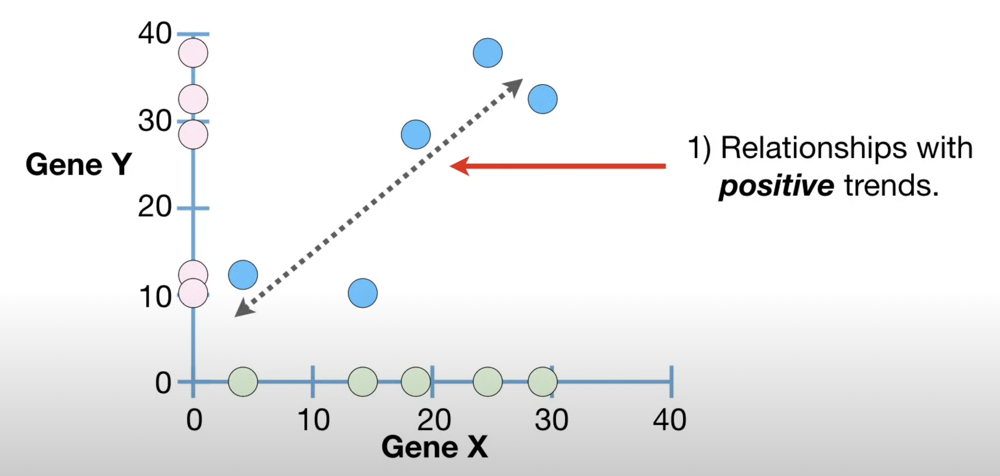 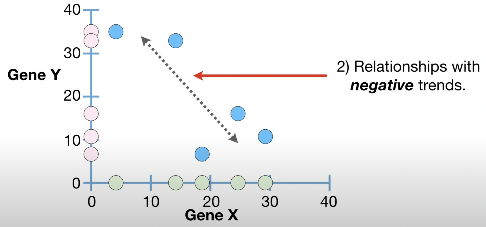

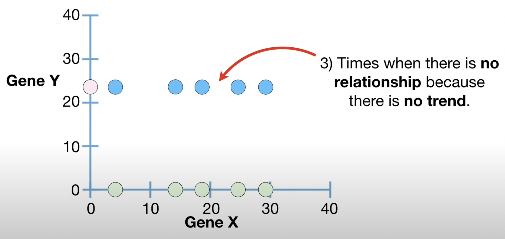 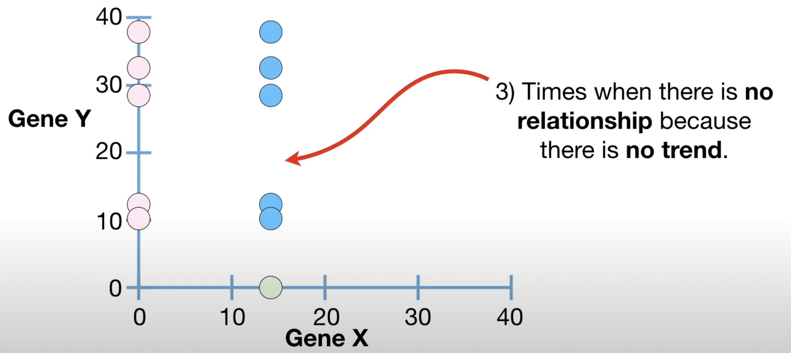

The other main idea behind covariance is kind of a bummer, covariance, in and of itself, is not very interesting. What I mean by that is you will never calculate covariance and be done for the day. Instead covariance is a computational stepping stone to something that is interesting, like correlation. Let's talk about how covariance is calculated.
 ## Calculating Covariance: The Formula

The covariance between two random variables, X and Y, is calculated using the following formula:

$\text{Cov}(X, Y) = \frac{\sum\limits_{i=1}^{n} (X_i - \bar{X})(Y_i - \bar{Y})}{n-1}$

Where:
- $\text{Cov}(X, Y)$ is the covariance between X and Y.
- $X_i$ and $Y_i$ are individual data points from the datasets X and Y, respectively.
- $\bar{X}$ and $\bar{Y}$ are the means (average values) of X and Y, respectively.
- $n$ is the number of data points.

To get an intuitive sense for how covariance is calculated, let’s go back to the mean value for gene x and extend the green line to the top of the graph, and then extend the red line that represents the mean for gene y to the edge of the graph. Now let's focus on the left-most data point.

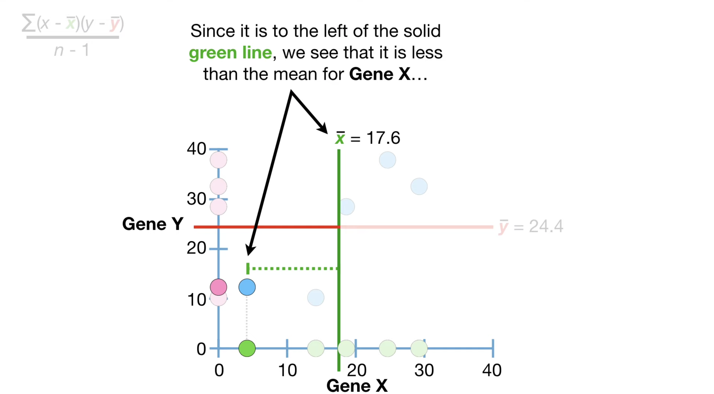 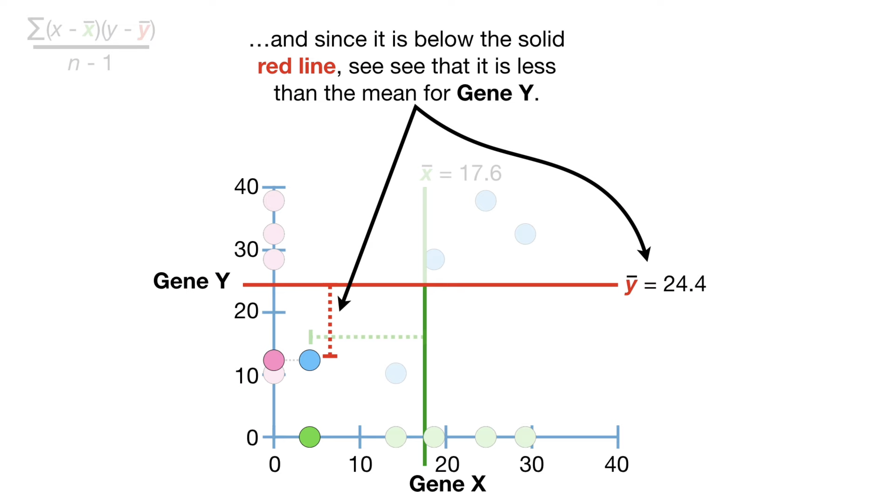

Now let's plug in the gene x measurement for this cell and the mean value for gene x, which is $(x-\bar{X})$ is negative since it is to the left of the mean, similarly let's plug in the gene y measurement for this same cell and the mean value for gene y, which is $(y-\bar{Y})$ , which is also negative since it is below the mean. since both difference are negative, multiplying them together gives us a positive value.

So we see that when the values for gene x and gene y are both less or greater than their respective means, we end up with positive values. In summary, data in these two quadrants contribute positive values to the total variance.

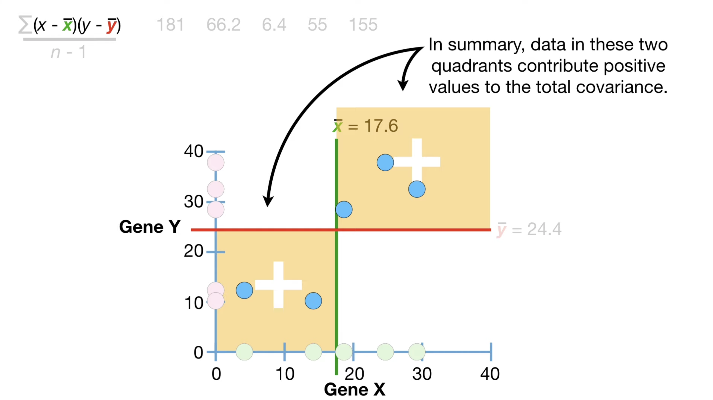 

Ultimately, we end up with a covariance = 116. Since the covariance value 116 is positive, it means that the slope of the relationship between Gene X and Gene Y is positive. In other words, ** when the covariance values is positive, we classify the trend as positive.**

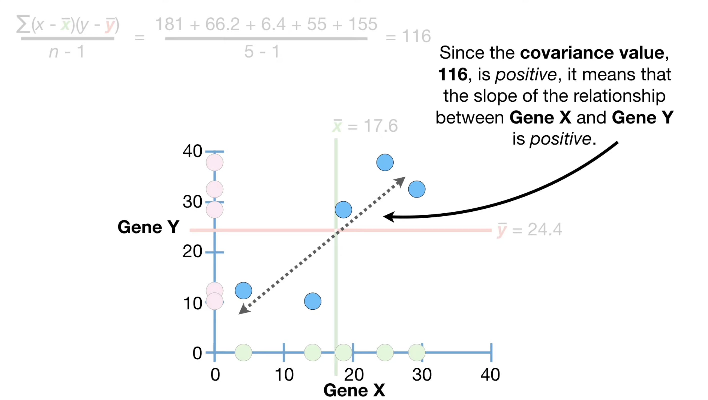 

For negative covariance value:

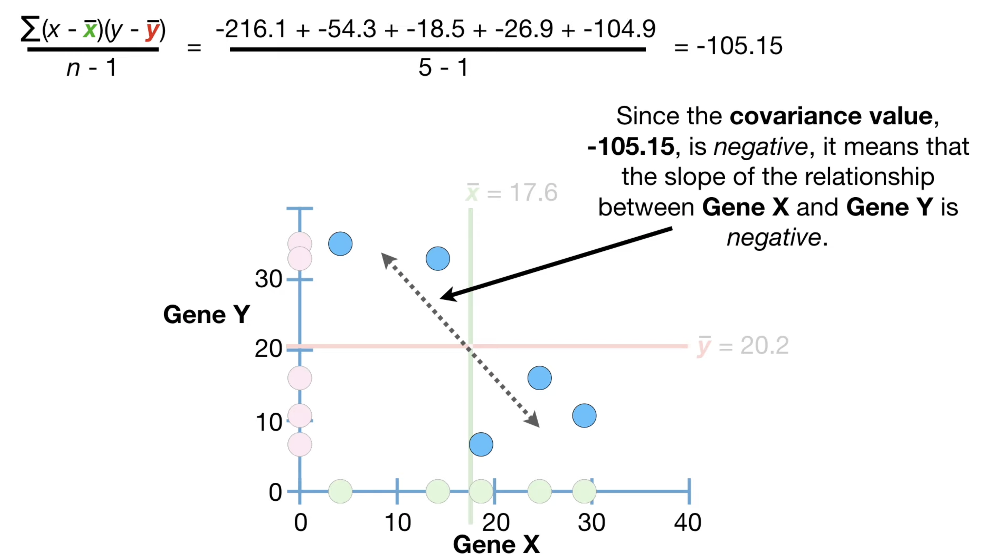 

For calculating the covariance when there is no trend:
1. when every value for Gene X corresponds to the same value for Gene Y, the covariance = 0.

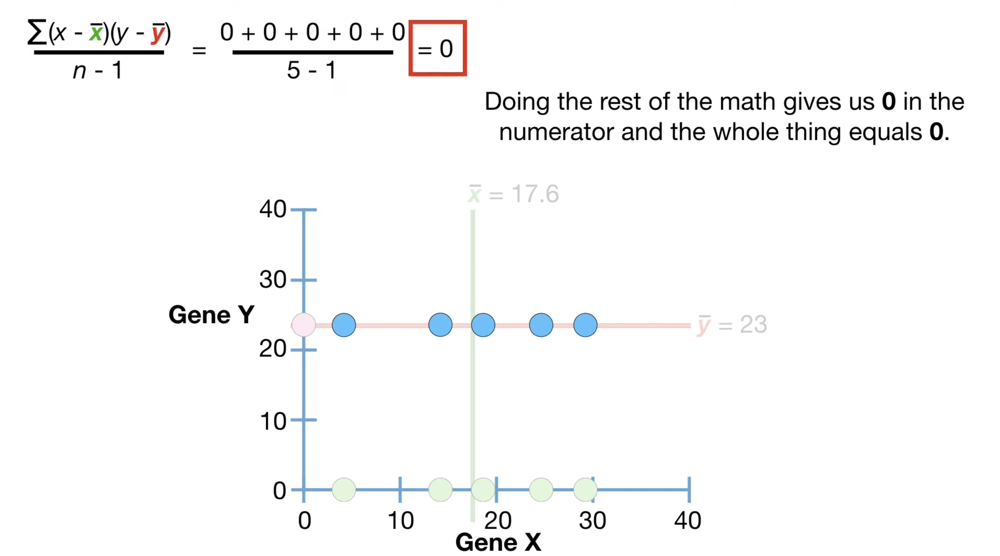 

2. when every value for Gene Y corresponds to the same value for Gene X, the covariance = 0.

  

 3. Even though there are multiple values for Genes X and Y, there is still no trend because as Gene X increases, Gene Y increases and decreases.

 

In other words, the negative value for the left high point is cancelled out by the positive value of left low point. Thus the covariance is 0.

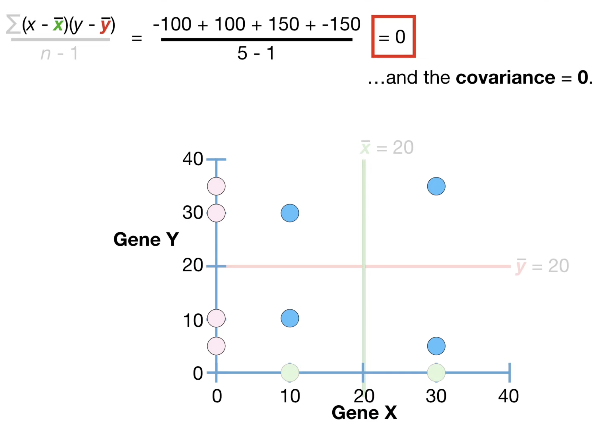 

So we see that covariance = 0 when there is no relationship between gene X and gene Y.

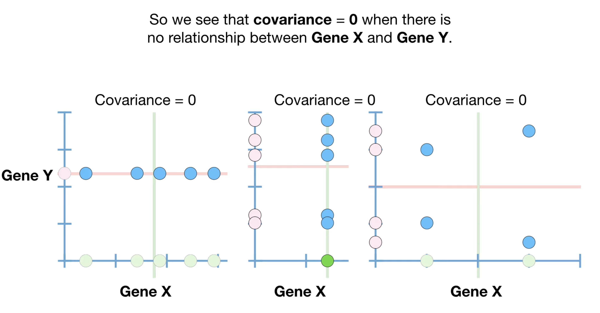 

## Interpretation of Covariance

**Note, the covariance value itself isn't very easy to interpret and depends on the context. For example, the covariance value does not tell us if the slope of the line representing the relationship is steep or not steep. It just tells us the slope is positive. More importantly, the covariance value doesn't tell us if the points are relatively close to the dotted line or relatively far from the dotted line. Again, it just tells us  that the slope of the relationship is positive.**

Even though covariance is hard to interpret, it is a computational stepping stone to more interesting things.

Why covariance is hard to interpret?

Let's go all the way back to looking at just Gene X and calculate the covatiance between Gene X and itself.

Then $\text{Cov}(X, X) = \frac{\sum\limits_{i=1}^{n} (X_i - \bar{X})(Y_i - \bar{Y})}{n-1} = \frac{\sum\limits_{i=1}^{n} (X_i - \bar{X})(X_i - \bar{X})}{n-1} = \frac{\sum\limits_{i=1}^{n} (X_i - \bar{X})^2}{n-1}$ $ Which is the formula for estimating variance.

In other words, the covariance for Gene X with itself is the same thing as the estimated variance for Gene X. then the covariance for Gene Xby calculation is 102, since the covariance value is positive, we know that the relationship between gene x and itself has a positive slope.

 

When we multiply the data by 2, the relative positions of the data did not change, and each dot still falls on the same straight line with positive slope. The only thing that changed was the scale that the data is on. however, when we do the math, we get covariance = 408, which is 4 times what we got before.

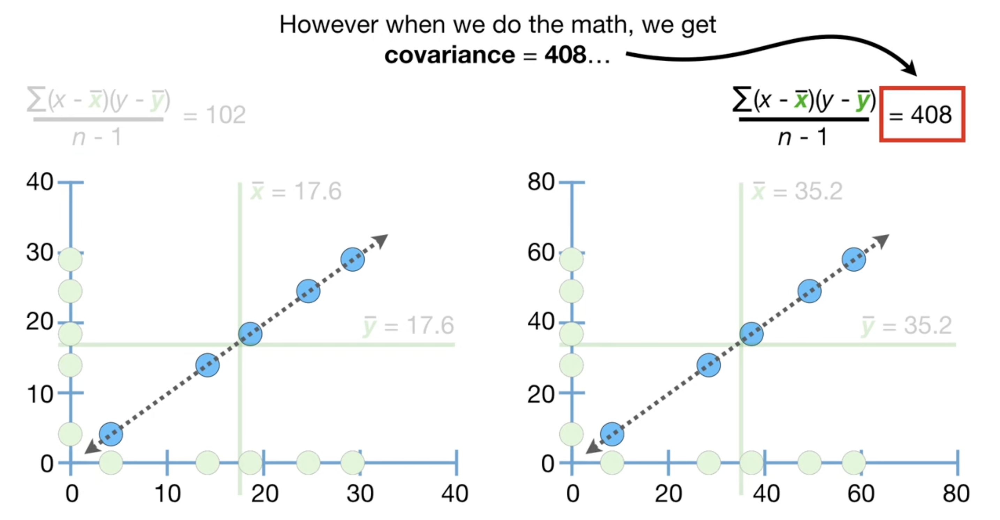 

Thus, we see that the covariance value changes even when the relationship does not. **In other words, covariance values are sensitive to the scale of the data, and this makes them difficult to interpret. The sensitivity to scale also prevents the covariance value from telling us if the data are close to the dotted line that represents the relationship or far from it.**

In this example, the covariance on the left, when each point is on the dotted line, is 102, and the covariance on the right, when the data are relatively far from the dotted line, is 381. So in this case, when the data are far from the line, the covariance is larger.

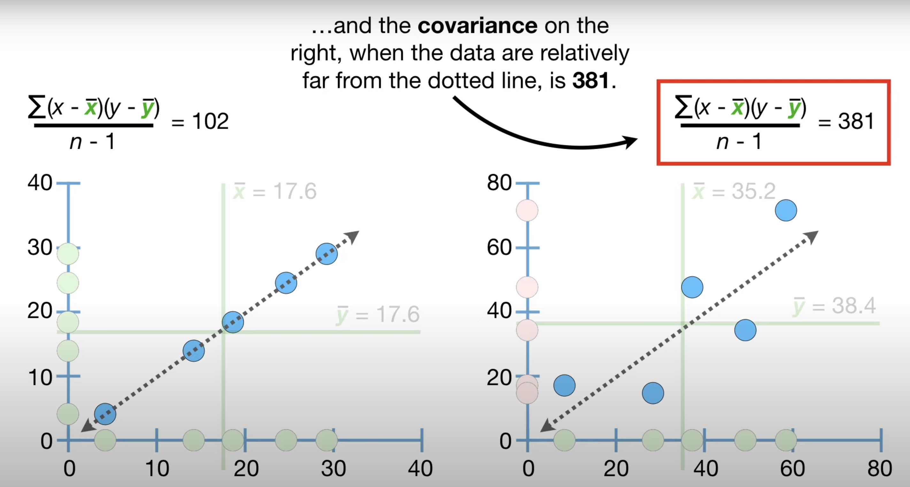 

Now, let's just change the scale on the right-hand side and recalculate the covariance, and now the covariance is less for the data that does not fall on the line.

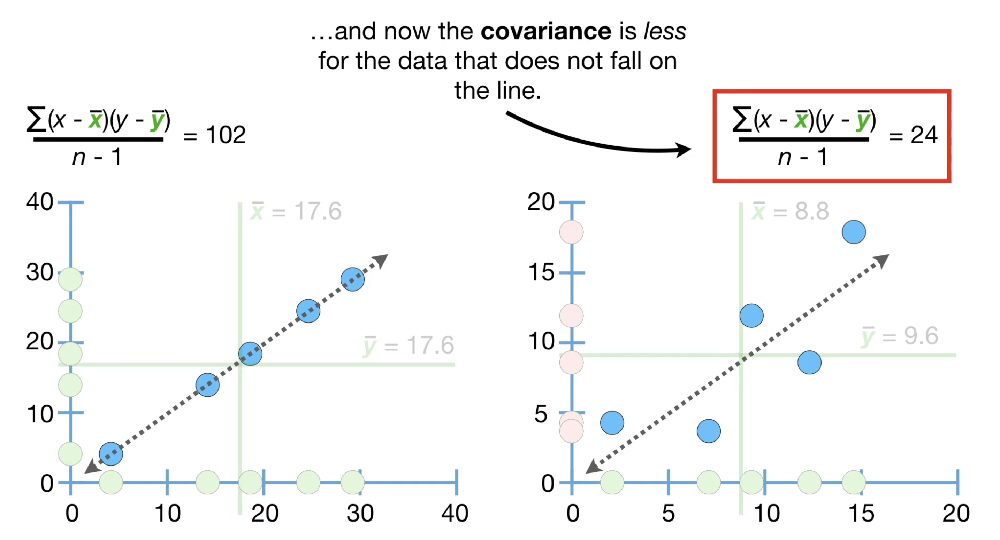 

Then there was something to describe relationships that wasn't sensitive to the scale of the data, calculating covariance is the first step in calculating correlation. **Correlation describes relationships and is not sensitive to the scale of the data.**

**The covariance values itself is difficult to interpret. However, it is useful for calculating correlations and in other computational settings.**

**covariance values are used as stepping stones in a wide variety of analyses. For example, covariance values were used for Principal Component Analysis(PCA) and are still used in other settings as computational stepping stones to other, more interesting things.**

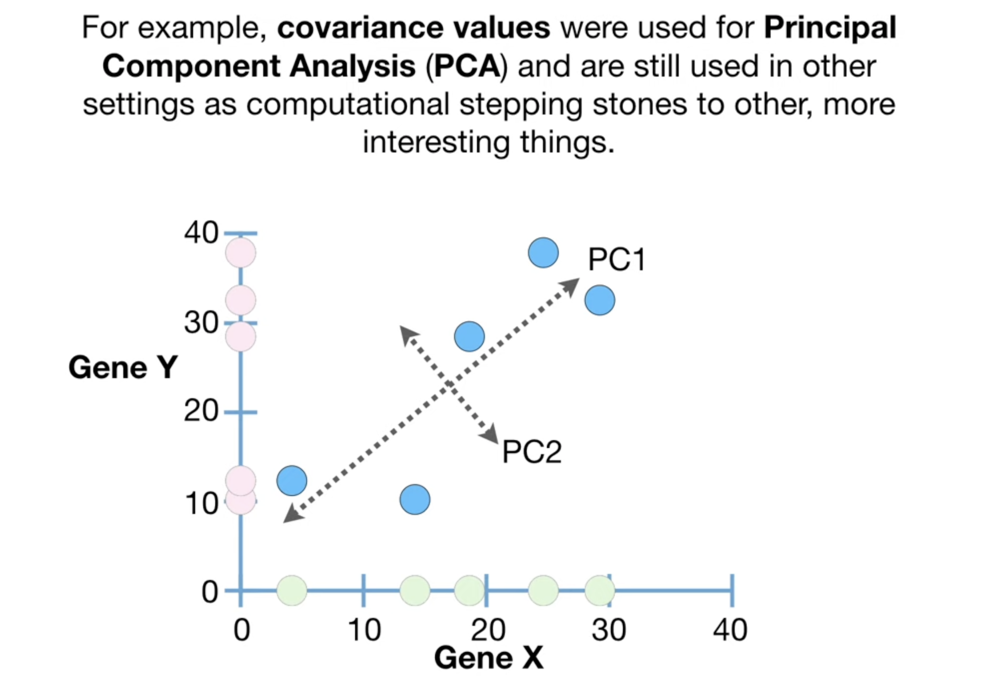 

In summary, the sign of the covariance indicates the nature of the relationship between two variables:

- If $\text{Cov}(X, Y) > 0$, it suggests a positive relationship. This means that as one variable increases, the other tends to increase as well.

- If $\text{Cov}(X, Y) < 0$, it indicates a negative relationship. This means that as one variable increases, the other tends to decrease.

- If $\text{Cov}(X, Y) = 0$, it implies no linear relationship between the variables. However, it's essential to note that a covariance of zero does not necessarily mean there is no relationship; it only means there is no linear relationship.

## Limitations

Consider a case, where the points are(2,5),(2,-2),(4,3),(4,-3), by calculation $\text{Cov}(X, Y) < 0$. However, If we look at these points, we can see that when x increases from 2 to 4, Y has instances of both increasing and decreasing. This is a nuanced situation because while the covariance is negative, indicating a general tendency towards a negative relationship, the actual data points do not show a consistent negative linear relationship. This highlights an important point: **covariance gives a general direction of the relationship between two variables but does not describe the exact relationship between individual data points.** So, while the general guideline about the sign of covariance indicating the direction of the relationship holds, it is crucial to remember that it doesn’t capture the intricacies of the relationship between the variables, especially when the relationship is not strictly linear or when there are multiple values of Y for a single value of X.

## Reference:
- [Watch the video on YouTube](https://www.youtube.com/watch?v=qtaqvPAeEJY)

## Further improve
covariance values were used for Principal Component Analysis(PCA) why? 
