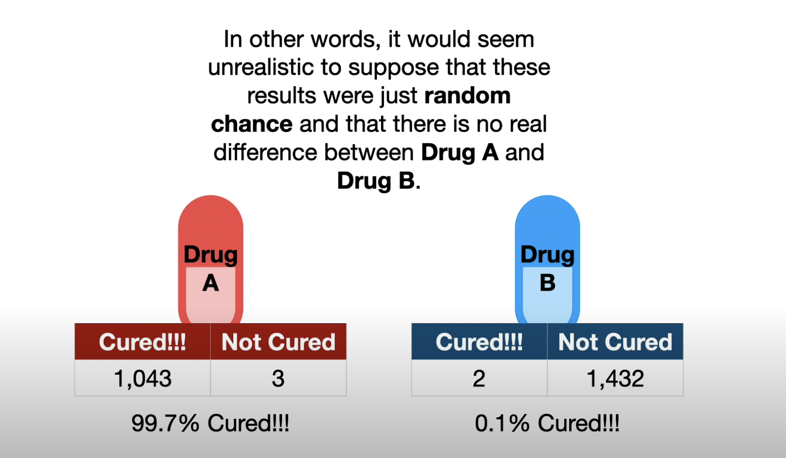

P-value

imagine have two drugs, drug a and B, and want to know if there is a difference between drug A and B.

So if give 1 person drug A and give 1 other person drug B. The one person who used drug A was cured.The one person who used drug B was not cured. Can we conclude that drug A is better than drug B?
No! Drug B may have failed for a lot of different reasons: the person may have taken a drug that had the opposite effect of drug B or maybe this guy has a rare allergy to drug B or maybe this guy didn’t take drug b properly and missed a dose. Or maybe drug A doesn’t actually work, and the placebo effect deserves all of the credit.

There are a lot of weird, random thing that can happen when doing a test, and this means that we need to try each drug on more than just one person each.

And for the following test results, it would seem unrealistic to suppose that these results were just random chance and that there is no real difference between Drug A and Drug B.

Given that no study is perfect and there are always a few random things that happen, how confident can we be that drug A is superior?  That’s where the p-value come in.

P-values are numbers between 0 and 1, that , in this example, quantify how confident we should be that drug A is different from drug B. The closer a p-value is 0, the more confidence we have that drug A and drug B are different.

How small does a p-value have to be before we are sufficiently confident that Drug A is different from drug B? In other words, what threshold can we use to make a good decision?

In practice, a commonly used threshold is 0.05. It means if there is no difference between drug A and drug B, and if we did this exact same experiment a bunch of times, then only 5% of those experiments would result in the wrong decision.

Let’s make an example to illustrate this sentence.
Imagine we give the same drug drug A to two different groups, now any differences in the results are 100% attributable to weird random things, like a rare allergy in one person, or a strong placebo effect in another. In this case, the p-value would be 0.9, which is way larger than 0.05. Thus, we would say that we fail to see a difference between the two groups. If we repeated this same experiment a lot of times, most of the time, we would get similarly large p-values.
[Insert graph]

However, every once in a while, all of the people with rare allergies might end up in the group on the left and all of the people with the strong placebo reactions might end up in the group on the right. As a result, the p-value for this specific run of the experiment is 0.01, since the results are pretty different. Thus, in this case, we would say that the two groups are different, even though they both took the same drug. Getting a small p-value when there is no difference is called a false positive.
[Insert graph]
A 0.05 threshold for p-values means that 5% of the experiments, where the only differences come from weird random things, will generate a p-value smaller than 0.05. In other words, if there is no difference between drug A and drug B, 5% time we do the experiment, we’ll get a p-value less than 0.05, aka a False Positive.
Note: if it is extremely important that we are correct when we say the drugs are different, then we can use a smaller threshold, like 0.00001. Using a threshold of 0.00001 means we would only get a false positive once every 100,000 experiments. Likewise, if it’s not that important(for example, if we’re trying to decide if the ice-cream truck will arrive on time), then we can use a larger threshold, like 0.2. Using a threshold of 0.2 means we are willing to get a False Positive 2 times out of 10. That said, the most common threshold is 0.05 because trying to reduce the number of false positives below 5% often costs more than it is worth.

So if we calculate a p-value for this experiment, and the p-value < 0.05, then we will decide that drug A is different from drug B. That said, the p-value is actually 0.24. so we are not confident that drug A is different from drug B.

The idea of trying to determine if these drugs are the same or not is called hypothesis testing. The null hypothesis is that the drugs are the same and the p-value helps us decide if we should reject the null hypothesis or not.
While a small p-value helps us decide if drug A is different from drug B, it does not tell us how different they are. In other words, you can have a small p-value regardless of the size of difference between drug A and drug B. The difference can be tiny or huge.

For example, this experiment gives us a relatively large p-value 0.24, even though there is an 6 point difference between drug A and drug B.

In contrast, this experiment, which involves a lot more people, gives us a smaller p-value 0.04 even though given the new data, there is only a 1 point difference between drug A and drug B.

In summary, a small p-value does not imply that the effect size or difference between drug A and drug B is large

