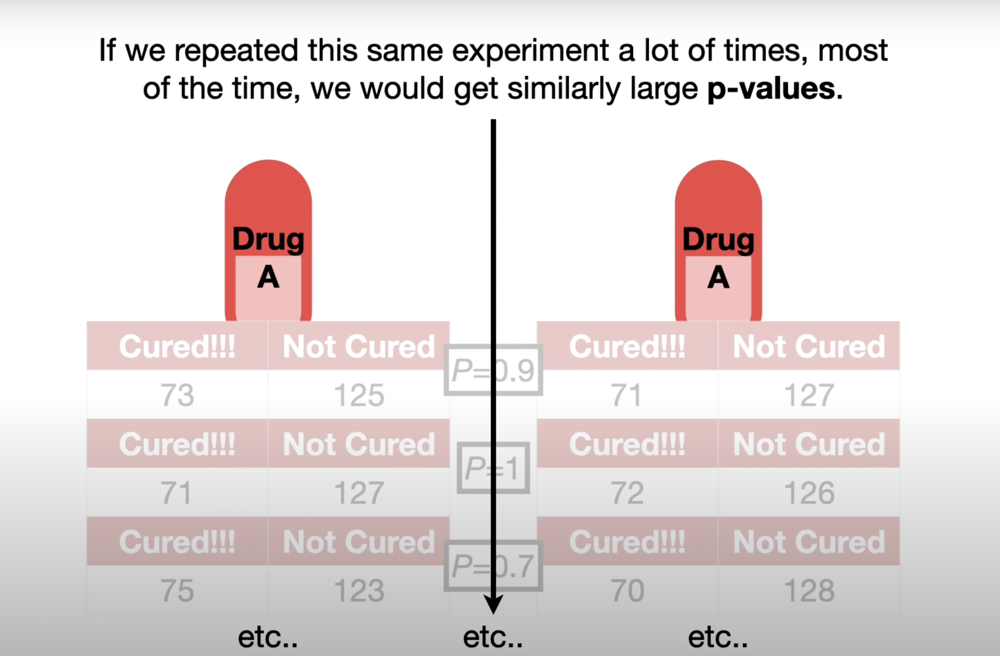
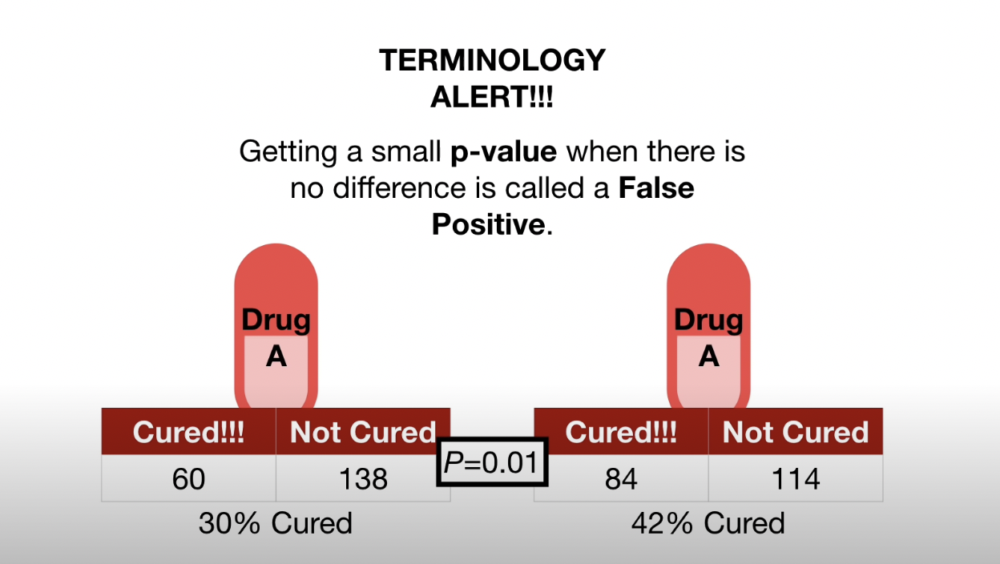

# Understanding P-Value through Drug Efficacy Comparison

Imagine we have two drugs: Drug A and Drug B. We want to know if there's a difference in their efficacy. Let's delve into how we can use p-values to determine this.

## The Problem with Small Sample Sizes

Giving Drug A to one person and Drug B to another, we notice:

- The person who took Drug A was cured.
- The person who took Drug B was not cured.

**Can we conclude that Drug A is better than Drug B?** No!

Reasons for Drug B's failure could vary:

- An opposing effect due to another drug.
- A rare allergy to Drug B.
- Incorrect dosage or usage.
- A placebo effect benefitting Drug A.

Hence, testing on more individuals is necessary.

And for the following test results, it would seem unrealistic to suppose that these results were just random chance and that there is no real difference between Drug A and Drug B.

 

## The Role of P-Values

P-values, ranging between 0 and 1, help quantify the confidence in whether Drug A is different from Drug B. A p-value close to 0 indicates a higher confidence in a difference.

### Common Thresholds for P-Values

- **Standard Threshold:** 0.05  
  - Implies that in an ideal scenario with no drug difference, only 5% of experiments would mistakenly suggest a difference.
- **For Critical Decisions:** Smaller thresholds (e.g., 0.00001)  
  - Reduces the chance of false positives but often at a higher cost or effort.
- **For Less Critical Decisions:** Higher thresholds (e.g., 0.2)  
  - Tolerates more false positives for less critical outcomes.

### Understanding through Examples

   Imagine we give the same drug drug A to two different groups, now any differences in the results are 100% attributable to weird random things, like a rare allergy in one person, or a strong placebo effect in another. In this case, the p-value would be 0.9, which is way larger than 0.05. Thus, we would say that we fail to see a difference between the two groups. If we repeated this same experiment a lot of times, most of the time, we would get similarly large p-values.
   
   
 
However, every once in a while, all of the people with rare allergies might end up in the group on the left and all of the people with the strong placebo reactions might end up in the group on the right. As a result, the p-value for this specific run of the experiment is 0.01, since the results are pretty different. Thus, in this case, we would say that the two groups are different, even though they both took the same drug. Getting a small p-value when there is no difference is called a false positive.

   

   A 0.05 threshold for p-values means that 5% of the experiments, where the only differences come from weird random things, will generate a p-value smaller than 0.05. In other words, if there is no difference between drug A and drug B, 5% time we do the experiment, we’ll get a p-value less than 0.05, aka a False Positive.

## P-Value in Our Experiment

If we calculate a p-value for our drug comparison and find it's **less than 0.05**, we'd conclude Drug A is different from Drug B. However, our experiment resulted in a p-value of **0.24**, leading us to believe there's no significant difference between the drugs.

## Hypothesis Testing and Effect Size

Hypothesis testing tries to determine if two conditions (like drugs) are the same or not. The **null hypothesis** assumes no difference. A small p-value doesn't necessarily mean a large difference in effect:

- A large p-value (0.24) might still show a 6-point difference.
- A small p-value (0.04) could indicate a minor 1-point difference.

**In summary**, a small p-value doesn't imply a large difference in effect between Drug A and Drug B.

> Note: Why Reject the Null Hypothesis?
> Reasoning: If something (like the observed difference in test scores) only has a 1% chance of occurring under a certain assumption (the null hypothesis), and yet it does occur, it casts doubt on that assumption. It suggests that maybe the assumption (the null hypothesis of no difference) is incorrect.
>

## Reference:
- [Watch the video on YouTube](https://www.youtube.com/watch?v=vemZtEM63GY)
