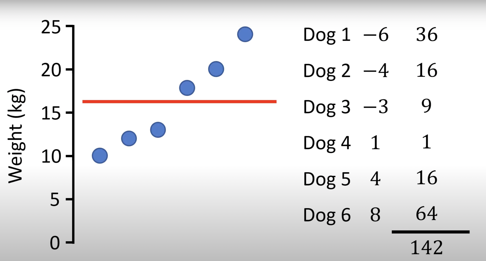
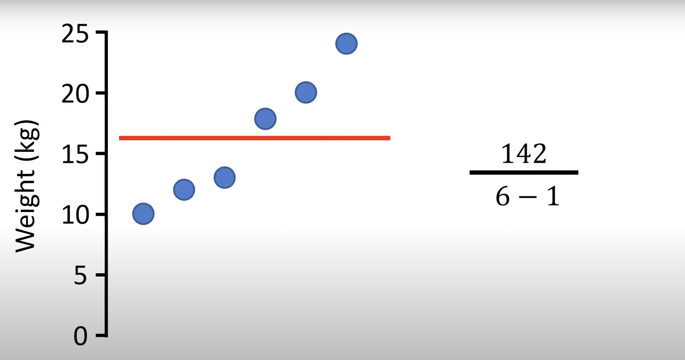
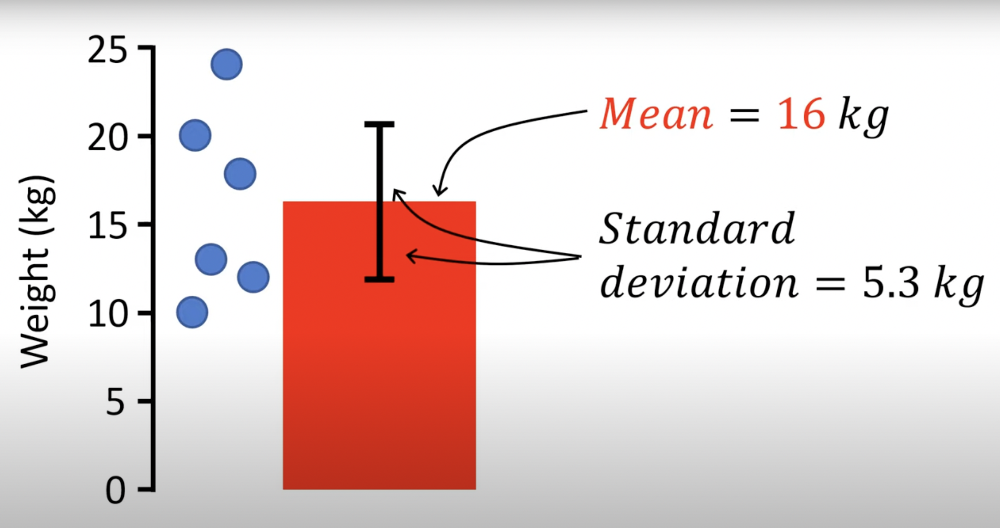

# Variance and Standard Deviation

Variance is the average of the squared differences from the mean, it quantifies data spread or dispersion and is crucial in assessing data variability in statistics and machine learning. Often, to interpret the variance value in the same unit as the data, researchers use the standard deviation, which is the square root of the variance.

## Variance Formula
The variance of a dataset can be calculated differently based on whether we are dealing with a sample or an entire population:
### Sample Variance
For a sample (e.g., weights of six sampled dogs in kg):

$\text{Variance} (s^2) = \frac{1}{n-1} \sum\limits_{i=1}^{n} (x_i - \mu)^2 \$

Where:
- $s^2$ represents the variance.
- $n$ is the number of data points.
- $x_i$ represents each data point in the dataset.
- $\mu$ is the mean (average) of the dataset.

 

  

  
Note: Subtracting one from the denominator, known as Bessel’s correction, corrects the bias when estimating population variance from a sample. This correction is necessary because using $n$ as the divisor would typically underestimate the actual variance when applied to a sample.
### Population Variance
For an entire population:

$\text{Variance} (\sigma^2) = \frac{1}{n} \sum\limits_{i=1}^{n} (x_i - \mu)^2 \$

Where:
- $\sigma^2$ represents the variance.
- $n$ is the number of data points.
- $x_i$ represents each data point in the dataset.
- $\mu$ is the mean (average) of the dataset.

## Interpreting Variance
The units of variance are squared, e.g., if you are measuring weights, then a variance might have units like kg^2. This makes direct interpretation challenging, which is why the standard deviation is often preferred.
## Standard Deviation
The standard deviation is the square root of the variance. It allows for interpretations in the same units as the original data:

Standard Deviation = $\sqrt{\text{Variance}} \$

For instance, if our variance for weights was calculated to be 28.4 kg^2, the standard deviation is $\sqrt{28.4 \text{ kg}^2}$, which equals 5.3 kg.
Since the units are the same as out data, we can plot it onto our graph, here is our graph:

- The mean value of 16 kg is represented by a red column.
- Actual data points or scatter plot are shown by the blue circles
- The standard deviation is usually plotted above and below the mean to show data spread. So, the line above the mean represents 16 + 5.3, and below represents 16 - 5.3.

## Interpreting Standard Deviation

1. **Large Standard Deviation**:  A large standard deviation indicates high variability from the mean, indicates that the data points in the dataset are widely spread out from the mean. In other words, there is a significant amount of variability or dispersion in the data.

2. **Small Standard Deviation**: A small standard deviation indicates low variability from the mean, suggests that the data points are closely clustered around the mean. In this case, there is less variability or dispersion in the data.

## Use Cases

Variance plays a crucial role in various aspects of statistics and machine learning, including:

- **Risk Assessment**: In finance and economics, variance is used to measure the risk associated with investments. Higher variance implies higher risk.

- **Model Evaluation**: In machine learning, variance is used to assess the model's performance. It helps identify whether the model is overfitting (high variance) or underfitting (high bias).

- **Quality Control**: Variance is used in quality control to monitor the consistency and variation in manufacturing processes.

## Example

Suppose you have a dataset of daily stock returns for a particular company over a year. You calculate the variance of these returns to assess how much the returns fluctuated from the average return during that period. A high variance might indicate a volatile stock, while a low variance suggests a more stable one.

## Conclusion

Variance is a critical statistical measure that quantifies the spread or dispersion of data. It helps in understanding the variability and risk associated with data points in a dataset. In various fields, including finance and machine learning, variance plays a vital role in decision-making and analysis.
