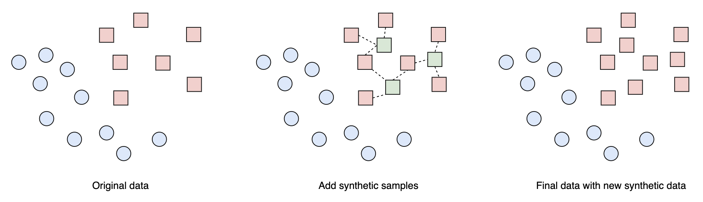

# Handle imbalance class distribution

In ML use cases like Fraud Detection, Click Prediction, or Spam Detection, it’s common to have imbalance labels. There are few strategies to handle them, i.e, you can use any of these strategies depend on your use case.

## Use class weights in loss function: 

For example, in a spam detection problem where non-spam data has 95% data compare to other spam data which has only 5%. We want to penalize more in the non-spam class. In this case, we can modify the entropy loss function using weight.

  ```python3
  //w0 is weight for class 0, 
  w1 is weight for class 1
  loss_function = -w0 * ylog(p) - w1*(1-y)*log(1-p)
  ```
### Case 1: Correct Classification (Spam Email)
- **True Label:** Spam (y = 1)
- **Predicted Probability:** p = 0.9 (high confidence for spam)
- **Class Weights:** w_0 = 1.05 (non-spam), w_1 = 20 (spam)

Since the true label is spam and the model predicts a high probability of spam, this is a correct classification.

$$\text{loss} = - w_1 \cdot y \cdot \log(p) - w_0 \cdot (1 - y) \cdot \log(1 - p)$$

$$\text{loss} = - 20 \cdot 1 \cdot \log(0.9) - 1.05 \cdot 0 \cdot \log(0.1)$$

$$\text{loss} = - 20 \cdot \log(0.9)$$

$$\text{loss} \approx - 20 \cdot (-0.105)$$

$$\text{loss} \approx 2.1$$

### Case 2: Misclassification (Spam Email)
- **True Label:** Spam (y = 1)
- **Predicted Probability:** p = 0.3 (low confidence for spam)
- **Class Weights:** w_0 = 1.05 (non-spam), w_1 = 20 (spam)

Since the true label is spam but the model predicts a low probability of spam, this is a misclassification.

$$\text{loss} = - w_1 \cdot y \cdot \log(p) - w_0 \cdot (1 - y) \cdot \log(1 - p)$$

$$\text{loss} = - 20 \cdot 1 \cdot \log(0.3) - 1.05 \cdot 0 \cdot \log(0.7)$$

$$\text{loss} = - 20 \cdot \log(0.3)$$

$$\text{loss} \approx - 20 \cdot (-0.523)$$

$$\text{loss} \approx 10.46$$

### Case 3: Correct Classification (Non-Spam Email)
- **True Label:** Non-Spam (y = 0)
- **Predicted Probability:** p = 0.1 (low confidence for spam)
- **Class Weights:** w_0 = 1.05 (non-spam), w_1 = 20 (spam)

Since the true label is non-spam and the model predicts a low probability of spam, this is a correct classification.

$$\text{loss} = - w_1 \cdot y \cdot \log(p) - w_0 \cdot (1 - y) \cdot \log(1 - p)$$

$$\text{loss} = - 20 \cdot 0 \cdot \log(0.1) - 1.05 \cdot 1 \cdot \log(0.9)$$

$$\text{loss} = - 1.05 \cdot \log(0.9)$$

$$\text{loss} \approx - 1.05 \cdot (-0.105)$$

$$\text{loss} \approx 0.11$$

### Case 4: Misclassification (Non-Spam Email)
- **True Label:** Non-Spam (y = 0)
- **Predicted Probability:** p = 0.8 (high confidence for spam)
- **Class Weights:** w_0 = 1.05 (non-spam), w_1 = 20 (spam)

Since the true label is non-spam but the model predicts a high probability of spam, this is a misclassification.

$$\text{loss} = - w_1 \cdot y \cdot \log(p) - w_0 \cdot (1 - y) \cdot \log(1 - p)$$

$$\text{loss} = - 20 \cdot 0 \cdot \log(0.8) - 1.05 \cdot 1 \cdot \log(0.2)$$

$$\text{loss} = - 1.05 \cdot \log(0.2)$$

$$\text{loss} \approx - 1.05 \cdot (-0.699)$$

$$\text{loss} \approx 0.73$$

### Summary
In these examples, you can see:

- When the model correctly classifies an email, the loss is relatively low.
- When the model misclassifies an email, the loss is higher, especially for the spam class due to the higher weight.

The increased loss for misclassifications during training encourages the model to adjust its parameters to reduce these high losses in future iterations, leading to better overall performance, particularly for the minority class (spam). When the loss is higher for misclassified spam emails, it signals the model to focus more on correctly predicting spam emails during training. Balance the Influence of Each Class: When the dataset is imbalanced, the model tends to become biased towards the majority class (non-spam in this case) because it sees more examples of that class. By assigning higher weights to the minority class (spam), we ensure that errors made on the minority class have a greater impact on the loss function, thereby encouraging the model to pay more attention to correctly classifying the minority class. Improve Recall for the Minority Class: In scenarios like spam detection, it is often more critical to correctly identify spam emails (true positives) than to correctly identify non-spam emails (true negatives). By penalizing the model more for misclassifying spam as non-spam, we improve the recall of the spam class, reducing the number of false negatives.

> In the context of spam detection:
> 
> True Positive (TP): An email that is actually spam and the model correctly identifies it as spam. True Negative (TN): An email that is actually not spam (ham) and the model correctly identifies it as not spam. False Positive (FP): An email that is actually not spam (ham) but the model incorrectly identifies it as spam. False Negative (FN): An email that is actually spam but the model incorrectly identifies it as not spam.


## Use naive resampling: 

Resample the non-spam class at a certain rate to reduce the imbalance in the training set. It’s important to have validation data and test data intact (no resampling).

### Types of Naive Resampling

Oversampling the Minority Class: This involves duplicating examples from the minority class to increase their frequency in the training dataset.

Undersampling the Majority Class: This involves randomly removing examples from the majority class to decrease their frequency in the training dataset.

### Important Considerations

Validation and Test Data Integrity: It’s crucial to keep the validation and test data intact, without any resampling, to ensure that the performance metrics reflect the model's ability to generalize to unseen data. Resampling should only be applied to the training data.

Risk of Overfitting (in Oversampling): Oversampling can lead to overfitting, as the model may memorize duplicated instances from the minority class.

Loss of Information (in Undersampling): Undersampling can result in the loss of valuable information from the majority class, which might degrade the model's performance.

```python3
import pandas as pd
from sklearn.utils import resample
# Create a sample dataset
data = {
    'feature1': [1, 2, 3, 4, 5, 6, 7, 8, 9, 10, 11, 12, 13, 14, 15, 16, 17, 18, 19, 20],
    'feature2': [2, 3, 4, 5, 6, 7, 8, 9, 10, 11, 12, 13, 14, 15, 16, 17, 18, 19, 20, 21],
    'label': [0, 0, 0, 0, 0, 0, 0, 0, 0, 0, 0, 0, 0, 0, 1, 1, 1, 1, 1, 1]
}

# Convert the dictionary to a pandas DataFrame
dataset = pd.DataFrame(data)

# Separate the majority and minority classes
non_spam = dataset[dataset['label'] == 0]
spam = dataset[dataset['label'] == 1]

# Oversample the minority class
spam_oversampled = resample(spam, replace=True, n_samples=len(non_spam), random_state=42)

# Combine the majority class with the oversampled minority class
oversampled_dataset = pd.concat([non_spam, spam_oversampled])

# Verify the new distribution after oversampling
print("Oversampled dataset class distribution:")
print(oversampled_dataset['label'].value_counts())
print(oversampled_dataset)

# Undersample the majority class
non_spam_undersampled = resample(non_spam, replace=False, n_samples=len(spam), random_state=42)

# Combine the undersampled majority class with the minority class
undersampled_dataset = pd.concat([non_spam_undersampled, spam])

# Verify the new distribution after undersampling
print("\nUndersampled dataset class distribution:")
print(undersampled_dataset['label'].value_counts())
print(undersampled_dataset)
```
Printing Result:

```
Oversampled dataset class distribution:
label
0    14
1    14
Name: count, dtype: int64
    feature1  feature2  label
0          1         2      0
1          2         3      0
2          3         4      0
3          4         5      0
4          5         6      0
5          6         7      0
6          7         8      0
7          8         9      0
8          9        10      0
9         10        11      0
10        11        12      0
11        12        13      0
12        13        14      0
13        14        15      0
17        18        19      1
18        19        20      1
16        17        18      1
18        19        20      1
18        19        20      1
15        16        17      1
16        17        18      1
16        17        18      1
16        17        18      1
18        19        20      1
17        18        19      1
16        17        18      1
19        20        21      1
18        19        20      1

Undersampled dataset class distribution:
label
0    6
1    6
Name: count, dtype: int64
    feature1  feature2  label
9         10        11      0
11        12        13      0
0          1         2      0
12        13        14      0
5          6         7      0
8          9        10      0
14        15        16      1
15        16        17      1
16        17        18      1
17        18        19      1
18        19        20      1
19        20        21      1
```

## Use synthetic resampling: 

The Synthetic Minority Oversampling Technique (SMOTE) consists of synthesizing elements for the minority class, based on those that already exist. It works by randomly picking a point from the minority class and computing the k-nearest neighbors for that point. The synthetic points are added between the chosen point and its neighbors. For practical reasons, SMOTE is not as widely used as other methods.




