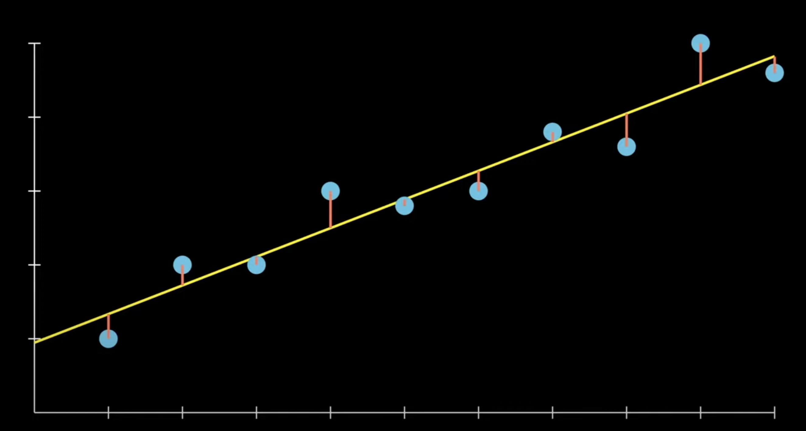
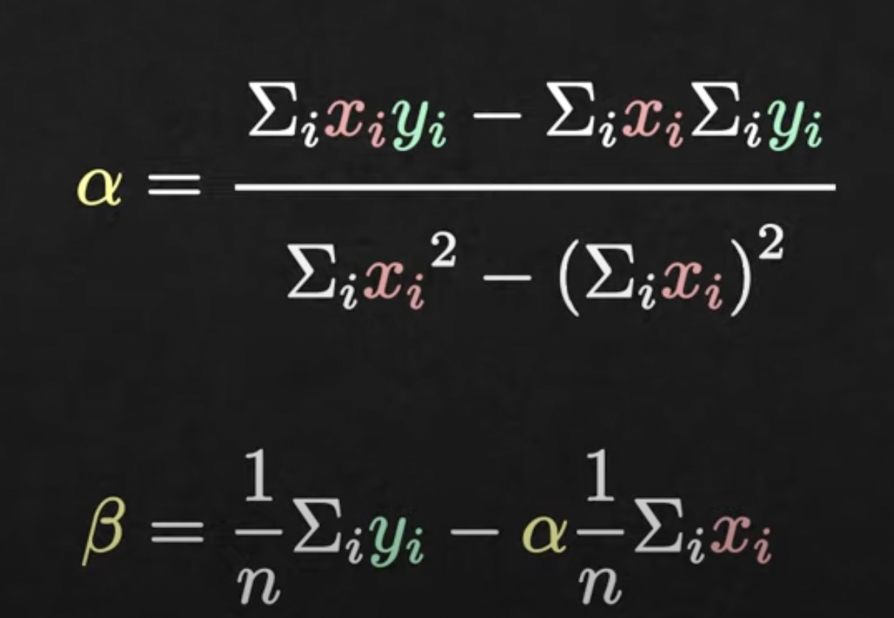

# Linear Regression

Machine learning has a myriad of applications, and one of its primary tasks is **prediction**. Linear regression predicts a dependent variable using one or more independent variables. It assumes a linear relationship between them.

> Note: **Linear Regression** is the overall process or method used to understand and quantify the relationship between variables.
> 
> **Linear Regression Model** is the specific mathematical representation of that relationship. 
## Model:
For linear regression with multiple predictors:

$y = \beta_0 + \beta_1x_1 + ... + \beta_nx_n + \epsilon$

Where:
- $y$: Dependent (or response) variable we aim to predict.
- $x_1, ..., x_n$: Independent (or predictor) variables that influence the prediction.
- $\beta_0, ..., \beta_n$: $\beta_0$ is the intercept, while $\beta_1, ..., \beta_n$ are coefficients indicating the impact of their respective independent variables.
- $\epsilon$: Error term that represents the difference between the observed and predicted value.

## Objective:
Minimize the sum of the squared differences(residuals) between the observed and predicted values:

Sum of squared errors (SSE): $\text{Min} \ \sum_i (\beta_0 + \beta_1 x_{i1} + ... + \beta_n x_{in} - y_i)^2$

This SSE serves as the loss function that we aim to minimize in linear regression.

## Simple Linear Regression: An Example

Consider a scenario where:
- $x$ represents an independent variable, such as height.
- $y$ denotes the dependent variable we aim to predict, like weight.
  
Our objective is to find a function $g$ such that $y = g(x)$. Given a training dataset with values for both $x$ and $y$, our task is to determine this function $g$. This process of finding the right function $g$ is termed **regression**. 

> Note: Regression: Now refers broadly to any method of modeling and analyzing several variables, when the focus is on the relationship between a dependent variable and one or more independent variables.
>

For simplicity, we can assume that $g$ is a linear regression model:

$g(x) = \alpha x + \beta$

In this equation:
- $\alpha$ is the slope of this line
- $\beta$ is the intercept.

For an optimal model, our task is to choose values for $\alpha$ and $\beta$ that minimize the squared differences between actual data points and their predicted counterparts. Formally, this minimization problem can be stated as:

$\text{Min} \ \sum_i (\alpha x_i + \beta - y_i)^2$

The necessary condition for a minimum is setting the gradient to zero:

$\left[ \sum_i 2x_i (\alpha x_i + \beta - y_i), \ 2\sum_i (\alpha x_i + \beta - y_i) \right] = 0$

After determining the values of $\alpha$ and $\beta$ from the image, we can insert them into the equation $g(x)$ to obtain the specific linear regression model.

## Reference:
- [YouTube Video 1](https://www.youtube.com/watch?v=CtsRRUddV2s)
- [YouTube Video 2](https://www.youtube.com/watch?v=3dhcmeOTZ_Q&t=1s)

###Futher improvement:
1. add assumption part for linear regression and look these terms
Constant variance
normally distribution
homoscedasticity 
non-random residuals 
2. add perform metrics for linear regression and look these terms
   r^2
   prediction interval
   standard error of the estimate
   statistic significance 
