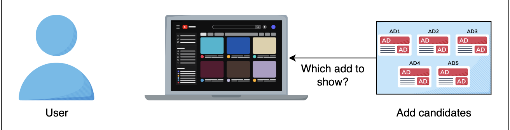
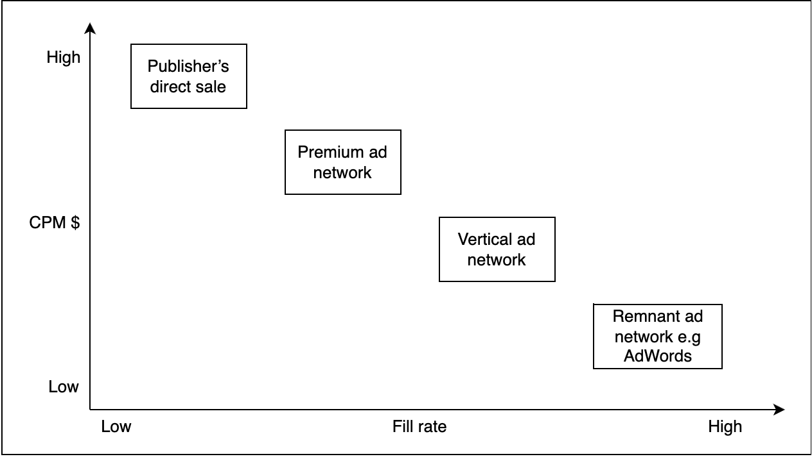
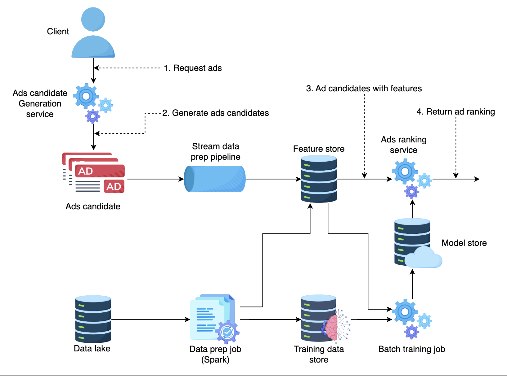
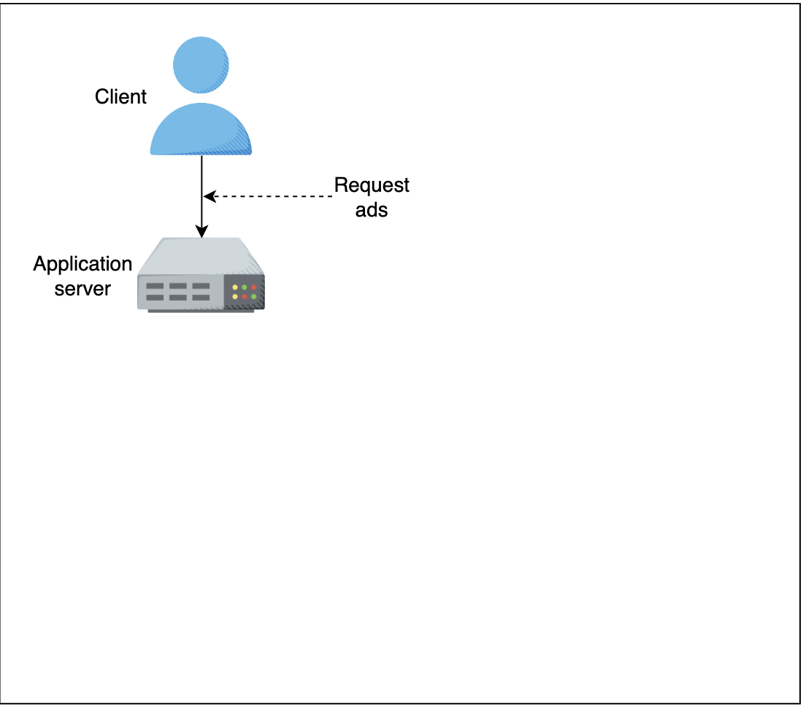
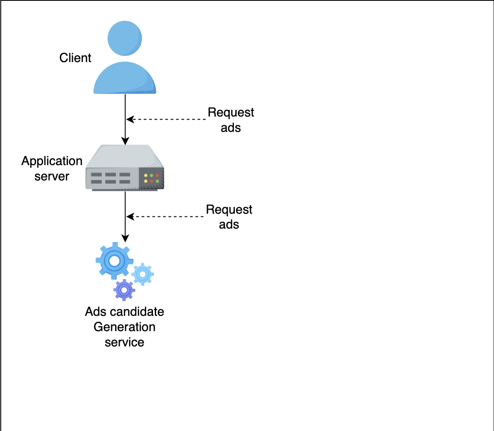
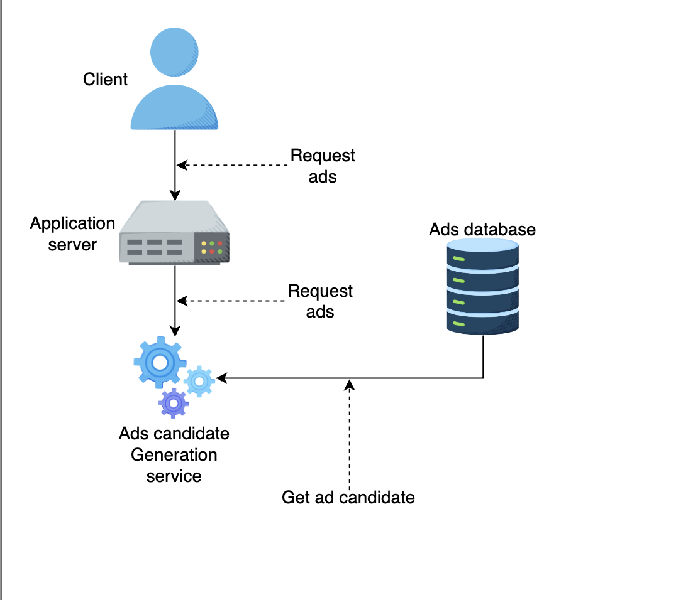
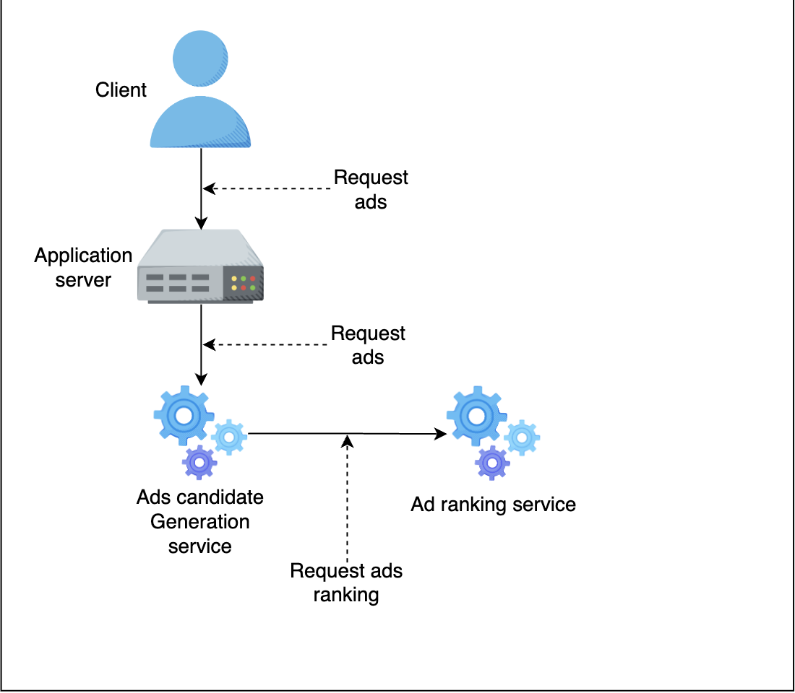
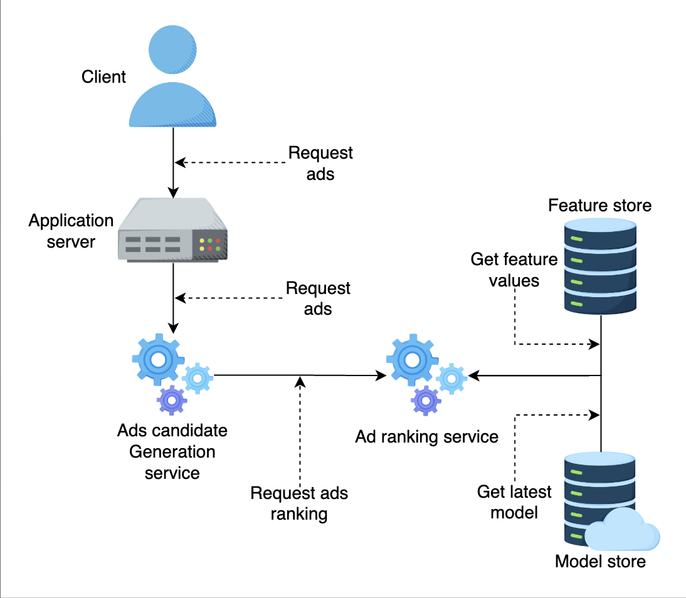

# Ad Click Prediction

## 1. Problem Statement

Build a machine learning model to predict if an ad will be clicked.

> For the sake of simplicity, we will not focus on the cascade of classifiers that is commonly used in AdTech.

- Let’s understand the ad serving background before moving forward. The ad request goes through a waterfall model where publishers try to sell its inventory through direct sales with high CPM (Cost Per Million). If it is unable to do so, the publishers pass the impression to other networks until it is sold.
  

> A cascade of classifiers involves multiple stages, each with its own classifier, where the output of one classifier becomes the input for the next. This can help in:
> - **Filtering:** Early stages filter out the majority of negative cases (e.g., unlikely clicks), allowing subsequent stages to focus on harder-to-classify cases.
> - **Specialization:** Different stages can specialize in different aspects of the prediction task, improving overall performance.
> - **Efficiency:** By progressively reducing the number of cases to be considered in each stage, the cascade can improve computational efficiency.

> In the waterfall model, the publisher (e.g., The New York Times) would first try to sell the ad space directly to advertisers for a high CPM. If it fails, it would then pass the opportunity to ad networks like Google AdSense, Facebook Audience Network, etc., in sequence until the ad space is filled.

>**Publisher's Direct Sale**:
> *Scenario*: The New York Times negotiates directly with Samsung for a banner ad on its homepage for a month at a high CPM.
>
> **Premium Ad Network**:
> *Scenario*: An advertiser uses Google Marketing Platform to place ads on top-tier sites like ESPN, ensuring their ads appear on reputable, high-traffic sites.
>
> **Vertical Ad Network**:
> *Scenario*: A travel agency uses Travel Ad Network to place ads specifically on travel-related websites, reaching an audience interested in travel.
>
> **Remnant Ad Network**:
> *Scenario*: A smaller advertiser uses Google Ads to bid on leftover ad inventory across Google's network, allowing their ads to appear on various sites at a lower cost.

> **Publisher**: A publisher is an entity (individual, organization, or company) that creates and owns content on which advertisements can be displayed. They provide the platform where ads are shown.
> 
> **Ad Network**: An ad network is a company that connects advertisers with publishers. It aggregates ad inventory from multiple publishers and sells it to advertisers, facilitating the buying and selling of ads.
> 
> **Impression**: An impression is a single instance of an ad being displayed on a web page, app, or any other digital medium. It is a metric used to measure how many times an ad is seen.

## 2. Metrics Design and Requirements

### Metrics

During the training phase, we can focus on machine learning metrics instead of revenue metrics or CTR metrics. Below are the two metrics:

#### Offline Metrics

- **Normalized Cross-Entropy (NCE):** NCE is the predictive log loss divided by the cross-entropy of the background CTR. This way NCE is insensitive to background CTR. This is the NCE formula:

$$ NCE = \frac{-\frac{1}{N} \sum\limits_{i=1}^{n} \left( \frac{1 + y_i}{2} \log(p_i) + \frac{1 - y_i}{2} \log(1 - p_i) \right)}{- \left( p \log(p) + (1 - p) \log(1 - p) \right)} $$

  >   **N**: Total number of samples.
  > 
  >   **$y_i$**: Actual label for the $i$-th sample. $y_i$ is 1 if the item was clicked and 0 if it was not clicked.
  > 
  > **$p_i$**: Predicted probability of the $i$-th item being clicked.
  > 
  >**$p$**: Background CTR (average probability of an item being clicked).
  >
  > Background CTR refers to the average Click Through Rate (CTR) observed in the dataset or a specific subset of data. It reflects the inherent likelihood of clicks across all items without considering individual item characteristics. For example, if the overall CTR of the platform is 0.02, it means that, on average, 2% of all shown items are clicked.
> 
#### Online Metrics

- **Revenue Lift:** Percentage of revenue changes over a period of time. Upon deployment, a new model is deployed on a small percentage of traffic. The key decision is to balance between percentage traffic and the duration of the A/B testing phase.

> A/B Testing involves splitting the traffic into two groups:
> - Control Group: Uses the existing model.
> - Test Group: Uses the new model.

> **Revenue Lift**: It is the percentage change in revenue over a period of time when a new model is deployed compared to the existing model or baseline performance.
> #### Formula:
> **Revenue Lift**:
>
> $\text{Revenue Lift} = \frac{\text{Revenue test} - \text{Revenue control}}{\text{Revenue}_{\text{control}}} \times 100$ \%
> 
> Where:
> - $\text{Revenue}_{\text{test}}$ is the revenue generated by the test group.
> - $\text{Revenue}_{\text{control}}$ is the revenue generated by the control group.

> ### Balancing Percentage Traffic:
>- **Small Percentage**: Minimizes risk but may take longer to gather statistically significant data.
>- **Large Percentage**: Provides quicker results but increases the risk if the new model performs poorly.

> ### Duration of A/B Testing:
>- **Short Duration**: Faster decision-making but may not capture long-term user behavior changes.
>- **Long Duration**: More comprehensive data but delays implementation of the new model if it performs well.

> ### Balance between Percentage Traffic and the Duration of the A/B Testing Phase
> #### Risk Tolerance:
> - **More Risk-Averse**: You might prefer a smaller percentage of traffic and a longer duration.
  > - Example: Allocating 10% of traffic to the test group and running the test for 4 weeks.
> - **More Comfortable with Risk**: You might choose a larger percentage of traffic for a shorter duration.
  > - Example: Allocating 50% of traffic to the test group and running the test for 1 week.
> #### Need for Speed:
> - **Quick Decision Needed**: You might accept the higher risk of using a larger percentage of traffic over a shorter period.
  > - Example: Allocating 40% of traffic to the test group and running the test for 2 weeks.
> - **Time Is Less of an Issue**: You can afford to run the test longer with a smaller percentage of traffic.
  > - Example: Allocating 20% of traffic to the test group and running the test for 6 weeks.

### Requirements

#### Training

- **Imbalance data:** The Click Through Rate (CTR) is very small in practice (1%-2%), which makes supervised training difficult. We need a way to train the model that can handle highly imbalanced data.
- **Retraining frequency:** The ability to retrain models many times within one day to capture the data distribution shift in the production environment.
- **Train/validation data split:** To simulate a production system, the training data and validation data is partitioned by time.

> ### Partitioning by Time
> The statement "Train/validation data split: To simulate a production system, the training data and validation data is partitioned by time" means that when dividing the data into training and validation sets, the split is done based on time rather than randomly.
> 
> Training Data: This set includes data from an earlier time period.
> 
> Validation Data: This set includes data from a later time period, following the training data period.
> 
> This approach ensures that the model is trained on past data and tested on future data, which is more representative of the production environment where the model will encounter new, unseen data.
#### Inference

- **Serving:** Low latency (50ms - 100ms) for ad prediction.
- **Latency:** Ad requests go through a waterfall model, therefore, recommendation latency for ML model needs to be fast.
- **Overspent:** If the ad serving model repeatedly serves the same ads, it might end up over-spending the campaign budget and publishers lose money.

### Summary

| Type     | Desired Goals                                                                 |
|----------|-------------------------------------------------------------------------------|
| Metrics  | Reasonable normalized cross-entropy and click through rate                    |
| Training | Ability to handle imbalance data                                              |
|          | High throughput with the ability to retrain many times per day                |
| Inference| Latency from 50 to 100ms                                                      |
|          | Ability to control or avoid overspent campaign budget while serving ads       |

## 3. Model

### Feature Engineering

| Features                              | Feature Engineering              | Description                                            |
|---------------------------------------|----------------------------------|--------------------------------------------------------|
| **AdvertiserID**                      | Use Embedding or feature hashing | It’s easy to have millions of advertisers              |
| **User’s historical behavior, i.e. number of clicks on ads over a period of time**        | Feature scaling, i.e., normalization |          |
| **Temporal: time_of_day, day_of_week etc**| One hot encoding                 |                                                        |
| **Cross features**                    | Combine multiple features        |  |

> #### AdvertiserID
> - **Feature Engineering**: Use Embedding or Feature Hashing
>   - **Embedding**: This technique is often used in deep learning to convert categorical data (like AdvertiserID) into a continuous vector space. It helps capture relationships between different advertisers.
>   - **Feature Hashing**: This method hashes the AdvertiserID into a fixed number of buckets (features), which reduces dimensionality and handles large numbers of categories efficiently.
> - **Description**: The reason for using these techniques is that there can be millions of unique advertisers. Embedding or feature hashing helps manage this large number of categories in a computationally efficient way.

> #### User’s Historical Behavior (e.g., number of clicks on ads over a period of time)
> - **Feature Engineering**: Feature Scaling, i.e., Normalization
>   - **Normalization**: This technique scales the features to a standard range, usually [0, 1] or [-1, 1]. It helps in improving the convergence of the learning algorithms.
> - **Description**: User behavior data, such as the number of clicks, can have a wide range of values. Normalizing this data ensures that the model treats all features equally, improving training efficiency and model performance.

> #### Temporal Features (e.g., time_of_day, day_of_week)
> - **Feature Engineering**: One Hot Encoding
>   - **One Hot Encoding**: This technique converts categorical data into a binary matrix. For instance, if there are 7 days in a week, each day will be represented as a binary vector of size 7, where only the index corresponding to the day is 1, and all others are 0.
> - **Description**: Temporal features like time of day and day of week are categorical. One hot encoding helps the model understand these categorical values without assuming any ordinal relationship between them.

> #### Cross Features
> - **Feature Engineering**: Combine Multiple Features
>   - **Cross Features**: This involves creating new features by combining two or more existing features. For example, combining “time_of_day” with “day_of_week” can create a more granular feature that captures patterns specific to certain times on certain days.
> - **Description**: Combining multiple features can help the model capture more complex relationships and interactions between features, which can lead to better predictions.

### Training Data

Before building any ML models we need to collect training data. The goal here is to collect data across different types of posts while simultaneously improving the user experience. As you recall from the previous lesson about the waterfall model, we can collect a lot of data about ad clicks. We can use this data for training the Ad Click model.

We can start to use data for training by selecting a period of data: last month, last six months, etc. In practice, we want to find a balance between training time and model accuracy. We also downsample the negative data to handle the imbalanced data.

### Model 
#### Selection

- We can use deep learning in distributed settings. We can start with fully connected layers with the Sigmoid activation function applied to the final layer. Because the CTR is usually very small (less than 1%), we would need to resample the training data set to make the data less imbalanced. It’s important to leave the validation and test sets intact to have accurate estimations about model performance.

> Leaving the validation set and test set intact means that you should not modify these datasets when you are making changes to your training data, such as resampling to address class imbalance.

#### Evaluation

- One approach is to split the data into training data and validation data. Another approach is to replay evaluation to avoid biased offline evaluation. Assume the training data we have up until time $t$. We use test data from time $t+1$ and reorder their ranking based on our model during inference. If there is an accurate click prediction, we record a match. The total match will be considered as total clicks.

- During evaluation, we will also evaluate how big our training data set should be and how frequently we need to retrain the model among many other hyperparameters.

> Replay evaluation is a method used to evaluate a model's performance by simulating how it would perform in a real-world scenario using historical data. Use past data to evaluate the model, treating the historical interactions as if they were happening in real-time. By using historical data to simulate real-time predictions, replay evaluation provides a more accurate measure of how the model will perform in production.

## 4. Calculation and Estimation

### Assumptions

- 40K ad requests per second or 100 billion ad requests per month.
- Each observation (record) has hundreds of features, and it takes 500 bytes to store.

### Data Size

- Data: Historical ad click data includes [user, ads, click_or_not]. With an estimated 1% CTR, it has 1 billion clicked ads. We can start with 1 month of data for training and validation. Within a month, we have: $100 \times 10^{12} \times 500 = 5 \times 10^{16} \text{ bytes or 50 PB}$. One way to make it more manageable is to downsample the data, i.e., keep only 1%-10% or use 1 week of data for training data and use the next day for validation data.

### Scale

- Supports 100 million users.

## 5. High-Level Design

### AdClick Prediction High-Level Design

- **Data Lake:** Store data that is collected from multiple sources, i.e., logs data or event-driven data (Kafka).
- **Batch Data Prep:** Collections of ETL (Extract, Transform, and Load) jobs that store data in Training Data Store.
- **Batch Training Jobs:** Organize scheduled jobs as well as on-demand jobs to retrain new models based on training data storage.
- **Model Store:** Distributed storage like S3 to store models.
- **Ad Candidates:** Set of Ad candidates provided by upstream services (refer back to waterfall model).
- **Stream Data Prep Pipeline:** Processes online features and stores features in key-value storage for low latency downstream processing.
- **Model Serving:** Standalone service that loads different models and provides Ad Click probability.

> #### 1. Data Lake
> **Event-driven data** refers to data that is generated by events or actions that occur within a system. These events can be anything that happens in the system, such as user interactions, system changes, or updates.
> **Apache Kafka** is an open-source distributed event streaming platform used to handle real-time data feeds. It is designed to handle high throughput and low latency data streaming.
> **Purpose**: To store raw data collected from multiple sources.
> **Example**: Logs from web servers, user interaction events captured via Kafka streams, and historical ad click data.
> **Scenario**: When a user visits a website, their interactions (like clicks, time spent, and navigation patterns) are logged. These logs are sent to a data lake for storage.

> #### 2. Batch Data Prep
> Batch Training Jobs refer to the process of periodically training machine learning models using a batch of data. These jobs are scheduled to run at specific intervals (e.g., daily, weekly, monthly) or can be triggered on-demand to update the model with new data. This ensures that the model remains current and accurate by learning from the latest available data.
> 
> **Purpose**: To extract, transform, and load (ETL) raw data into a format suitable for training.
> **Example**: ETL jobs process the raw logs to extract features like user demographics, browsing history, and ad interactions, then transform this data into a structured format and load it into the Training Data Store.
> **Scenario**: An ETL job might extract click timestamps, transform them to derive features like "time of day" or "day of week," and load these features into a relational database for further use.

> #### 3. Batch Training Jobs
> **Purpose**: To schedule and run jobs that retrain machine learning models.
> **Example**: Jobs that periodically retrain the ad click prediction model using the processed training data.
> **Scenario**: A job runs every night at midnight to retrain the model using the latest week's worth of data, ensuring the model stays up-to-date with recent trends.

> #### 4. Model Store
> **Purpose**: To store trained machine learning models in a distributed storage system.
> **Example**: Using Amazon S3 to store different versions of trained models.
> **Scenario**: After training, the new model version is saved to S3 with metadata indicating its training parameters and performance metrics.

> #### 5. Ad Candidates
> **Purpose**: To provide a set of ads from which the model selects the most relevant ones.
> **Example**: A service that gathers potential ad candidates based on various criteria like campaign targets, user demographics, and previous ad performance.
> **Scenario**: When a user visits a webpage, the upstream service provides a list of 10 ads that might be relevant to the user.

> #### 6. Stream Data Prep Pipeline
> **Purpose**: To process real-time data and prepare features for online model inference.
> **Example**: A pipeline that processes user interactions in real-time and updates feature stores (like Redis) with the latest user data.
> **Scenario**: As a user browses a website, their interactions (e.g., viewing specific categories, clicking on certain ads) are processed in real-time and stored in a key-value database for immediate access.

> #### 7. Model Serving
> **Purpose**: To serve the machine learning model and provide predictions in real-time.
> **Example**: A standalone service that loads the trained model from the model store and provides ad click probability scores for given ad candidates.
> **Scenario**: When a user visits a page, the model serving service takes the ad candidates and user features, loads the appropriate model, and returns the probability scores indicating the likelihood of each ad being clicked.

Let’s examine the flow of the system:

1. Client sends an ad request to Application Server

2. Application Server sends ad request to Ads Candidate Generation service

3. Ads Candidate Generation Service generates ad candidates from database

4. Ads Candidate Generation Service sends ad ranking request to Ads Ranking service

5. Ads Ranking service gets feature values from Feature Store, gets latest model

6. Ads Ranking service score ads and return ads with ranking to Ads Candidate Generation service. Ads Candidate Generation service return result to Application server and client.

### Flow of the System

1. User visits the homepage and sends an Ad request to the Candidate Generation Service. Candidate Generation Service generates a list of Ads Candidates and sends them to the Aggregator Service.
2. The Aggregator Service splits the list of candidates and sends it to the Ad Ranking workers to score.
3. Ad Ranking Service gets the latest model from Model Repos, gets the correct features from the Feature Store, produces ad scores, then returns the list of ads with scores to the Aggregator Service.
4. The Aggregator Service selects top $K$ ads (For example, k = 10, 100, etc.) and returns to upstream services.

## 6. Scale the Design

Given a latency requirement of 50ms-100ms for a large volume of Ad Candidates (50k-100k), if we partition one serving instance per request, we might not achieve Service Level Agreement (SLA). For this, we scale out Model Serving and put Aggregator Service to spread the load for Model Serving components.

One common pattern is to have the Aggregator Service. It distributes the candidate list to multiple serving instances and collects results. [Read more about it here](#).

## 7. Follow-Up Questions

| Question | Answer |
|----------|--------|
| How do we adapt to user behavior changing over time? | Retrain the model as frequently as possible. One example is to retrain the model every few hours with new data (collected from user clicked data). |
| How do we handle the Ad Ranking Model being under-explored? | We can introduce randomization in Ranking Service. For example, 2% of requests will get random candidates, and 98% will get sorted candidates from Ad Ranking Service. |

## 8. Summary

- We first learned to choose Normalize Entropy as the metric for the Ad Click Prediction Model.
- We learned how to apply the Aggregator Service to achieve low latency and overcome imbalance workloads.
- To scale the system and reduce latency, we can use Kubeflow so that Ad Generation services can directly communicate with Ad Ranking services.

# Appendix

## User’s Historical Behavior (e.g., number of clicks on ads over a period of time)

**Feature Engineering**: Feature Scaling (Normalization)

Normalization is a technique used to scale the values of features to a standard range, usually [0, 1] or [-1, 1]. This process helps improve the convergence of learning algorithms by ensuring that all features contribute equally to the model's learning process.

### Example

Let's consider a scenario where we have user behavior data for the number of clicks on ads over a period of time. Here is an example dataset:

| User ID | Clicks in Last Week |
|---------|---------------------|
| User 1  | 2                   |
| User 2  | 50                  |
| User 3  | 150                 |
| User 4  | 20                  |
| User 5  | 5                   |

The number of clicks ranges from 2 to 150, which shows a wide variance. Directly feeding this data into a machine learning model might cause issues, as the model could become biased towards features with larger values.

### Step-by-Step Normalization Process

1. **Calculate Minimum and Maximum Values**:
   - Minimum clicks: 2
   - Maximum clicks: 150

2. **Apply Normalization Formula**:
   The normalization formula to scale a value $x$ to the range [0, 1] is:

   $$x' = \frac{x - x_{\text{min}}}{x_{\text{max}} - x_{\text{min}}}$$

   where $x'$ is the normalized value, $x$ is the original value, $x_{\text{min}}$ is the minimum value in the data, and $x_{\text{max}}$ is the maximum value in the data.

3. **Normalize Each Value**:
   - For User 1: $x' = \frac{2 - 2}{150 - 2} = \frac{0}{148} = 0.00$
   - For User 2: $x' = \frac{50 - 2}{150 - 2} = \frac{48}{148} \approx 0.32$
   - For User 3: $x' = \frac{150 - 2}{150 - 2} = \frac{148}{148} = 1.00$
   - For User 4: $x' = \frac{20 - 2}{150 - 2} = \frac{18}{148} \approx 0.12$
   - For User 5: $x' = \frac{5 - 2}{150 - 2} = \frac{3}{148} \approx 0.02$

### Normalized Data

| User ID | Clicks in Last Week | Normalized Clicks |
|---------|---------------------|-------------------|
| User 1  | 2                   | 0.00              |
| User 2  | 50                  | 0.32              |
| User 3  | 150                 | 1.00              |
| User 4  | 20                  | 0.12              |
| User 5  | 5                   | 0.02              |

### Description

- **Purpose**: Normalizing user behavior data such as the number of clicks ensures that all features are on a similar scale, preventing any single feature from disproportionately influencing the model.
- **Improving Training Efficiency**: By scaling features to a standard range, normalization helps in improving the convergence rate of learning algorithms, leading to faster and more stable training.
- **Enhancing Model Performance**: Models trained on normalized data generally perform better because the model treats all features equally, enabling it to learn more effectively from the data.

In summary, normalization of user behavior data, such as the number of clicks on ads, scales the features to a standard range, improving training efficiency and model performance.

