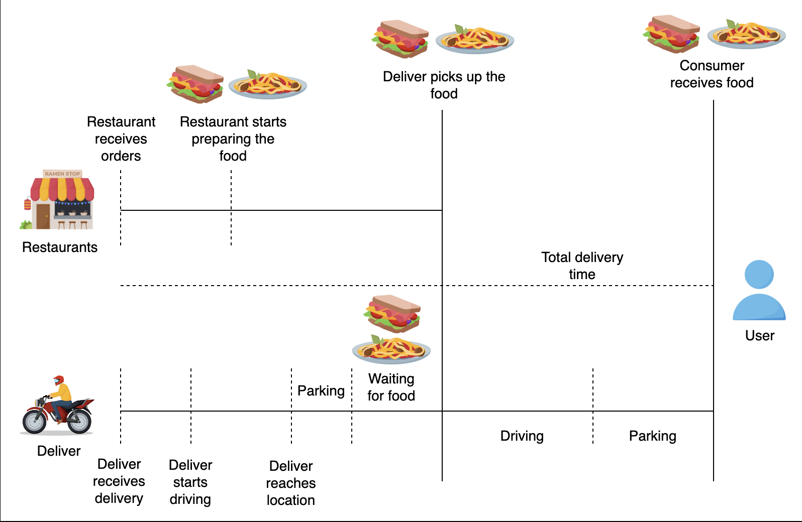
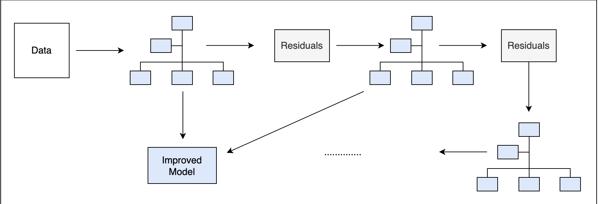
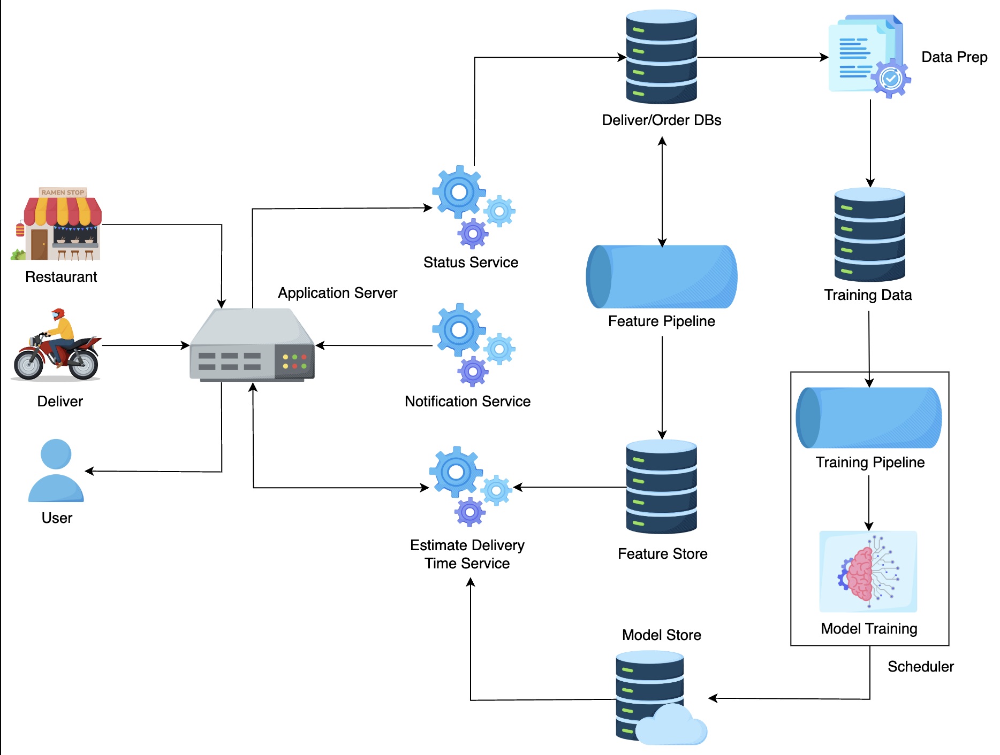
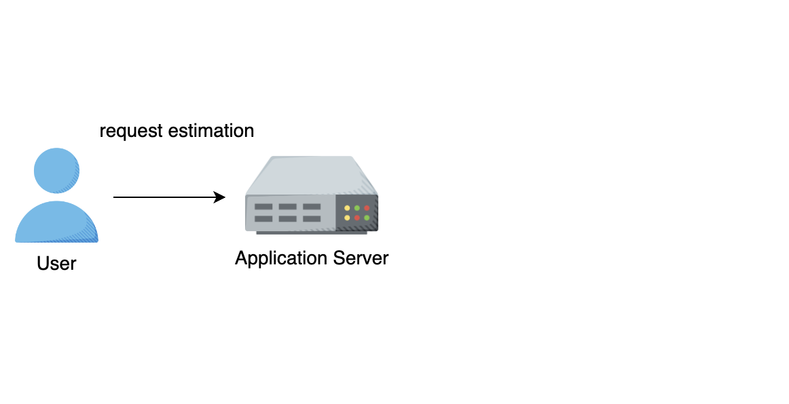
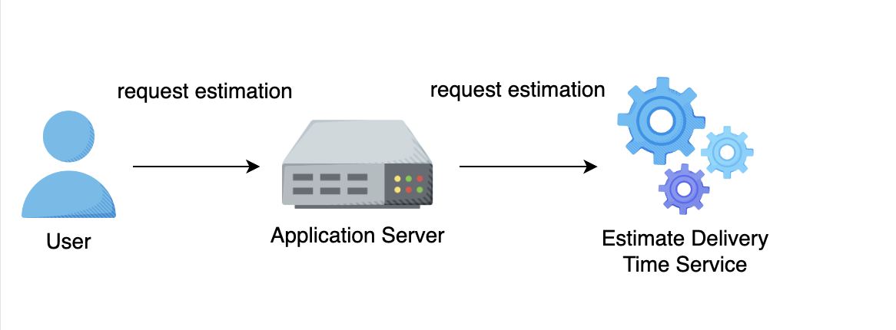
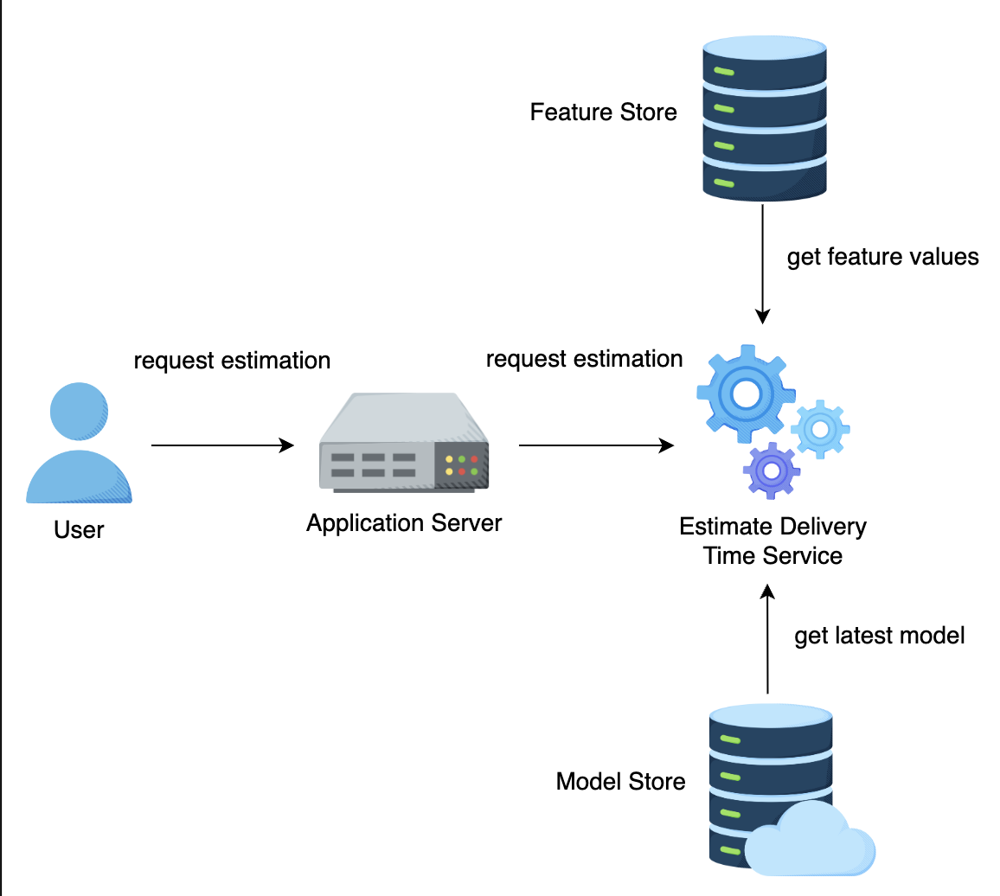
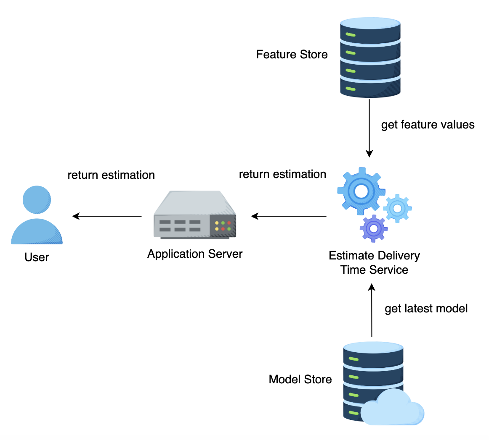

# Estimate Delivery Time

## 1. Problem Statement
Build a model to estimate the total delivery time given order details, market conditions, and traffic status.

To keep it simple, we do not consider batching (group multiple orders at restaurants) in this exercise.

> In the context of building a model to estimate total delivery time, "market conditions" refer to the various external factors that can influence the delivery process.  Some examples of market conditions include:
> 
> Day of the Week: Delivery times may vary between weekdays and weekends.
> 
>Time of the Day: Delivery times can be influenced by whether it is peak dining hours (e.g., lunch or dinner time) or off-peak hours.
> 
>Weather Conditions: Adverse weather such as rain, snow, or extreme heat can slow down deliveries.
> 
>Special Events: Local events such as sports games, concerts, or festivals can cause increased traffic and longer delivery times.
> 
>Holidays: Delivery times might be longer during holidays due to higher order volumes and different traffic patterns.
> 
>Promotions and Discounts: Times when there are special promotions or discounts might lead to a higher volume of orders, affecting delivery times.

### Delivery Time Calculation
$$\text{DeliveryTime} = \text{PickupTime} + \text{PointtoPointTime} + \text{DropoffTime}$$

## 2. Metrics Design and Requirements

### Metrics

**Offline Metrics:** Use Root Mean Squared Error (RMSE)
$$\text{RMSE} = \sqrt{\frac{\sum\limits_{k=1}^{n} (\text{predict} - y)^2}{n}}$$
where,
- $n$ is the total number of samples,
- $\text{predict}$ is the estimated wait time,
- $y$ is the actual wait time.

**Online Metrics:** Use A/B testing and monitor RMSE, customer engagement, customer retention, etc.

> **RMSE** is a commonly used metric for regression problems, including estimating delivery times. RMSE measures the average magnitude of the error between predicted values and actual values.By taking the square root of MSE, RMSE converts the error back into the original units of the target variable. This means RMSE is in the same units as the delivery time (minutes), making it more interpretable. For example, an RMSE of 2.9 minutes directly tells us that, on average, the predictions are off by about 2.9 minutes.

> **A/B Testing**: Split users into groups where one group uses the new delivery time estimation model and the other uses the existing model. Compare the outcomes between these groups.
> 
> **Customer Engagement**: Measure how customers interact with the app, such as checking delivery times, order frequency, and app usage duration.
> 
> **Customer Retention**: Track whether customers continue using the service over time, indicating satisfaction with the delivery experience.

### Requirements

#### Training
- During training, we need to handle a large amount of data. For this, the training pipeline should have a high throughput. To achieve this purpose, data can be organized in Parquet files.
- The model should undergo retraining every few hours. Delivery operations are under a dynamic environment with many external factors: traffic, weather conditions, etc. So, it is important for the model to learn and adapt to the new environment. For example, on game day, traffic conditions can get worse in certain areas. Without a retrained model, the current model will consistently underestimate delivery time. Schedulers are responsible for retraining models many times throughout the day.
- Balance between overestimation and underestimation. To help with this, retrain multiple times per day to adapt to market dynamics and traffic conditions.

> **High Throughput**: In the context of machine learning, "high throughput" refers to the ability to process a large amount of data quickly and efficiently.
> 
>  To achieve high throughput, the training pipeline should be optimized for speed and efficiency. This involves using data storage and processing techniques that allow for rapid reading and writing of data. So we can consider using **Parquet Files** : Apache Parquet is a columnar storage file format designed for efficient data processing.
> 
>  Here's why using Parquet files can help achieve high throughput:
> 
> Parquet stores data in a columnar format, meaning that all the values for a particular column are stored together. This contrasts with row-based formats (like CSV), where each row's data is stored together. For many machine learning tasks, operations are performed on entire columns at once (e.g., calculating averages, normalizing data). Columnar storage allows these operations to be performed more efficiently.
> 
> Parquet files support various compression algorithms (e.g., Snappy, Gzip), which reduce the size of the data on disk.
Speed: Smaller file sizes mean less data needs to be read from disk into memory, speeding up data loading times.
#### Inference
- For every delivery, the system needs to make real-time estimations as frequently as possible. For simplicity, we can assume we need to make 30 predictions per delivery.
- Near real-time updates: any changes in status need to go through model scoring as fast as possible, i.e., the restaurant starts preparing meals, the driver starts driving to customers.
- Whenever there are changes in delivery, the model runs a new estimate and sends an update to the customer.
- Capture near real-time aggregated statistics, i.e., feature pipeline aggregates data from multiple sources (Kafka, database) to reduce latency.
- Latency from 100ms to 200ms

> A feature pipeline is a system that gathers raw data from different sources, processes it, and transforms it into features that can be used by the machine learning model for predictions.

### Summary
| Type      | Desired goals                                                                                                                                       |
|-----------|-----------------------------------------------------------------------------------------------------------------------------------------------------|
| Metrics   | Optimized for low RMSE. Estimation should be less than 10-15 minutes. If we overestimate, customers are less likely to make orders. Underestimation can cause customers upset. |
| Training  | High throughput with the ability to retrain many times per day                                                                                      |
| Inference | Latency from 100ms to 200ms                                                                                                                         |

## 3. Model

### Feature Engineering

| Features             | Feature Engineering          | Description                                                                    |
|----------------------|------------------------------|--------------------------------------------------------------------------------|
| **Order features**    |  subtotal, cuisine          |                                                                                |
| **Item features**    |        price and type         |                                                                                |
| **Order type**           |    group, catering        |                                                                                |
| **Merchant details** |                              |                                                                                |
| **Store ID**         | Store Embedding              |                                                                                |
| **Realtime feature** | Number of orders, number of dashers, traffic, travel estimates | |
| **Time feature**     | Time of day (lunch/dinner), day of week, weekend, holiday |                                           |
| **Historical Aggregates** | Past X weeks average delivery time for: Store/City/market/TimeOfDay | |
| **Similarity**       | Average parking times, variance in historical times |                                           |
| **Latitude/longitude** | Measure estimated driving time between delivery of order (to consumer) & restaurants | |

> **Order features**: Features derived from the order details. For example, the total cost of the order (subtotal) and the type of cuisine (e.g., Italian, Chinese). These features can impact delivery times as different cuisines may have different preparation times. The **subtotal** is the sum of the prices of all items in the order. It does not include additional charges such as taxes, delivery fees, or tips.
>
> **Item features** : Features derived from individual items in the order. Item price and type (e.g., beverages, main course) can influence the overall preparation and packaging time.
>
> **Order type** : Identifies the type of order. Group orders and catering services typically take longer to prepare and deliver compared to individual orders.
>
>  **Merchant details**: Details about the merchant (restaurant) such as their historical performance, preparation speed, and popularity. These can affect delivery times.
>
>  **Store ID**: A numerical representation (embedding) of the store, capturing various characteristics and historical performance. This helps the model understand differences between stores.
>
> **Realtime feature**: Features that capture real-time conditions such as the current number of orders being processed, the number of delivery drivers (dashers) available, current traffic conditions, and travel time estimates. These are crucial for predicting delivery times accurately in real-time.
> 
> **Time feature** : Temporal features that indicate when the order was placed. Delivery times can vary significantly depending on whether it is during peak hours (lunch or dinner), on weekends, or during holidays.
>
> **Historical Aggregates**: Aggregated historical data such as the average delivery time over the past few weeks for specific stores, cities, markets, and times of day. This helps in understanding and predicting future delivery times based on past performance.
> 
> **Similarity** : Features that capture similarities in conditions such as average parking times at the delivery location and the variance in historical delivery times. These can indicate potential delays.
> 
> **Latitude/longitude**: Geospatial features that measure the distance and estimated driving time from the restaurant to the delivery location. This is critical for estimating travel times accurately.

### Training Data

We can use historical deliveries for the last 6 months as training data. Historical deliveries include delivery data and actual total delivery time, store data, order data, customer data, location, and parking data.

### Model

#### Gradient Boosted Decision Tree

- Gradient Boosted Decision Tree Sample
  
  

- How do Gradient Boosted Decision Trees work?

1. **Calculate Baseline**: Given historical delivery data, the model first calculates the average delivery time. This value will be used as a baseline.

2. **Measure Residual**: The model measures the residual (error) between prediction and actual delivery time.
   
   $$\text{Error} = \text{Actual Delivery Time} - \text{Estimated Delivery Time}$$
   

3. **Build Decision Tree**: Build the decision tree to predict the residuals. Each leaf will contain a prediction for residual values.

4. **Predict Using All Trees**: Predict using all the trees. Construct predictions for delivery time using this formula:
   
   $$\text{Estimated Delivery Time} = \text{Average Delivery Time} + \text{learning rate} \times \text{residuals}$$

5. **Compute New Residuals**: Given the new estimated delivery time, compute the new residuals. Use these values to build new decision trees in step 3.

6. **Repeat**: Repeat steps 3-5 until reaching the number of iterations defined in the hyperparameters.

> In **Gradient Boosted Decision Trees (GBDT)**, the objective is to minimize the difference between the predicted values and the actual values. These differences are known as residuals. By building a decision tree to predict the residuals, the model focuses on the errors made by the previous predictions. The idea is to correct these errors in subsequent iterations.
>

#### RMSE Optimization Issue

One problem with optimizing RMSE is that it penalizes similarly between under-estimate prediction and over-estimate prediction. Consider the table below. Both models use boosted decision trees.

| Actual | Model 1 Prediction | Model 1 Square Error | Model 2 Prediction | Model 2 Square Error |
|--------|---------------------|----------------------|---------------------|----------------------|
| 30     | 34                  | 16                   | 26                  | 16                   |
| 35     | 37                  | 4                    | 33                  | 4                    |

Although Model 1 and Model 2 have the same RMSE error, Model 1 overestimates delivery time, which prevents customers from making orders. Model 2 underestimates the delivery time and might cause customers to be unhappy.

## 4. Calculation & Estimation

### Assumptions
For the sake of simplicity, we can make these assumptions:

- There are 2 million monthly active users, a total of 20 million users, 300k restaurants, and 200k drivers deliver food.
- On average, there are 20 million deliveries per year.

### Data Size
- For 1 month, we collected data on 2 million deliveries. Each delivery has around 500 bytes related features.

- Total size: $500 \text{ bytes} \times 2 \times 10^6 = 10^9 \text{ bytes} = 1 \text{ Gigabytes}$

### Scale
- Support 20 million users.

## 5. System Design

- **Feature Store**: Provides fast lookup for low latency. A feature store with any key-value storage with high availability like Amazon DynamoDB is a good choice.
- **Feature Pipeline**: Reads from Kafka, transforms, and aggregates near real-time statistics. Then, it stores them in feature storage.
- **Database**: Delivery Order database stores historical Orders and Delivery. Data prep is a process to create training data from a database. We can store training data in cloud storage, for example, S3.
- We have three services: Status Service, Notification Service, and Estimate Delivery Time service. The first two services handle real-time updates, and the Estimate Delivery Time service uses our Machine Learning Model to estimate delivery time.
- We have a scheduler that handles and coordinates retraining models multiple times per day. After training, we store the Model in Model Storage.

Let’s examine the flow of the system:

1. User requests for Estimated Delivery Time
   

2.

3.

4. Estimate Delivery Time service returns time estimation to Application Server. Application Server returns time estimation to user
   

- There are three main types of users: Consumer/User, Deliver, and Restaurant.
- **User Flow**:
    - User visits a homepage, checks their food orders, and requests the Application Server for an estimated delivery time.
    - The Application Server sends the requests to the Estimate Delivery Time Service.
    - The Estimate Delivery Time service loads the latest ML model from Model Storage and gets all the feature values from the Feature Store. It then uses the ML model to predict delivery time and return results to the Application Server.

- **Restaurant/Deliver Flow**:
    - When restaurants make progress, i.e., start making the dish or packaging the food, they send the status to the Status Service.
    - Status Service updates the order status. This event is usually updated in a queue service, i.e., Kafka, so other services can subscribe and get updates accordingly.
    - Notification Service subscribed to the message queue, i.e., Kafka, and receives the latest order status in near real-time.

## 6. Scale the Design

- We scale out our services to handle large requests per second. We also use a Load Balancer to balance loads across Application Servers.

- We leverage streaming process systems like Kafka to handle notifications as well as model predictions. Once our Machine Learning model completes its predictions, it sends them to Kafka so other services can get notifications right away.

## 7. Follow Up Questions

**Question** | **Answer**
--- | ---
What are the cons of using StoreID embedding as features? | We need to evaluate if using StoreID embedding is efficient in handling new stores.
How often do we need to retrain models? | It depends, we need to have infrastructure in place to monitor the online metrics. When online metrics go down, we might want to trigger our models to retrain.

> Cons: Handling New Stores: A significant challenge with StoreID embeddings is dealing with new stores that have no historical data. The model might not perform well for these new stores since their embeddings are not well-defined.
>

## 8. Summary

- We learned to formulate estimated delivery times as a machine learning problem using Gradient Boosted Decision Trees.
- We learned how to collect and use data to train models.
- We learned how to use Kafka to handle logs and model predictions for near real-time predictions.

# Appendix 
## Offline Metric Example

Let's say we have 5 deliveries with the following actual and predicted delivery times (in minutes):

| Delivery | Actual Time (y) | Predicted Time (predict) |
|----------|------------------|--------------------------|
| 1        | 30               | 32                       |
| 2        | 25               | 28                       |
| 3        | 40               | 36                       |
| 4        | 35               | 38                       |
| 5        | 20               | 22                       |

First, calculate the squared differences:
$$(32 - 30)^2 = 4$$
$$(28 - 25)^2 = 9$$
$$(36 - 40)^2 = 16$$
$$(38 - 35)^2 = 9$$
$$(22 - 20)^2 = 4$$

Sum these squared differences:
$$4 + 9 + 16 + 9 + 4 = 42$$

Divide by the number of samples (n = 5) and take the square root:
$$\text{RMSE} = \sqrt{\frac{42}{5}} = \sqrt{8.4} \approx 2.9$$

So, the RMSE in this case is approximately 2.9 minutes.

### Explanation of Gradient Boosted Decision Trees with an Example

Let's walk through each step of how Gradient Boosted Decision Trees (GBDT) work using a specific example. Suppose we have the following historical delivery data (in minutes):

| Delivery | Actual Time (y) | Features (X) |
|----------|------------------|--------------|
| 1        | 30               | 10           |
| 2        | 25               | 8            |
| 3        | 40               | 12           |
| 4        | 35               | 11           |
| 5        | 20               | 7            |

For simplicity, let's assume there's only one feature \( X \) representing some aggregated information about the order and traffic conditions.

#### Step 1: Calculate Baseline
First, we calculate the average delivery time across all historical data. This average serves as the initial prediction for all deliveries.

$$ \text{Average Delivery Time} = \frac{30 + 25 + 40 + 35 + 20}{5} = 30 \text{ minutes} $$

So, our initial prediction for all deliveries is 30 minutes.

#### Step 2: Measure Residual
Next, we calculate the residuals (errors) between the actual delivery times and the initial prediction.

| Delivery | Actual Time (y) | Initial Prediction | Residual (Error) |
|----------|------------------|--------------------|------------------|
| 1        | 30               | 30                 | 0                |
| 2        | 25               | 30                 | -5               |
| 3        | 40               | 30                 | 10               |
| 4        | 35               | 30                 | 5                |
| 5        | 20               | 30                 | -10              |

#### Step 3: Build Decision Tree
We build a decision tree to predict the residuals using the feature \( X \).

| Features (X) | Residual (Error) |
|--------------|------------------|
| 10           | 0                |
| 8            | -5               |
| 12           | 10               |
| 11           | 5                |
| 7            | -10              |

Suppose the decision tree looks like this:

       X <= 9.5
      /      \
    -7.5     X <= 11.5
            /       \
           7.5       5

This tree splits the data into different regions and predicts the average residual in each region.

#### Step 4: Predict Using All Trees
The predictions are adjusted using the learning rate. Suppose our learning rate is 0.1. The updated predictions are:

$$ \text{New Prediction} = \text{Initial Prediction} + \text{learning rate} \times \text{Residuals Prediction} $$

Let's calculate the updated predictions:

| Delivery | Initial Prediction | Residual Prediction | New Prediction |
|----------|--------------------|---------------------|----------------|
| 1        | 30                 | 7.5 (for \( X > 9.5 \))    | 30 + 0.1 * 7.5 = 30.75 |
| 2        | 30                 | -7.5 (for \( X \leq 9.5 \))  | 30 + 0.1 * -7.5 = 29.25 |
| 3        | 30                 | 7.5 (for \( X > 11.5 \))    | 30 + 0.1 * 7.5 = 30.75 |
| 4        | 30                 | 7.5 (for \( 9.5 < X \leq 11.5 \))  | 30 + 0.1 * 7.5 = 30.75 |
| 5        | 30                 | -7.5 (for \( X \leq 9.5 \))  | 30 + 0.1 * -7.5 = 29.25 |

#### Step 5: Compute New Residuals
We calculate the new residuals using the updated predictions.

| Delivery | Actual Time (y) | New Prediction | New Residual (Error) |
|----------|------------------|----------------|----------------------|
| 1        | 30               | 30.75          | 30 - 30.75 = -0.75   |
| 2        | 25               | 29.25          | 25 - 29.25 = -4.25   |
| 3        | 40               | 30.75          | 40 - 30.75 = 9.25    |
| 4        | 35               | 30.75          | 35 - 30.75 = 4.25    |
| 5        | 20               | 29.25          | 20 - 29.25 = -9.25   |

#### Step 6: Repeat
We repeat steps 3-5 for a number of iterations defined in the hyperparameters. Each iteration builds a new decision tree to predict the new residuals and adjusts the predictions accordingly.

By iteratively building decision trees to predict residuals and adjusting predictions, the GBDT model gradually improves its accuracy in estimating delivery times. The learning rate ensures that each tree makes small adjustments to avoid overfitting.

## Reference:
- Machine learning System Design from educative
