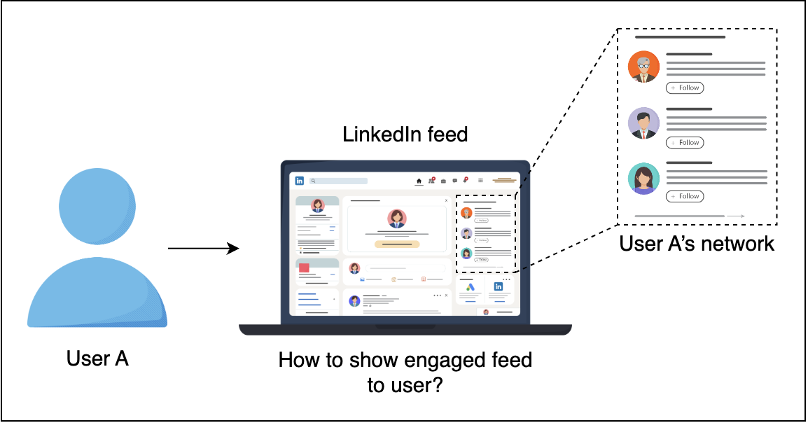

# LinkedIn Feed Ranking

## 1. Problem Statement

Design a personalized LinkedIn feed to maximize long-term user engagement. One way to measure engagement is user frequency, i.e, measure the number of engagements per user, but it’s very difficult in practice. Another way is to measure the click probability or **Click Through Rate** (CTR).

> A "feed" in the context of social media platforms like LinkedIn refers to a continuously updated stream of content displayed to users. 

On the LinkedIn feed, there are five major activity types:

- Connections
- Informational
- Profile
- Opinion
- Site-Specific

Intuitively, different activities have very different CTRs. This is important when building models and generating training data.

| Category       | Example                                                     |
| -------------- | ----------------------------------------------------------- |
| **Connection** | Member connector follows member/company, member joins group |
| **Informational** | Member or company shares article/picture/message          |
| **Profile**    | Member updates profile, i.e., picture, job-change, etc.     |
| **Opinion**    | Member likes or comments on articles, pictures, job-changes, etc. |
| **Site-Specific** | Activities unique to LinkedIn, Member endorses member, etc.                              |

## 2. Metrics Design and Requirements

### Metrics

**Offline Metrics**
- **Click Through Rate (CTR)**: The number of clicks that a feed receives, divided by the number of times the feed is shown.
  - **Formula**: 
  
    $$ CTR = \frac{\text{numberofclicks}}{\text{numberofshowntimes}}$$

- Maximizing CTR can be formalized as training a supervised binary classification model. For offline metrics, we normalize cross-entropy and AUC.

- **Normalizing Cross-Entropy (NCE)**: Helps the model be less sensitive to background CTR.
  - **Formula**:
 
$$NCE =  \frac{-\frac{1}{N} \sum\limits_{i=1}^{n} \left( \frac{1 + y_i}{2} \log(p_i) + \frac{1 - y_i}{2} \log(1 - p_i) \right)}{ - \left( p \log(p) + (1 - p) \log(1 - p) \right)}$$

  >   **N**: Total number of samples.
  > 
  >   **$y_i$**: Actual label for the \( i \)-th sample. \( y_i \) is 1 if the item was clicked and 0 if it was not clicked.
  > 
  > **$p_i$**: Predicted probability of the \( i \)-th item being clicked.
  > 
  > #### Normalization Term:
  > 
  >$$- \left( p \log(p) + (1 - p) \log(1 - p) \right)$$
  > 
  >**$p$**: Background CTR (average probability of an item being clicked).
  > 
  >This term is the entropy of a Bernoulli distribution with mean $p$. It normalizes the cross-entropy loss to account for the inherent likelihood of clicks (background CTR).

> Normalization of Cross-Entropy:
>- Ensures that the model's performance is not disproportionately influenced by items with inherently high or low CTR.
>- Makes the model more robust and generalizable across different types of items.
>  
> AUC:
>- Provides a comprehensive metric to evaluate the model's ability to distinguish between clicked and non-clicked items.
>- Is particularly useful for imbalanced datasets where the number of clicks may be much smaller than the number of non-clicks.
>  
> Background CTR refers to the average Click Through Rate (CTR) observed in the dataset or a specific subset of data. It reflects the inherent likelihood of clicks across all items without considering individual item characteristics. For example, if the overall CTR of the platform is 0.02, it means that, on average, 2% of all shown items are clicked.

**Online Metrics**
- For non-stationary data, offline metrics are not usually a good indicator of performance. Online metrics need to reflect the level of engagement from users once the model is deployed, i.e., Conversion rate (ratio of clicks with the number of feeds).

### Requirements

**Training**
- **Handle large volumes of data**: Ideally, the models are trained in distributed settings.
- **Online data distribution shift**: Retrain the models (incrementally) multiple times per day to address data distribution shifts.
- **Personalization**: Support a high level of personalization since different users have different tastes and styles for consuming their feed.
- **Data freshness**: Avoid showing repetitive feed on the user’s home feed.

**Inference**
- **Scalability**: Handle the large volume of users’ activities and support 300 million users.
- **Latency**: Feed Ranking needs to return within 50ms, with the entire process completed within 200ms.
- **Data freshness**: Ensure feed ranking is aware of whether a user has already seen any particular activity to avoid showing repetitive activity.

### Summary

| Type         | Desired Goals                                                             |
| ------------ | ------------------------------------------------------------------------- |
| **Metrics**  | Reasonable normalized cross-entropy                                       |
| **Training** | High throughput with the ability to retrain many times per day            |
|              | Supports a high level of personalization                                  |
| **Inference**| Latency from 100ms to 200ms                                               |
|              | Provides a high level of data freshness and avoids showing the same feeds multiple times |

## 3. Model

### Feature Engineering

| Features                        | Feature Engineering                      | Description                                                                                       |
|---------------------------------|------------------------------------------|---------------------------------------------------------------------------------------------------|
| **User profile:** job title, industry, demographic, etc. | For low cardinality: Use one hot encoding. Higher cardinality: use Embedding. |                                                                                                |
| **Connection strength between users** |                                          | Represented by the similarity between users. We can also use Embedding for users and measure the distance vector. |
| **Age of activity**             |                 Considered as a continuous feature or a binning value depending on the sensitivity of the Click target.                         |   |
| **Activity features:**  | Type of activity, hashtag, media, etc. Use Activity Embedding and measure the similarity between activity and user. |                                                                                                   |
| **Cross features**              | Combine multiple features.               |          |

> **User profile:**: One-hot encode demographic since it has low cardinality (e.g., age groups). Embed job title and industry due to potentially high cardinality (many unique job titles and industries).
> 
> **Connection strength between users**: For instance, if User A frequently interacts with User B (liking posts, commenting, messaging), the connection strength is high.
> 
> **Age of activity**: For example, the age of an activity (e.g., a post or update) can be represented as the number of days since it was created. If click behavior is sensitive to how recent the activity is, this can be treated as a continuous variable. Alternatively, it can be binned into categories like "less than a day," "1-3 days," "4-7 days," etc., to simplify the model. Example: A post was created 2 days ago. Feature Engineering: 1. Treat age as a continuous feature: Age = 2 2. Alternatively, bin the age: Age bin = "1-3 days."
>
> **Activity features:**: For example, activities could include sharing an article, updating a profile picture, or liking a post. Each type of activity can be embedded in a vector space. If a user frequently engages with articles about "data science," the similarity between new data science-related activities and the user’s interests can be measured using these embeddings.
>
> **Cross features**: Cross features are combinations of multiple basic features to capture interactions between them. For instance, combining "user industry" and "activity type" to see if users in the technology industry prefer informational activities like article shares more than others.

### Training Data

Before building any ML models we need to collect training data. The goal is to collect data across different types of posts while simultaneously improving user experience. Below are some of the ways we can collect training data:

1. **Rank by chronological order**: This approach ranks each post in chronological order. Use this approach to collect click/not-click data. The trade-off here is serving bias because of the user’s attention on the first few posts. Also, there is a data sparsity problem because different activities, such as job changes, rarely happen compared to other activities on LinkedIn.
2. **Random serving**: This approach ranks posts by random order. This may lead to a bad user experience. It also does not help with sparsity, as there is a lack of training data about rare activities.
3. **Use a Feed Ranking algorithm**: This would rank the top feeds. Within the top feeds, you would permute randomly. Then, use the clicks for data collection. This approach provides some randomness and is helpful for models to learn and explore more activities.

Based on this analysis, we will use an algorithm to generate training data so that we can later train a machine learning model.

We can start to use data for training by selecting a period of data: last month, last 6 months, etc. In practice, we want to find a balance between training time and model accuracy. We also downsample the negative data to handle the imbalanced data.

### Model Selection

We can use a probabilistic sparse linear classifier (logistic regression). This is a popular method because of the computation efficiency that allows it to work well with sparse features.

With the large volume of data, we need to use distributed training: Logistic Regression in Spark or Alternating Direction Method of Multipliers.

We can also use deep learning in distributed settings. We can start with the fully connected layers with the Sigmoid activation function applied to the final layer. Because the CTR is usually very small (less than 1%), we would need to resample the training data set to make the data less imbalanced. It’s important to leave the validation set and test set intact to have accurate estimations about model performance.

> Logistic regression can handle sparse vectors efficiently because it only needs to compute the weighted sum for non-zero features.
> ### Why Logistic Regression is a Linear Classifier
> #### Linear Decision Boundary
> ##### Linear Combination of Features
> Logistic regression uses a linear combination of input features to make a prediction. This means that the relationship between the input features and the log-odds of the outcome is linear.
> ##### Decision Boundary
> The decision boundary, which separates different classes, is a straight line (or hyperplane in higher dimensions) in the feature space.

> **Apache Spark**: Spark is a powerful tool for big data processing and machine learning. It supports distributed computing, which means it can handle large datasets by distributing the data and computations across a cluster of machines. **Logistic Regression in Spark**: Spark's MLlib library includes implementations of logistic regression that can run in a distributed manner. This enables efficient training on very large datasets.
>
> **Alternating Direction Method of Multipliers(ADMM)**: This is an optimization algorithm used to solve complex problems by breaking them into smaller subproblems, which are easier to handle. Each subproblem can be solved independently, making ADMM suitable for distributed computing environments. **Application in Logistic Regression**: ADMM can be used to optimize the logistic regression model parameters in parallel across different machines, improving efficiency and scalability.

insert multilayer_perceptron.png

### Evaluation

One approach is to split the data into training data and validation data. Another approach is to replay the evaluation to avoid biased offline evaluation. We use data until time $t$ for training the model. We use test data from time \( t+1 \) and reorder their ranking based on our model during inference. If there is an accurate click prediction at the correct position, then we record a match. The total match will be considered as total clicks.

During evaluation, we will also evaluate how big our training data set should be, and how frequently we should retrain the model, among many other hyperparameters.

# Appendix

## logistic regression numerical example

Let's assume a simple logistic regression model with the following weights ($\theta$) and input features ($x$):

- **Weights**: $\theta = [\theta_0, \theta_1, \theta_2, \theta_3, \theta_4]$
- **Feature Vector**: $$x = [1, 0, 0, 3, 0]$

Here, \$theta_0$ is the intercept term, and the other \$theta_i$ values are the weights for the features. The feature vector $x$ is sparse with many zero values.

### Logistic Regression Calculation

The logistic regression model computes the linear combination $z$ as follows:

$$z = \theta_0 \times 1 + \theta_1 \times x_1 + \theta_2 \times x_2 + \theta_3 \times x_3 + \theta_4 \times x_4$$

Substituting the values from our example:

$$z = \theta_0 \times 1 + \theta_1 \times 0 + \theta_2 \times 0 + \theta_3 \times 3 + \theta_4 \times 0$$

### Simplified Calculation

Because any number multiplied by zero is zero, we can ignore the terms where the feature values are zero:

$$z = \theta_0 \times 1 + \theta_3 \times 3$$

So, the computation simplifies to:

$$z = \theta_0 + 3\theta_3$$

