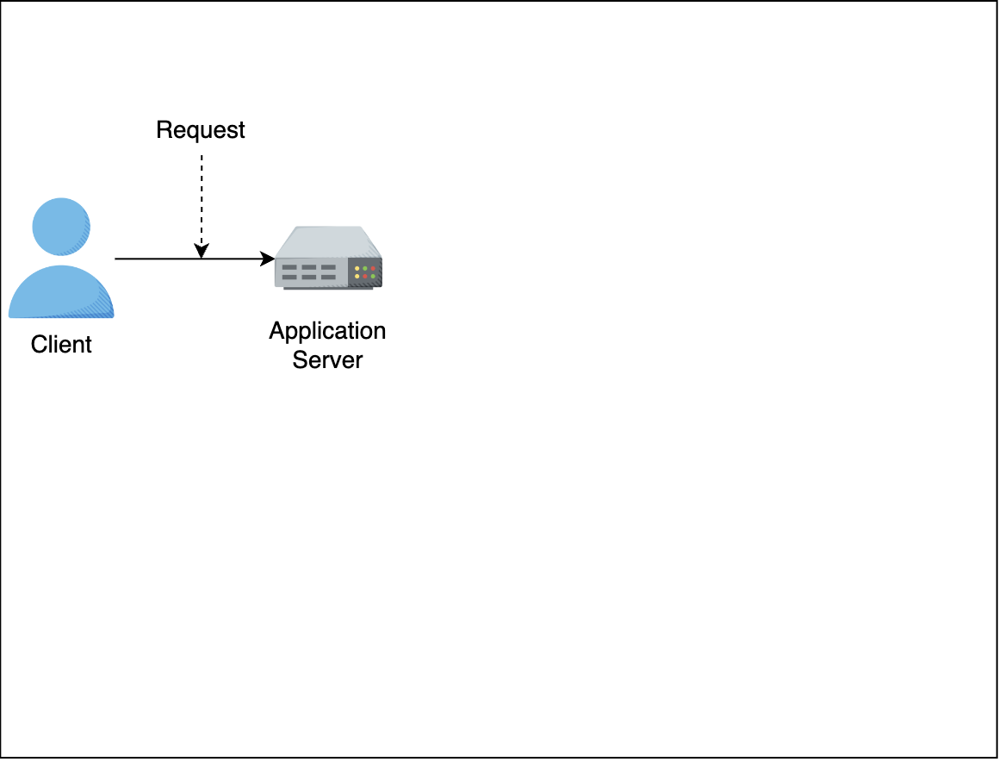
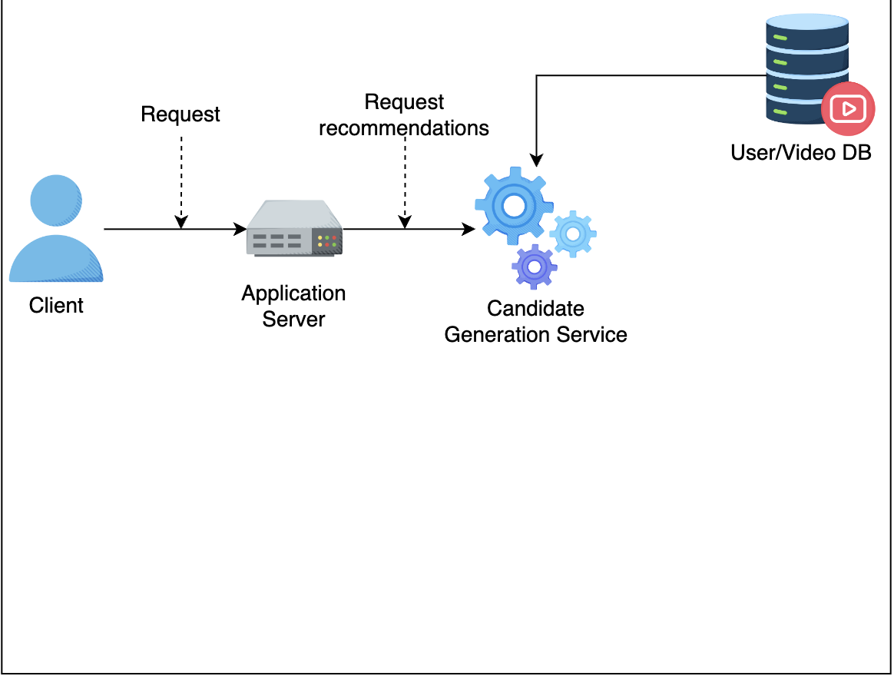
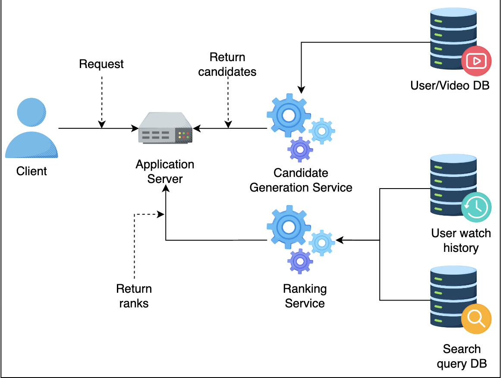
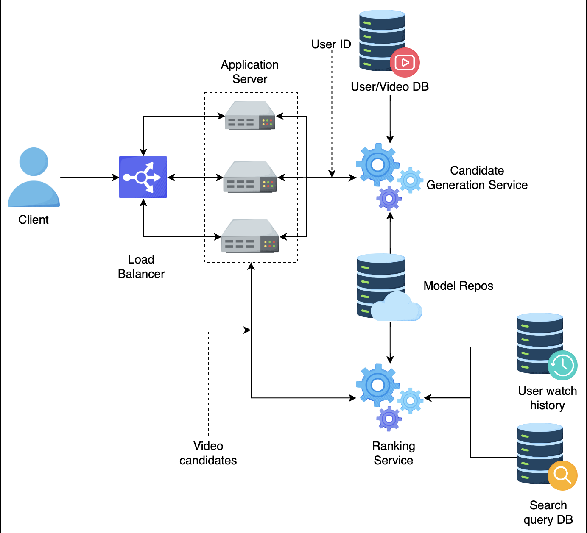

# Video Recommendations

## 1. Problem Statement
The goal is to build a video recommendation system for YouTube users to maximize engagement and suggest new types of content. The system aims to:

- Increase user engagement.
- Introduce users to new and diverse content.

## 2. Metrics Design and Requirements

### Metrics

**Offline Metrics:**

- **Precision:** The ratio of relevant videos recommended to the total recommended videos.
- **Recall:** The ratio of relevant videos recommended to the total relevant videos available.
- **Ranking Loss:** A metric to measure the error in the predicted order of recommended videos.
- **Logloss:** A measure of the accuracy of the probabilistic predictions.

**Online Metrics:**

- **Click Through Rates (CTR):** The ratio of users who click on a recommended video to the total users who see the recommendation.
- **Watch Time:** The total time users spend watching the recommended videos.
- **Conversion Rates:** The ratio of users who perform a desired action (e.g., subscribing to a channel) after watching the recommended videos.

### Requirements

**Training:**

- **Frequency:** Train the model multiple times a day to capture temporal changes, as user behavior can be unpredictable, and videos can become viral quickly.
- **Throughput:** Ensure the training process can handle high volumes of data efficiently.

**Inference:**

- **Latency:** Recommendations must be generated within 200ms, ideally under 100ms, for each user visit to the homepage.
- **Balance:** Find the right balance between exploration (showing new content) and exploitation (showing historically relevant content). Over-exploitation of historical data can prevent new videos from being exposed to users.

### Summary

| Type       | Desired Goals                                      |
|------------|----------------------------------------------------|
| **Metrics**| Reasonable precision, high recall                  |
| **Training**| High throughput, ability to retrain frequently    |
| **Inference**| Latency from 100ms to 200ms, flexible exploration vs. exploitation control |

The recommendation system should ensure a balance between providing relevant content and introducing fresh content to keep the users engaged and discovering new videos. The system needs to be responsive and adaptable to the rapidly changing user preferences and viral trends.

## 3. Multi-stage Models

The architecture of the video recommendation system is divided into two main stages: **Candidate Generation** and **Ranking**. This two-stage approach helps in scaling the system efficiently and effectively.

It’s a common pattern that you will see in many ML systems.

We will explore the two stages in the section below.

### Candidate Generation Model

The candidate model will find the relevant videos based on user watch history and the type of videos the user has watched.

> ### User Watch History
> This term encompasses all the details about a user's interactions with videos on the platform. It includes:
> - **List of Videos Watched**: The specific videos the user has watched.
> - **Watch Duration**: How long the user watched each video.
> - **Watch Frequency**: How often the user watches videos.
> - **Watch Time**: The timestamps of when the user watched each video.
> - **Watch Patterns**: Viewing patterns such as binge-watching or watching videos at specific times of the day or week.

> ### The Type of Videos the User Has Watched
> This term focuses more on the characteristics or categories of the videos the user has engaged with. It includes:
> - **Genres**: Categories like comedy, drama, action, documentary, etc.
> - **Topics**: Specific subjects or themes, such as cooking, technology, sports, etc.
> - **Content Attributes**: Features like video length (short clips vs. full-length movies), language, production quality, and format (e.g., live streams, pre-recorded videos).
> - **Metadata Tags**: Keywords associated with the videos that describe the content.

#### Feature Engineering

Each user has a list of video watches (videos, minutes_watched).
> Example:
> - User A:
>   - "Cooking Masterclass": 30 minutes
>   - "Tech Reviews": 15 minutes
>   - "Travel Vlog": 45 minutes

#### Training Data

User-video watch space: Use data from a selected period (e.g., last month, last 6 months) to balance training time and model accuracy.

#### Model

- The candidate generation can be done by Matrix factorization. The purpose of candidate generation is to generate “somewhat” relevant content to users based on their watched history. The candidate list needs to be big enough to capture potential matches for the model to perform well with desired latency.

- One solution is to use collaborative algorithms because the inference time is fast, and it can capture the similarity between user taste in the user-video space.
> Collaborative filtering is a broader category of algorithms that use user interactions (e.g., ratings, clicks) to make recommendations. It includes both user-based and item-based collaborative filtering. These algorithms calculate similarities between users or items to generate recommendations.
> #### Types:
> - **User-Based Collaborative Filtering**: Recommends items based on the preferences of similar users.
> - **Item-Based Collaborative Filtering**: Recommends items similar to those that a user has previously liked.
> Matrix factorization is a technique used to uncover the latent features underlying the interactions between users and items. It’s commonly used in collaborative filtering to enhance the recommendation process by breaking down the user-item interaction matrix into lower-dimensional matrices.

> In practice, for large scale system (Facebook, Google), we don’t use Collaborative Filtering and prefer low latency method to get candidate. One example is to leverage Inverted Index (commonly used in Lucene, Elastic Search). Another powerful technique can be found FAISS or Google ScaNN.

### Ranking Model

During inference, the ranking model receives a list of video candidates given by the Candidate Generation model. For each candidate, the ranking model estimates the probability of that video being watched. It then sorts the video candidates based on that probability and returns the list to the upstream process.

#### Feature Engineering

| Features                     | Feature Engineering                  |
|------------------------------|--------------------------------------|
| Watched video IDs            | Video embedding                      |
| Historical search query      | Text embedding                       |
| Location                     | Geolocation embedding                |
| User associated features: age, gender | Normalization or Standardization |
| Previous impression          | Normalization or Standardization     |
| Time related features        | Month, week_of_year, holiday, day_of_week, hour_of_day |

#### Training Data

We can use User Watched History data. Normally, the ratio between watched vs. not-watched is 2/98. So, for the majority of the time, the user does not watch a video.

#### Model

At the beginning, it’s important that we started with a simple model, as we can add complexity later.

- A fully connected neural network is simple yet powerful for representing non-linear relationships, and it can handle big data.

- We start with a fully connected neural network with sigmoid activation at the last layer. The reason for this is that the Sigmoid function returns value in the range [0, 1]; therefore it’s a natural fit for estimating probability.

> For deep learning architecture, we can use relu, (Rectified Linear Unit), as an activation function for hidden layers. It’s very effective in practice.

- The loss function can be cross-entropy loss.

## 4. Calculation & Estimation

### Assumptions
For the sake of simplicity, we can make these assumptions:

- Video views per month are 150 billion.
- 10% of videos watched are from recommendations, a total of 15 billion videos.
- On the homepage, a user sees 100 video recommendations.
- On average, a user watches two videos out of 100 video recommendations.
- If users do not click or watch some video within a given time frame, i.e., 10 minutes, then it is a missed recommendation.
- The total number of users is 1.3 billion.

### Data size
- For 1 month, we collected 15 billion positive labels and 750 billion negative labels.
- Generally, we can assume that for every data point we collect, we also collect hundreds of features. For simplicity, each row takes 500 bytes to store. In one month, we need 800 billion rows.
- Total size: `500 * 800 * 10^9 = 4 * 10^14` bytes = 0.4 Petabytes. To save costs, we can keep the last six months or one year of data in the data lake, and archive old data in cold storage.

### Bandwidth
- Assume that every second we have to generate a recommendation request for 10 million users. Each request will generate ranks for 1k-10k videos.

### Scale
- Support 1.3 billion users

## 5. System Design

### High-level System Design

- Database
  - **User Watched History**: Stores which videos are watched by a particular user over time.
  - **Search Query DB**: Stores historical queries that users have searched in the past.
  - **User/Video DB**: Stores a list of users and their profiles along with video metadata.
  - **User Historical Recommendations**: Stores past recommendations for a particular user.

- Resampling Data: It’s part of the pipeline to help scale the training process by down-sampling negative samples.

- Feature Pipeline: A pipeline program to generate all required features for training a model. It’s important for feature pipelines to provide high throughput, as we require this to retrain models multiple times. We can use Spark or Elastic MapReduce or Google DataProc.

> ### High Throughput vs. Bandwidth
> **Throughput**: The amount of data processed or tasks completed per unit of time. It is a measure of how much work the system can perform over a specific period.
> **Bandwidth**: The capacity of a network to transmit data per unit of time, usually measured in bits per second (bps). It is more about the maximum rate at which data can be transferred over a network.
> While throughput and bandwidth are related concepts, they are not the same. Throughput measures the actual data processing capacity of the system, while bandwidth measures the potential data transfer rate of the network.

- Model Repos: Storage to store all models, using AWS S3 is a popular option.

> In practice, during inference, it’s desirable to be able to get the latest model near real-time. One common pattern for the inference component is to frequently pull the latest models from Model Repos based on timestamp.

### Challenges

#### Huge Data Size
- Solution: Pick 1 month or 6 months of recent data.

#### Imbalanced Data
- Solution: Perform random negative down-sampling.

#### High Availability
- **Solution 1**: Use model-as-a-service, each model will run in Docker containers.
- **Solution 2**: Use Kubernetes to auto-scale the number of pods.

> A Pod is the smallest and simplest unit in the Kubernetes object model. It represents a single instance of a running process in your cluster. Pods are the fundamental building blocks of Kubernetes applications, each encapsulating one or more containers (usually Docker containers), along with shared storage/network resources and a specification for how to run the containers.

Let’s examine the flow of the system:

### System Flow

1. User sends video recommendation request to the Application Server.

2. Application Server sends recommendation request to Candidate Generation Service.

3. Candidate Generation Service gets user metadata and videos from database.

4. Candidate Generation Service returns list of video candidates to Application Server.

5. Application service sends list of candidates to Ranking Service to score.

6. Ranking Service gets user watched history and user search query history from databases.

7. Ranking Service scores each video candidates and returns the score to Application Server.

8. Application Server selects top 100 video candidates and return to user.

When a user requests a video recommendation, the Application Server requests Video candidates from the Candidate Generation Model. Once it receives the candidates, it then passes the candidate list to the ranking model to get the sorting order. The ranking model estimates the watch probability and returns the sorted list to the Application Server. The Application Server then returns the top videos that the user should watch.

## 6.Scale the Design

- Scale out (horizontal) multiple Application Servers and use Load Balancers to balance loads.
- Scale out (horizontal) multiple Candidate Generation Services and Ranking Services.
> It’s common to deploy these services in a Kubernetes Pod and take advantage of the Kubernetes Pod Autoscaler to scale out these services automatically.
> In practice, we can also use Kube-proxy so the Candidate Generation Service can call Ranking Service directly, reducing latency even further.

## 7. Follow-up Questions

### How do we adapt to user behavior changing over time?
1. Read more about Multi-arm bandit.
2. Use the Bayesian Logistic Regression Model so we can update prior data.
3. Use different loss functions to be less sensitive with click-through rates, etc.

### How do we handle the ranking model being under-explored?
We can introduce randomization in the Ranking Service. For example, 2% of requests will get random candidates, and 98% will get sorted candidates from the Ranking Service.

## 8. Summary

- We first learned to separate Recommendations into two services: Candidate Generation Service and Ranking Service.

- We also learned about using deep learning fully connected layers as a baseline model and how to handle feature engineering.

- To scale the system and reduce latency, we can use kube-flow so that the Candidate Generation Service can communicate with the Ranking Service directly.

# Appendix
That's a great question! Let's clarify why we use matrix factorization to generate the predicted ratings matrix (R') instead of directly using the original interaction matrix (R) for predictions.

## Key Reasons for Using Matrix Factorization

### Sparsity of the Original Matrix:
- The original interaction matrix (R) is usually very sparse. This means that most users have only watched or rated a small fraction of the total available videos. For example, in a large video streaming platform, a user might have watched only a few dozen videos out of millions available.
- Matrix factorization helps to fill in these missing values by identifying patterns and similarities among users and items. This allows us to predict interactions for videos that a user hasn't watched yet.

### Latent Factors:
- Matrix factorization decomposes the interaction matrix into latent factors that capture underlying patterns in user preferences and video characteristics. These latent factors can represent abstract concepts like a user's preference for certain genres or themes, which are not directly visible in the original data.
- By learning these latent factors, the model can generalize and make more accurate predictions for unseen interactions.

### Dimensionality Reduction:
- The original interaction matrix can be extremely large, with dimensions equal to the number of users multiplied by the number of videos. Matrix factorization reduces this to a lower-dimensional representation, making it computationally efficient to work with.

### Example with Sparse Matrix
Let's revisit the simplified example:

**Original Interaction Matrix (R):**

|       | Video 1 | Video 2 | Video 3 |
|-------|---------|---------|---------|
| User 1 |    5    |    3    |    0    |
| User 2 |    4    |    0    |    0    |
| User 3 |    1    |    1    |    0    |

Notice that many entries are zero, meaning those interactions are unknown.

**Predicted Ratings Matrix (R') (After Matrix Factorization):**

|       | Video 1 | Video 2 | Video 3 |
|-------|---------|---------|---------|
| User 1 |   4.8   |   3.1   |   2.0   |
| User 2 |   4.1   |   2.5   |   1.7   |
| User 3 |   1.2   |   1.1   |   0.9   |

- **User 1 and Video 3**: In the original matrix (R), we don't have a rating for Video 3 by User 1. However, in the predicted matrix (R'), we have a predicted rating of 2.0, which indicates the estimated preference based on latent factors.
- **Filling in the Gaps**: The predicted matrix provides ratings for all user-video pairs, including those not explicitly rated in the original matrix.

### Why Not Use R Directly?
- **Incomplete Data**: The original matrix (R) lacks information for many user-video pairs. Using it directly would mean we can't make recommendations for videos a user hasn't interacted with.
- **Discovery of Preferences**: Matrix factorization uncovers hidden patterns and preferences that aren't apparent from the sparse data alone.
- **Generalization**: It allows the model to generalize from known interactions to predict unknown ones, improving recommendation quality and user experience.

In summary, matrix factorization leverages the incomplete interaction data to generate a comprehensive set of predicted ratings, enabling the recommendation system to suggest relevant videos even for those a user hasn't previously watched.

## How Matrix Factorization with SGD Works

### Initialization:
- Initially, the user and item matrices are filled with random values. These matrices represent latent factors for users and items. The dimensions of these matrices depend on the number of latent factors we choose to use.

### Optimization:
- The algorithm iteratively adjusts these values to minimize the difference between the observed interactions (original matrix R) and the predicted interactions (predicted matrix R').

### Learning Latent Factors:
- **User Matrix (U)**: Represents users in terms of latent factors.
- **Item Matrix (V)**: Represents items (videos) in terms of latent factors.

The decomposition can be mathematically represented as:
$$R \approx U \times V^T$$
where $U$ is the user matrix, $V$ is the item matrix, and $R$ is the interaction matrix.

### Optimization Process
The goal is to minimize the reconstruction error, which is the difference between the observed ratings (in R) and the predicted ratings (in R'). This is typically done using a loss function, such as Mean Squared Error (MSE):

$$\text{Loss} = \sum_{(i, j) \in \text{observed}} (R_{ij} - (U_i \cdot V_j)^T)^2 + \lambda (||U||^2 + ||V||^2)$$

Here:
- $R_{ij}$ is the actual rating of user $i$ for video $j$.
- $U_i$ is the latent factor vector for user $i$.
- $V_j$ is the latent factor vector for video $j$.
- $\lambda$ is a regularization term to prevent overfitting.

### Example
Consider a small example with 3 users and 3 videos, with 2 latent factors (k=2):

#### Step 1: Initialize Matrices
Randomly initialize the user (U) and item (V) matrices:

**User Matrix (U):**
|       | Factor 1 | Factor 2 |
|-------|----------|----------|
| User 1 |    0.1   |    0.3   |
| User 2 |    0.4   |    0.2   |
| User 3 |    0.2   |    0.5   |

**Item Matrix (V):**
|         | Factor 1 | Factor 2 |
|---------|----------|----------|
| Video 1 |    0.3   |    0.6   |
| Video 2 |    0.1   |    0.4   |
| Video 3 |    0.5   |    0.2   |

#### Step 2: Compute Predicted Ratings
Multiply the user matrix (U) by the item matrix (V) to get the predicted ratings matrix (R'):

$$R' = U \times V^T$$

**Predicted Ratings Matrix (R'):**
|       | Video 1 | Video 2 | Video 3 |
|-------|---------|---------|---------|
| User 1 |   0.21  |   0.15  |   0.11  |
| User 2 |   0.26  |   0.14  |   0.23  |
| User 3 |   0.39  |   0.23  |   0.23  |

#### Step 3: Optimize Matrices
Adjust the values in U and V to minimize the loss function. This is done using techniques like Stochastic Gradient Descent (SGD).

#### Step 4: Updated Matrices
After several iterations, the matrices U and V are adjusted to better predict the original matrix R.

**User Matrix (U) (Adjusted):**
|       | Factor 1 | Factor 2 |
|-------|----------|----------|
| User 1 |    0.4   |    0.5   |
| User 2 |    0.3   |    0.4   |
| User 3 |    0.2   |    0.7   |

**Item Matrix (V) (Adjusted):**
|         | Factor 1 | Factor 2 |
|---------|----------|----------|
| Video 1 |    0.5   |    0.6   |
| Video 2 |    0.3   |    0.4   |
| Video 3 |    0.4   |    0.5   |

### Step 5: Generate Recommendations
Using the adjusted matrices, compute the predicted ratings for all user-video pairs. These predicted ratings help generate a list of recommended videos for each user based on the latent factors captured during the matrix factorization process.

**Predicted Ratings Matrix (R') (Final):**
|       | Video 1 | Video 2 | Video 3 |
|-------|---------|---------|---------|
| User 1 |   4.8   |   3.1   |   2.0   |
| User 2 |   4.1   |   2.5   |   1.7   |
| User 3 |   1.2   |   1.1   |   0.9   |

### Conclusion
Matrix factorization does not directly extract latent factors from video metadata. Instead, it learns latent factors through an iterative process that minimizes the difference between observed interactions and predicted interactions. These latent factors emerge from the patterns in the user-item interaction data, capturing abstract concepts that explain user preferences and item characteristics. While SVD and matrix factorization with SGD both aim to decompose the interaction matrix into latent factors, SVD is a direct decomposition method, whereas SGD is an iterative optimization technique. In practice, matrix factorization with SGD is often preferred for large-scale recommendation systems due to its scalability and efficiency in handling sparse data.

> #### Differences and Use Cases
> ##### SVD:
> - Provides an exact decomposition.
> - Computationally intensive for very large datasets.
> - Useful when an exact solution is needed and the dataset is manageable in size.
> ##### Matrix Factorization with SGD:
> - Provides an approximate solution through iterative optimization.
> - More scalable and efficient for very large and sparse datasets.
> - Commonly used in practical recommendation systems where the focus is on scalability and handling large datasets.

## Collaborative Filtering Example

### User-Item Interaction Matrix
Let's consider a small dataset of user interactions with videos. The interaction matrix \( R \) contains user ratings for different videos.

|       | Video 1 | Video 2 | Video 3 | Video 4 | Video 5 |
|-------|---------|---------|---------|---------|---------|
| User 1 |    5    |    4    |    0    |    0    |    3    |
| User 2 |    3    |    0    |    4    |    2    |    1    |
| User 3 |    4    |    2    |    5    |    3    |    0    |
| User 4 |    0    |    5    |    4    |    4    |    2    |
| User 5 |    1    |    0    |    0    |    5    |    4    |

### Step-by-Step Calculation

#### Step 1: Identify Common Rated Videos
For User 1 and User 3, the common rated videos are Video 1, Video 2, and Video 5.

- **User 1's ratings**: $R_{U1} = [5, 4, 3]$ for Videos 1, 2, and 5.
- **User 3's ratings**: $R_{U3} = [4, 2, 0]$ for Videos 1, 2, and 5.

#### Step 2: Calculate the Dot Product
The dot product of the ratings vectors is calculated as follows:

$R_{U1} \cdot R_{U3} = (5 \times 4) + (4 \times 2) + (3 \times 0)$
$R_{U1} \cdot R_{U3} = 20 + 8 + 0$
$R_{U1} \cdot R_{U3} = 28$

#### Step 3: Calculate the Magnitudes of the Vectors
Calculate the magnitude of User 1's and User 3's ratings vectors.

$$\|R_{U1}\| = \sqrt{(5^2) + (4^2) + (3^2)}$$

$$\|R_{U1}\| = \sqrt{25 + 16 + 9}$$

$$\|R_{U1}\| = \sqrt{50}$$

$$\|R_{U1}\| \approx 7.07$$

$$\|R_{U3}\| = \sqrt{(4^2) + (2^2) + (0^2)}$$

$$\|R_{U3}\| = \sqrt{16 + 4 + 0}$$

$$\|R_{U3}\| = \sqrt{20}$$

$$\|R_{U3}\| \approx 4.47$$

#### Step 4: Calculate Cosine Similarity
Using the dot product and magnitudes, calculate the cosine similarity.

$$\text{similarity}(U1, U3) = \frac{R_{U1} \cdot R_{U3}}{\|R_{U1}\| \times \|R_{U3}\|}$$

$$ \text{similarity}(U1, U3) = \frac{28}{7.07 \times 4.47}$$

$$\text{similarity}(U1, U3) = \frac{28}{31.61}$$

$$ \text{similarity}(U1, U3) \approx 0.89$$

### Conclusion
The cosine similarity between User 1 and User 3 is approximately 0.89, indicating a high degree of similarity between their ratings for the common videos. This similarity score can be used in collaborative filtering algorithms to recommend videos to users based on the preferences of similar users.

### Predict Missing Ratings
Use the similarity scores to predict ratings for the missing items. For User 1, we need to predict ratings for Video 3 and Video 4.

#### Weighted Sum Approach

$$\hat{R}(U1, V3)= \frac{\sum (\text{similarity}(U1, Ux) \cdot R_{Ux, V3})}{\sum \text{similarity}(U1, Ux)}$$

Where $Ux$ are the users similar to $U1$ who have rated $V3$.

### Example Calculation
Assuming the similarity scores and user ratings, we calculate the predicted rating for User 1 for Video 3 using the ratings from similar users (User 2 and User 4).

For simplicity, let's assume:
- Similarity(User 1, User 2) = 0.9
- Similarity(User 1, User 4) = 0.7

Ratings:
- User 2's rating for Video 3 = 4
- User 4's rating for Video 3 = 4

Predicted Rating for User 1 for Video 3:

$$\hat{R}_{U1, V3} = \frac{(0.9 \cdot 4) + (0.7 \cdot 4)}{0.9 + 0.7} = \frac{3.6 + 2.8}{1.6} = \frac{6.4}{1.6} = 4.0 $$

Thus, the predicted rating for User 1 for Video 3 is 4.0. We can similarly predict ratings for other missing values.

### Final Recommendations
Based on the predicted ratings, User 1 can be recommended Video 3 and Video 4, as these now have high predicted ratings.

This collaborative filtering approach leverages the collective preferences of similar users to make recommendations, enhancing the user's experience by suggesting videos they are likely to enjoy based on their similarity to other users' tastes.
