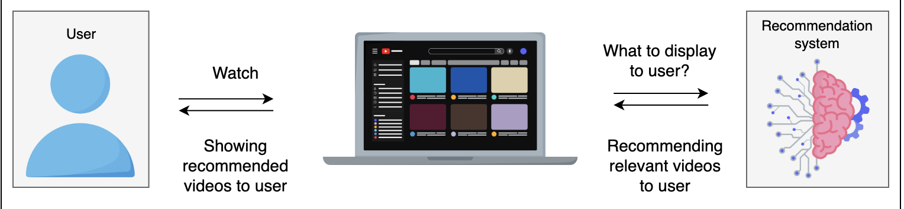
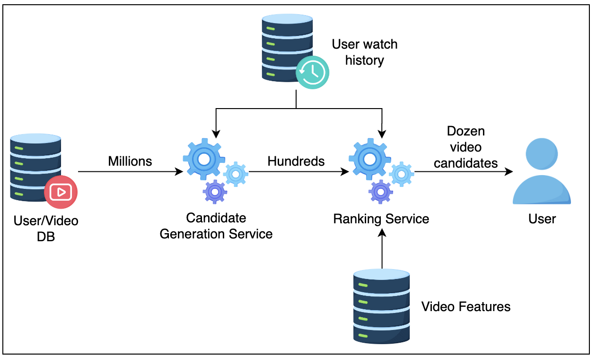
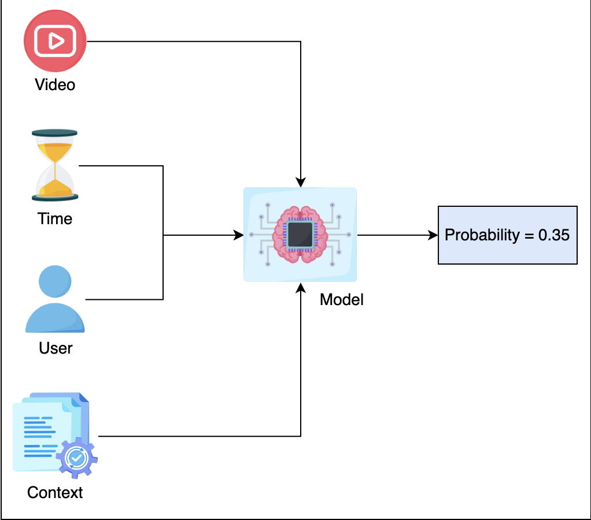
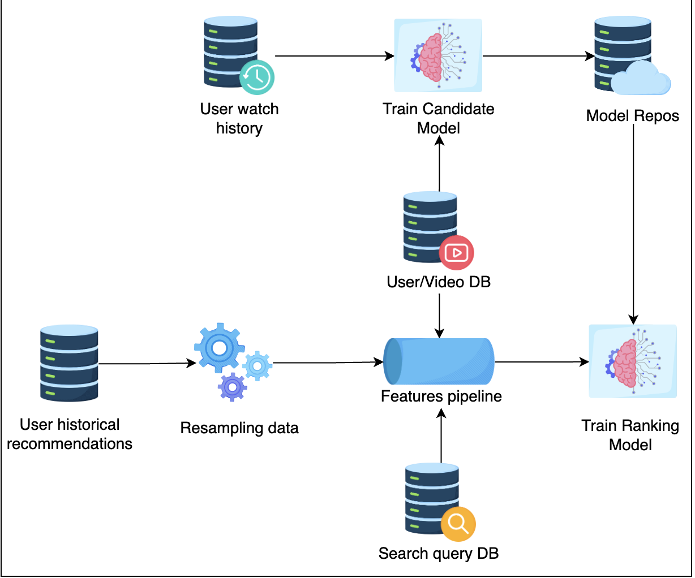

# Video Recommendations

## 1. Problem Statement
The goal is to build a video recommendation system for YouTube users to maximize engagement and suggest new types of content. The system aims to:

- Increase user engagement.
- Introduce users to new and diverse content.

## 2. Metrics Design and Requirements

### Metrics

**Offline Metrics:**

- **Precision:** The ratio of relevant videos recommended to the total recommended videos.
- **Recall:** The ratio of relevant videos recommended to the total relevant videos available.
- **Ranking Loss:** A metric to measure the error in the predicted order of recommended videos.
- **Logloss:** A measure of the accuracy of the probabilistic predictions.

**Online Metrics:**

- **Click Through Rates (CTR):** The ratio of users who click on a recommended video to the total users who see the recommendation.
- **Watch Time:** The total time users spend watching the recommended videos.
- **Conversion Rates:** The ratio of users who perform a desired action (e.g., subscribing to a channel) after watching the recommended videos.

### Requirements

**Training:**

- **Frequency:** Train the model multiple times a day to capture temporal changes, as user behavior can be unpredictable, and videos can become viral quickly.
- **Throughput:** Ensure the training process can handle high volumes of data efficiently.

**Inference:**

- **Latency:** Recommendations must be generated within 200ms, ideally under 100ms, for each user visit to the homepage.
- **Balance:** Find the right balance between exploration (showing new content) and exploitation (showing historically relevant content). Over-exploitation of historical data can prevent new videos from being exposed to users.

### Summary

| Type       | Desired Goals                                      |
|------------|----------------------------------------------------|
| **Metrics**| Reasonable precision, high recall                  |
| **Training**| High throughput, ability to retrain frequently    |
| **Inference**| Latency from 100ms to 200ms, flexible exploration vs. exploitation control |

The recommendation system should ensure a balance between providing relevant content and introducing fresh content to keep the users engaged and discovering new videos. The system needs to be responsive and adaptable to the rapidly changing user preferences and viral trends.

## 3. Multi-stage Models

The architecture of the video recommendation system is divided into two main stages: **Candidate Generation** and **Ranking**. This two-stage approach helps in scaling the system efficiently and effectively.

It’s a common pattern that you will see in many ML systems.

We will explore the two stages in the section below.

### Candidate Generation Model

The candidate model will find the relevant videos based on user watch history and the type of videos the user has watched.

#### Feature Engineering

Each user has a list of video watches (videos, minutes_watched).

#### Training Data

User-video watch space: Use data from a selected period (e.g., last month, last 6 months) to balance training time and model accuracy.

#### Model

- The candidate generation can be done by Matrix factorization. The purpose of candidate generation is to generate “somewhat” relevant content to users based on their watched history. The candidate list needs to be big enough to capture potential matches for the model to perform well with desired latency.

- One solution is to use collaborative algorithms because the inference time is fast, and it can capture the similarity between user taste in the user-video space.

> In practice, for large scale system (Facebook, Google), we don’t use Collaborative Filtering and prefer low latency method to get candidate. One example is to leverage Inverted Index (commonly used in Lucene, Elastic Search). Another powerful technique can be found FAISS or Google ScaNN.

### Ranking Model

During inference, the ranking model receives a list of video candidates given by the Candidate Generation model. For each candidate, the ranking model estimates the probability of that video being watched. It then sorts the video candidates based on that probability and returns the list to the upstream process.

#### Feature Engineering

| Features                     | Feature Engineering                  |
|------------------------------|--------------------------------------|
| Watched video IDs            | Video embedding                      |
| Historical search query      | Text embedding                       |
| Location                     | Geolocation embedding                |
| User associated features: age, gender | Normalization or Standardization |
| Previous impression          | Normalization or Standardization     |
| Time related features        | Month, week_of_year, holiday, day_of_week, hour_of_day |

#### Training Data

We can use User Watched History data. Normally, the ratio between watched vs. not-watched is 2/98. So, for the majority of the time, the user does not watch a video.

#### Model

At the beginning, it’s important that we started with a simple model, as we can add complexity later.

- A fully connected neural network is simple yet powerful for representing non-linear relationships, and it can handle big data.

- We start with a fully connected neural network with sigmoid activation at the last layer. The reason for this is that the Sigmoid function returns value in the range [0, 1]; therefore it’s a natural fit for estimating probability.

> For deep learning architecture, we can use relu, (Rectified Linear Unit), as an activation function for hidden layers. It’s very effective in practice.

- The loss function can be cross-entropy loss.

## 4. Calculation & Estimation

### Assumptions
For the sake of simplicity, we can make these assumptions:

- Video views per month are 150 billion.
- 10% of videos watched are from recommendations, a total of 15 billion videos.
- On the homepage, a user sees 100 video recommendations.
- On average, a user watches two videos out of 100 video recommendations.
- If users do not click or watch some video within a given time frame, i.e., 10 minutes, then it is a missed recommendation.
- The total number of users is 1.3 billion.

### Data size
- For 1 month, we collected 15 billion positive labels and 750 billion negative labels.
- Generally, we can assume that for every data point we collect, we also collect hundreds of features. For simplicity, each row takes 500 bytes to store. In one month, we need 800 billion rows.
- Total size: `500 * 800 * 10^9 = 4 * 10^14` bytes = 0.4 Petabytes. To save costs, we can keep the last six months or one year of data in the data lake, and archive old data in cold storage.

### Bandwidth
- Assume that every second we have to generate a recommendation request for 10 million users. Each request will generate ranks for 1k-10k videos.

### Scale
- Support 1.3 billion users

## 5. System Design

### High-level System Design

- Database
  - **User Watched History**: Stores which videos are watched by a particular user over time.
  - **Search Query DB**: Stores historical queries that users have searched in the past. User/Video DB stores a list of users and their profiles along with video metadata.
  - **User Historical Recommendations**: Stores past recommendations for a particular user.

- Resampling Data: It’s part of the pipeline to help scale the training process by down-sampling negative samples.

- Feature Pipeline: A pipeline program to generate all required features for training a model. It’s important for feature pipelines to provide high throughput, as we require this to retrain models multiple times. We can use Spark or Elastic MapReduce or Google DataProc.

- Model Repos: Storage to store all models, using AWS S3 is a popular option.

> In practice, during inference, it’s desirable to be able to get the latest model near real-time. One common pattern for the inference component is to frequently pull the latest models from Model Repos based on timestamp.

### Challenges

#### Huge Data Size
- Solution: Pick 1 month or 6 months of recent data.

#### Imbalanced Data
- Solution: Perform random negative down-sampling.

#### High Availability
- **Solution 1**: Use model-as-a-service, each model will run in Docker containers.
- **Solution 2**: Use Kubernetes to auto-scale the number of pods.

Let’s examine the flow of the system:

### System Flow

1. User sends video recommendation request to the Application Server.
2. Application Server sends recommendation request to Candidate Generation Service.
3. Candidate Generation Service gets user metadata and videos from database.
4. Candidate Generation Service returns list of video candidates to Application Server.
5. Application service sends list of candidates to Ranking Service to score.
6. Ranking Service gets user watched history and user search query history from databases.
7. Ranking Service scores each video candidates and returns the score to Application Server.
8. Application Server selects top 100 video candidates and return to user.

When a user requests a video recommendation, the Application Server requests Video candidates from the Candidate Generation Model. Once it receives the candidates, it then passes the candidate list to the ranking model to get the sorting order. The ranking model estimates the watch probability and returns the sorted list to the Application Server. The Application Server then returns the top videos that the user should watch.

## 6.Scale the Design

- Scale out (horizontal) multiple Application Servers and use Load Balancers to balance loads.
- Scale out (horizontal) multiple Candidate Generation Services and Ranking Services.
> It’s common to deploy these services in a Kubernetes Pod and take advantage of the Kubernetes Pod Autoscaler to scale out these services automatically.
> In practice, we can also use Kube-proxy so the Candidate Generation Service can call Ranking Service directly, reducing latency even further.

insert Design system at scale png

## 7. Follow-up Questions

### How do we adapt to user behavior changing over time?
1. Read more about Multi-arm bandit.
2. Use the Bayesian Logistic Regression Model so we can update prior data.
3. Use different loss functions to be less sensitive with click-through rates, etc.

### How do we handle the ranking model being under-explored?
We can introduce randomization in the Ranking Service. For example, 2% of requests will get random candidates, and 98% will get sorted candidates from the Ranking Service.

## 8. Summary

- We first learned to separate Recommendations into two services: Candidate Generation Service and Ranking Service.

- We also learned about using deep learning fully connected layers as a baseline model and how to handle feature engineering.

- To scale the system and reduce latency, we can use kube-flow so that the Candidate Generation Service can communicate with the Ranking Service directly.

- You can also learn more about how companies scale their design here.

